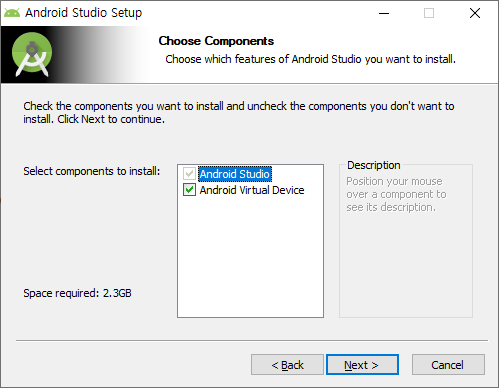
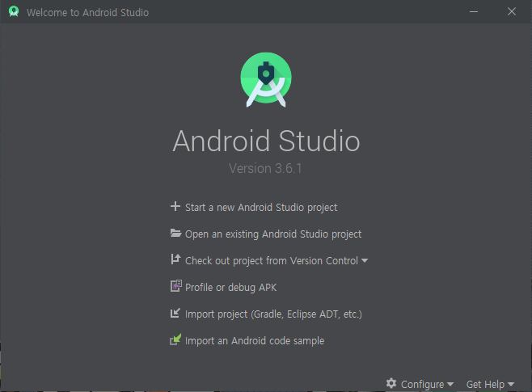
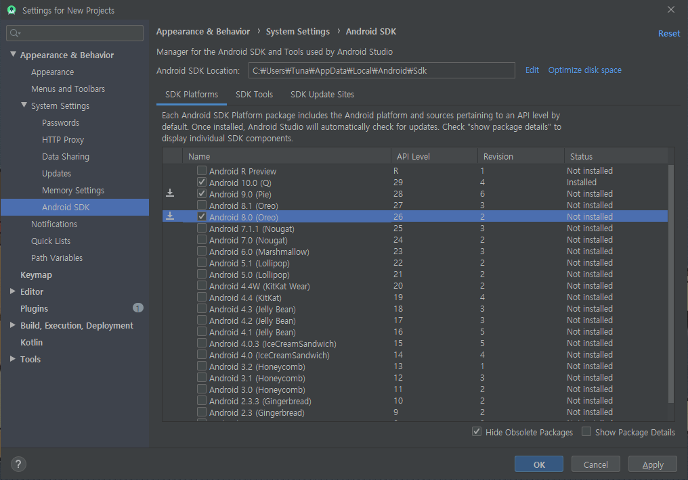
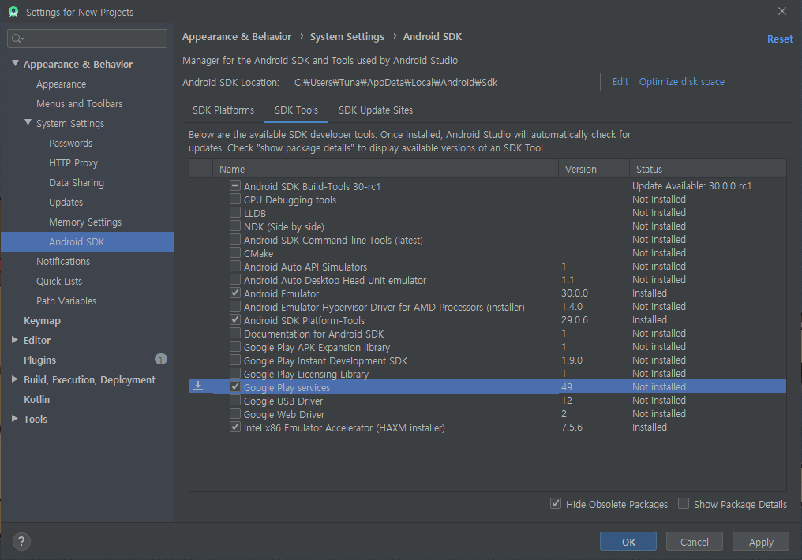
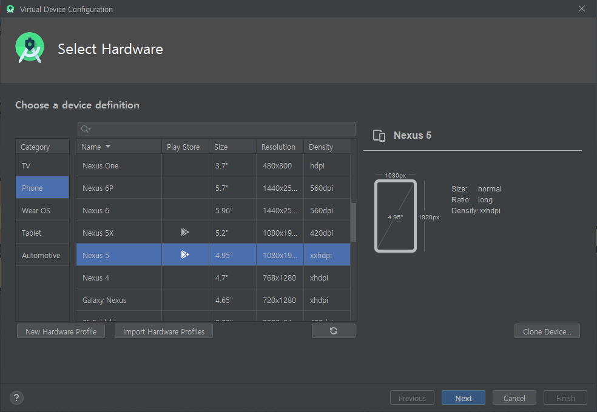
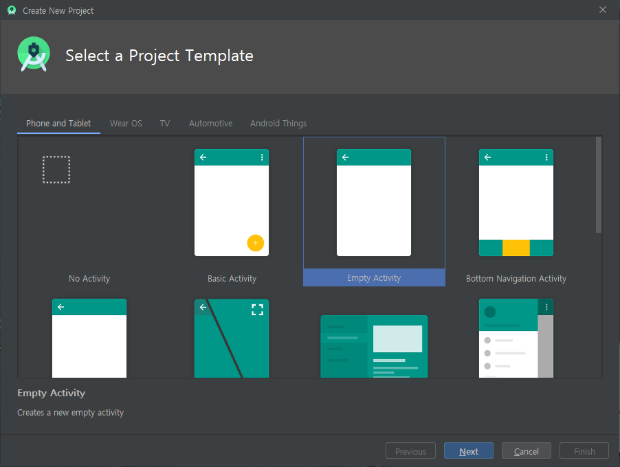
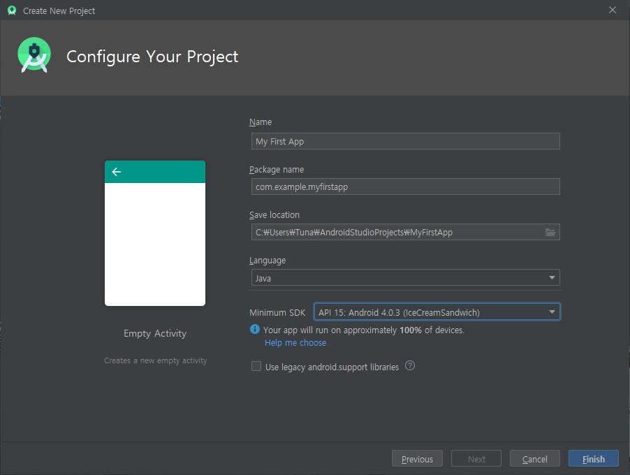

# Android Start

## Purpose

* 안드로이드를 구성하고 있는 주요 Component

  1. Activity
     * 앱을 실행시켰을 때 볼 수 있는 화면

  2. Service

  3. Broadcast Receiver

  4. Content Provider

  * Component 동작방식에 대한 이해

* Android Framework의 동작원리

## Concept

### Android란?

> Google이 만든(주도하는) 휴대 기기용(스마트폰, 태블릿) 플랫폼

* Android의 정의
  * OS(Linux Kernel) + 미들웨어 + 핵심 어플리케이션(전화, 카메라, 메시지 등)과 같은 것들이 포함되어 있는 모바일 디바이스를 위한 소프트웨어 스택
* Android의 특징
  * 오픈소스
    * 안드로이드 소스코드가 모든 개발자에게 개방되어 있음
  * 개발 언어 : Java / Kotlin
    * Java 언어로 개발
  * 앱 간의 자유로운 연동
    * 앱들 간의 리소스를 공유하여 사용할 수 있음
  * ART Runtime 탑재
    * 성능이 매우 뛰어남
* Android Version
  * 2007년도에 초기 SDK를 발표
  * 디저트이름으로 코드명을 붙여서 사용
    * 8(오레오), 9(파이), 10(Q)
    * 10부터는 그냥 안드로이드10이라고 명명함
  * 현재는 10버전으로 출시되고 있음(2020/03)
* Android의 성장이유
  * 오픈소스
  * Eco System이 잘 되어 있음
    * 단말기 제조사, 이동 통신사 등 성장에 기여하는 기업이 많음
* Framework
  * vs library
    * library는 특정 기능을 쉽고 편하게 구현할 수 있음
    * 유지보수가 어려움
  * Framework을 이해해야 해야 사용할 수 있음
  * 돌아가는 규칙이 어느정도 정해져있기 때문에 유지보수가 용이함

### Component

> Android를 구성하고 있는 4가지 주요 Component

1. Activity
   * Android App의 화면 1개
   * UI를 담당하는 Component
   * 사용자의 Event 처리를 담당
   * Load가 많은 작업 처리는 담당하지 않음
2. Service
   * 내부 로직처리를 담당
     * 데이터베이스 연결(DB 처리), 네트워크 연결(외부 API 사용) 등
   * 사용자와의 Interaction을 담당하지 않음
   * 일반적으로 Background에서 로직처리를 담당
3. Broadcast Receiver
   * 안드로이드 시스템에서 발생되는 여러가지 신호(Broadcast)를 받아서 적절한 처리를 담당
4. Content Provider & Resolver
   * 모든 Android App은 sandbox model을 이용
     * 모든 앱은 자기가 사용하는 리소스를 자신만 사용할 수 있음
       * 자신의 데이터는 자신의 sandbox에 존재한다고 해서 sandbox model
     * 위와 같은 단점을 보완하여 데이터를 공유하기위해서 데이터를 보내고 받는 처리를 해야함
   * App간의 데이터 공유

## Develop Environment Setting

* 안드로이드 개발 언어는 Java, Kotlin 이 있음
  * 우리는 Java를 사용하여 공부할 예정

### JDK

* [Java Environment](../Java/Basic_Java/00_Java_Environment.md)를 참고하여 JDK를 설치한다.

### Android Studio IDE

* 구현 방법
  * AVD (Android Virtual Device)
    * 가상의 안드로이드 기기를 만들어 해당 기기에 우리가 만든 apk를 다운로드하여 실행하는 방법
  * Real Phone

#### Download

* [Download Site](https://developer.android.com/studio)에서 다운로드 받는다.

* 다음의 순서를 따른다.

  1. Next

  2. AVD (Android Virtual Devie)에 체크된 것을 확인한 후 Next

     

  3. 설치 경로를 지정해준 후 Next

  4. Install

* 설치된 Android Studio를 실행시키면 기본 Setting Wizard가 실행된다

  * 처음 설치하는 것이므로 Setting변경없이 Next를 진행하여 추가설치를 진행한다.

#### Remove

> 나중에 Android Studio를 삭제할 때 주의

* 제어판에서 삭제해도 설치 폴더, 환경설정 파일이 남아있는 경우가 있음
* 수동으로 해당 폴더를 삭제해야함.

#### Setting

* SDK 설정을 진행한다.

  * 초기 화면에서 Configure - SDK Manager로 진입한다.

    

    * 우측 아래의 Configure이다.

  * 진입하면 다음과 같은 SDK Platforms 창이 나온다.

    

    * 다운로드 표시가 나와있는 Android 9.0, 8.0을 체크한다

  * SDK Tools로 진입한다.

    

    * Google Play Service를 체크한다.

  * 전부 체크했다면 OK를 눌러서 추가 설치를 진행한다.
  
* AVD를 만든다.

  * 초기화면의 Configure - AVD Manager로 진입한다.

  * Create Virtual Device 버튼을 클릭한다.

    

    * Nexus 5를 선택한다.

    * 기계가 준비되었으니 System Image, 즉 어떤 안드로이드를 설치할 지 선택한다.

      

    * Pie 옆의 Download를 클릭하여 추가 설치를 진행한다.

    * 설치한 Pie를 선택하고 Next로 넘어간다.

    * 가상 기기의 이름을 정해준 후 Finish

  * 이후 하나의 AVD가 만들어진 것을 확인할 수 있다.

    * 우측의 재생버튼을 클릭하면 가상기기가 핸드폰모양으로 나타난다.

### Driver Download

* 삼성 통합 USB 드라이버를 [Download Site](http://local.sec.samsung.com/comLocal/support/down/kies_main.do?kind=usb)에서 다운로드 받는다.
  * 이는 USB 드라이버를 통해 실제 폰과 컴퓨터를 연결할 때 사용될 Driver이다.

## Start Project

* 초기화면에서 Start a New Android Project를 선택한다.

  * 여러 형태를 선택할 수 있지만 Empty Activity를 선택한다.

    

    * 다른 형태들은 추후에 학습한다.

  * Project의 Configure을 설정한다.

    

    * 원하는 Name을 입력한다.
    * package name
      * 해당 기기와 다른 기기를 구별해야 하기 때문에 중복되면 안된다.
      * 일반적으로 도메인의 역순으로 잡는다.
      * 도메인 자체가 Unique한 값이기 때문이다.
    * Language는 Kotlin이 아닌 Java로 바꿔준다.
    * Minimum SDK
      * API를 높게 설정한다면 해당 SDK 이하의 API에서는 구동되지 않는다.
      * 보통 4.0.3 아이스크림샌드위치를 주로 사용한다.
      * 아래의 !표시를 살펴보면 약 100%의 기기에서 구동이 가능하다는 것을 확인한다.
        * Android 10으로 설정하고 확인해보면 < 1%가 나온다.
    * Finish

### Project Setting

* File - Setting - Editor - Font
  * 폰트에 대한 내용을 변경할 수 있다.
* 좌측 상단의 Directory View를 보는 방법은 여러개이다.
  * 주로 Android 방법을 사용하여 볼것이며, 가끔 Project 방법을 사용할 것이다.