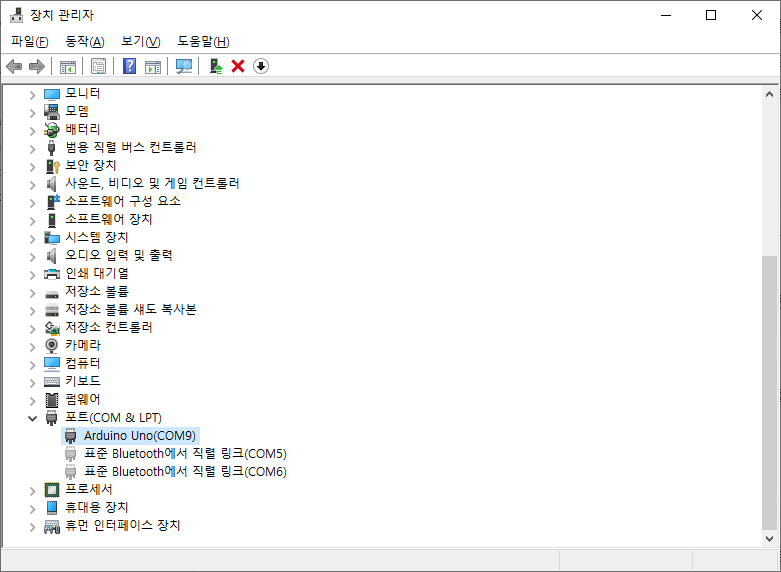
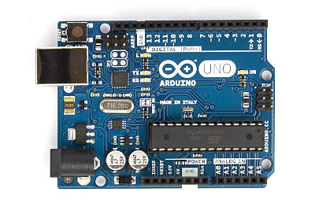
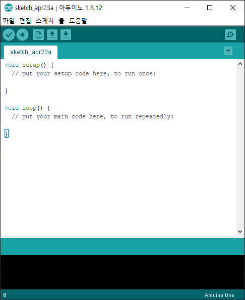
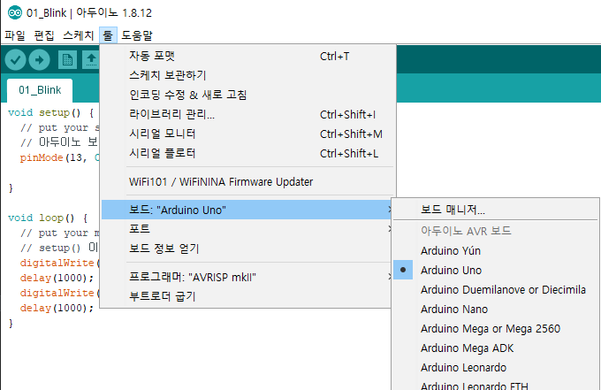
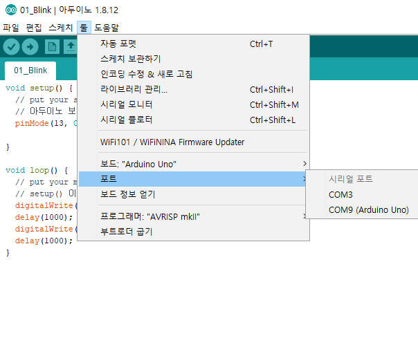
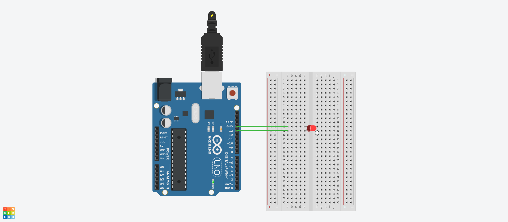
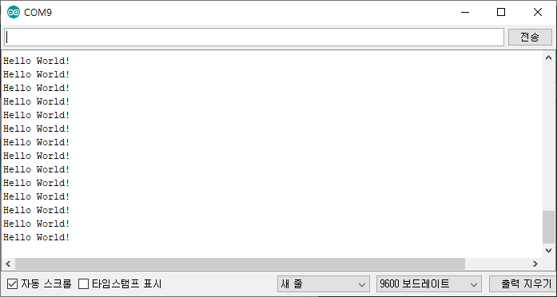
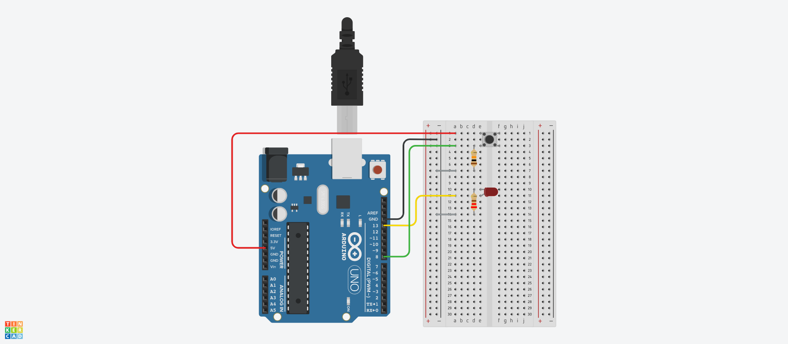

# Arduino Basic

## Concept

* Micro-Controller

  * 이식된 코드를 수행하는 단순한 기계

* 컴퓨터가 아니다

  * OS설치나 기타 응용프로그램을 설치할 수 없다.
  * 컴퓨터인 라즈베리파이와는 다르다.
  * 싱글보드 컴퓨터인 라떼판다를 연결하여 사용할 예정

* IoT와 맞물려 있어서 각광을 받는다.

  * IoT(Internet of Things) : 사물인터넷
    * 일반적인 사물에 통신장비를 결합하고 고도의 통신기술을 이용하여 특별한 작업을 수행하는 장비
  * 사물인터넷을 구현하기 위해서 그 안에 들어가는 Controller가 가져야 하는 조건
    * 저렴한 가격
    * 프로그램 작성과 프로그램 이식의 용이
    * 센서와 액츄에이터의 쉬운 사용

* 아두이노는 브랜드명, 여러가지 버전이 존재한다.

  * Uno
    * 가장 대표적인 모델(버전)
  * Mega
    * 크기가 크지만 꽤나 복잡한 처리를 할 수 있는 버전
  * Mini
    * 크기가 아주 작은 버전
  * etc
    * 굉장히 다양한 버전이 존재하고 우리 목적에 맞게 선택해서 사용

* 아두이노를 사용할 때 알아야할 간단한 전기상식

  * 전압은 기호로 V(Voltage)를 이용하고 단위로는 V(볼트)
    * +에서 -로 전류가 흐른다.
  * 전류는 기호로 I(Intensity)를 이용하고 단위로는 A(암페어)
  * 저항은 기호로 R(Resistance)을 이용하고 단위로는 옴
  * **V = IR** (전압 = 전류 * 저항)
    * 전류 = 전압 / 저항

* Serial Port를 사용하여 컴퓨터와 통신한다.

  * 컴퓨터의 제어판 - 하드웨어 및 소리 - 장치관리자 - 포트에 아두이노가 나타났는지 확인

    * 컴퓨터와 아두이노가 연결이 되어있는 상태여야 확인이 가능하다.

      

## Configuration

### Arduino Board



* 좌측 위의 큰 부분이 컴퓨터와 연결하는 부분
* 우측 위와 아래의 네이밍되어있는 소켓들이 헤더소켓
  * 우측 위의 Digital이라고 표현된 곳의 0번부터 13번 소켓을 사용한다.

### BreadBoard

![브레드보드 사용법 알아보기 [빵판 , 브레드보드 , 기원] : 네이버 블로그](image/unnamed.png)

* 보드에 존재하는 헤더소켓을 확장시켜서 사용할 목적으로 이용한다.
* 가운데에 A부터 J까지 구성된 공간은 세로로 연결되어있다.
* 빨간색과 파란색으로 줄 그어져 있는 위와 아래의 공간은 +, -극을 의미하며 가로로 연결되어 있다.

## Arduino IDE

* [Download Site](https://www.arduino.cc/en/Main/Software)에서 OS에 맞게 다운로드 받아서 설치

  * 설치과정의 다른 변경사항없이 그대로 설치하면된다.

  * 설치를 완료하고 실행하면 다음의 화면이 나온다.

    

* 과정

  * 아두이노 보드를 실행하면 `setup()`이 먼저 실행된다.
    * 한번만 실행하는 코드가 `setup()`내에 들어간다.
  * `setup()`이 실행되고나서는 `loop()`가 실행된다.
    * `loop()`는 우리가 따로 반복하도록 지정하지 않아도 아두이노 내에서 계속 반복해서 실행한다.

* Setting

  * 보드의 버전을 지정해준다.

    

    * 사용하는 보드의 버전을 지정한다.

  * 통신하는 포트를 지정해준다.

    

    * 포트는 연결된 상태여야 확인할 수 있다.

## Usage

### LED

> 간단한 LED 켜기예제로 사용법을 알아본다.

* `setup()`을 다음과 같이 구성한다.

  * 13번째 헤더소켓을 사용한다

    ```c
    pinMode(13, OUTPUT);
    ```

* `loop()`를 다음과 같이 구성한다.

  * LED를 킨다.

    * digital방식을 사용하기 때문에 `digitalWrite()`를 사용한다.

    ```c
    digitalWrite(13, HIGH);
    ```

    * 13번 핀으로 전류를 내보낸다는 의미다.

  * 1초동안 상태를 유지한다.

    ```c
    delay(1000);
    ```

    * 1초동안 불이 켜져있는 상태다.

  * LED를 끈다.

    ```c
    digitalWrite(13, LOW);
    ```

    * 13번 핀으로 전류를 내보내지 않는다는 의미다.

  * 1초동안 상태를 유지한다.

    ```c
    delay(1000);
    ```

    * 1초동안 불이 꺼져있는 상태다.

* 코드의 구성을 완료했으면 좌측 상단의 체크표시를 클릭한다.

  * 해당 코드 파일을 저장해야한다.
    * 저장하면 해당 이름으로 폴더가 생성되며 내부에 `.ino`확장자 파일이 생성된다.
  * 컴파일에 문제가 있는지 확인한다.

* 아두이노에서 회로를 구성한다.

  * Bread board를 사용하여 간접연결을 하거나, 암수 점퍼와이어를 이용하여 직접연결을 한다.
    * Breadboard를 사용한다면 주의할 점이 전구를 Breadboard에 꽂을 때다.
      * 가운데부분으로 꽂을텐데, 같은 라인에 꽂으면 안된다.
      * Breadboard는 위에서 말했듯이 세로로 연결되어 있는데 같은라인에 꽂으면 긴 부분과 짧은 부분이 서로 연결되어 있는 것이므로 전류를 주면 문제가 발생한다.
  * 보드의 우측상단 Digital 헤더소켓의 13번자리와 전구의 긴 부분을 연결한다.
    * 전구의 긴부분이 전류를 받는 부분이다.
  * 보드의 우측상단 혹은 우측하단의 GND(Ground) 소켓에 전구의 짧은 부분을 연결한다.
    * 전구의 짧은 부분이 전류를 내보내는 부분이다.
  * 13번 소켓에서 전류가 나가서, GND 소켓으로 들어가도록 설정하는 것이다.
    * 마찬가지로 전구는 짧은 부분에서 전류를 받고  부분으로 내보낸다.

  

### Serial

> 시리얼 모니터로 값을 받아오는 예제를 진행한다.

* 시리얼 모니터는 툴 - 시리얼모니터로 진입할 수 있다.

  * 아두이노가 연결되어있고, 포트가 설정되어 있는 상황이어야 한다.
  * 우측 아래의 보드레이트를 설정할 수 있다.
    * 보드레이트는 시리얼 통신의 속도를 의미하며 보통 9600을 사용한다.

* `setup()`을 다음과 같이 구성한다.

  ```c
  Serial.begin(9600);
  ```

  * Serial Port의 보드레이트를 설정한다.

* `loop()`를 다음과 같이 구성한다.

  ```c
  Serial.println("Hello World!");
  delay(1000);
  ```

  * 시리얼 모니터에 `Hello World!`를 출력하고 1초 쉰다.

* 아두이노에 업로드한 후 시리얼모니터의 우측 아래 보드레이트를 9600 보드레이트로 설정하고 확인한다.

  

* `setup()`에 다음의 코드를 추가한다.

  ```c
  pinMode(13, OUTPUT);
  ```

* `loop()`를 다음과 같이 수정한다.

  ```c
  if(Serial.available()){
    char c = Serial.read();
    if(c == 'A'){
      digitalWrite(13, HIGH);
    } else {
      digitalWrite(13, LOW);
    }
    delay(1000);
  }
  ```

  * `Serial.available()`은 Serial 통신으로 데이터가 들어왔는지를 확인한다.
    * Serial 통신으로 데이터를 보내는 방법은 시리얼 모니터에서 데이터를 입력하고 전송을 누르면 된다.
  * 코드만 살펴보면 A를 입력해서 전송했을 때 불이 켜져있는 상태가 될 것 같지만 1초후에 불이 꺼진다.
    * 이는 시리얼 모니터의 전송의 문제다.
    * A를 입력하고 전송하면 A 뒤의 `\n`이라는 줄바꿈문자가 같이 전송되기 때문에 이를 읽고 불이 꺼지는 것이다.

* 아두이노 회로는 LED 예제와 동일하게 구성해놓는다.

  * 아두이노 보드에서 나가는 전압은 5V의 전압이 나가게 된다.
    * 하지만 LED 전구의 강압전압은 2V이다. 과전압이기 때문에 전압을 줄이기 위해 저항을 추가한다.
    * LED 전구의 전류는 15mA이다.
      * 보통 전자기기를 구매하면 전자기기의 명세에 나와있다
    * 이를 이용하여 얼마만큼의 저항을 넣어야 하는지 계산한다.
  * **전압 = 전류 * 저항**을 이용한다.
    * **5 - 2 = 0.015 * R**을 이용해서 R을 계산한다.
    * 200의 값을 가진 저항을 가진다.
    * 220R의 값을 가진 저항을 연결해준다.

  

### Button

> Button의 입력을 사용한 예제를 진행해본다.

* 회로를 먼저 구성해본다.

  

  * 5V의 전압을 푸쉬버튼에 할당한다.
  * 푸쉬버튼의 반대쪽을 8번 소켓에 연결하여 8번 소켓에 신호를 보내도록 한다.
    * 푸쉬버튼은 맞은편과 회로가 이어져있다.
      그래서 맞은편에 연결하면 버튼과 상관없이 연결된 회로로 구성된다.
    * 반대편에 연결하면 버튼을 눌렀을 때 회로가 연결되도록 구성되어 있다.
    * 또, 저항 이후의 GND와의 연결부 중간에서 8번소켓과 연결하면 안된다.
      * 이는 나중에 풀업 풀다운 저항에서 자세한 내용을 알아볼 수 있다.
        [풀업 풀다운 참고 내용](https://kocoafab.cc/tutorial/view/526)
  * 푸쉬버튼에 저항을 추가하여 저항 이후에는 GND를 연결한다.
    * 이 저항은 푸쉬버튼이 눌렸을 때 아두이노의 전원과 그라운드가 단락(Short, 합선) 되더라도 소량의 전류가 흘러 아두이노 보드를 보호하기 위해 사용한다.
  * [Serial](#Serial) 예제처럼 전구를 연결한다.
  * 여기서 GND 부분은 Breadboard의 -부분을 이용하였다.
    * GND와 -부분중 하나를 연결해두면 모든 -부분은 GND와 연결된다.
    * 푸쉬버튼과 전구가 GND와 연결되어야 되는 부분을 이제 -부분과 연결해주면 GND와 연결된다.

* `setup()`을 구성한다.

  ```c
  void setup() {
    pinMode(13, OUTPUT);
    pinMode(8, INPUT);
  }
  ```

  * 13번은 전구와 연결된 소켓이므로 OUTPUT
  * 8번은 푸쉬버튼과 연결된 소켓이므로 INPUT

* `loop()`를 구성한다.

  ```c
  void loop() {
    int value = digitalRead(8);
    if(value == HIGH){
      digitalWrite(13, HIGH);
    } else {
      digitalWrite(13, LOW);
    }
  }
  ```

  * 8번 소켓으로 들어오는 신호를 읽는다.
    * 신호가 들어오면 전구의 불을 킨다.
    * 신호가 들어오지 않으면 전구의 불을 끈다.

