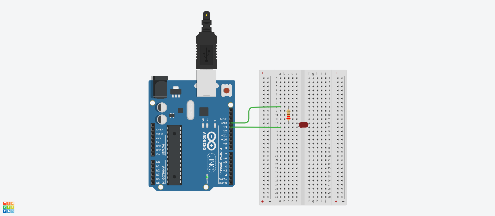

# Serial Communication

> Serial 통신을 이용하여 Eclipse와 Arduino간의 데이터 통신을 진행한다.

## Setting

* [Download Site](http://rxtx.qbang.org/wiki/index.php/Download)에서 RXTX를 다운로드 받아야한다.
  * zip파일을 다운로드받으면 RXTXcomm.jar파일이 존재한다.
  * 또한 각 운영체제 폴더가 존재하는데 Windows에 rxtxSerial.dll과 rxtxParallel.dll이 존재한다.
* 환경변수 JAVA_HOME으로 설정된 Java설치 폴더를 탐색한다.
  * 해당 Java폴더의 bin폴더 내에 rxtxSerial.dll파일을 붙여넣는다.
* Eclipse의 Project에 생성되어있는 Library폴더를 탐색한다.
  * RXTXcomm.jar파일을 붙여넣는다.
  * 해당 Project의 Java Build Path로 진입하여 Add Jar를 통해 해당 jar파일을 Library로 등록한다.

## Using Thread

### Eclipse

> Eclipse부터 작업을 진행한다.

* Thread를 이용하여 Arduino와 데이터 통신을 진행한다.

  * 새로운 Class를 생성한다.

* Serial 통신을 하기위한 COM포트를 설정한다.

  ```java
  CommPortIdentifier portIdentifier = null
  ```

  * `CommPortIdentifier`가 RXTXcomm.jar에 존재하는 Class이다.

  * null로 지정해준 이유

    * 이후에 try-catch문을 사용하여 예외처리를 진행하며 객체를 생성할 예정이다.

  * 객체 생성은 `CommPortIdentifier`의 **static method**를 이용하여 처리한다.

    ```java
    portIdentifier = CommPortIdentifier.getPortIdentifier("COM9");
    ```

    * `getPortIdentifier`의 인자는 Arduino가 연결되었을때 연결된 포트번호를 입력한다.

* 해당 포트가 다른 프로세스에 의해 점유되고 있는지 확인

  * 포트가 사용되고 있는지 확인한다.

  ```java
  if(portIdentifier.isCurrentlyOwned()) {
  	System.out.println("포트가 사용중입니다.");
  }
  ```

  * 포트가 사용중이 아니라면, 

    * Port를 열어서 Port 객체를 생성한다.

      ```java
      else {
          CommPort commPort = portIdentifier.open("PORT_OPEN", 2000);
      ```

      * `open()`의 두 인자는 Description이므로 사용자 임의로 지정하면 된다.

* Port객체를 얻어온 후 사용할 수 있는 Port는 두 개가 있다.

  * `SerialPort`, `ParallelPort`

  * Serial은 단일 선으로 연결되어 있는 것처럼 입출력단자가 한개씩인 경우다.

  * Parallel은 여러 개의 선으로 연결되어 있는 것처럼 입출력단자가 여러 개인 경우다.

    * 데이터를 병렬방식으로 전송하며 Arduino에 입출력단자가 여러개가 필요하다.

  * `SerialPort`로 이용할 수 있으므로 `ParallelPort`가 들어오면 프로그램을 끝낸다.

    ```java
    if(commPort instanceof SerialPort) {
    	
    } else {
    	System.out.println("Serial Port만 이용할 수 있다.");
    }
    ```

  * `SerialPort`임을 확인했으면 `commPort`를 `SerialPort`로 **Casting**한다.

    ```java
    SerialPort serialPort = (SerialPort)commPort;
    ```

  * Port의 통신속도를 설정한다.

    ```java
    serialPort.setSerialPortParams(9600, 
                                   SerialPort.DATABITS_8, 
                                   SerialPort.STOPBITS_1, 
                                   SerialPort.PARITY_NONE);
    ```

    * 첫 번째 인자는 Arduino의 보드레이트이다.
    * 2, 3, 4번째 인자는 전송비트, 중단비트, 패리티를 의미하는데 보통 위의 코드를 사용한다.

* 데이터 통신을 위해 Stream을 생성한다.

  * Serial 통신에서는 Byte방식으로 통신하기 때문에 기본 Stream을 사용한다.

  ```java
  InputStream in = serialPort.getInputStream();
  OutputStream out = serialPort.getOutputStream();
  ```

* Thread를 이용해서 Arduino로부터 들어오는 데이터를 반복적으로 받는다.

  * Anonymous Inner Class를 사용한다.

  ```java
  Thread t = new Thread(new Runnable() {
  	@Override
  	public void run() {
  		
  	}
  });
  t.start();
  ```

  * Byte방식으로 들어오므로 Byte배열을 생성한다.

    ```java
    byte[] buffer = new byte[1024];
    ```

    * 데이터가 얼마나 들어오는지 모르기때문에 적당히 큰값을 잡는다.

  * InputStream으로 들어온 Byte를 읽어서 Byte배열에 넣는 과정을 반복한다.
  
    ```java
    int len = -1;
    try {
    	while((len = in.read(buffer)) != -1) {
    		System.out.print("Data: " + new String(buffer, 0, len));
    	}
    } catch (Exception e) {
    	e.printStackTrace();
  }
    ```
  
    * len은 Data의 Size를 의미한다. -1은 데이터가 존재하지 않는다는 의미다.
    * `new String()`은 buffer배열중 0번째부터 len번째까지 출력한다는 의미다.
  
* [Code]

### Arduino

* `setup()`을 다음과 같이 구성한다.

  ```c
  void setup() {
    Serial.begin(9600);
  }
  ```

  * 9600 보드레이트를 지정한다.

* `loop()`를 다음과 같이 구성한다.

  ```c
  void loop() {
    Serial.println("Hello World");
    delay(1000);
  }
  ```

  * 1초마다 Serial 통신으로 Hello World를 전송하도록 설정한다.

* 업로드하여 확인한다.

  * Arduino보드에서 TX라고 쓰여있는 부분이 1초마다 깜박인다.
  * TX가 데이터를 전송을 의미한다.
  * RX는 데이터 수신을 의미한다.

## Using Event

### Eclipse

* [Using Thread](#Using Thread)의 코드에서 Thread부분만 제거하고 나머지는 동일하게 구성한다.

  * Thread가 들어있던 부분에 Event를 이용한 처리를 넣을 예정이다.

* 이벤트를 처리하는 Listener객체를 만들기 위한 Class를 정의해야 한다.

  * `SerialPortEventListener`라는 인터페이스를 상속받는다.

    ```java
    class SerialListener implements SerialPortEventListener {}
    ```

  * 추상메소드인 `serialEvent()`를 Overriding한다.

    * 이벤트가 발생하면 호출되는 method이다.

    ```java
    @Override
    public void serialEvent(SerialPortEvent arg0) {
    
    }
    ```

* 이벤트 처리를 `serialPort`에 추가한다.

  ```java
  serialPort.addEventListener(new SerialListener(in));
  ```

  * Event처리 객체가 Arduino로부터 들어오는 Data를 받아서 처리를 진행해야 한다.

    * 인자로 InputStream을 가진다.

  * 해당 Class에도 전역변수 선언과 생성자 선언을 진행한다.

    ```java
    private InputStream in;
    	
    SerialListener(InputStream in){
    	this.in = in;
    }
    ```

  * Data가 들어왔을 때, Event 처리가 진행되도록 신호를 주는 method를 설정한다.

    ```java
    serialPort.notifyOnDataAvailable(true);
    ```

    * 해당 코드는 `addEventListener()`아래에 작성한다.

* Overriding했던 Event처리 method를 구성한다.

  * EventType을 체크한다.

    ```java
    if(arg0.getEventType() == SerialPortEvent.DATA_AVAILABLE)
    ```

  * InputStream에 데이터가 존재하는지 확인한다.

    ```java
    int k = in.available();
    ```

    * `available()`의 return값은 Data의 Size를 의미하므로 k는 Data의 크기를 의미한다.

  * Data의 size를 알기 때문에 size만큼의 byte[]를 선언한다.

    ```java
    byte[] data = new byte[k];
    ```

  * InputStream의 데이터를 읽어와서 byte[]에 저장한다.

    ```java
    in.read(data, 0, k);
    ```

  * 저장된 데이터를 출력한다.

    ````java
    System.out.println("Data: " + data);
    ````

### Arduino

* Using Thread와 동일하다.

## Communication with Android

> Android와 컴퓨터간의 Network통신을 진행하고, 컴퓨터와 Arduino간의 Serial통신을 진행한다.

### Android

* MainActivity에서 새로운 Activity로 이동하는 Button과 해당 Button의 Action을 처리한다.

  * Layout에 Button생성

    ```xml
    <Button
        android:layout_width="match_parent"
        android:layout_height="wrap_content"
        android:text="Arduino의 LED 제어 실습(수업)"
        android:id="@+id/ArduinoBtn"/>
    ```

  * Activity Java에 Button의 Event처리

    ```java
    Button ArduinoBtn = findViewById(R.id.ArduinoBtn);
    
    ArduinoBtn.setOnClickListener(new View.OnClickListener() {
        @Override
        public void onClick(View v) {
            Intent i = new Intent();
            ComponentName cname = new ComponentName("com.example.androidlectureexample",
                    "com.example.androidlectureexample.ArduinoActivity");
            i.setComponent(cname);
            startActivity(i);
        }
    });
    ```

* ArduinoActivity로 새로운 Activity생성

* ArduinoActivity의 Layout 구성

  * 상태를 출력할 TextView, LED를 켤 Button, LED를 끌 Button으로 구성
  * [Arudino Activity Layout]

* ArduinoActivity의 Java 구성

  * 각 Widget의 객체 생성 및 Event 기본틀 형성

    ```java
    // onCreate() 외부
    private TextView statusTV;
    
    // onCreate() 내부
    statusTV = findViewById(R.id.statusTV);
    
    Button ledOnBtn = findViewById(R.id.ledOnBtn);
    ledOnBtn.setOnClickListener(new View.OnClickListener() {
        @Override
        public void onClick(View v) {
    
        }
    });
    
    Button ledOffBtn = findViewById(R.id.ledOffBtn);
    ledOffBtn.setOnClickListener(new View.OnClickListener() {
        @Override
        public void onClick(View v) {
            
        }
    });
    ```

  * Activity가 뜨는 순간, Eclipse와 Network 통신을 진행한다.

    * Activity(UI Thread)에서 Network처리 코드를 사용할 수 없다. (ANR 문제)

    * Thread를 사용한다.

    * Runnable 객체를 생성한다.

      ```java
      Runnable runnable = new Runnable(){
          @Override
          public void run() {
              try {
                  Socket socket = new Socket("70.12.229.25", 9998);
              } catch (IOException e){
                  Log.i("ArduinoTest", e.toString());
              }
          }
      };
      ```

    * Thread를 생성하고 실행한다.

      ```java
      Thread t = new Thread(runnable);
      t.start();
      ```

    * socket을 활용하여 Data 송수신 통로를 생성한다.

      ```java
      // onCreate() 외부
      private Socket socket;
      private BufferedReader br;
      private PrintWriter pw;
      
      // Thread 내부
      socket = new Socket("70.12.229.25", 9998);
      br = new BufferedReader(new InputStreamReader(socket.getInputStream()));
      pw = new PrintWriter(socket.getOutputStream());
      ```

  * LED On/Off Button에 pw를 사용하면 문제가 발생한다.

    * pw역시 Network를 사용하기 때문이다.
    * Thread가 사용할 공용객체를 활용하여 문제를 해결한다.

  * Thread가 사용할 공용객체를 만들기 위한 Class를 inner class로 선언한다.

    * 해당 Class는 내부에 메시지가 존재하면 Thread를 사용하여 전송하고 아니라면 메시지가 들어오길 기다리는 역할을 수행한다.

    ```java
    class SharedObject {
        private Object MONITOR = new Object();
        private LinkedList<String> list = new LinkedList<>();
    
        SharedObject() {}
    
        public void put(String msg){
            synchronized (MONITOR) {
                list.addLast(msg);
                MONITOR.notify();
                Log.i("ArduinoTest", "공용개체에 데이터 입력");
            }
        }
    
        public String pop(){
            String result = "";
            synchronized (MONITOR) {
                if (list.isEmpty()) {
                    try {
                        MONITOR.wait();
                        result = list.removeFirst();
                    } catch (Exception e) {
                        Log.i("ArduinoTest", e.toString());
                    }
                } else {
                    result = list.removeFirst();
                    Log.i("ArduinoTest", "공용객체에서 데이터 추출");
                }
            }
            return result;
        }
    }
    ```

    * Thread가 진입했을 때, MONITOR 객체를 활용하여 동기화를 설정한다.
      * list안에 원소가 없다면 MONITOR가 wait()가 된다.
      * 해당 Line에 진입하면 다른 위치에서 MONITOR가 notify()될 때까지 잠시 멈추게 된다.

  * `onCreate()`에 final변수로 공용객체를 선언한다.

    ```java
    final SharedObject shared = new SharedObject();
    ```

  * Thread 내부에 무한Loop로 공용객체의 메시지 전송을 진행한다.

    ```java
    while(true){
        String msg = shared.pop();
        pw.println(msg);
        pw.flush();
    }
    ```

  * LED ON/OFF Button의 Event처리를 진행한다.

    ```java
    shared.put("LED_ON");
    ```

    * OFF는 메시지만 LED_OFF로 변경해주면 된다.

  * [Arduino Activity Java Code]

### Eclipse

* Server Program이 될 Class하나를 생성한다.

* ServerSocket이 Thread로 구성되도록 만들 것이다.

  * Runnable 객체를 생성한다.

    ```java
    Runnable runnable = new Runnable() {
    	@Override
    	public void run() {
    		
    	}
    };
    ```

  * Thread를 생성하고 실행한다.

    ```java
    Thread t = new Thread(runnable);
    t.start();
    ```

* Runnable객체 내부에 Android와의 Socket 통신을 구성한다.

  ```java
  ServerSocket server = new ServerSocket(9998);
  System.out.println("ServerSocket Created");
  Socket socket = server.accept();
  System.out.println("Client Connected");
  					
  BufferedReader br = new BufferedReader(new InputStreamReader(socket.getInputStream()));
  PrintWriter pw = new PrintWriter(socket.getOutputStream());
  					
  String msg = "";
  while(true) {
  	if((msg = br.readLine()) != null) {
  		if(msg.equals("LED_ON")) {
  			System.out.println("Turn on LED");
  		}
  		if(msg.equals("LED_OFF")) {
  			System.out.println("Turn off LED");
  		}
  	}
  }
  ```

  * `System.out.println()`은 이후 전부 Arduino와의 통신으로 변경한다.

* main method에 Arduino와의 Serial 통신을 구성한다.

  ```java
  CommPortIdentifier portIdentifier = null;
  try {
  	portIdentifier = CommPortIdentifier.getPortIdentifier("COM9");
  			
  	if(portIdentifier.isCurrentlyOwned()) {
  		System.out.println("포트가 사용중입니다.");
  	} else {
  		CommPort commPort = portIdentifier.open("PORT_OPEN", 2000);
  		if(commPort instanceof SerialPort) {
  			SerialPort serialPort = (SerialPort)commPort;
  			serialPort.setSerialPortParams(9600, SerialPort.DATABITS_8, SerialPort.STOPBITS_1, SerialPort.PARITY_NONE);
  					
  			InputStream in = serialPort.getInputStream();
  			OutputStream out = serialPort.getOutputStream();
  		} else {
  			System.out.println("Serial Port만 이용할 수 있다.");
  		}
  	}
  } catch (Exception e) {
  	e.printStackTrace();
  }
  ```

* OutputStream은 사용하기 힘드므로 BufferedWriter를 이용한다.

  ```java
  static BufferedWriter bw;
  
  // OutputStream 생성 위치
  bw = new BufferedWriter(new OutputStreamWriter(out));
  ```

* BufferedWrtier를 이용하여 Arduino에 데이터를 전송한다.

  ```java
  bw.write(msg, 0, msg.length());
  bw.flush();
  ```

  * Runnable 객체 내부에서 `System.out.println()`부분에 추가한다.
  * msg의 전송길이를 지정해줘야 하기 때문에 위와같이 작성하였다.

* [Eclipse Server Code]

### Arduino

* `setup()`을 다음과 같이 구성한다.

  ```c
  void setup() {
    // put your setup code here, to run once:
    Serial.begin(9600);
    pinMode(13, OUTPUT);
  }
  ```

* `loop()`를 다음과 같이 구성한다.

  ```c
  void loop() {
    // put your main code here, to run repeatedly:
    if(Serial.available()){
      String msg = Serial.readStringUntil('\n');
      if(msg == "LED_ON"){
        digitalWrite(13, HIGH);
      } else {
        digitalWrite(13, LOW);
      }
    }
  }
  ```

  * `readStringuntil()`을 통해 `\n`이 나오기 전까지의 String을 가져온다.

* Arduino의 회로를 다음과 같이 구성한다.

  