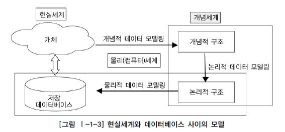

# 데이터 모델의 이해

## 모델링의 이해

### 모델링의 정의

* 모델을 만들어가는 일 자체
* 사람이 살아가면서 나타날 수 있는 다양한 현상은 사람, 사물, 개념 등에 의해 발생된다고 할 수 있으며
  모델링은 이것을 **표기법에 의해 규칙을 가지고 표기하는 것 자체**를 의미
* 모델링에 대한 다양한 정의
  * Webster 사전
    * 가설적 또는 일정 양식에 맞춘 표현
    * 어떤 것에 대한 예비표현으로 그로부터 최종대상이 구축되도록 하는 계획으로서 기여하는 것
  * 복잡한 현실세계를 단순화시켜 표현하는 것
  * 모델이란 사물 또는 사건에 관한 양상이나 관점을 연관된 사람이나 그룹을 위하여 명확하게 하는 것
  * 모델이란 현실 세계의 추상화된 반영

### 모델링의 특징

* **추상화**
  * 현실세계를 일정한 형식에 맞추어 표현을 한다는 의미
  * 다양한 현상을 일정한 양식인 표기법에 의해 표현
* **단순화**
  * 복잡한 현실세계를 약속된 규약에 의해 제한된 표기법이나 언어로 표현하여 쉽게 이해할 수 있도록 하는 개념
* **명확화**
  * 누구나 이해하기 쉽게 하기 위해 대상에 대한 애매모호함을 제거하고 정확하게 현상을 기술하는 것
* 특징을 활용하여 다시 정의된 모델링
  * **현실세계를 추상화, 단순화, 명확화하기 위해 일정한 표기법에 의해 표현하는 기법**

### 모델링의 세 가지 관점

* 데이터 관점
  * 업무가 어떤 데이터와 관련이 있는지 또는 데이터간의 관계는 무엇인지에 대해서 모델링하는 방법
* 프로세스 관점
  * 업무가 실제하고 있는 일은 무엇인지 또는 무엇을 해야 하는지를 모델링하는 방법
* 데이터와 프로세스의 상관관점
  * 업무가 처리하는 일의 방법에 따라 데이터는 어떻게 영향을 받고 있는지 모델링하는 방법

## 데이터 모델의 기본 개념의 이해

### 데이터 모델링의 정의

> 데이터베이스의 골격을 이해하고 그 이해를 바탕으로 SQL문장을 기능과 성능적인 측면에서 효율적으로 작성하기 위해 꼭 알아야 하는 핵심요소

* 정보시스템을 구축하기 위해, 해당 업무에 어떤 데이터가 존재하는지 또는 업무가 필요로 하는 정보는 무엇인지를 분석하는 방법
* 기업 업무에 대한 종합적인 이해를 바탕으로 데이터에 존재하는 업무 규칙에 대하여 참 또는 거짓을 판별할 수 있는 사실을 데이터에 접근하는 방법, 사람, 전산화와는 별개의 관점에서 이를 명확하게 표현하는 추상화 기법
* **업무에서 필요로 하는 데이터를 시스템 구축 방법론에 의해 분석하고 설계하여 정보시스템을 구축하는 과정**
* 데이터 모델링이란,
  * 정보시스템을 구축하기위한 데이터 관점의 업무 분석 기법
  * 현실세계의 데이터에 대해 약속된 표기법을 표현하는 과정
  * 데이터베이스를 구축하기 위한 분석/설계의 과정

### 데이터 모델이 제공하는 기능

* 시스템을 현재 또는 원하는 모습으로 **가시화**
* 시스템의 구조와 행동을 **명세화**
* 시스템을 구축하는 **구조화된 틀을 제공**
* 시스템을 구축하는 과정에서 결정한 것을 **문서화**
* 다양한 영역에 **집중**하기 위해 다른 영역의 세부 사항은 숨기는 **다양한 관점을 제공**
* 특정 목표에 따라 **구체화된 상세 수준의 표현방법**을 제공

## 데이터 모델링의 중요성 및 유의점

> 파급효과, 간결한 표현, 데이터 품질로 정리할 수 있다.

### 파급효과

* 데이터 구조의 변경으로 인한 일련의 변경작업은 전체 시스템 구축 프로젝트에서 큰 위험요소
  * 시스템 구축 작업 중에서 다른 어떤 설계 과정보다 데이터 설계가 더 중요

### 복잡한 정보 요구사항의 간결한 표현

* 데이터 모델은 구축할 시스템의 정보 요구사항과 한계를 가장 명확하고 간결하게 표현할 수 있는 도구
* 정보 요구사항을 파악하는 가장 좋은 방법은 간결하게 그려져 있는 데이터 모델을 리뷰하면서 파악하는 것

### 데이터 품질

* 데이터는 기업의 중요한 자산
* 데이터의 품질이 안 좋다면, 해당 데이터로 얻을 수 있었던 소중한 비즈니스의 기회를 상실할 수도 있는 문제

### 데이터 모델링 유의점

* **중복**
  * 같은 데이터를 사용하는 사람, 시간, 장소를 파악하는데 도움
  * 데이터베이스가 여러 장소에 같은 정보를 저장하는 잘못을 하지 않도록 함
* **비유연성**
  * 사소한 업무변화에도 데이터 모델이 수시로 변경됨으로써 유지보수의 어려움을 가중시킬 가능성
  * 데이터의 정의를 데이터의 사용 프로세스와 분리
    * 데이터 혹은 프로세스의 작은 변화가 애플리케이션과 데이터베이스에 중대한 변화를 일으킬 수 있는 가능성을 줄임
* **비일관성**
  * 중복이 없더라도 비일관성이 발생
    * 다른 데이터와 모순된다는 고려 없이 일련의 데이터를 수정할 수 있기 때문
  * 데이터와 데이터간 상호 연관 관계에 대한 명확한 정의는 이러한 위험을 사전에 예방

## 데이터 모델링의 3단계 진행

> 실질적인 현실 프로젝트에서는 개념 => 논리 => 물리로 수행하는 경우는 드물며,
> 개념과 논리적 데이터 모델을 한꺼번에 수행하여 논리적인 데이터 모델링으로 수행하는 경우가 대부분

* **개념적 데이터 모델링**
  * 추상화 수준이 높은 상위 수준을 형상화 하기 위해
  * 추상화 수준이 높고 업무중심적이고 포괄적인 수준의 모델링을 진행
  * 전사적 데이터 모델링, EA수립시 많이 이용
* **논리적인 데이터 모델링**
  * 엔터티중심의 상위 수준의 데이터 모델이 완성되면,
    업무의 구체적인 모습과 흐름에 따른 구체화된 업무중심의 데이터 모델을 만들어 냄
  * 시스템으로 구축하고자 하는 업무에 대해 Key, 속성, 관계 등을 정확하게 표현
  * 재사용성이 높음
* **물리적인 데이터 모델링**
  * 데이터베이스의 저장구조에 따른 테이블스페이스 등을 고려한 방식
  * 실제로 데이터베이스에 이식할 수 있도록 성능, 저장 등 물리적인 성격을 고려하여 설계

### 개념적 데이터 모델링

* 조직, 사용자의 데이터 요구사항을 찾고 분석하는데서 시작
* 핵심 엔터티와 그들 간의 관계를 발견, 그것을 표현하기 위해 **엔터티-관계 다이어그램**을 생성
  * 다이어그램: 조직과 사용자에게 어떠한 데이터가 중요한지 나타내기 위해서 사용
* **전사적 데이터 모델**
  * 데이터 모델링 과정이 전 조직에 걸쳐 이루어질 때
* 조직의 데이터 요구를 공식화
  * 사용자와 시스템 개발자가 데이터 요구사항을 발견하는 것을 지원
  * 현 시스템이 어떻게 변형되어야 하는가를 이해하는데 유용

### 논리적 데이터 모델링

* 데이터 모델링 과정에서 가장 핵심이 되는 부분
* **비즈니스 정보의 논리적인 구조와 규칙을 명확하게 표현하는 기법 또는 과정**
* 결과로 얻어지는 논리 데이터 모델은 **데이터 모델링이 최종적으로 완료된 상태**
* 누가, 어떻게 그리고 전산화와는 별개로 비즈니스 데이터에 존재하는 사실들을 인식하여 기록하는 것
* **정규화**
  * 모델의 일관성을 확보하고 중복을 제거하여 속성들이 가장 적절한 엔터티에 배치되도록 함으로써
    보다 신뢰성 있는 데이터구조를 얻는데 목적

### 물리적 데이터 모델링

* 데이터 저장소로서 어떻게 컴퓨터 하드웨어에 표현될 것인가를 다룸
* **물리적 스키마**
  * 데이터가 물리적으로 컴퓨터에 어떻게 저장될 것인가에 대한 정의

## 프로젝트 생명주기에서 데이터 모델링

* Waterfall 기반
  * 데이터 모델링의 위치가 분석과 설계단계로 구분되어 명확하게 정의
* 정보공학이나 구조적 방법론
  * 보통 분석단계에서 업무중싱믜 논리적인 데이터 모델링을 수행
  * 설계단계에서 하드웨어와 성능을 고려한 물리적인 데이터 모델링을 수행
* 나선형 모델
  * 업무크기에 따라 논리적 데이터 모델과 물리적 데이터 모델이 분석, 설계단계 양쪽에서 수행
  * 비중은 분석단계에서 논리적인 데이터 모델이 더 많이 수행되는 형태
* **일반적**
  * 계획 또는 분석단계에서 개념적 데이터 모델링 수행
  * 분석단계에서 논리적 데이터 모델링 수행
  * 설계단계에서 물리적 데이터 모델링 수행
  * 현실 프로젝트에서는 개념적 데이터 모델이 생략된 개념/논리 데이터 모델링이 분석단계 때 대부분 수행

## 데이터 모델링에서 데이터 독립성의 이해

### 데이터 독립성의 필요성

* 어떤 단위에 대해 독립적인 의미를 부여하고 그것을 효과적으로 구현하게 되면,
  * 자신이 가지는 고유한 특징을 명확하게 함
  * 다른 기능의 변경으로부터 쉽게 변경되지 않음
  * 자신의 고유한 기능을 가지고 기능을 제공함
* 반대말은 데이터 종속성
* **목적**
  * 지속적으로 증가하는 유지보수 비용을 절감
  * 데이터 복잡도를 낮추며 중복된 데이터를 줄이기 위함
  * 끊임없이 요구되는 사용자 요구사항에 대해 화면과 데이터베이스 간에 서로 독립성을 유지
* **효과**
  * 각 View의 독립성을 유지하고 계층별 View에 영향을 주지 않고 변경이 가능
  * 단계별 스키마에 따라 데이터 정의어(DDL)와 데이터 조작어(DML)가 다름을 제공

### 데이터베이스 3단계 구조

> ANSI/SPARC의 3단계 구성: 외부단계, 개념적 단계, 내부적 단계로 구성된 서로 간섭되지 않는 모델

* **외부단계**
  * 사용자와 가까운 단계
  * 사용자 개개인이 보는 자료에 대한 관점과 관련
  * 사용자가 처리하고자 하는 데이터 유형에 따라, 관점에 따라, 방법에 따라 다른 스키마 구조
* **개념적 단계**
  * 사용자가 처리하는 데이터 유형의 공통적인 사항을 처리하는 통합된 뷰를 스키마 구조로 디자인
* **내부적 단계**
  * 데이터가 물리적으로 저장된 방법에 대한 스키마 구조

### 데이터 독립성 요소

> 각각은 상호 독립적인 의미를 가지고 고유한 기능을 가짐
>
> 데이터 모델링은 통합관점의 뷰를 가지고 있는 개념 스키마를 만들어 가는 과정

* **외부스키마**
  * View단계 여러 개의 사용자 관점으로 구성
    * 개개 사용자 단계로서 개개 사용자가 보는 개인적 DB 스키마
  * DB의 개개 사용자나 응용프로그래머가 접근하는 DB 정의
* **개념스키마**
  * 개념단계 하나의 개념적 스키마로 구성
    * 모든 사용자 관점을 통합한 조직 전체의 DB를 기술하는 것
  * 모든 응용시스템들이나 사용자들이 필요로 하는 데이터를 통합한 조직 전체의 DB를 기술한 것
    * DB에 저장되는 데이터와 그들간의 관계를 표현하는 스키마
* **내부스키마**
  * 내부단계, 내부스키마로 구성
  * DB가 물리적으로 저장된 형식
  * 물리적 장치에서 데이터가 실제적으로 저장되는 방법을 표현하는 스키마

### 두 영역의 데이터 독립성

* **논리적 독립성**
  * 내용
    * 개념 스키마가 변경되어도 외부 스키마에는 영향을 미치지 않도록 지원하는 것
    * 논리적 구조가 변경되어도 응용프로그램에 영향 없음
  * 특징
    * 사용자 특성에 맞는 변경 가능
    * 통합 구조 변경 가능
* **물리적 독립성**
  * 내용
    * 내부스키마가 변경되어도 외부/개념 스키마는 영향을 받지 않도록 지원하는 것
    * 저장장치의 구조변경은 응용프로그램과 개념스키마에 영향 없음
  * 특징
    * 물리적 구조 영향없이 개념구조 변경 가능
    * 개념구조 영향 없이 물리적인 구조 변경 가능

### 사상

* **Mapping**, 상호 독립적인 개념을 연결시켜주는 다리
* **외부적/개념적 사상**
  * 논리적 사상
  * 외부적 뷰와 개념적 뷰의 상호 관련성을 정의
  * 사용자가 접근하는 형식에 따라 다른 타입의 필드를 가질 수 있음
  * 개념적 뷰의 필드 타입은 변화가 없음
* **개념적/내부적 사상**
  * 물리적 사상
  * 개념적 뷰와 저장된 데이터베이스의 상호관련성을 정의
  * 저장된 데이터베이스 구조가 바뀐다면, 개념적/내부적 사상이 바뀌어야 함
    * 그래야 개념적 스키마가 그대로 남아있게 됨
* 데이터 독립성을 보장하기 위해, Mapping을 하는 Script(DDL)를 DBA가 필요할 때마다 변경해 주어야 함

## 데이터 모델링의 중요한 세 가지 개념

### 데이터 모델링의 세 가지 요소

* 업무가 관여하는 어떤 것 **(Things)**
  * 사물이나 사건 등을 바라 볼 때 전체를 지칭하는 용어
* 어떤 것이 가지는 성격 **(Attribute)**
  * 그 어떤 것이 가지는 세부적인 사항
* 업무가 관여하는 어떤 것 간의 관계 **(Relationships)**
  * 각각의 어떤 것과 다른 어떤 것과의 연관성

### 단수와 집합의 명명

## 데이터 모델링의 이해관계자

### 이해관계자의 데이터 모델링 중요성 인식

* DBA가 데이터 모델링을 전적으로 담당하지 않음
  * 업무시스템을 개발하는 응용시스템 개발자가 데이터 모델링도 같이 진행
* 데이터 모델링이라는 과정이 단지 데이터베이스를 설계한다는 측면보다
  업무를 이해하고 분석하여 표현하는 것이 중요하고,
  표현된 내용을 바탕으로 프로젝트 관련자와 의사소통하고 프로그램이나 다른 표기법과 비교 검증하는 일을 수행하는 등 많은 시간을 업무를 분석하고 설계하는데 할애하기 때문에
  업무 영역별 개발팀에서 보통 데이터 모델링을 진행하게 되는 것

### 데이터 모델링의 이해관계자

* 정보시스템을 구축하는 모든사람
  * 데이터 모델링도 전문적으로 할 수 있거나 적어도 완성된 모델을 정확하게 해석할 수 있어야 함
* IT기술에 종사하거나 전공하지 않았더라도 해당 업무에서 정보화를 추진하는 위치에 있는 사람
  * 데이터 모델링에 대한 개념 및 세부사항에 대해 어느 정도 지식을 가지고 있어야 함

## 데이터 모델의 표기법인 ERD의 이해

### 데이터 모델 표기법

> Entity-relationship model(E-R Model), 1976년 Peter Chen

### ERD 표기법을 이용하여 모델링하는 방법

> 데이터 분석이 어느정도 완료되면 즉 엔터티, 관계, 속성 등이 데이터 사전이나 각종 산출물에 의해 분석된 상태에서 ERD를 그리는 것이 이론적인 작업 방법

1. ERD 작업순서

   > ERD는 엔터티와 엔터티 사이의 관계가 있는 정보를 나타내므로 두 개를 이용하여 작성
   >
   > Primary Key와 Foreign Key를 ERD 규칙에 따라 기술

   1. 엔터티를 그림
      * 엔터티는 사각형으로 표기하여 기술
   2. 엔터티를 적절하게 배치
      * 가장 중요한 엔터티를 왼쪽 상단에 배치, 그것을 중심으로 다음 엔터티를 나열하여 전개
   3. 엔터티간 관계를 설정
      * 초기에는 모두 Primary Key로 속성이 상속되는 식별자 관계를 설정
      * 중복되는 관계, Circle 관계가 발생하지 않도록 유의하여 작성
   4. 관계명을 기술
      * 관계이름은 현재형을 사용
      * 지나치게 포괄적인 용어는 사용하지 않음
   5. 관계의 참여도를 기술
   6. 관계의 필수여부를 기술

## 좋은 데이터 모델의 요소

### 완전성

* 업무에서 필요로 하는 모든 데이터가 데이터 모델에 정의되어 있어야 함

### 중복배제

* 하나의 데이터베이스 내에 동일한 사실은 반드시 한 번만 기록하여야 함

### 업무규칙

* 데이터 모델링 과정에서 도출되고 규명되는 수많은 업무규칙을 데이터 모델에 표현하고 이를 해당 데이터 모델을 활용하는 모든 사용자가 공유할 수 있도록 제공해야 함

### 데이터 재사용

* 데이터 재사용성을 향상시키고자 한다면 통합성과 독립성에 대해 충분히 고려해야 함
* 통합성
  * 통합 모델
    * 회사 전체 관점에서 공통 데이터를 도출하고 이를 전 영역에서 사용하기에 적절한 형태로 설계하여 시스템을 구축
  * 정보시스템에서의 '행위의 주체'가 되는 집합의 통합, '행위의 대상'이 되는 집합의 통합, '행위 자체'에 대한 통합 등은 정보시스템의 안정성, 확장성을 좌우하는 가장 중요한 요소
  * 간결한 모델의 기본적인 전제
    * 합리적으로 잘 정돈된 방법으로 데이터를 통합하여 데이터의 집합을 정의하고 이를 데이터 모델로 잘 표현하여 활용한다면 웬만한 업무 변화에도 데이터 모델이 영향을 받지 않고 운용할 수 있게 됨
* 독립성
  * 데이터가 애플리케이션에 대해 독립적으로 설계되어야만 데이터 재사용성을 향상시킬 수 있음
    * 독립되어 있지 않다면 데이터 중복이 발생하고 일관성 문제가 심각하래 초래됨

### 의사소통

* 도출되는 많은 업무 규칙들은 데이터 모델에 엔터티, 서브타입, 속성, 관계 등의 형태로 최대한 자세하게 표현되어야 함
* 데이터 모델이 진정한 의사소통의 도구로서의 역할을 함

### 통합성

* 동일한 데이터는 조직의 전체에서 한번만 정의되고 이를 여러 다른 영역에서 참조, 활용하는 것