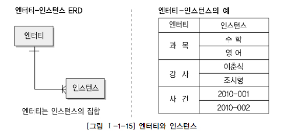

#  엔터티(Entity)

## 엔터티의 개념

> 실체, 객체

* 업무에 필요하고 유용한 정보를 저장하고 관리하기 위한 집합적인 것(Thing)
  * 사람, 장소, 물건, 사건, 개념 등의 명사
  * 업무상 관리가 필요한 관심사
  * 저장이 되기 위한 어떤 것(Thing)
* 업무 활동상 지속적인 관심을 가지고 있어야 하는 대상으로서,
  그 대상들 간에 동질성을 지닌 인스턴스들이나 그들이 행하는 행위의 집합
* **속성(Attribute)**
  * 그 집합에 속하는 개체들의 특성을 설명하는 것
  * '학생'이라는 엔터티내의 학번, 이름, 생일, 주소 등
* **인스턴스**
  * 엔터티의 하나의 값
  * '과목'이라는 엔터티의 수학, 영어, 국어라는 각각의 인스턴스가 존재

## 엔터티와 인스턴스에 대한 내용과 표기법

## 엔터티의 특징

* **반드시 해당 업무에서 필요하고 관리하고자 하는 정보여야 함**
* **유일한 식별자에 의해 식별이 가능해야 함**
* **영속적으로 존재하는 인스턴스의 집합이어야 함**
* **업무 프로세스에 의해 이용되어야 함**
* **반드시 속성이 있어야 함**
* **다른 엔터티와 최소 한 개 이상의 관계가 있어야 함**

### 업무에서 필요로 하는 정보

* 시스템 구축 대상인 해당업무에서 그 엔터티를 필요로 하는가를 판단하는 것이 중요
* 업무영역내에서 관리할 필요가 있는지를 먼저 판단하는 것이 중요

### 식별이 가능해야 함

* 각각의 업무적으로 의미를 가지는 인스턴스가 식별자에 의해 한 개씩만 존재하는지 검증해 보아야 함
* 유일한 식별자는 그 엔터티의 인스턴스만의 고유한 이름

### 인스턴스의 집합

* "한 개"가 아니라 "두 개 이상"이라는 집합 개념
* 인스턴스가 한 개 밖에 없는 엔터티는 집합이 아니므로 엔터티 성립이 안됨

### 업무 프로세스에 의해 이용

* 첫 번째 정의에서처럼 업무에서 반드시 필요하다고 생각하여 엔터티로 선정
  하지만 업무프로세스에 의해 전혀 이용되지 않는다면
  * 업무 분석이 정확하게 안되어 엔터티가 잘못 선정되었음을 의미
  * 업무프로세스 도출이 적절하게 이루어지지 않았음을 의미
* 그러한 엔터티가 존재한다면,
  * 엔터티를 제거하거나
  * 누락된 프로세스가 존재하는지 살펴보고 해당 프로세스를 추가해야함

### 속성을 포함

* 속성이 존재하지 않는 오브젝트는 엔터티가 될 수 없음

* 속성을 포함하지 않고 엔터티의 이름만 가지고 있는 경우
  * 관계가 생략된 경우
  * 업무 분석이 미진하여 속성정보가 누락되는 경우
* 주식별자만 존재하고 일반속성을 전혀 없는 경우도 마찬가지로 적절한 엔터티가 아님
  * 관계엔터티는 예외적으로 주식별자 속성만 가지고 있어도 엔터티로 인정

### 관계의 존재

* 엔터티가 관계가 없으면, 잘못된 엔터티이거나 관계가 누락되었을 가능성이 큼
* 관계를 생략하여 표현해야 하는 경우
  * 통계성 엔터티 도출
    * 업무진행 엔터티로부터 통계업무만을 위해 별도로 엔터티를 다시 정의하게 되므로
      엔터티간의 관계가 생략
  * 코드성 엔터티 도출
    * 너무 많은 관계 설정으로 인해 데이터 모델의 읽기효율성이 저하
    * 물리적으로 구현 이후에도 외부키에 의한 참조무결성을 체크하기 위한 규칙을 데이터베이스 기능에 맡기지 않는 경우가 대부분이기 때문에 논리적, 물리적으로 관계를 설정할 이유가 없음
  * 시스템 처리시 내부 필요에 의한 엔터티 도출
    * 업무적인 필요가 아니고 시스템 내부적인 필요에 의해 생성된 엔터티이므로 관계를 생략

## 엔터티의 분류

### 유무형에 따른 분류

* **유형 엔터티**
  * 물리적인 형태가 있고 안정적이며 지속적으로 활용되는 엔터티
  * 업무로부터 엔터티를 구분하기가 가장 용이
* **개념 엔터티**
  * 물리적인 형태는 존재하지 않고 관리해야 할 개념적 정보로 구분이 되는 엔터티
* **사건 엔터티**
  * 업무를 수행함에 따라 발생되는 엔터티
  * 비교적 발생량이 많으며 각종 통계자료에 이용

### 발생시점에 따른 분류

* **기본/키 엔터티**
  * 그 업무에 원래 존재하는 정보
  * 다른 엔터티와 관계에 의해 생성되지 않고 독립적으로 생성이 가능
  * 자신은 타 엔터티의 부모의 역할
* **중심 엔터티**
  * 기본엔터티로부터 발생되고 그 업무에 있어서 중심적인 역할
  * 데이터의 양이 많이 발생되고 다른 엔터티와의 관계를 통해 많은 행위 엔터티를 생성
* **행위 엔터티**
  * 두 개 이상의 부모 엔터티로부터 발생
  * 자주 내용이 바뀌거나 데이터 양이 증가
  * 분석 초기단계에서는 잘 나타나지 않으며, 상세 설계단계나 프로세스와 상관모델링을 진행하며 도출

## 엔터티의 명명

* 가능하면 현업업무에서 사용하는 용어를 사용
* 가능하면 약어를 사용하지 않음
* 단수명사를 사용
* 모든 엔터티에서 유일하게 이름이 부여
* 엔터티 생성 의미대로 이름을 부여