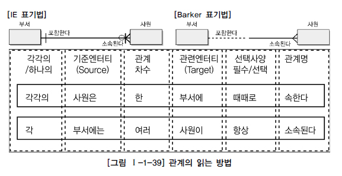

# 관계(Relationship)

## 관계의 개념

### 관계의 정의

* 사전적으로 정의하면 상호 연관성이 있는 상태
* 엔터티의 인스턴스 사이의 논리적인 연관성으로서 존재의 형태로서나 행위로서 서로에게 연관성이 부여된 상태

### 관계의 패어링(Paring)

* 엔터티 안에 인스턴스가 개별적으로 관계를 가지는 것이 **패어링**
* 패어링의 집합을 **관계**로 표현
* 자신이 관련된 인스턴스들과 관계의 어커런스로 참여하는 형태가 **관계 패어링**
  * 엔터티내에 인스턴스와 인스턴스사이에 관계가 설정되어 있는 어커런스
* 관계는 관계 패어링의 집합을 논리적으로 표현한 것

## 관계의 분류

* **존재에 의한 관계**
  * 행위에 따른 이벤트에 의해 발생되는 의미가 아님
  * 존재의 형태에 의해 관계가 형성되어 있는 것
* **행위에 의한 관계**
  * 행위에 의해 발생되었기 때문에 행위에 의한 관계
* 두 관계를 표현할 때는 구분하지 않고 표현
* 클래스다이어그램에서는 구분하여 연관관계와 의존관계로 표현
  * 항상 이용하는 관계로 존재적 관계에 해당하는 **연관관계**
    * 실선으로 표현
    * 소스코드에서 멤버변수로 선언하여 사용
  * 상대방 클래스의 행위에 의해 관계까 형성될 때 구분하여 표현하는 **의존관계**
    * 점선으로 표현
    * 행위를 나타내는 코드인 Operation에서 파라미터 등으로 이용

## 관계의 표기법

> 관계명(Membership) : 관계의 이름
>
> 관계차수(Cardinality) : 1:1, 1:M, M:N
>
> 관계선택사양(Optionally) : 필수관계, 선택관계

### 관계명

* 엔터티가 관계에 참여하는 형태를 지칭
* 각각의 관계는 두 개의 관계명을 가지며, 각각의 관계명에 의해 두 가지의 관점으로 표현
* 관계가 시작되는 편을 **관계시작점**, 받는 편을 **관계끝점**이라고 부름
  * 모두 관계이름을 가져야 하며, 참여자의 관점에 따라 관계이름이 능동적이거나 수동적으로 명명
* 명명규칙
  * 애매한 동사를 피함
  * 현재형으로 표현

### 관계차수

* 두 개의 엔터티간 관계에서 참여자의 수를 표현하는 것
* 가장 일반적인 관계차수 표현방법은 **1:M, 1:1, M:N**
  * Corw's Foot 모델에서는 한 개가 참여하는 경우 실선, 다수가 참여한 경우 까마귀발과 같은 모양으로 표기
* 한 개의 관계가 존재하느냐 아니면 두 개 이상의 멤버십이 존재하는지를 파악하는 것이 중요

### 관계선택사양

* 참여하는 엔터티가 항상 참여하는지 아니면 참여할 수도 있는지를 나타내는 방법이 **필수참여**와 **선택참여**
* 필수참여
  * 참여하는 모든 참여자가 반드시 관계를 가지는 타 엔터티의 참여자와 연결이 되어야 하는 관계
  * ERD에서 관계를 나타내는 선에서 아무런 표시를 하지 않음
* 선택참여
  * 필수참여의 반대, 참여할수도 안할수도 있는 관계
  * 물리속서에서 Foreign Key로 연결될 경우 Null을 허용할 수 있는 항목이 됨
  * ERD에서 관계를 나타내는 선에서 선택참여하는 엔터티 쪽을 원으로 표시

## 관계의 정의 및 읽는 방법

### 관계 체크사항

* 두 개의 엔터티 사이에 관심있는 연관규칙이 존재하는가?
* 두 개의 엔터티 사이에 정보의 조합이 발생하는가?
* 업무기술서, 장표에 관계연결에 대한 규칙이 서술되어 있는가?
* 업무기술서, 장표에 관계연결을 가능하게 하는 동사가 있는가?

### 관계 읽기

* 기준 엔터티를 한 개 또는 각각 읽음
* 대상 엔터티의 관계참여도 즉 개수를 읽음
* 관계선택사양과 관계명을 읽음

