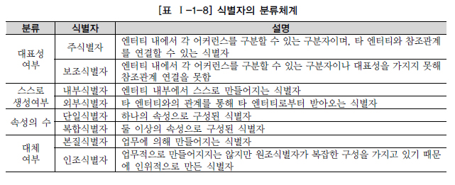
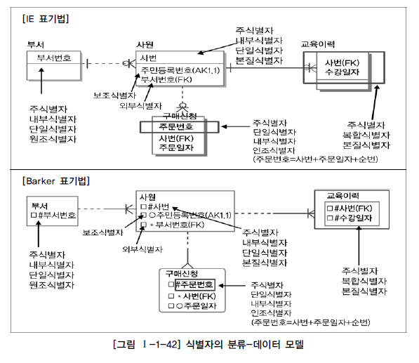

# 식별자

## 식별자 개념

* 하나의 엔터티에 구성되어 있는 여러 개의 속성 중에 엔터티를 대표할 수 있는 속성
* 하나의 엔터티는 반드시 하나의 유일한 식별자가 존재해야 함
* Key와 다름
  * 식별자는 업무적으로 구분이 되는 정보로 논리 데이터 모델링 단계에서 사용
  * Key는 데이터베이스 테이블에 접근하기 위한 매개체로서 물리데이터 모델링 단계에서 사용

## 식별자의 특징

* 주식별자의 경우
  * **유일성**: 주식별자에 의해 엔터티 내에 모든 인스턴스들이 유일하게 구분되어야 함
  * **최소성**: 주식별자를 구성하는 속성의 수는 유일성을 만족하는 최소의 수가 되어야 함
  * **불변성**: 지정된 주식별자의 값은 자주 변하지 않는 것이어야 함
  * **존재성**: 주식별자가 지정이 되면 반드시 값이 들어와야 함 (Null 안됨)
* 대체식별자의 특징은 주식별자의 특징과 일치
* 외부식별자의 경우 주식별자의 특징과 다르며 참조무결성 제약조건에 따른 특징을 가지고 있음

## 식별자 분류 및 표기법

### 식별자 분류

* 자신의 엔터티 내에서 대표성을 가지는가에 따라
  * 주식별자
  * 보조식별자
* 엔터티 내에서 스스로 생성되었는지 여부에 따라
  * 내부식별자
  * 외부식별자
* 단일속성으로 식별이 되는가에 따라
  * 단일식별자
  * 복합식별자
* 업무적으로 의미가 있던 식별자 속성을 대체하여 일련번호와 같이 새롭게 만든 식별자를 구분하기 위해
  * 본질식별자
  * 인조식별자

### 식별자 표기법

## 주식별자 도출기준

### 해당 업무에서 자주 이용되는 속성을 주식별자로 지정

* 여러 개의 속성이 해당 엔터티를 유일하게 식별가능하게 존재할 떄, 흔히 사용하는 속성을 지정

### 명칭, 내역 등과 같이 이름으로 기술되는 것은 피함

* 물리데이터베이스로 테이블을 생성하여 읽을때 WHERE조건절에 기술됨
  * 조건절에 정확한 명칭, 내역을 기술하기는 쉬운 일이 아님
* 명칭이나 내역이 있고 인스턴스들을 식별할 수 있는 다른 구분자가 존재하지 않을 경우는 새로운 식별자 생성
  * 보통 일련번호와 코드를 많이 사용

### 속성의 수가 많아지지 않도록 함

* 주식별자의 속성의 개수가 많다는 것은 새로운 인조식별자를 생성하여 데이터 모델을 구성하는 것이
  데이터 모델을 한층 더 단순하게 하고 애플리케이션을 개발할 때 조건절을 단순하게 할 수 있음

## 식별자관계와 비식별자관계에 따른 식별자

### 식별자관계와 비식별자 관계의 결정

* 외부식별자
  * 다른 엔터티와의 관계를 통해 자식 엔터티에 생성되는 속성
  * 데이터베이스 생성 시에 Foreign Key역할
  * 관계와 속성을 정의하고 주식별자를 정의하면 논리적인 관계에 의해 자연스럽게 도출
* 자식엔터티에서 부모엔터티로부터 받은 외부식별자를 자신의 주식별자로 이용할 것인지 또는 부모와 연결이 되는 속성으로만 이용할 것인지를 결정해야 함

### 식별자관계

* 부모로부터 받은 식별자를 자식엔터티의 주식별자로 이용하는 경우
  * Null값이 오면 안되므로 반드시 부모엔터티가 생성되어야 자기 자신의 엔터티가 생성됨
* 부모로부터 받은 속성만 주식별자로 사용한다면 부모엔터티와 자식엔터티의 관계는 1:1의 관계가 됨
* 부모로부터 받은 속성을 포함하여 다른 속성과 주식별자로 구성되는 경우는 1:M관계가 됨

### 비식별자 관계

* 부모로부터 속성을 받았지만 자식엔터티의 주식별자로 사용하지 않고 일반적인 속성으로만 사용하는 경우
* 비식별자 관계에 의한 외부속성을 생성하는 4가지 경우
  * 부모 없는 자식이 생성될 수 있는 경우
  * 엔터티별로 데이터의 생명주기를 다르게 관리할 경우
  * 여러 개의 엔터티가 하나로 통합되어 표현되었는데, 각각의 엔터티가 별도의 관계를 가질 경우
  * 자식엔터티에 주식별자로 사용하여도 되지만 자식엔터티에서 별도의 주식별자를 생성하는 것이 더 유리하다고 판단되는 경우

### 식별자 관계로만 설정할 경우의 문제점

* 주식별자 속성이 지속적으로 증가할 수 밖에 없는 구조로서 개발자 복잡성과 오류가능성을 유발

### 비식별자 관계로만 설정할 경우의 문제점

* 중요한 기준속성이 자식엔터티로 상속되지 않으면 이를 조회하기 위해 부모엔터티까지 찾아가야 함
* SQL구문에 많은 조인이 걸리게 되고 그에 따라 복잡성이 증가하고 성능이 저하됨

### 식별자 관계와 비식별자 관계 모델링

* **비식별자 관계 선택 프로세스**

  * 기본적으로 식별자 관계로 모든 관계가 연결되면서 다음 조건에 해당할 경우 비식별자 관계로 조정

    

    * 가장 중요한 요인은 자식엔터티의 독립된 주식별자 구성이 필요한지를 분석하는 부분
      * 업무적 필요성과 성능상 필요여부를 모두 포함하는 의미

* **식별자와 비식별자관계 비교**

  