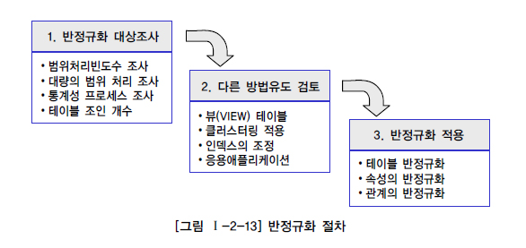
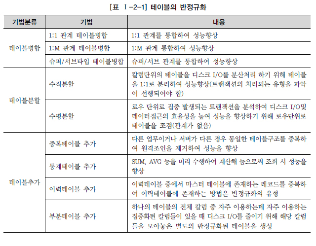
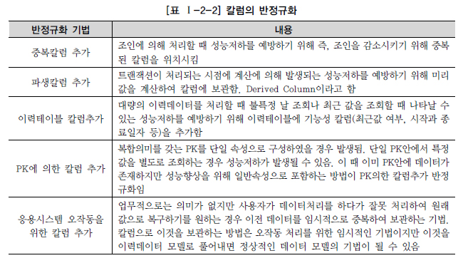
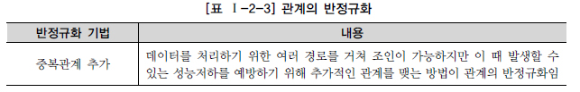

# 반정규화와 성능

## 반정규화를 통한 성능향상 전략

### 반정규화의 정의

* 정규화된 엔터티, 속성, 관계에 대해 시스템의 성능향상과 개발과 운영의 단순화를 위해 
  중복, 통합, 분리 등을 수행하는 데이터 모델링의 기법
* 반정규화를 적용하는 이유
  * 데이터를 조회할 때, 디스크 I/O량이 많아서 성능이 저하되는 경우
  * 경로가 너무 멀어 조인으로 인한 성능저하가 예상되는 경우
  * 칼럼을 계산하여 읽을 때 성능이 저하될 것이 예상되는 경우
* 반정규화를 통한 성능향상
  * 업무적으로 조회에 대한 처리성능이 중요하다고 판단되는 경우
  * 정규화의 함수적 종속관계는 위반하지 않지만 데이터의 중복성을 증가시켜야만 데이터 조회의 성능을 향상시키는 경우
* 반정규화를 기술적으로 수행하지 않는 경우
  * 성능이 저하된 데이터베이스가 생성될 수 있음
  * 구축단계나 시험단계에서 반정규화를 적용할 때 수정에 따른 노력비용이 많이 들게됨

### 반정규화의 적용방법

* 보통 프로젝트에서는 칼럼 중복을 통해서만 반정규화를 수행
  * SQL문장을 단순하게 처리하도록 하기 위해
* 테이블의 반정규화와 관계의 반정규화를 종합적으로 고려하여 결정
* 무분별한 반정규화는 데이터에 대한 무결성을 깨뜨리는 결정적인 역할을 하는 경우가 많음
  * 반드시 데이터 무결성을 보장할 수 있는 방법을 고려한 이후에 반정규화를 적용
  * 프로세스 처리에 있어서 안정성이 먼저 확인되어야 함

* **반정규화의 대상 조사**
  * 데이터가 해당 프로세스를 처리할 때 성능저하가 나타날 수 있는지 검증
  * 성능이 저하될 것으로 예상되면 4가지 경우를 고려하여 반정규화를 고려
    * 자주 사용되는 테이블에 접근하는 프로세스의 수가 많고 항상 일정한 범위만을 조회하는 경우
    * 테이블에 대량의 데이터가 있고 대량의 데이터 범위를 자주 처리하는 경우
      처리범위를 일정하게 줄이지 않으면 성능을 보장할 수 없을 경우
    * 통계성 프로세스에 의해 통계 정보를 필요로 할 때 별도의 통계테이블을 생성
    * 테이블에 지나치게 많은 조인이 걸려 데이터를 조회하는 작업이 기술적으로 어려울 경우
* **반정규화의 대상에 대해 다른 방법으로 처리가 가능한지 검토**
  * 반정규화를 결정하기 이전에 성능을 향상시킬 수 있는 다른 방법을 모색
  * View 사용
    * 지나치게 많은 조인이 걸려 데이터를 조회하는 작업이 기술적으로 어려울 경우
    * 뷰가 조회의 성능을 향상시키는 역할을 수행하지는 않음
    * 개발자별로 SQL문장을 만드는 방법에 따라 성능저하가 나타날 수 있으므로 사용
  * 클러스터링 적용
    * 대량의 데이터처리나 부분처리에 의해 성능이 저하되는 경우에 클러스터링을 적용
    * 대량의 데이터를 특정 클러스터링 팩트에 의해 저장방식을 다르게 하는 방법
    * 데이터를 입력/수정/삭제하는 경우 성능이 많이 저하
    * 조회중심의 테이블이 아니라면 생성하면 안되는 오브젝트
  * 인덱스 조정
    * 대량의 데이터처리나 부분처리에 의해 성능이 저하되는 경우
    * 인덱스를 통해 성능을 충분히 확보할 수 있다면 인덱스를 조정
  * 파티셔닝 기법
    * 대량의 데이터를 Primary Key의 성격에 따라 부분적인 테이블로 분리
    * 특정 기준에 의해 물리적인 저장공간이 구분될 수 있고 트랜잭션이 들어올 때 일정한 기준에 의해 들어온다면 파티셔닝 테이블을 적용하여 조회의 성능을 향상시키는 것도 좋은 방법
  * 응용 애플리케이션 로직 변경
    * 응용 애플리케이션에서 로직을 구사하는 방법을 변경함으로써 성능을 향상
    * 응용 메모리 영역에 데이터를 처리하기 위한 값을 캐쉬
    * 중간 클래스 영역에 데이터를 캐쉬하여 공유
* **반정규화의 적용**
  * 테이블, 속성, 관계에 대해 적용
  * 중복으로 가져가는 방법만이 반정규화가 아니고 추가/분할/제거도 방법

## 반정규화의 기법

### 테이블 반정규화

### 칼럼 반정규화

### 관계 반정규화

* 테이블, 칼럼과 다르게 데이터 무결성을 깨뜨릴 위험을 가지지 않음
* 데이터 모델 전체가 관계로 연결되어 있고 관계가 서로 먼 친척간에 조인관계가 빈번한 경우