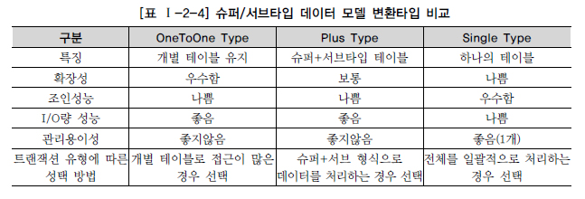

# 데이터베이스 구조와 성능

## 슈퍼타입/서브타입 모델의 성능고려 방법

### 슈퍼/서브타입 데이터 모델의 개요

* 업무를 구성하는 데이터의 특징을 공통과 차이점의 특징을 고려하여 효과적으로 표현
  * 공통의 부분을 슈퍼타입으로 모델링
  * 공통으로부터 상속받아 다른 엔터티와 차이가 있는 속성에 대해서는 별도의 서브엔터티로 구분
* 논리적인 데이터 모델에서 이용되는 형태
* 분석단계에서 많이 쓰이는 모델
* 물리적인 데이터 모델을 설계하는 단계에서는 슈퍼/서브타입 데이터 모델을 일정한 기준에 의해 변환

### 슈퍼/서브타입 데이터 모델의 변환

* 변환을 잘못하면 성능이 저하되는 이유는 트랜잭션 특성을 고려하지 않고 테이블이 설계되었기 때문
  * 트랜잭션은 항상 일괄로 처리하는데 테이블은 개별로 유지되어 Union연산에 의해 성능이 저하
  * 트랜잭션은 항상 서브타입 개별로 처리하는데 테이블은 하나로 통합되어 있어 불필요하게 많은 양의 데이터가 집약되어 있어 성능이 저하
  * 트랜잭션은 항상 슈퍼+서브 타입을 공통으로 처리하는데 개별로 유지되어 있거나 하나의 테이블로 집약되어 있어 성능이 저하
* 물리적인 데이터 모델로 변환하는 기준은 데이터 양과 해당 테이블에 발생되는 트랜잭션의 유형에 따라 결정
  * 데이터 양이 소량일 경우 성능에 영향을 미치지 않음
    * 데이터 처리의 유연성을 고려하여 가급적 1:1관계를 유지하는 것이 바람직
  * 데이터 용량이 많아지는 경우, 해당 업무적인 특징이 성능에 민감한 경우
    * 트랜잭션이 해당 테이블에 어떻게 발생되는지에 따라 3가지 변환방법을 참조하여 상황에 맞게 변환

### 슈퍼/서브 타입 데이터 모델의 변환기술

* 어떤 유형의 트랜잭션이 발생하는지 검증
* **개별로 발생되는 트랜잭션에 대해서는 개별 테이블로 구성**
  * 업무적으로 발생되는 트랜잭션이 슈퍼타입과 서브타입 각각에 대해 발생하는 것
    * 슈퍼타입이 각 서브타입에 대해 기준역할을 하는 형식
  * 슈퍼타입, 서브타입 모두 꼭 필요한 속성만을 가지게 하기 위해 모두 분리하여 1:1관계를 가지도록 함
  * 실전 프로젝트에서는 데이터 양이 대용량으로 존재하는 경우 슈퍼타입의 속성 수가 너무 많아져 디스크 I/O가 많아지는 것을 방지하기 위해 각각을 1:1관계로 가져가는 경우도 존재
* **슈퍼타입+서브타입에 대해 발생되는 트랜잭션에 대해서는 슈퍼타입+서브타입 테이블로 구성**
  * 슈퍼타입과 서브타입이 모두 하나의 테이블로 통합되어 있는 경우
    * 슈퍼타입 + 각 서브타입을 하나로 묶어 별도의 테이블로 구성하는 것이 효율적
* **전체를 하나로 묶어 트랜잭션이 발생할 때는 하나의 테이블로 구성**
  * 데이터를 처리할 때 여러 테이블을 항상 통합하여 처리한다고 하면 테이블을 개별로 분리했을 때 불필요한 조인을 유발하거나 불필요한 Union All과 같은 SQL구문이 작성되어 성능이 저하
  * 슈퍼타입과 서브타입의 테이블들을 하나로 묶었을 때 각각의 속성별로 제약사항을 정확하게 지정하지 못할지라도 대용량이고 성능향상이 필요하다면 하나의 테이블로 묶어서 만듬
* 혼합된 트랜잭션 유형이 있는 경우 많이 발생하는 트랜잭션 유형에 따라 구성

### 슈퍼/서브타입 데이터 모델의 변환타입 비교

## 인덱스 특성을 고려한 PK/FK 데이터베이스 성능향상

### PK/FK 칼럼 순서와 성능개요

* 데이터를 조회할 때 가장 효과적으로 처리될 수 있도록 접근경로를 제공하는 오브젝트가 인덱스
  * 일반적으로 데이터베이스 테이블에서는 균형 잡힌 트리구조의 B*Tree구조를 많이 사용
    * 정렬되어 있는 특징
    * 칼럼 앞 쪽에 위치한 값의 비교가 중요
* 데이터를 접근할 때 경로를 제공하는 성능의 측면에서 중요한 의미를 가짐
* 물리적인 데이터 모델링 단계에서는 스스로 생성된 PK순서 이외에 다른 엔터티로부터 상속받아 발생되는 PK순서까지 항상 주의하여 표시
* **PK순서를 결정하는 기준**은 인덱스 정렬구조를 이해한 사태에서 인덱스를 효율적으로 이용할 수 있도록 지정
  * 여러 개의 속성이 하나의 인덱스로 구성되어 있을 때 앞쪽에 위치한 속성의 값이 비교자로 있어야 인덱스가 좋은 효율을 나타낼 수 있다
* DDL 문장을 통해 PK순서를 다르게 생성할 수 있음
  * 대부분의 프로젝트에서는 데이터 모델의 순서에 따라 그대로 생성
  * 데이터모델과 데이터베이스 테이블의 구조가 다른 것처럼 보여 유지보수에 어려움이 있을 수 있기 때문
* FK도 데이터를 조회할 때 조인의 경로를 제공하는 역할을 수행하므로 반드시 인덱스를 생성
  * 접근이 가장 효율적인 칼럼 순서대로 인덱스를 생성

### PK칼럼의 순서를 조정하지 않으면 성능이 저하되는 이유

* 데이터 모델링에서 엔터티를 설계하면 그에 따라 DDL이 생성되고 생성된 DDL에 딸 인덱스가 생성
* 데이터 모델의 PK순서에 따라 각 칼럼이 정렬됨
* 맨 앞에 있는 인덱스 칼럼에 대해 조회조건이 들어오면 인덱스의 정렬된 첫 번째 칼럼에 비교가 되었기 때문에 순차적으로 데이터를 찾아감
  * 맨 앞에 있는 칼럼이 제외된 상태에서 데이터를 조회하면 데이터를 비교하는 범위가 매우 넓어지게 되어 성능 저하를 유발
    * 인덱스를 읽고 테이블 블록에서 읽어 처리하는데 I/O가 많이 발생하게 되므로 옵티마이저는 차라리 테이블에 가서 전체를 읽는 방식(Full Scan)으로 처리하게 됨
* **PK의 순서를 인덱스 특징에 맞게 고려하지 않고 그대로 생성하게 되면, 테이블에 접근하는 트랜잭션의 특징에 효율적이지 않은 인덱스가 생성되어 있으므로 인덱스의 범위를 넓게 이용하거나 Full Scan을 유발하게 되어 성능이 저하됨**

### PK순서를 잘못 지정하여 성능이 저하된 경우

* 조건으로 탐색하지 않는 인덱스가 가장 앞에 정렬되어 있을 경우 성능 저하
  * 순서를 변경해줘야 함
* 인덱스를 이용하였으나 최적화된 인덱스 이용이 안된 경우
  * 인덱스 이용 범위를 살펴보고 좁은 범위를 먼저 조회하여 성능을 향상
* 테이블의 PK구조를 그대로 둔 상태에서 인덱스만 하나 더 만들어도 성능은 개선 가능
  * 이미 만들어진 PK 인덱스가 전혀 사용되지 않는다면 입력/수정/삭제 시 불필요한 인덱스로 인해 더 성능이 저하되므로 좋지 않음
  * PK순서 변경을 통한 인덱스 생성이 바람직

## 물리적인 테이블에 FK제약이 걸려있지 않을 경우 인덱스 미생성으로 성능 저하

* 물리적인 테이블에 FK를 사용하지 않아도 데이터 모델 관계에 의해 상속받은 FK속성들은 SQL WHERE절에서 조인으로 이용되는 경우가 많이 있으므로 FK 인덱스를 생성해야 성능이 좋은 경우가 빈번함
* 비록 물리적으로 연결되어 있지 않다고 하더라도 상속받은 FK에 대해 FK인덱스를 생성함으로써 SQL문장에서 조인이 발생할 때 성능 저하를 예방할 수 있음
* FK 인덱스를 적절하게 설계하여 구축하지 않았을 경우 데이터 양이 누적될수록 SQL 성능이 나빠짐으로 인해 데이터베이스 서버에 심각한 장애현상을 초래하는 경우가 많이 있음
  * 물리적인 테이블에 FK 제약을 걸었을 때는 반드시 FK 인덱스를 생성하도록 하고
    FK 제약이 걸리지 않았을 경우에는 FK 인덱스를 생성하는 것을 기본정책으로 하되 발생되는 트랜잭션에 의해 거의 활용되지 않았을 때에만 FK 인덱스를 지우는 방법으로 하는 것이 적절한 방법