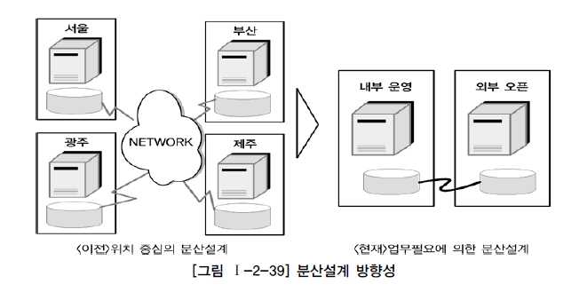

# 분산 데이터베이스와 성능

## 분산 데이터베이스의 개요

* **데이터베이스를 연결하는 빠른 네트워크 환경을 이용하여 데이터베이스를 여러 지역 여러 노드로 위치시켜 사용성/성능 등을 극대화시킨 데이터베이스**
  * 여러 곳으로 분산되어 있는 데이터베이스를 하나의 가상 시스템으로 사용할 수 있도록 한 데이터베이스
  * 논리적으로 동일한 시스템에 속하지만, 컴퓨터 네트워크를 통해 물리적으로 분산되어 있는 데이터들의 모임, 물리적 Site 분산, 논리적으로 사용자 통합/공유

## 분산 데이터베이스의 투명성

> 분산 데이터베이스가 되기 위해서는 6가지 투명성을 만족해야 함

* **분할 투명성 (단편화)**
  * 하나의 논리적 Relation이 여러 단편으로 분할되어 각 단편의 사본이 여러 Site에 저장
* **위치 투명성**
  * 사용하려는 데이터의 저장 장소 명시 불필요, 위치정보가 System Catalog에 유지되어야 함
* **지역사상 투명성**
  * 지역 DBMS와 물리적 DB사이의 Mapping보장
  * 각 지역시스템 이름과 무관한 이름 사용 가능
* **중복 투명성**
  * DB객체가 여러 Site에 중복 되어 있는지 알 필요가 없는 성질
* **장애 투명성**
  * 구성요소(DBMS, Computer)의 장애와 무관한 Transaction의 원자성 유지
* **병행 투명성**
  * 다수 Transaction 동시 수행시 결과의 일관성 유지
  * Time Stamp, 분산 2단계 Locking을 이용하여 구현

## 분산 데이터베이스의 적용 방법 및 장단점

### 분산 데이터베이스 적용 방법

* 업무의 흐름을 보고 업무 구성에 따른 아키텍처 특징에 따라 데이터베이스를 구성

### 분산 데이터베이스 장단점

## 분산 데이터베이스의 활용 방향성

## 데이터베이스 분산구성의 가치

* **통합된 데이터베이스에서 제공할 수 없는 빠른 성능을 제공**
* 원거리 또는 다른 서버에 접속하여 처리하므로 인해 발생되는 네트워크 부하 및
  트랜잭션 집중에 따른 성능 저하의 원인을 분산된 데이터베이스 환경을 구축하므로 빠른 성능을 제공

## 분산 데이터베이스의 적용 기법

* 테이블 위치 분산, 테이블 분할 분산, 테이블 복제 분산, 테이블 요약 분산의 종류
  * 테이블 복제 분할 분산의 방법을 가장 많이 사용
    * 성능이 저하되는 많은 데이터베이스에서 가장 유용하게 적용할 수 있는 기술적인 방법
* 통합 데이터 모델링을 하고 각 테이블 별로 업무적인 특징에 따라 지역 또는 서버별로 테이블을 분산 배치나 복제 배치하는 형태로 설계

### 테이블 위치 분산

* 설계된 테이블의 위치를 각각 다르게 위치시키는 것
* 테이블의 구조는 변하지 않음
* 다른 데이터베이스에 중복되어 생성되지 않음
* 정보를 이용하는 형태가 각 위치별로 차이가 있을 경우 이용
* 도식화된 위치별 데이터베이스 문서가 필요

### 테이블 분할 분산

* 단순히 위치만 다른 곳에 두는 것이 아니라, 각각의 테이블을 쪼개어 분산하는 방법
* 테이블을 나누는 기준에 따라 두 가지로 구분
  * 테이블을 로우(Row)단위로 분리하는 **수평분할**
  * 테이블을 칼럼(Column)단위로 분할하는 **수직분할**
* **수평분할**
  * 지사(Node)에 따라 테이블을 특정 칼럼의 값을 기준으로 로우를 분리
  * 각 지사별로 사용하는 로우가 다를 때 이용
  * 각 지사에 있는 데이터와 다른 지사에 있는 데이터가 항상 배타적으로 존재
    * 데이터를 한군데 집합시켜 놓아도 Primary Key에 의해 중복이 발생하지 않음
  * 각 지사에 존재하는 테이블에 대해서 통합처리를 해야하는 경우 조인이 발생하여 성능 저하가 예상
    * 통합처리 프로세스가 많은지를 먼저 검토한 이후에 많지 않은 경우에 수평분할을 진행
  * 데이터가 지사별로 별도로 존재하므로 중복은 발생하지 않음
  * 한 시점에는 한 지사에서 하나의 데이터만이 존재하므로 데이터의 무결성은 보장되는 형태
* **수직분할**
  * 지사(Node)에 따라 테이블 칼럼을 기준으로 칼럼을 분리
  * 각각의 테이블에는 동일한 Primary Key 구조와 값을 가지고 있어야함
  * 데이터를 한군데 집합시켜 놓아도 동일한 Primary Key는 하나로 표현하면 되므로 데이터 중복은 발생하지 않음
  * 전체 칼럼 데이터를 보기 위해서는 각 지사별로 흩어져 있는 테이블들을 조인하여 가져와야 하므로 가능하면 통합하여 처리하는 프로세스가 많은 경우에는 이용하지 않음

### 테이블 복제 분산

* 동일한 테이블을 다른 지역이나 서버에서 동시에 생성하여 관리하는 유형
* 마스터 데이터베이스의 테이블의 일부의 내용만 다른 지역이나 서버에 위치시키는 **부분복제**
  * 통합된 테이블을 한군데(본사)에 가지고 있으면서 각 지역별로는 지사에 해당된 로우를 가지고 있는 형태
  * 지사에 존재하는 데이터는 반드시 본사에 존재
  * 본사의 데이터는 지사 데이터의 합
  * 전체 데이터에 대한 통합처리도 본사에 있는 통합 테이블을 이용하게 되므로 조인이 발생하지 않는 빠른 작업 수행이 가능
  * 지사간에는 데이터 중복이 발생하지 않으나 본사와 지사간에는 데이터의 중복이 항상 발생
  * 실제 프로젝트에서 많이 사용하는 데이터베이스 분산 기법
  * 실시간 처리에 의해 복사하는 것 보다는 야간 배치 작업에 의해 수행되는 경우가 많음
    * 다른 지역간의 데이터를 복제하는데 많은 시간이 소요되기 때문
    * 데이터베이스와 서버에 부하가 발생하기 때문
  * 데이터의 정합성을 일치시키는 것이 어렵기 때문에 가능하면 한쪽(지사)에서 데이터의 수정이 발생하여 본사로 복제하도록 함
  * 지사에서 데이터에 대한 입력, 수정, 삭제가 발생하여 본사에서 이용하는 방식이 많음
* 마스터 데이터베이스의 테이블의 내용을 각 지역이나 서버에 존재시키는 **광역복제**
  * 통합된 테이블을 한군데(본사)에 가지고 있으면서 각 지사에도 본사와 동일한 데이터를 모두 가지고 있는 형태
  * 지사에 존재하는 데이터는 반드시 본사에 존재
  * 모든 지사에 있는 데이터양과 본사에 있는 데이터양이 동일
  * 본사와 지사 모두 동일한 정보를 가지고 있으므로 데이터 처리에 특별한 제약을 받지 않음
  * 실제 프로젝트에서 많이 사용하는 데이터베이스 분산기법
  * 실시간 처리에 의해 복사하는 것 보다는 야간 배치 작업에 의해 수행되는 경우가 많음
    * 다른 지역간의 데이터를 복제하는데 많은 시간이 소요되기 때문
    * 데이터베이스와 서버에 부하가 발생하기 때문
  * 본사에서 데이터가 입력, 수정, 삭제가 되어 지사에서 이용하는 형태

### 테이블 요약 분산

* 지역간에 또는 서버 간에 데이터가 비슷하지만 서로 다른 유형으로 존재하는 경우
* **분석요약**
  * 동일한 테이블 구조를 가지고 있으면서 분산되어 있는 동일한 내용의 데이터를 이용하여 통합된 데이터를 산출하는 방식
  * 각 지사별로 존재하는 요약 정보를 본사에 통합하여 다시 전체에 대해서 요약정보를 산출하는 분산방법
  * 각종 통계데이터를 산정할 때, 모든 지사의 데이터를 이용하여 처리하면 성능이 지연되고 각 지사 서버에 부하를 주기 때문에 업무에 장애가 발생
    * 통합 통계데이터에 대한 정보제공에 용이한 분산방법
* **통합요약**
  * 분산되어 있는 다른 내용의 데이터를 이용하여 통합된 데이터를 산출하는 방식
  * 각 지사별로 존재하는 다른 내용의 정보를 본사에 통합하여 다시 전체에 대해서 요약정보를 산출하는 방법
  * 각종 통계데이터를 산정할 때, 모든 지사의 데이터를 조인하여 처리하면 성능이 지연되고 각 지사 서버에 부하를 주기 때문에 업무에 장애가 발생
    * 통합 통계데이터에 대한 정보제공에 용이한 분산방법

## 분산 데이터베이스를 적용하여 성능이 향상된 사례

* **분산설계가 효과적인 경우**
  * 성능이 중요한 사이트에 적용하는 경우
  * 공통코드,  기준정보, 마스터 데이터 등에 대해 분산환경을 구성하면 성능이 좋아지는 경우
  * 실시간 동기화가 요구되지 않는 경우
    * 실시간의 업무적인 특징을 가지고 있을 때도 분산 환경을 구성할 수 있음
  * 특정 서버에 부하가 집중이 될 때 부하를 분산하기 위한 경우
  * 백업 사이트를 구성하는 경우
    * 간단하게 분산기능을 적용하여 구성할 수 있음