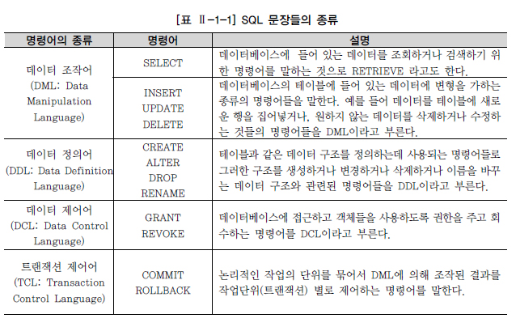

# 관계형 데이터 베이스 개요

## 데이터베이스

* 넓은 의미에서의 데이터베이스
  * 일상적인 정보들을 모아 놓은 것 자체를 의미
* 일반적인 데이터베이스
  * 특정 기업이나 조직 또는 개인이 필요에 의해 데이터를 일정한 형태로 저장해 놓은 것
* DBMS(Database Management System)
  * 보다 효율적인 데이터 관리
  * 예기치 못한 사건으로 인한 데이터의 손상을 방지
  * 필요시 필요한 데이터를 복구하기 위한 강력한 기능의 소프트웨어
* 데이터베이스의 발전
  * 1960년대
    * 플로우 차트 중심의 개발 방법 사용
    * 파일 구조를 통해 데이터를 저장하고 관리
  * 1970년대
    * 데이터베이스 관리 기법이 처음 태동
    * 계층형 데이터베이스, 망형 데이터베이스와 같은 제품들이 상용화
  * 1980년대
    * 관계형 데이터베이스 상용화 (Oracle, Sybase, DB2)
  * 1990년대
    * 많은 제품들이 보다 향상된 기능으로 정보시스템의 확실한 핵심 솔루션으로 자리잡음
    * 객체 관계형 데이터베이스로 발전
* 관계형 데이터베이스
  * 정규화를 통한 합리적인 테이블 모델링을 통해 이상현상을 제거하고 데이터 중복을 방지하며 동시성 관리, 병행 제어를 통해 많은 사용자들이 동시에 데이터를 공유 및 조작할 수 있는 기능 제공
  * 메타데이터를 총괄 관리
    * 데이터의 성격, 속성, 표현방법등을 체계화
    * 데이터 표준화를 통한 데이터 품질을 확보
  * DBMS는 인증된 사용자만이 참조할 수 있도록 보안 기능 제공
    * 다양한 제약조건을 이용하여 데이터 무결성을 보장

## SQL

> Structured Query Language

* 관계형 데이터베이스에서 데이터 정의, 데이터 조작, 데이터 제어를 하기 위해 사용하는 언어

* SQL 문장들의 종류

  

## TABLE

* 어느 특정한 주제와 목적으로 만들어지는 일종의 집합

* 데이터를 저장하는 객체로서 관계형 데이터베이스의 기본 단위

* 테이블의 구조

  

* 테이블 용어

  

* 모든 데이터를 하나의 테이블로 저장하지 않음

  * 복수의 테이블로 분할하여 저장
  * 분할된 테이블은 그 칼럼의 값에 의해 연결
  * 테이블을 분할하여 데이터의 불필요한 중복을 줄이는 것을 **정규화**
  * 각 행을 한가지 의미로 특정할 수 있는 한 개 이상의 칼럼을 **기본키(Primary Key)**
  * 다른 테이블의 기본 키로 사용되면서 테이블과의 관계를 연결하는 역할을 하는 칼럼을 **외부키(Foreign Key)**

## ERD

* 관계의 의미를 직관적으로 표현할 수 있는 좋은 수단
* 테이블 간 서로의 상관 관계를 그림으로 도식화한 것을 **E-R다이어그램(ERD)**
* ERD의 구성요소
  * 엔터티(Entity)
  * 관계(Relationship)
  * 속성(Attribute)