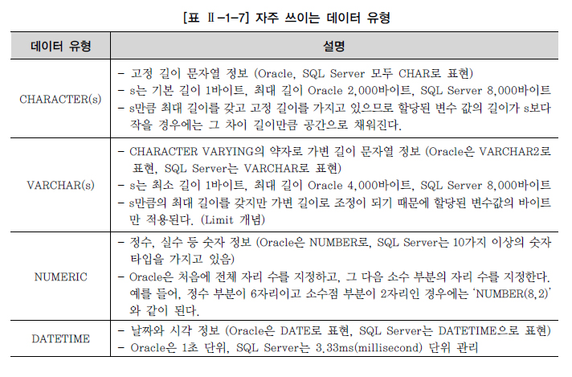
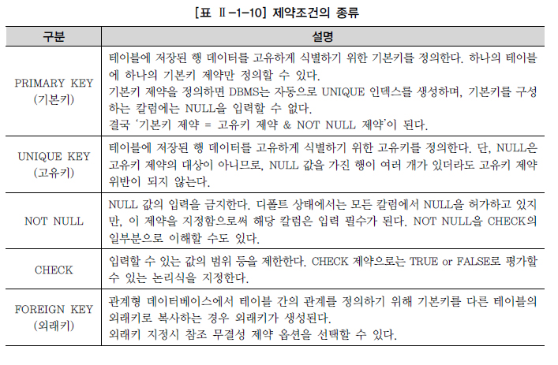

# DDL

> Data Definition Language

## 데이터 유형

* 데이터베이스의 테이블에 특정 자료를 입력할 때, 그 자료를 받아들일 공간을 자료의 유형별로 나누는 기준

  * 특정 칼럼을 정의할 때 선언한 데이터 유형은 그 칼럼이 받아들일 수 있는 자료의 유형을 규정

* 대표적인 4가지 데이터 유형

  

  * CHAR vs VARCHAR
    * VARCHAR는 가변길이 이므로 필요한 영역은 실제 데이터 크기
      * CHAR 유형보다 작은 영역에 저장할 수 있으므로 VARCHAR가 장점
    * 비교방법의 차이
      * CHAR에서는 문자열을 비교할 때 공백을 채워서 비교하는 방법을 사용
        * 끝의 공백만 다른 문자열은 같다고 판단
      * VARCHAR에서는 공백도 하나의 문자로 취급하므로 끝의 공백이 다르면 다른 문자로 판단
    * 주민등록번호나 사번처럼 자료들이 고정된 길이의 문자열을 가지지 않는다면 데이터 유형은 VARCHAR를 적용

## CREATE TABLE

### 테이블과 칼럼 정의

* 기본키 지정
  * 테이블에 존재하는 모든 데이터를 고유하게 식별할 수 있어야 함
  * 반드시 값이 존재하는 단일 칼럼이나 칼럼의 조합들(후보키) 중에 하나로 선정
* 기본키는 단일 칼럼이 아닌 여러 개의 칼럼으로도 만들어질 수 있음
* 테이블과 테이블 간에 정의된 관계는 기본키와 외부키를 활용해서 설정

### CREATE TABLE

```sql
CREATE TABLE 테이블이름 (
	칼럼명1 DATATYPE [DEFAULT 형식],
	칼럼명2 DATATYPE [DEFAULT 형식],
    칼럼명3 DATATYPE [DEFAULT 형식]
)
```

* 테이블 생성 시 주의해야 할 규칙
  * 테이블명은 객체를 의미할 수 있는 적절한 이름을 사용
    * 가능한 단수형을 권고
  * 테이블명은 다른 테이블의 이름과 중복되지 않아야 함
  * 한 테이블 내에서 칼럼명이 중복되게 지정될 수 없음
    * 다른 테이블의 칼럼이름과는 같을 수 있음
  * 테이블 이름을 지정하고 각 칼럼들은 괄호 `( )`로 묶어 지정
  * 각 칼럼들은 콤마`,`로 구분되고, 테이블 생성문의 끝은 항상 세미콜론`;`으로 끝남
  * 칼럼에 대해서는 다른 테이블까지 고려하여 데이터베이스 내에서는 일관성 있게 사용
    * 데이터 표준화 관점
  * 칼럼 뒤에 데이터 유형은 꼭 지정되어야 함
  * 테이블명과 칼럼명은 반드시 문자로 시작해야 하고, 벤더별로 길이에 대한 한계가 있음
  * 벤더에서 사전에 정의한 예약어는 사용 불가
  * `A-Z, a-z, 0-9, _, $, #` 문자만 허용
* 추가적인 주의사항
  * 테이블 생성시 대/소문자 구분은 하지 않음
    * 기본적으로 테이블이나 칼럼명은 대문자로 생성됨
  * DATATIME 데이터 유형에는 별도로 크기를 지정하지 않음
  * 문자 데이터 유형은 반드시 가질 수 있는 최대 길이를 표시
  * 칼럼과 칼럼의 구분은 콤마로 하되, 마지막 칼럼에는 콤마를 찍지 않음
  * 칼럼에 대한 제약 조건이 있으면 CONSTRAINT를 이용하여 추가
* 칼럼 LEVEL 정의방식
  * 칼럼의 데이터 유형 뒤에 NOT NULL을 정의한 사례와 같은 방식
* 테이블 LEVEL 정의 방식
  * 테이블 생성 마지막에 모든 제약조건을 기술하는 방식

### 제약조건

* 데이터의 무결성을 유지하기 위한 데이터베이스의 보편적인 방법

* 테이블의 특정 칼럼에 설정하는 제약

* 제약조건의 종류

  

* NULL 의미

  * 공백이나 숫자 0과는 전혀 다른 값
  * 조건에 맞는 데이터가 없을 때의 공집합과도 다름
  * 아직 정의되지 않은 미지의 값
  * 현재 데이터를 입력하지 못하는 경우

* DEFAULT 의미

  * 데이터 입력시 명시된 값을 지정하지 않은 경우에 NULL값 대신 정의된 DEFAULT값을 입력

### 생성된 테이블 구조 확인

* Oracle

  ```sql
  DESCRIBE 테이블명;
  DESC 테이블명;
  ```

* SQL Server

  ```sql
  sp_help 'dbo.테이블명'
  ```

### SELECT 문장을 통한 테이블 생성 사례

> CTAS(Create Table ~ As Select ~)

* 칼럼별로 데이터 유형을 다시 재정의 하지 않아도 되는 장점
* 기존 테이블의 제약조건 중에 NOT NULL만 새로운 복제 테이블에 적용
  * 기본키, 고유키, 외래키, CHECK 등의 다른 제약조건은 없어짐
  * ALTER TABLE 기능을 사용하여 제약조건 추가해야 함
* SQL Server
  * `SELECT ~ INTO ~`를 활용
  * 칼럼 속성에 Identity를 사용했다면 해당 속성까지 같이 적용

## ALTER TABLE

* 칼럼을 추가/삭제하거나 제약조건을 추가/삭제하는 작업을 진행

### ADD COLUMN

```sql
ALTER	TABLE		{테이블명}
ADD		{추가할 칼럼명}  {데이터 유형};
```

* 기존 테이블에 필요한 칼럼을 추가하는 명령
* 새롭게 추가된 칼럼은 테이블의 마지막 칼럼이 되며 칼럼의 위치를 지정할 수 는 없음

### DROP COLUMN

```SQL
ALTER	TABLE	{테이블명}
DROP	COLUMN	{삭제할 칼럼명};
```

* 불필요한 칼럼을 삭제하는 명령
  * 데이터가 있거나 없거나 모두 삭제 가능
* 한 번에 하나의 칼럼만 삭제 가능
* 칼럼 삭제 후 최소 하나 이상의 칼럼이 테이블에 존재해야 함
* 한 번 삭제된 칼럼은 복구가 불가능

### MODIFY COLUMN

```SQL
[ORACLE]
ALTER	TABLE	{테이블명}
MODIFY	({칼럼명1} {데이터 유형} [DEFAULT 식] [NOT NULL],
         {칼럼명2} {데이터 유형} ...);
         
[SQL Server]
ALTER	TABLE	{테이블명}
ALTER	(칼럼명1 데이터 유형 [DEFAULT 식] [NOT NULL],
         칼럼명2 데이터 유형 ...);
```

* 칼럼에 대한 정의를 변경하는 명령

* 칼럼 변경시 고려해야 할 사항

  * 해당 칼럼의 크기는 늘릴 수 있지만 줄이지는 못함
    * 기존의 데이터가 훼손될 수 있기 때문
  * 해당 칼럼이 NULL값만 가지고 있거나 아무 행도 없으면 칼럼의 폭을 줄일 수 있음
  * 해당 칼럼이 NULL값만을 가지고 있으면 데이터 유형을 변경할 수 있음
  * 해당 칼럼의 DEFAULT값을 바꾸면 변경 작업 이후 발생하는 행 삽입에만 영향
  * 해당 칼럼에 NULL 값이 없을 경우에만 NOT NULL 제약조건을 추가가능

* RENAME COLUMN

  * 칼럼명을 불가피하게 변경해야 하는 경우에 사용

  ```SQL
  ALTER TABLE {테이블명}
  RENAME COLUMN {변경해야 할 칼럼명} TO {새로운 칼럼명}
  ```

  * 해당 칼럼과 관계된 제약조건에 대해서도 자동으로 변경되는 장점

  * Oracle 등 일부 DBMS에서만 지원하는 기능

  * SQL Server에서는 sp_rename을 사용

    ```sql
    sp_rename {변경해야 할 칼럼명}, {새로운 칼럼명}, 'COLUMN';
    ```

### DROP CONSTRAINT

```sql
ALTER TABLE {테이블명}
DROP CONSTRAINT {제약조건명};
```

* 테이블 생성 시 부여했던 제약조건을 삭제하는 명령

### ADD CONSTRAINT

```SQL
ALTER TABLE {테이블명}
ADD CONSTRAINT {제약조건명} {제약조건} ({칼럼명});
```

* 테이블 생성 시 제약조건을 적용하지 않았다면, 생성 이후에 필요에 의해서 추가

## RENAME TABLE

```SQL
[ORACLE]
RENAME {변경전 테이블명} TO {변경후 테이블명};
[SQL Server]
sp_rename {변경전 테이블명}, {변경후 테이블명};
```

* 테이블의 이름을 변경하는 명령

## DROP TABLE

```sql
DROP TABLE {테이블명} [CASCADE CONSTRAINT];
```

* 불필요한 테이블을 삭제하는 명령
* 테이블의 모든 데이터 및 구조를 삭제
* `[CASCADE CONSTRAINT]` 옵션은 해당 테이블과 관계가 있었던 참조되는 제약조건에 대해서도 삭제한다는 것을 의미
  * SQL Server에서는 CASCADE옵션이 존재하지 않음

## TRUNCATE TABLE

```SQL
TRUNCATE TABLE {테이블명};
```

* 테이블 자체가 삭제되는 것이 아니고, 해당 테이블에 들어 있던 모든 행들이 제거되고 저장공간을 재사용 가능하도록 해제하는 명령
* DROP TABLE은 테이블 자체가 없어지므로 테이블 구조를 확인할 수 없음
  * TRUNCATE TABLE은 테이블 구조는 유지된 채로 데이터만 전부 삭제
* DML로 분류 할 수 있지만, 내부 처리방식이나 Auto Commit 특성 등으로 인해 DDL로 분류
* DML의 DELETE와는 처리하는 방식 자체가 다름
  * 테이블의 전체 데이터를 삭제하는 경우에는 TRUNCATE가 시스템 부하가 적음
* 정상적인 복구가 불가능