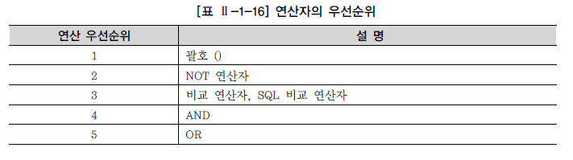
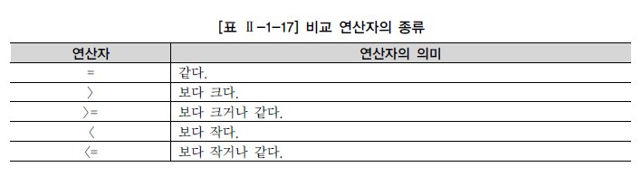
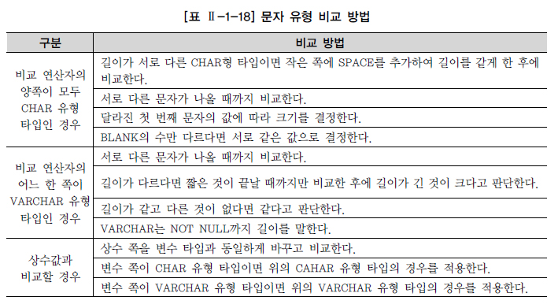
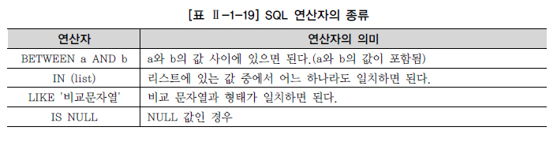
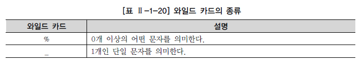
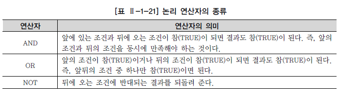
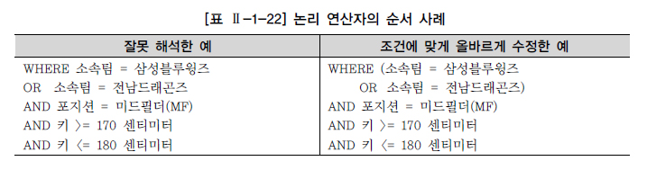
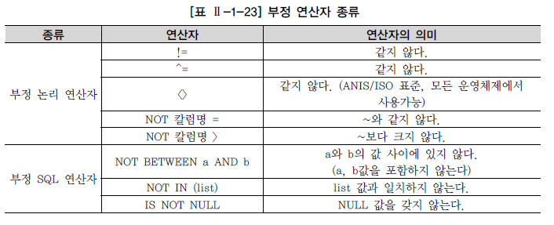

# WHERE

## WHERE 조건절 개요

* 사용자들은 자신이 원하는 자료만을 검색하기 위해서 SQL문장에 WHERE절을 이용하여 자료들에 대하여 제한할 수 있음

* FTS(Full Table Scan)

  * WHERE절에 조건이 없는 문장
  * SQL 튜닝의 1차적인 검토 대상

* WHERE절은 조회하려는 데이터의 특정 조건을 부여할 목적으로 사용하기 때문에 FROM 절 뒤에 사용

  ```SQL
  SELECT {칼럼명}
  FROM {테이블명}
  WHERE {조건식};
  ```

* 조건식

  * 칼럼명 (보통 조건식의 좌측에 위치)
  * 비교 연산자
  * 문자, 숫자, 표현식 (보통 조건식의 우측에 위치)
  * 비교 칼럼명 (JOIN 사용시)

## 연산자의 종류

* 연산자의 우선순위

  

  * 괄호로 묶은 연산이 제일 먼저 연산 처리됨
  * 연산자들 중에는 부정 연산자(NOT)가 먼저 처리됨
  * 비교 연산자(=, >, >=, <, <=), SQL 비교 연산자(BETWEEN a AND b, IN (list), LIKE, IS NULL)가 먼저 처리됨
  * 논리 연산자 중에서는 AND, OR의 순으로 처리됨

## 비교 연산자



* CHAR 변수나 VARCHAR2와 같은 문자형 타입을 가진 칼럼을 특정 값과 비교하기 위해서는 인용부호(`' ', " "`)로 묶어서 처리

* NUMERIC과 같은 숫자형 형태의 값은 인용부호를 사용하지 않음

  * 숫자 유형 칼럼의 경우 숫자로 변환이 가능한 문자열과 비교되면 상대 타입을 숫자타입으로 바꾸어 비교

* 문자 유형간의 비교 조건이 발생하는 경우

  

## SQL 연산자

* SQL문장에서 사용하도록 기본적으로 예약되어 있는 연산자

  

* LIKE

  * WILDCARD를 활용
    * 한 개 혹은 0개 이상의 문자를 대신해서 사용하기 위한 특수문자
  * SQL문장에서 사용하는 String값으로 용이하게 사용가능

  

* IS NULL

  * NULL의 특성
    * NULL 값과의 수치연산은 NULL 값을 리턴
    * NULL 값과의 비교연산은 거짓(FALSE)을 리턴
    * 어떤 값과 비교할 수도 없으며, 특정 값보다 크다, 적다라고 표현할 수 없음

## 논리 연산자

* 여러 개의 조건들을 논리적으로 연결시키기 위해서 사용되는 연산자

  

* AND와 OR의 연산 우선순위 주의

  

## 부정 연산자



## ROWNUM, TOP

### ROWNUM

* Oracle

* 칼럼과 비슷한 성격의 Pseudo Column

* SQL 처리 결과 집합의 각 행에 대해 임시로 부여되는 일련번호

* 테이블이나 집합에서 원하는 만큼의 행만 가져오고 싶을 때 WHERE 절에서 행의 개수를 제한하는 목적으로 사용

* 테이블 내의 고유한 키나 인덱스 값을 만들 수 있음

  ```SQL
  UPDATE MY_TABLE
  SET COLUMN1 = ROWNUM;
  ```

### TOP

* SQL Server

* 결과 집합으로 출력되는 행의 수를 제한

* 표현식

  ```SQL
  TOP (Expression) [PERCENT] [WITH TIES]
  ```

  * Expression : 반환할 행의 수를 지정하는 숫자
  * PERCENT : 쿼리 결과 집합에서 처음 Expression%의 행만 반환됨을 나타냄
  * WITH TIES : ORDER BY 절이 지정된 경우에만 사용 가능, TOP N(PERCENT)의 마지막 행과 같은 값이 있는 경우 추가 행이 출력되도록 지정

* ORDER BY절이 사용되지 않으면 Oracle의 ROWNUM과 SQL Server의 TOP은 동일한 기능

  * ORDER BY절이 사용되면 기능의 차이 발생