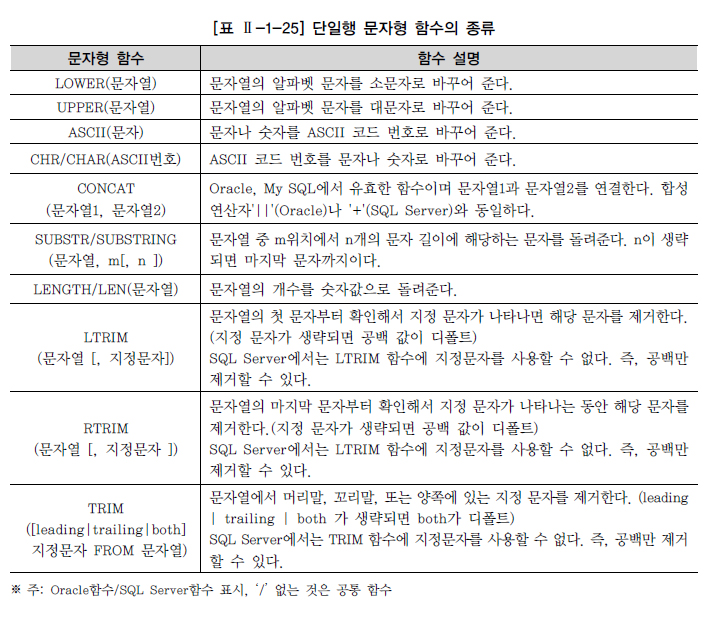
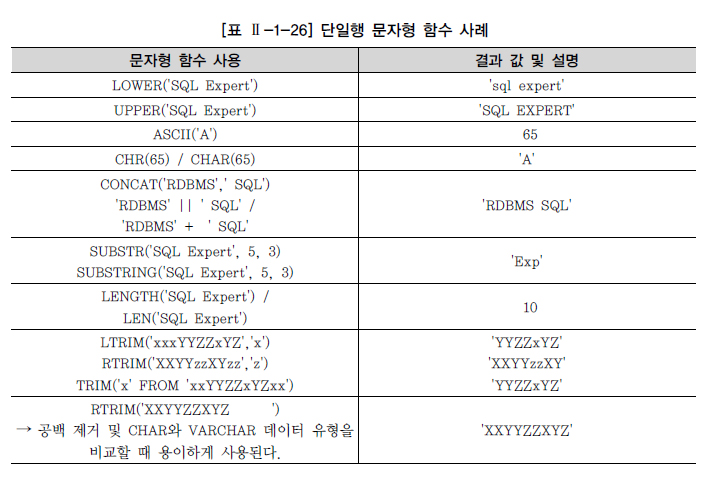
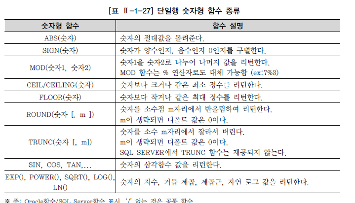
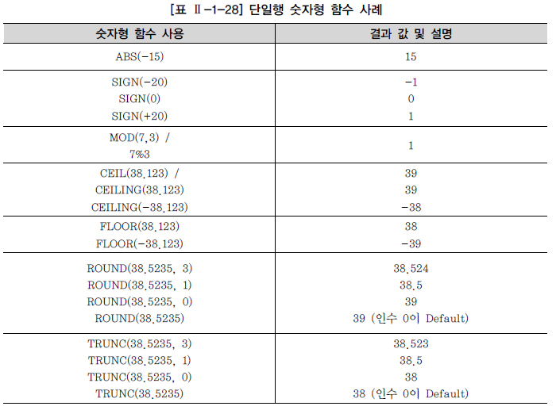
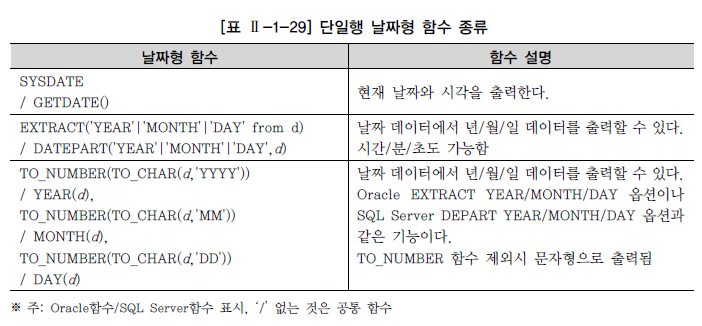
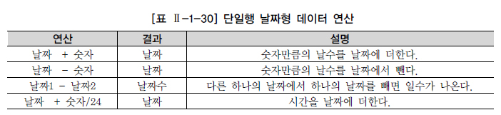
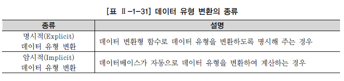
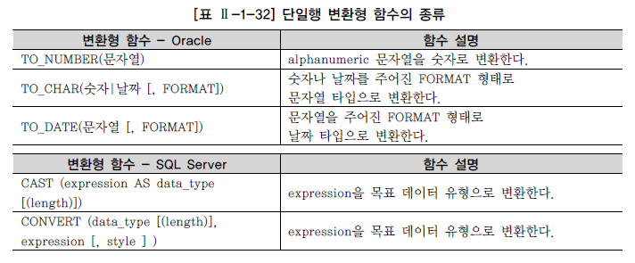
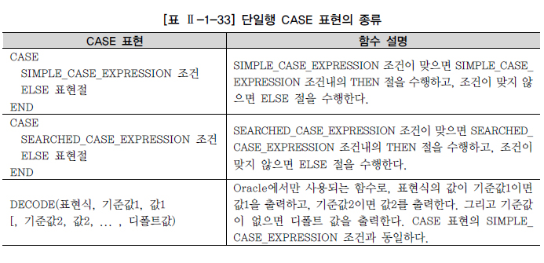
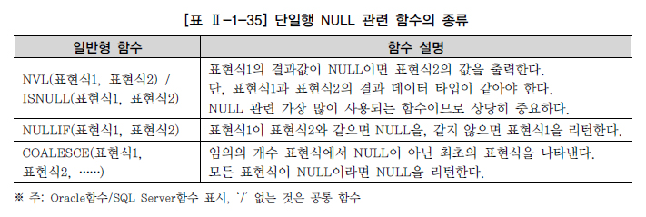

# 함수(FUNCTION)

## 내장 함수(BUILT-IN FUNCTION) 개요

* 함수의 분류

  * 벤더에서 제공하는 **내장함수(Buil-in Function)**
    * 함수의 입력 값이 단일행 값이 입력되는 **단일행 함수(Single-Row Function)** - Now Section
    * 여러 행의 값이 입력되는 다중행 함수(Multi-Row Function)
      * 집계 함수(Aggregate Function) - Section 2_1_7
      * 그룹 함수(Group Function) - Section 2_2_5
      * 윈도우 함수(Window Function) - Section 2_2_6
  * 사용자가 정의할 수 있는 함수(User Defined Function)

* 입력되는 값이 아무리 많아도 출력은 하나만 된다는 M:1관계라는 중요한 특징

* 표현식

  ```sql
  함수명 (칼럼이나 표현식 [, Arg1, Arg2, ...])
  ```

* 단일행 함수는 처리하는 데이터의 형식에 따라서 문자형, 숫자형, 날짜형, 변환형, NULL 관련 함수로 나눌 수 있음

* 벤더에서 제공하는 내장 함수는 상당히 종류가 많고 벤더별로 사용법이 다름

  * SQLD자격증에서는 Oracle과 SQL Server에서 공통으로 사용하는 중요 함수 위주로 설명

* 단일행 함수의 종류

  

* 단일행 함수의 특징

  * SELECT, WHERE, ORDER BY 절에 사용 가능

  * 각 행들에 대해 개별적으로 작용하여 데이터 값들을 조작, 각각의 행에 대한 조작 결과를 리턴

  * 여러 인자를 입력해도 단 하나의 결과만 리턴

  * 함수의 인자로 상수, 변수, 표현식이 사용 가능, 하나의 인수를 가지는 경우도 있지만 여러 개의 인수를 가질 수 있음

  * 특별한 경우가 아니면 함수의 인자로 함수를 사용하는 함수의 중첩이 가능

    ```SQL
    함수3 (함수2 (함수1 (칼럼이나 표현식 [, Arg1]) [, Arg2]), [, Arg3])
    ```

## 문자형 함수

* 문자 데이터를 매개 변수로 받아들여서 문자나 숫자 값의 결과를 돌려주는 함수

* 종류

  

  * 문자열 함수들이 적용되었을 때 리턴되는 값의 예시

    

* Oracle은 SELECT 절과 FROM 절 두 개의 절을 SELECT 문장의 필수 절로 지정

  * 사용자 테이블이 필요 없는 SQL 문장의 경우에도 필수적으로 DUAL이라는 테이블을 FROM 절에 지정
  * DUAL 테이블의 특성
    * 사용자 SYS가 소유하며 모든 사용자가 액세스 가능한 테이블
    * SELECT ~ FROM ~ 의 형식을 갖추기 위한 일종의 DUMMY 테이블
    * DUMMY라는 문자열 유형의 칼럼에 'X'라는 값이 들어있는 행을 1건 포함하고 있음

* SQL Server의 경우 SELECT 절만으로도 SQL 문장이 수행 가능

  * 사용자 테이블의 칼럼을 사용할 때는 FROM 절 필수 사용

## 숫자형 함수

* 종류

  

  * 숫자형 함수들이 적용되었을 때 리턴되는 값 예시

    

## 날짜형 함수

* DATE 타입의 값을 연산하는 함수

* 종류

  

* 데이터베이스는 날짜를 저장할 때 내부적으로 세기, 년, 월, 일, 시, 분, 초와 같은 숫자 형식으로 변환하여 저장

  * 날짜는 여러 형식으로 출력이 되고 날짜 계산에도 사용되기 때문에 편리성을 위해서 숫자형으로 저장하는 것

  * 그래서 산술 연산자로도 계산이 가능함

    

## 변환형 함수

* 특정 데이터 타입을 다양한 형식으로 출력하고 싶은 경우에 사용

* 종류

  

  * 암시적의 경우 성능 저하가 발생할 수 있으며, 자동적으로 데이터베이스가 알아서 계산하지 않는 경우가 있어 에러를 발생할 수 있음
    * 그래서 명시적인 데이터 유형 변환 방법을 사용하는 것이 바람직함

* 명시적 데이터 유형 변환에 사용되는 대표적인 변환형 함수

  

  * 변환형 함수를 사용하여 출력 형식을 지정할 때, 숫자형과 날짜형의 경우 많은 포맷이 벤더별로 제공됨
    * 벤더의 고유항목이 많으므로 매뉴얼을 참고

## CASE 표현

* IF-THEN-ELSE 논리와 유사한 방식으로 표현식을 작성해서 SQL의 비교 연산 기능을 보완하는 역할

* 표현식 예시

  ```SQL
  [IF-THEN-ELSE]
  IF	SAL > 2000
  	THEN REVISED_SALARY = SAL
  	ELSE REVISED_SALARY = 2000
  END-IF.
  
  [CASE]
  SELECT ENAME,
  	   CASE WHEN SAL > 2000
  	        THEN SAL
  	        ELSE 2000
  	   END  REVISED_SALARY
  FROM   EMP;
  ```

* 단일행 CASE 표현의 종류

  

* CASE Expression

  * Simple Case Expression

    * CASE 다음에 바로 저건에 사용되는 칼럼이나 표현식을 표시하고, 다음 WHEN 절에서 앞에서 정의한 칼럼이나 표현식과 같은지 아닌지 판단하는 문장으로 EQUI(=) 조건만 사용한다면 Searched Case Expression보다 간단하게 사용할 수 있는 장점

    * 표현식

      ```sql
      CASE EXPR
      	WHEN COMPARISON_EXPR THEN RETURN_EXPR
      	ELSE 표현절
      END
      ```

  * Searched Case Expression

    * Case 다음에 칼럼이나 표현식을 표시하지 않고, 다음 WHEN절에서 EQUI(=) 조건 포함 여러 조건을 이용한 조건절을 사용할 수 있기 때문에 Simple Case Expression보다 훨씬 다양한 조건을 적용할 수 있는 장점

    * 표현식

      ```sql
      CASE
      	WHEN CONDITION THEN RETURN_EXPR
      	ELSE 표현절
      END
      ```

  * CASE 표현은 함수의 성질을 가지고 있으므로, 다른 함수처럼 중첩해서 사용 가능

## NULL 관련 함수

### NVL/ISNULL 함수

* NULL의 특성

  * NULL 값은 아직 정의되지 않은 값으로 0 또는 공백과 다름
    * 0은 숫자이고, 공백은 하나의 문자임
  * 테이블을 생성할 때 NOT NULL 또는 PRIMARY KEY로 정의되지 않은 모든 데이터 유형은 NULL 값을 포함할 수 있음
  * NULL 값을 포함하는 연산의 경우 결과 값도 NULL임
    * 모르는 데이터에 숫자를 더하거나 빼도 결과는 마찬가지로 모르는 데이터인 것과 같음
  * 결과값을 NULL이 아닌 다른 값을 얻고자 할 때 NVL/ISNULL 함수를 사용
    * NULL 값의 대상이 숫자 유형 데이터인 경우는 주로 0으로, 문자 유형 데이터인 경우는 블랭크보다는 'x'와 같이 해당 시스템에서 의미 없는 문자로 바꾸는 경우가 많음

* NULL을 처리하는 주요 함수

  

* NVL함수를 다중행 함수의 인자로 사용하는 경우는 불필요한 부하를 발생시킬 수 있음

  * 입력 값으로 전체 건수가 NULL 값인 경우만 함수의 결과가 NULL이 나오고 전체 건수 중에서 일부만 NULL인 경우는 다중행 함수 대상에서 제외함

### NULL과 공집합

* 일반적인 NVL/ISNULL 함수 사용

  1. 정상적으로 매니저 정보를 가지고 있는 SCOTT의 매니저를 출력
  2. 매니저에 NULL이 들어있는 KING의 매니저를 출력
  3. 매니저가 NULL인 경우 빈칸이 아닌 9999로 출력하기 위해 NVL/ISNULL함수를 사용

* 공집합의 NVL/ISNULL 함수 사용

  * 조건에 맞는 데이터가 한 건도 없는 경우를 공집합이라 함
    * NULL 데이터와는 다르게 이해해야 함

  1. 공집합을 발생시키기 위해 사원 테이블에 존재하지 않는 JSC라는 이름으로 데이터를 검색
  2. NVL/ISNULL 함수를 이용해 공집합을 9999로 바꾸고자 시도
  3. 적절한 집계함수를 찾아서 NVL 함수 대신 적용
  4. 집계 함수를 인수로 한 NVL/ISNULL 함수를 이용해서 공집합인 경우에도 빈칸이 아닌 9999로 출력하게 함

  * 공집합의 경우는 NVL 함수를 사용해도 공집합이 출력되므로, 그룹함수와 NVL함수를 같이 사용해서 처리

### NULLIF

* EXPR1이 EXPR2와 같으면 NULL을 아니면 EXPR1을 리턴

* 특정 값을 NULL로 대체하는 경우에 유용하게 사용

* 표현식

  ```SQL
  NULLIF (EXPR1, EXPR2)
  ```

### 기타 NULL 관련 함수 (COALESCE)

* 인수의 숫자가 한정되어 있지 않으며, 임의의 개수 EXPR에서 NULL이 아닌 최초의 EXPR을 나타냄

  * 모든 EXPR이 NULL이라면 NULL을 리턴

* 표현식

  ```SQL
  COALESCE (EXRP1, EXPR2, ...)
  ```

  