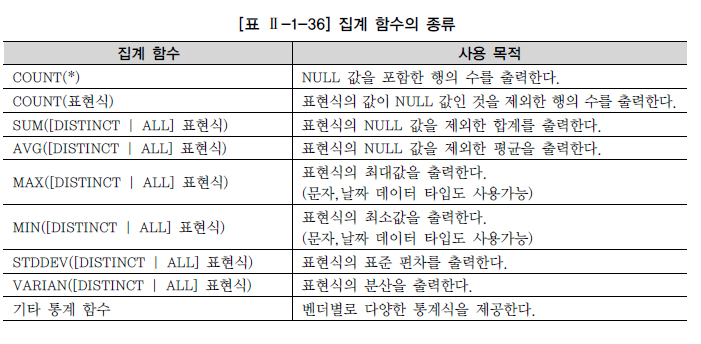

# GROUP BY, HAVING

## 집계함수

> Aggregate Function

* 특성

  * 여러 행들의 그룹이 모여서 그룹당 단 하나의 결과를 돌려주는 함수(다중 행 함수)
  * GROUP BY 절은 행들을 소그룹화함
  * SELECT 절, HAVING 절, ORDER BY 절에 사용 가능

* 표현식

  ```SQL
  집계 함수명 ( [DISTINCT | ALL] 칼럼이나 표현식 )
  ```

* 주요 집계 함수

  

## GROUP BY 절

* SQL문에서 FROM 절과 WHERE 절 뒤에 위치

* 데이터들을 작은 그룹으로 분류하여 소그룹에 대한 항목별로 통계 정보를 얻을 때 추가로 사용

* 표현식

  ```SQL
  SELECT [DISTINCT] 칼럼명 [ALIAS 명]
  FROM 테이블명
  [WHERE 조건식]
  [GROUP BY 칼럼이나 표현식]
  [HAVING 그룹조건식];
  ```

* 특성

  * GROUP BY 절을 통해 소그룹별 기준을 정한 후, SELECT 절에 집계 함수를 사용
  * 집계 함수의 통계 정보는 NULL 값을 가진 행을 제외하고 수행
  * GROUP BY 절에서는 SELECT 절과는 달리 ALIAS 명을 사용할 수 없음
  * 집계 함수는 WHERE 절에는 올 수 없음
    * 집계 함수를 사용할 수 있는 GROUP BY 절보다 WHERE 절이 먼저 수행되기 때문
  * WHERE 절은 전체 데이터를 GROUP으로 나누기 전에 행들을 미리 제거
  * HAVING 절은 GROUP BY 절의 기준 항목이나 소그룹의 집계 함수를 이용한 조건을 표시
  * GROUP BY 절에 의한 소그룹별로 만들어진 집계 데이터 중, HAVING 절에서 제한 조건을 두어 조건을 만족하는 내용만 출력
  * HAVING 절은 일반적으로 GROUP BY 절 뒤에 위치

## HAVING 절

* WHERE 절과 비슷하지만 그룹을 나타내는 결과 집합의 행에 조건이 적용된다는 점에서 차이가 있음
* GROUP BY 소그룹의 데이터 중 일부만 필요한 경우
  * 연산 전 WHERE 절에서 조건을 적용하여 필요한 데이터만 추출하여 GROUP BY 연산을 하는 방법
  * 연산 후 HAVING 절에서 필요한 데이터만 필터링하는 방법
  * 가능하면 WHERE 절에서 조건절을 적용하여 GROUP BY의 계산 대상을 줄이는 것이 효율적인 자원 사용 측면에서 바람직
* HAVING 절은 SELECT 절에 사용되지 않은 칼럼이나 집계 함수가 아니더라도
  GROUP BY 절의 기준 항목이나 소그룹의 집계 함수를 이용한 조건을 표시할 수 있음
* WHERE 절의 조건 변경은 대상 데이터의 개수가 변경되므로 결과 데이터 값이 변경되지만,
  HAVING 절의 조건 변경은 결과 데이터 변경은 없고 출력되는 레코드의 개수만 변경될 수 있음

## CASE 표현을 활용한 월별 데이터 집계

1. 개별 데이터 확인

   ```SQL
   SELECT ENAME, DEPTNO, EXTRACT(MONTH FROM HIREDATE) 입사월, SAL
   FROM EMP;
   ```

2. 월별 데이터 구분

   ```SQL
   SELECT ENAME, DEPTNO,
   	CASE MONTH WHEN  1 THEN SAL END M01, CASE MONTH WHEN  2 THEN SAL END M02,
   	CASE MONTH WHEN  3 THEN SAL END M03, CASE MONTH WHEN  4 THEN SAL END M04,
   	CASE MONTH WHEN  5 THEN SAL END M05, CASE MONTH WHEN  6 THEN SAL END M06,
   	CASE MONTH WHEN  7 THEN SAL END M07, CASE MONTH WHEN  8 THEN SAL END M08,
   	CASE MONTH WHEN  9 THEN SAL END M09, CASE MONTH WHEN 10 THEN SAL END M10,
   	CASE MONTH WHEN 11 THEN SAL END M11, CASE MONTH WHEN 12 THEN SAL END M12
   FROM (SELECT ENAME, DEPTNO, EXTRACT(MONTH FROM HIREDATE) MONTH, SAL
         FROM EMP);
   ```

3. 부서별 데이터 집계

   ```SQL
   SELECT DEPTNO,
   	AVG(CASE MONTH WHEN  1 THEN SAL END) M01,
       AVG(CASE MONTH WHEN  2 THEN SAL END) M02,
       AVG(CASE MONTH WHEN  3 THEN SAL END) M03,
       AVG(CASE MONTH WHEN  4 THEN SAL END) M04,
       AVG(CASE MONTH WHEN  5 THEN SAL END) M05,
       AVG(CASE MONTH WHEN  6 THEN SAL END) M06,
       AVG(CASE MONTH WHEN  7 THEN SAL END) M07,
       AVG(CASE MONTH WHEN  8 THEN SAL END) M08,
       AVG(CASE MONTH WHEN  9 THEN SAL END) M09,
       AVG(CASE MONTH WHEN 10 THEN SAL END) M10,
       AVG(CASE MONTH WHEN 11 THEN SAL END) M11,
       AVG(CASE MONTH WHEN 12 THEN SAL END) M12
   FROM (SELECT ENAME, DEPTNO, EXTRACT(MONTH FROM HIREDATE) MONTH, SAL
         FROM EMP)
   GROUP BY DEPTNO;
   ```

* 하나의 데이터에 여러 번 CASE 표현을 사용하고 집계 함수가 적용되므로 처리 성능 측면에서 나쁘지 않은가?
  * 복잡한 프로그램이 아닌 하나의 SQL문장으로 처리가능하므로 DBMS 자원활용이나 처리 속도에서 훨씬 효율적

## 집계 함수와 NULL 처리

* 다중 행 함수는 입력 값으로 전체 건수가 NULL 값인 경우만 함수의 결과가 NULL이 나옴
  * 전체 건수 중에서 일부만 NULL인 경우는 NULL인 행을 다중 행 함수의 대상에서 제외함