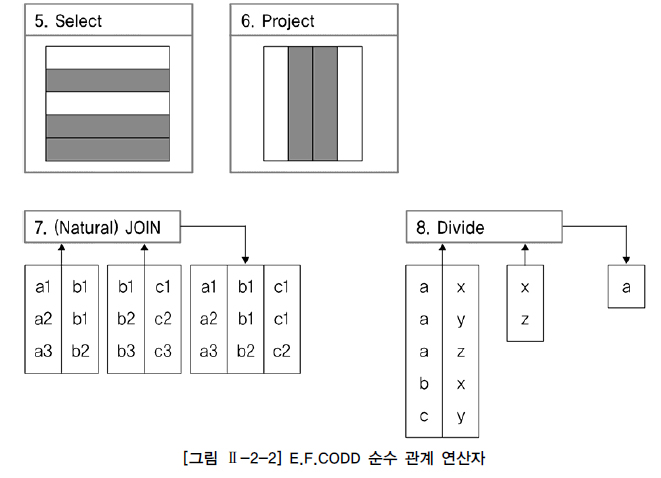
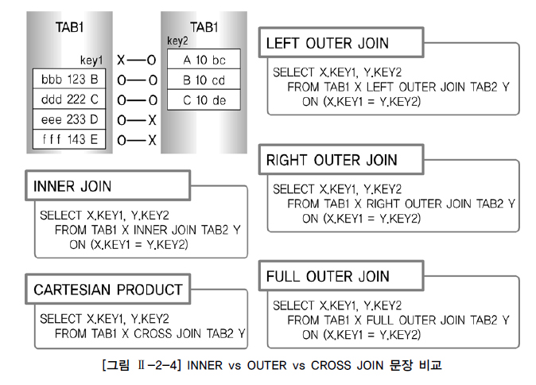

# 표준 조인 (Standard Join)

## Standard SQL 개요

### 일반 집합 연산자

* Union, Intersection, Difference, Product

  

* 현재의 SQL과 비교

  * Union 연산은 Union 기능으로 구현
  * Intersection 연산은 Intersect 기능으로 구현
  * Difference 연산은 Except(Oracle은 Minus) 기능으로 구현
  * Product 연산은 Cross Join 기능으로 구현

* **UNION 연산**

  * 수학적 합집합을 제공
    * 공통 교집합의 중복을 없애기 위한 사전작업으로 시스템에 부하를 주는 정렬 작업이 발생
  * UNION ALL 기능이 추가
    * 특별한 요구 사항이 없다면 공통집합을 중복해서 그대로 보여줌
    * 정렬작업이 일어나지 않는 장점
  * UNION과 UNION ALL의 출력 결과가 같다면 UNION ALL 사용을 권고
    * 응답 속도 향상이나 자원 효율화 측면에서 데이터 정렬작업이 발생하지 않으므로

* **INTERSECTION 연산**

  * 수학의 교집합
    * 두 집합의 공통집합을 추출

* **DIFFERENCE 연산**

  * 수학의 차집합
    * 첫 번째 집합에서 두 번째 집합과의 공통집합을 제외한 부분
  * 대다수 벤더는 EXCEPT, Oracle은 MINUS 용어를 사용

* **PRODUCT 연산**

  * CROSS PRODUCT라고 불리는 곱집합
  * JOIN 조건이 없는 경우 생길 수 있는 모든 데이터의 조합
  * 양쪽 집합의 M * N 건의 데이터 조합이 발생하며 CARTESIAN PRODUCT라고 표현

### 순수 관계 연산자

* Select, Project, (Natural) Join, Divide

  

* 관계형 데이터베이스를 구현하기 위해 새롭게 만들어진 연산자

* 현재의 SQL 문장과 비교

  * SELECT 연산은 WHERE 절로 구현
  * PROJECT 연산은 SELECT 절로 구현
  * (NATURAL) JOIN 연산은 다양한 JOIN 기능으로 구현
  * DIVIDE 연산은 현재 사용되지 않음

* **SELECT 연산**

  * SQL 문장에서 WHERE 절의 조건절 기능으로 구현
  * SELECT 연산과 SELECT 절의 의미가 다름을 유의

* **PROJECT 연산**

  * SQL 문장에서 SELECT 절의 칼럼 선택 기능으로 구현

* **JOIN 연산**

  * WHERE 절의 INNER JOIN 조건과 함께 FROM 절의 NATURAL JOIN, INNER JOIN, OUTER JOIN, USING 조건절, ON 조건절 등으로 다양하게 발전

* **DIVIDE 연산**

  * 나눗셈과 비슷한 개념
  * 왼쪽의 집합을 'XZ'로 나누었을 때, 'XZ'를 모두 가지고 있는 'A'가 답이 되는 기능
  * 현재 사용되지 않음

## FROM 절 JOIN 형태

* WHERE 절을 사용하던 기존 JOIN 방식과 차이가 있음
  * 기존 JOIN 조건을 구분 없이 사용하던 방식을 그대로 사용할 수 있음
  * 추가된 선택 기능으로 테이블 간의 JOIN 조건을 FROM 절에서 명시적으로 정의 가능
* **INNER JOIN**
  * WHERE 절에서부터 사용하던 JOIN의 DEFAULT 옵션
    * 생략이 가능
  * JOIN 조건에서 동일한 값이 있는 행만 반환
  * CROSS JOIN, OUTER JOIN과는 같이 사용할 수 없음
* **NATURAL JOIN**
  * INNER JOIN의 하위 개념
  * 두 테이블 간의 동일한 이름을 갖는 모든 칼럼들에 대해 EQUI JOIN을 수행
  * NATURAL INNER JOIN이라고도 표시
* **USING 조건절**
* **ON 조건절**
  * WHERE 절의 JOIN 조건을 FROM 절의 ON 조건절로 분리하여 표시함으로써 사용자가 이해하기 쉬움
  * NATURAL JOIN 처럼 JOIN 조건이 숨어 있지 않음
    * 명시적으로 JOIN 조건을 구분할 수 있음
  * NATURAL JOIN이나 USING 조건절처럼 칼럼명이 똑같아야 된다는 제약이 없음
    * 칼럼명이 상호 다르더라도 JOIN조건으로 사용할 수 있음
  * FROM 절에 테이블이 많이 사용될 경우 다소 복잡하게 보여 가독성이 떨어지는 단점
* **CROSS JOIN**
* **OUTER JOIN**

## INNER JOIN

* JOIN 조건에서 동일한 값이 있는 행만 반환

* 그동안 WHERE 절에서 사용하던 JOIN 조건을 FROM 절에서 정의하겠다는 표시

  * 그러므로 USING 조건절이나 ON 조건절을 필수적으로 사용해야 함

* WHERE 절 JOIN 조건 vs FROM 절 JOIN 조건

  ```SQL
  [WHERE]
  SELECT EMP.DEPTNO, EMPNO, ENAME, DNAME
  FROM EMP, DEPT
  WHERE EMP.DEPTNO = DEPT.DEPTNO;
  
  [FROM]
  SELECT EMP.DEPTNO, EMPNO, ENAME, DNAME
  FROM EMP (INNER) JOIN DEPT
  WHERE EMP.DEPTNO = DEPT.DEPTNO;
  ```

  * 두 SQL은 같은 결과를 얻음
  * INNER JOIN에서 INNER는 JOIN의 DEFAULT 값이므로 생략 가능

## NATURAL JOIN

* 두 테이블 간의 동일한 이름을 갖는 모든 칼럼들에 대해 EQUI JOIN을 수행

* NATURAL JOIN이 명시되면, 추가로 USING 조건절, ON 조건절, WHERE 절에서 JOIN 조건을 정의할 수 없음

* SQL Server에서 지원하지 않는 기능

* 사용

  ```SQL
  SELECT DEPTNO, EMPNO, ENAME, DNAME
  FROM EMP NATURAL JOIN DEPT;
  ```

  * 두 에티블에서 DEPTNO라는 공통된 칼럼을 자동으로 인식하여 JOIN 처리
  * JOIN에 사용된 칼럼들은 같은 데이터 유형이어야 하며, ALIAS나 테이블명과 같은 접두사를 붙일 수 없음

* `*` 와일드카드처럼 별도의 칼럼 순서를 지정하지 않으면 NATURAL JOIN의 기준이 되는 칼럼들이 다른 칼럼보다 먼저 출력됨

  * INNER JOIN의 경우 첫 번째 테이블, 두 번째 테이블의 칼럼 순서대로 데이터가 출력됨

## USING 조건절

* NATURAL JOIN 에서는 모든 일치되는 칼럼들에 대해 JOIN이 이루어지지만,
  FROM 절의 USING 조건절을 이용하면 같은 이름을 가진 칼럼들 중에서 원하는 칼럼에 대해서만 선택적으로 EQUI JOIN을 진행할 수 있음

* SQL Server에서 지원하지 않는 기능

* 사용

  ```SQL
  SELECT *
  FROM DEPT JOIN DEPT_TEMP
  USING (DEPTNO);
  ```

  * 별도의 칼럼 순서를 지정하지 않으면 USING 조건절의 기준이 되는 칼럼이 다른 칼럼보다 먼저 출력
  * JOIN에 사용된 같은 이름의 칼럼을 하나로 처리

* JOIN 칼럼에 대해서는 ALIAS나 테이블 이름과 같은 접두사를 붙일 수 없음

## ON 조건절

* JOIN 서술부(ON 조건절)와 비 JOIN 서술부(WHERE 조건절)를 분리하여 이해가 쉬움

* 칼럼명이 다르더라도 JOIN 조건을 사용할 수 있는 장점

* 사용

  ```SQL
  SELECT E.EMPNO, E.ENAME, E.DEPTNO, D.DNAME
  FROM EMP E JOIN DEPT D
  ON (E.DEPTNO = D.DEPTNO);
  ```

  * ON 조건절에 사용된 괄호는 옵션 사항

* ON 조건절을 사용하는 경우

  > NATURAL JOIN의 JOIN 조건은 기본적으로 같은 이름을 가진 모든 칼럼들에 대한 동등 조건이지만

  * 임의의 JOIN 조건을 지정하는 경우
  * 이름이 다른 칼럼명을 JOIN 조건으로 사용하는 경우
  * JOIN 칼럼을 명시하기 위한 경우

* ALIAS나 테이블 명과 같은 접두사를 사용하여 SELECT에 사용되는 칼럼을 논리적으로 명확하게 지정해주어야 함

* WHERE 절의 JOIN 조건과 같은 기능

  * 명시적으로 JOIN의 조건을 구분할 수 있으므로 가장 많이 사용될 것으로 예상

* FROM 절에 테이블이 많이 사용될 경우 다소 복잡하게 보여 가독성이 떨어지는 단점

### WHERE 절과의 혼용

* 예제

  ```SQL
  SELECT E.ENAME, E.DEPTNO, D.DEPTNO, D.DNAME
  FROM EMP E JOIN DEPT D
  ON (E.DEPTNO = D.DEPTNO)
  WHERE E.DPETNO = 30;
  ```

### ON 조건절 + 데이터 검증 조건 추가

* ON 조건절에 JOIN 조건 외에도 데이터 검색 조건을 추가할 수 있으나, WHERE 절을 사용할 것을 권고

  * 다만 OUTER JOIN에서 JOIN의 대상을 제한하기 위한 목적으로 사용되는 추가 조건의 경우는 ON 절에 표기되어야 함

* 예제

  ```SQL
  SELECT E.ENAME, E.MGR, D.DEPTNO, D.DNAME
  FROM EMP E JOIN DEPT D
  ON (E.DEPTNO = D.DEPTNO AND E.MGR = 7698);
  
  SELECT E.ENAME, E.MGR, D.DEPTNO, D.DNAME
  FROM EMP E JOIN DEPT D
  ON (E.DEPTNO = D.DETPNO)
  WHERE E.MGR = 7698;
  ```

### 다중 테이블 JOIN

* 예제

  ```SQL
  SELECT E.EMPNO, D.DEPTNO, D.DNAME, T.DNAME New_DNAME
  FROM EMP E JOIN DEPT D 
  ON (E.DEPTNO = D.DEPTNO) 
  	 JOIN DEPT_TEMP T 
  ON (E.DEPTNO = T.DEPTNO);
  
  SELECT E.EMPNO, D.DEPTNO, D.DNAME, T.DNAME New_DNAME
  FROM EMP E, DEPT D, DEPT_TEMP T 
  WHERE E.DEPTNO = D.DEPTNO AND E.DEPTNO = T.DEPTNO;
  ```

## CROSS JOIN

* PRODUCT의 개념으로 테이블 간 JOIN 조건이 없는 경우 생길 수 있는 모든 데이터의 조합

* CARTESIAN PRODUCT 또는 CROSS PRODUCT와 같은 표현

* 결과는 양쪽 집합의 M * N 건의 데이터 조합이 발생

* 사용

  ```sql
  SELECT ENAME, DNAME
  FROM EMP CROSS JOIN DEPT
  ORDER BY ENAME;
  ```

## OUTER JOIN

* JOIN 조건에서 동일한 값이 없는 행도 반환할 때 사용

* 설명

  

* OUTER JOIN 역시 JOIN 조건을 FROM 절에서 정의하겠다는 표시이므로 USING 조건절이나 ON 조건절을 필수적으로 사용해야 함

* LEFT/RIGHT OUTER JOIN의 경우, 기준이 도는 테이블이 JOIN 수행시 무조건 드라이빙 테이블이 됨

  * 옵티마이저는 이 원칙에 위배되는 다른 실행계획을 고려하지 않음

### LEFT OUTER JOIN

* JOIN 수행 시 먼저 표기된 좌측 테이블에 해당하는 데이터를 먼저 읽은 후, 나중 표기된 우측 테이블에서 JOIN 대상 데이터를 읽어옴
  * 우측 테이블에서 같은 값이 없는 경우에는 NULL 값으로 채움
* LEFT JOIN으로 OUTER 키워드를 생략해서 사용 가능

### RIGHT OUTER JOIN

* JOIN 수행 시 LEFT JOIN과 반대로 우측 테이블이 기준이 되어 결과를 생성
  * 좌측 테이블에서 같은 값이 없는 경우에는 NULL값으로 채움
* RIGHT JOIN으로 OUTER 키워드를 생략해서 사용 가능

### FULL OUTER JOIN

* JOIN 수행 시 좌측, 우측 테이블의 모든 데이터를 읽어 JOIN하여 결과를 생성
* LEFT OUTER JOIN과 RIGHT OUTER JOIN의 결과를 합집합으로 처리한 결과와 동일
* UNION ALL이 아닌 UNION 기능과 같으므로 중복되는 데이터는 삭제
* FULL JOIN으로 OUTER 키워드를 생략해서 사용 가능

## INNER vs OUTER vs CROSS JOIN 비교



* INNER JOIN의 결과
  * 양 쪽 테이블에 모두 존재하는 키값이 **B-B, C-C**인 2건이 출력
* LEFT OUTER JOIN의 결과
  * TAB1을 기준으로 키 값 조합이 **B-B, C-C, D-NULL, E-NULL**인 4건이 출력
* RIGHT OUTER JOIN의 결과
  * TAB2를 기준으로 키 값 조합이 **NULL-A, B-B, C-C**인 3건이 출력
* FULL OUTER JOIN의 결과
  * 양쪽 테이블을 기준으로 키 값 조합이 **NULL-A, B-B, C-C, D-NULL, E-NULL**인 5건이 출력
* CROSS JOIN의 결과
  * JOIN 가능한 모든 경우의 수를 표시하지만 OUTER JOIN은 제외
  * 양쪽 테이블 TAB1과 TAB2의 데이터를 곱한 개수인 4 * 3 = 12건이 추출
  * 키 값 조합이 **B-A, B-B, B-C, C-A, C-B, C-C, D-A, D-B, D-C, E-A, E-B, E-C**인 12건이 출력