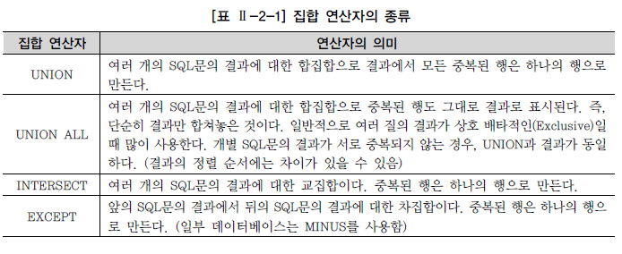

# 집합 연산자(SET OPERATOR)

* 두 개 이상의 테이블에서 조인을 사용하지 않고 연관된 데이터를 조회하는 방법

* 여러 개의 질의의 결과를 연결하여 하나로 결합하는 방식 사용

  * 2개 이상의 질의 결과를 하나의 결과로 만듬

* 집합 연산자를 사용하는 경우

  * 서로 다른 테이블에서 유사한 형태의 결과를 반환하는 것을 하나의 결과로 합치고자 할때
  * 동일 테이블에서 서로 다른 질의를 수행하여 결과를 합치고자 할 때
  * 튜닝 관점에서 실행계획을 분리하고자 하는 목적

* 제약조건

  * SELECT 절의 칼럼 수가 동일
  * SELECT 절의 동일 위치에 존재하는 칼럼의 데이터 타입이 상호 호환가능해야 함
    * 반드시 동일한 데이터 타입일 필요는 없음

* 종류

  

* SQL문의 형태

  ```SQL
  SELECT 칼럼명1, 칼럼명2, ... 
  FROM 테이블명1 
  [WHERE 조건식 ] 
  [[GROUP BY 칼럼(Column)이나 표현식 [HAVING 그룹조건식 ] ] 
  집합 연산자
  SELECT 칼럼명1, 칼럼명2, ... 
  FROM 테이블명2 [WHERE 조건식 ]
  [[GROUP BY 칼럼(Column)이나 표현식 [HAVING 그룹조건식 ] ]
  [ORDER BY 1, 2 [ASC또는 DESC ];
  ```

  * 집합 연산자는 여러 개의 SELECT문을 연결하는 것에 지나지 않음
  * ORDER BY는 집합 연산을 적용한 최종 결과에 대한 정렬 처리이므로 가장 마지막 줄에 한번만 기술