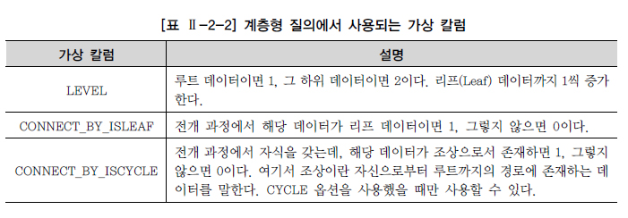
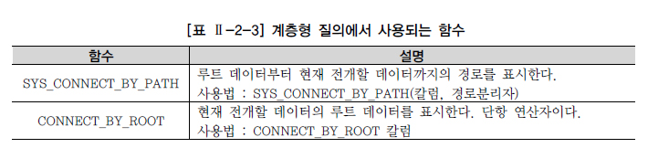

# 계층형 질의와 셀프 조인

## 계층형 질의

* 테이블에 계층형 데이터가 존재하는 경우 데이터를 조회하기 위해서 사용
  * 계층형 데이터란, 동일 테이블에 계층적으로 상위와 하위 데이터가 포함된 데이터

### Oracle 계층형 질의

* 계층형 질의 구문

  ```sql
  SELECT ...
  FROM 테이블
  WHERE condition AND condition ...
  START WITH condition
  CONNECT BY [NOCYCLE] condition AND condition ...
  [ORDER SIBLINGS BY column, column, ...]
  ```
  * **START WITH** 절은 계측 구조 전개의 시작 위치를 지정하는 구문
    * 즉, 루트 데이터를 지정(액세스)
  * **CONNECT BY** 절은 다음에 전개될 자식 데이터를 지정하는 구문
    * 주어진 조건을 만족해야 함(JOIN)
  * **PRIOR** : CONNECT BY 절에 사용되며 현재 읽은 칼럼을 지정
    * PRIOR 자식 = 부모 형태를 사용하면 계층구조에서 부모 데이터에서 자식데이터 방향(부모 -> 자식)으로 전개하는 순방향 전개
    * PRIOR 부모 = 자식 형태를 사용하면 반대로 자식데이터에서 부모데이터 방향(자식 -> 부모)으로 전개하는 역방향 전개
  * **NOCYCLE** : 데이터를 전개하면서 이미 나타났던 동일한 데이터가 전개 중에 다시 나타난다면 이것을 CYCLE이 형성되었다고 함
    * 사이클이 발생한 데이터는 런타임 오류가 발생
    * NOCYCLE을 추가하면 사이클이 발생한 이후의 데이터는 전개하지 않음
  * **ORDER SIBLINGS BY** : 형제 노드(동일 LEVEL) 사이에서 정렬을 수행
  * **WHERE** : 모든 전개를 수행한 후에 지정된 조건을 만족하는 데이터만 추출(필터링)

* Oracle은 계층형 질의를 사용할 때 가상 칼럼(Pseudo Column)을 제공

  

* 계층형 질의를 사용할 때 사용자 편의성을 제공하기 위해 Oracle에서 제공하는 함수

  

### SQL Server 계층형 질의

* CTE(Common Table Expression)를 재귀 호출함으로써 데이터의 최상위부터 시작해 하위방향으로 계층 구조를 전개

  ```SQL
  WITH EMPLOYEES_ANCHOR AS (
      SELECT EMPLOYEEID, LASTNAME, FIRSTNAME, REPORTSTO, 0 AS LEVEL 
      FROM EMPLOYEES 
      WHERE REPORTSTO IS NULL /* 재귀 호출의 시작점 */ 
      UNION ALL 
      SELECT R.EMPLOYEEID, R.LASTNAME, R.FIRSTNAME, R.REPORTSTO, A.LEVEL + 1 
      FROM EMPLOYEES_ANCHOR A, EMPLOYEES R 
      WHERE A.EMPLOYEEID = R.REPORTSTO ) 
  SELECT LEVEL, EMPLOYEEID, LASTNAME, FIRSTNAME, REPORTSTO 
  FROM EMPLOYEES_ANCHOR 
  GO
  ```

  * WITH 절의 CTE 쿼리를 보면, UNION ALL 연산자로 쿼리 두 개를 결합
    * 둘 중 위에 있는 쿼리를 Anchor Member라고 하고, 아래에 있는 쿼리를 Recursive Member라고 함
  * 재귀적 쿼리의 처리 과정
    1. CTE 식을 앵커 멤버와 재귀 멤버로 분할
    2. 앵커 멤버를 실행하여 첫 번째 호출 또는 기본 결과 집합(T0)을 만듬
    3. Ti는 입력으로 사용하고 T(i+1)은 출력으로 사용하여 재귀 멤버를 실행
    4. 빈 집합이 반환될 때까지 3단계를 반복
    5. 결과 집합을 반환
       * 이것은 T0에서 Tn까지의 UNION ALL
  * 정리하자면,
    * 앵커 멤버가 시작점이자 Outer 집합이 되어 Inner 집합인 재귀 멤버와 조인을 시작
    * 앞서 조인한 결과가 다시 Outer 집합이 되어 재귀 멤버와 조인을 반복하다가 조인 결과가 비어있으면(더 조인할 수 없으면) 지금까지 만들어진 결과 집합을 모두 합하여 리턴

* 계층 구조를 단순히 하위 방향으로 전개했을 뿐 조직도와는 많이 다른 모습으로 출력됨

  * 조직도와 같은 모습으로 출력하려면 ORDER BY 절을 추가해 원하는 순서대로 결과를 정렬

## 셀프 조인

* 동일 테이블 사이의 조인

  * FROM 절에 동일 테이블이 두 번 이상 나타남
  * 동일 테이블이지만 개념적으로는 두 개의 서로 다른 테이블을 사용하는 것과 동일

* 테이블과 칼럼 이름이 모두 동일하기 때문에 식별을 위해 반드시 테이블 별칭(ALIAS)를 사용해야 함

  * 동일 테이블을 다른 테이블인 것처럼 처리하기 위해서 테이블 별칭을 사용

* 기본적인 사용법

  ```SQL
  SELECT ALIAS명1.칼럼명, ALIAS명2.칼럼명, ... 
  FROM 테이블1 ALIAS명1, 테이블2 ALIAS명2 
  WHERE ALIAS명1.칼럼명2 = ALIAS명2.칼럼명1;
  ```