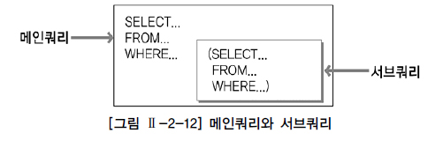
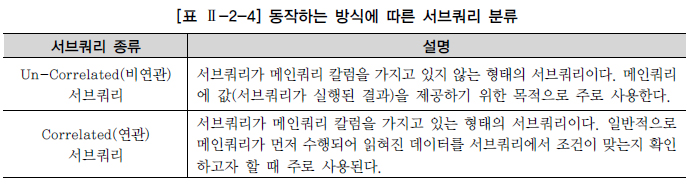
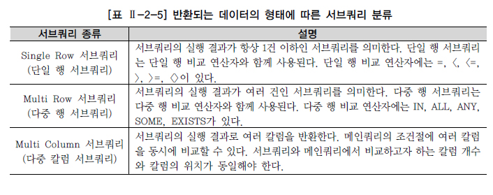
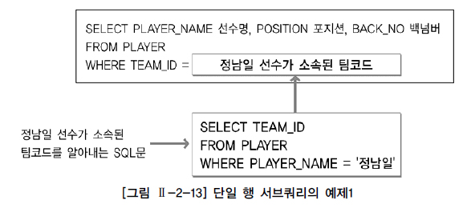
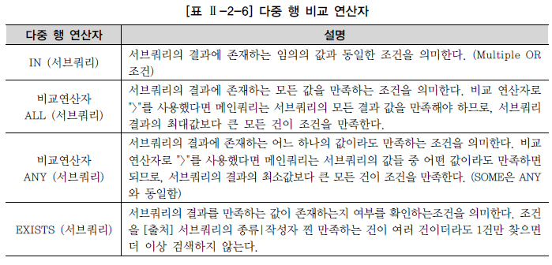
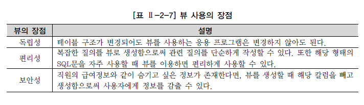

# 서브쿼리

* 하나의 SQL문안에 포함되어 있는 또 다른 SQL문

* 알려지지 않은 기준을 이용한 검색을 위해 사용

* 형태

  

* 서브쿼리는 메인쿼리의 칼럼을 모두 사용할 수 있지만, 메인쿼리는 서브쿼리의 칼럼을 사용할 수 없음

  * 질의 결과에 서브쿼리 칼럼을 표시해야 한다면
    * 조인 방식으로 변환하거나
    * 함수, 스칼라 서브쿼리 등을 사용해야 함

* 서브쿼리 레벨과는 상관없이 항상 메인쿼리 레벨로 결과 집합이 생성

* 서브쿼리를 사용할 때 주의사항

  * 서브쿼리를 괄호로 감싸서 사용
  * 서브쿼리는 단일 행 또는 복수 행 비교 연산자와 함께 사용이 가능
    * 단일 행 비교 연산자는 서브쿼리의 결과가 반드시 1건 이하여야 함
    * 복수 행 비교 연산자는 서브쿼리의 결과 건수와 상관 없음
  * 서브쿼리에서는 ORDER BY 절을 사용하지 못함
    * ORDER BY 절은 SELECT 절에서 오직 한 개만 올 수 있기 때문에 ORDER BY 절은 메인 쿼리의  마지막 문장에 위치해야 함

* 서브쿼리가 SQL문에서 사용이 가능한 곳

  * SELECT 절
  * FROM 절
  * WHERE 절
  * HAVING 절
  * ORDER BY 절
  * INSERT 문의 VALUES 절
  * UPDATE 문의 SET 절

* 동작하는 방식에 따른 서브쿼리 분류

  

  * 서브쿼리는 메인쿼리 안에 포함된 종속적인 관계
    * 논리적인 실행순서는 항상 메인쿼리에 읽혀진 데이터에 대해 서브쿼리에서 해당 조건이 만족하는지를 확인하는 방식

* 반환되는 데이터의 형태에 따른 서브쿼리 분류

  

## 단일 행 서브 쿼리

* 서브쿼리가 단일 행 비교 연산자(`=`, `<`, `<=`, `>`, `>=`, `<>`)와 함께 사용될 때는 서브쿼리의 결과 건수가 반드시 1건 이하여야 함

  * 만약, 서브쿼리의 결과가 2건 이상을 반환하면 런타임 오류가 발생

* 예제

  

## 다중 행 서브 쿼리

* 서브쿼리의 결과가 2건 이상 반환될 수 있다면 반드시 다중 행 비교 연산자(IN, ALL, ANY, SOME)와 함께 사용

  * 그렇지 않으면 SQL문은 오류를 반환

* 다중 행 비교 연산자

  

## 다중 칼럼 서브 쿼리

* 서브쿼리의 결과로 여러 개의 칼럼이 반환되어 메인쿼리의 조건과 동시에 비교되는 것

* 예제

  ```SQL
  SELECT TEAM_ID 팀코드, PLAYER_NAME 선수명, POSITION 포지션, BACK_NO 백넘버, HEIGHT 키 
  FROM PLAYER 
  WHERE (TEAM_ID, HEIGHT) IN (SELECT TEAM_ID, MIN(HEIGHT) 
                              FROM PLAYER 
                              GROUP BY TEAM_ID) 
  ORDER BY TEAM_ID, PLAYER_NAME;
  ```

* SQL Server에서 지원되지 않는 기능

## 연관 서브쿼리

* 서브쿼리 내에 메인쿼리 칼럼이 사용된 서브쿼리

* 예제

  ```SQL
  SELECT T.TEAM_NAME 팀명, M.PLAYER_NAME 선수명, M.POSITION 포지션, M.BACK_NO 백넘버, M.HEIGHT 키 
  FROM PLAYER M, TEAM T 
  WHERE M.TEAM_ID = T.TEAM_ID 
  AND M.HEIGHT < (SELECT AVG(S.HEIGHT) 
                  FROM PLAYER S 
                  WHERE S.TEAM_ID = M.TEAM_ID 
                  AND S.HEIGHT IS NOT NULL 
                  GROUP BY S.TEAM_ID ) 
  ORDER BY 선수명;
  ```

* EXIST 서브쿼리는 항상 연관 서브쿼리로 사용

  * 아무리 조건을 만족하는 건이 여러 건이더라도 조건을 만족하는 1건만 찾으면 추가적인 검색을 진행하지 않음

## 그밖에 위치에서 사용하는 서브쿼리

### SELECT 절에 서브쿼리 사용하기

* 스칼라 서브쿼리는 한 행, 한 칼럼만을 반환하는 서브쿼리를 말함

  * 칼럼을 쓸 수 있는 대부분의 곳에서 사용 가능

* 예제

  ```SQL
  SELECT PLAYER_NAME 선수명, HEIGHT 키, (SELECT AVG(HEIGHT) 
                                       FROM PLAYER X 
                                       WHERE X.TEAM_ID = P.TEAM_ID) 팀평균키 
  FROM PLAYER P
  ```

* 스칼라 서브쿼리 또한 단일 행 서브쿼리이기 때문에 결과가 2건 이상 반환되면 SQL문은 오류를 반환

### FROM 절에서 서브쿼리 사용하기

* 인라인 뷰(Inline View)

  * 테이블 명이 올 수 있는 곳에서 사용 가능

* 서브쿼리의 결과가 마치 실행시에 동적으로 생성된 테이블인 것처럼 사용

  * SQL문이 실행될 때만 임시적으로 생성되는 동적인 뷰이기 때문에 데이터베이스에 해당 정보가 저장되지 않음

* 서브쿼리의 칼럼은 메인쿼리 에서 사용할 수 없음

  * 그러나 인라인 뷰는 동적으로 생성된 테이블
  * 인라인 뷰를 사용하는 것은 JOIN 방식을 사용하는 것과 같음
  * 인라인 뷰의 칼럼은 SQL문 자유롭게 참조

* TOP-N 쿼리

  * 인라인 뷰에서 먼저 정렬을 수행하고 정렬된 결과 중에서 일부 데이터를 추출하는 것
  * 정렬작업과 정렬 결과 중에서 일부 데이터만을 추출할 수 있는 방법이 필요
    * Oracle에서는 ROWNUM이라는 연산자를 통해 가능

* 예제

  ```SQL
  SELECT PLAYER_NAME 선수명, POSITION 포지션, BACK_NO 백넘버, HEIGHT 키 
  FROM (SELECT PLAYER_NAME, POSITION, BACK_NO, HEIGHT 
        FROM PLAYER 
        WHERE HEIGHT IS NOT NULL 
        ORDER BY HEIGHT DESC) 
  WHERE ROWNUM <= 5;
  ```

### HAVING 절에서 서브쿼리 사용하기

* HAVING절은 그룹함수와 함께 사용될 때 그룹핑된 결과에 대해 부가적인 조건을 주기 위해 사용

* 예제

  ```SQL
  SELECT P.TEAM_ID 팀코드, T.TEAM_NAME 팀명, AVG(P.HEIGHT) 평균키 
  FROM PLAYER P, TEAM T 
  WHERE P.TEAM_ID = T.TEAM_ID 
  GROUP BY P.TEAM_ID, T.TEAM_NAME 
  HAVING AVG(P.HEIGHT) < (SELECT AVG(HEIGHT) 
                          FROM PLAYER 
                          WHERE TEAM_ID ='K02')
  ```

### UPDATE 문의 SET 절에서 사용하기

* 예제

  ```SQL
  UPDATE TEAM A 
  SET A.STADIUM_NAME = (SELECT X.STADIUM_NAME 
                        FROM STADIUM X 
                        WHERE X.STADIUM_ID = A.STADIUM_ID);
  ```

### INSERT 문의 VALUES 절에서 사용하기

* 예제

  ```SQL
  INSERT INTO PLAYER(PLAYER_ID, PLAYER_NAME, TEAM_ID) 
  VALUES((SELECT TO_CHAR(MAX(TO_NUMBER(PLAYER_ID))+1) 
          FROM PLAYER), '홍길동', 'K06');
  ```

## 뷰(View)

* 테이블은 실제 데이터를 가지고 있는 반면, 뷰는 실제 데이터를 가지고 있지 않음

  * 뷰는 뷰 정의(View Definition)만을 가지고 있음

* 테이블이 수행하는 역할을 수행하기 때문에 가상 테이블(Virtual Table)이라고 함

* 장점

  

* CREATE VIEW문을 통한 생성

  ```SQL
  CREATE VIEW V_PLAYER_TEAM AS 
  SELECT P.PLAYER_NAME, P.POSITION, P.BACK_NO, P.TEAM_ID, T.TEAM_NAME 
  FROM PLAYER P, TEAM T 
  WHERE P.TEAM_ID = T.TEAM_ID;
  ```

* 테이블 뿐만 아니라 이미 존재하는 뷰를 참조해서도 생성 가능

* DROP VIEW문을 통한 제거

  ```SQL
  DROP VIEW V_PLAYER_TEAM;
  ```