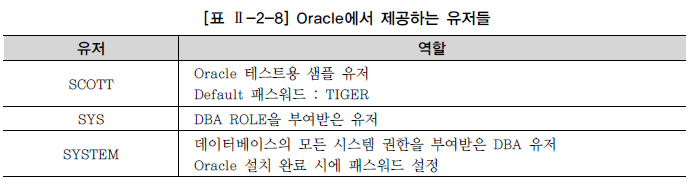
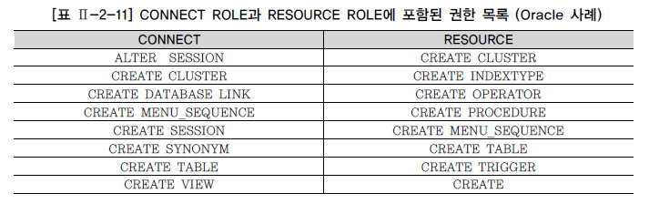
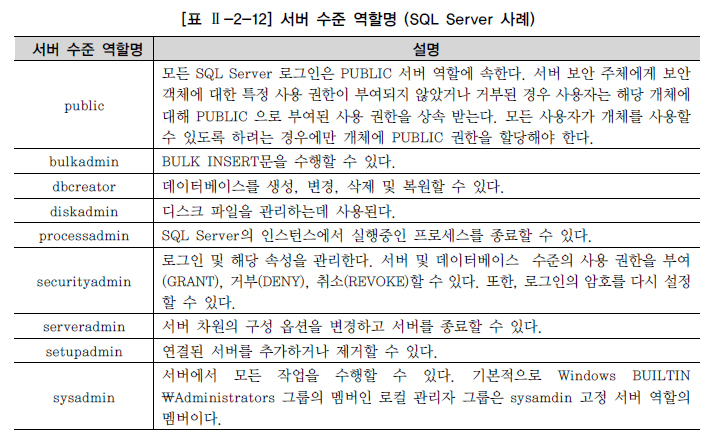
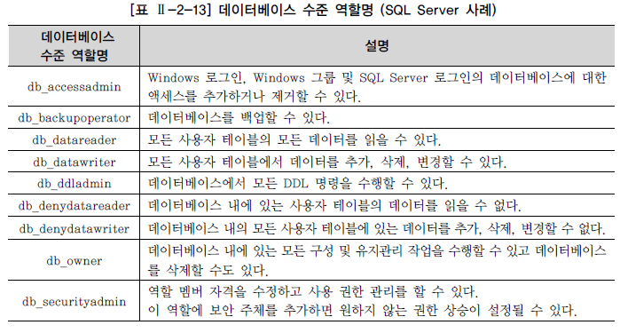

# DCL

> DATA CONTROL LANGUAGE

## DCL 개요

* 유저를 생성하고 권한을 제어하는 명령어

## 유저와 권한

* 운영 시스템에서 사용하던 유저를 오픈하면 데이터의 손실 우려가 너무 커지게 됨

  * 새로운 유저를 생성하고, 생성한 유저에게 공유할 테이블이나 기타 오브젝트에 대한 접근 권한만을 부여한다면 문제 해결

* 대부분의 데이터베이스는 데이터 보호와 보안을 위해서 유저와 권한을 관리

  * Oracle을 설치하면 기본적으로 제공되는 유저들이 존재

    

  * Oracle은 유저를 통해 데이터베이스에 접속하는 형태

    * 아이디와 비밀번호 방식으로 인스턴스에 접속하고 그에 해당하는 스키마에 오브젝트 생성 등의 권한을 부여

  * SQL Server는 인스턴스에 접속하기 위해 로그인이라는 것을 생성, 인스턴스 내에 존재하는 다수의 데이터베이스에 연결하여 작업하기 위해 유저를 생성한 후 로그인과 유저를 매핑해 주어야 함

    * 특정 유저는 특정 데이터베이스 내의 특정 스키마에 대해 권한을 부여 받을 수 있음
    * 두 가지 로그인 방식
      1. Windows 인증 방식으로 Windows에 로그인한 정보를 가지고 SQL Server에 접속하는 방식
      2. 혼합 모드 방식으로 Windows 인증으로도 SQL Server에 접속 가능하며, Oracle의 인증과 같은 방식으로 사용자 아이디와 비밀번호로 SQL Server에 접속하는 방식

### 유저 생성과 시스템 권한 부여

* 유저를 생성하고 데이터베이스에 접속

  * 데이터베이스에 접속했다고 해서 테이블, 뷰, 인덱스 등과 같은 오브젝트를 생성할 수 없음
  * 사용자가 실행하는 모든 DDL 문장(CREATE, ALTER, DROP, RENAME 등)은 그에 해당하는 적절한 권한이 있어야만 문장을 실행 가능

* 새로운 유저를 생성하려면 유저 생성 권한(CREATE USER)이 있어야 함

  * Oracle에서는 `GRANT`를 사용하여 유저 생성 권한을 부여한 후 해당 계정에서 유저를 생성

    ```SQL
    GRANT CREATE USER TO SCOTT;
    CONN SCOTT/TIGHT;
    CREATE USER PJS IDENTIFIED BY KOREA7;
    ```

  * SQL Server에서는 sa로 로그인한 이후 유저를 생성함

    ```sql
    CREATE LOGIN PJS WITH PASSWORD='KOREA7', DEFAULT_DATABASE=AdventureWorks
    ```

    * 유저는 데이터베이스마다 존재함. 생성하고자 하는 유저가 속할 데이터베이스로 이동한 후 유저를 생성

      ```SQL
      USE ADVENTUREWORKS;
      GO
      CREATE USER PJS FOR LOGIN PJS WITH DEFAULT_SCHEMA = dbo;
      ```

* 로그인하기 위해서는 CREATE SESSION 권한을 부여해야 함

  ```SQL
  GRANT CREATE SESSION TO PJS;
  ```

* 테이블을 생성하기 위한 권한을 부여

  ```SQL
  GRANT CREATE TABLE TO PJS;
  ```

### OBJECT에 대한 권한 부여

* 오브젝트 권한은 특정 오브젝트인 테이블, 뷰 등에 대한 SELECT, INSERT, DELETE, UPDATE 작업 명령어를 의미

* 오브젝트 권한과 오브젝트와의 관계

  

* 모든 유저는 각각 자신이 생성한 테이블 외에 다른 유저의 테이블에 접근하려면 해당 테이블에 대한 오브젝트 권한을 소유자로부터 부여받아야 함

* SQL Server에서는 유저는 단지 스키마에 대한 권한만을 가짐

  * 오브젝트는 유저가 소유하는 것이 아니고 스키마가 소유를 하게되며 유저는 스키마에 대해 특정 권한을 가짐

* 다른 유저가 소유한 객체에 접근하기 위해서는 객체 앞에 객체를 소유한 유저의 이름을 붙여서 접근해야 함

  * SQL Server는 객체 앞에 소유한 유저의 이름을 붙이는 것이 아니고 객체가 속한 스키마 이름을 붙여야 함

    ```SQL
    [Oracle]
    SELECT * FROM PJS.MENU;
    
    [SQL Server]
    SELECT * FROM dbo.MENU;
    ```

  * PJS 유저로부터 MENU 테이블을 SELECT할 수 있는 권한을 부여받지 못했기 때문에 조회 불가능

    ```SQL
    GRANT SELECT ON MENU TO SCOTT;
    ```

## Role을 이용한 권한 부여

* 데이터베이스 관리자는 각 유저별로 어떤 권한이 부여되었는지를 관리해야 함

* 많은 데이터베이스에서 유저들과 권한들 사이에서 중개 역할을 하는 ROLE을 제공

* 데이터베이스 관리자는 ROLE을 생성하고, ROLE에 각종 권한들을 부여한 후 ROLE을 다른 ROLE이나 유저에게 부여

  * ROLE에 포함되어 있는 권한들이 필요한 유저에게는 해당 ROLE만을 부여함으로써 빠르고 정확하게 필요한 권한을 부여

* ROLE에는 시스템 권한과 오브젝트 권한을 모두 부여 가능

  * ROLE은 유저에게 직접 부여될 수도 있고, 다른 ROLE에 포함하여 유저에게 부여될 수도 있음

* ROLE을 생성하고 유저에게 ROLE을 이용하여 권한을 부여

  ```SQL
  REVOKE CREATE SESSION, CREATE TABLE FROM PJS;
  
  CREATE ROLE LOGIN_TABLE;
  GRANT CREATE SESSION, CREATE TABLE TO LOGIN_TABLE;
  GRANT LOGIN_TABLE TO PJS;
  ```

* Oracle에서는 기본적으로 몇 가지 ROLE을 제공

  * 가장 많이 사용하는 ROLE은 CONNECT와 RESOURCE

    

  * 기본적인 ROLE을 사용하여 권한 부여

    ```SQL
    DROP USER PJS CASCADE;
    
    CREATE USER PJS IDENTIFIED BY KOREA7;
    
    GRANT CONNECT, RESOURCE TO PJS;
    ```

* SQL Server에서는 기본적으로 제공되는 ROLE에 멤버로 참여하는 방식으로 사용

  * 특정 로그인이 멤버로 참여할 수 있는 서버 수준 ROLE

    

  * 데이터베이스에 존재하는 유저에 대해서는 아래와 같은 데이터베이스의 역할의 멤버로 참여 가능

    

  * SQL Server에서는 Oracle과 같이 ROLE을 자주 사용하지 않음

    * 대신 위에서 언급한 두 역할을 이용하여 권한을 제어
    * 인스턴스 수준을 요구하는 로그인에는 서버 수준 역할을, 데이터베이스 수준을 요구하는 사용자에게는 데이터베이스 수준 역할을 부여