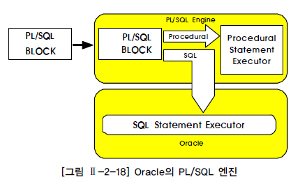
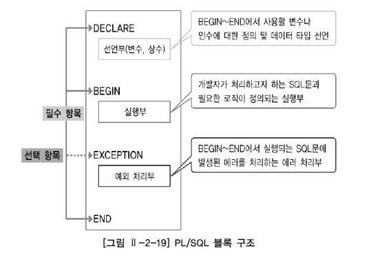
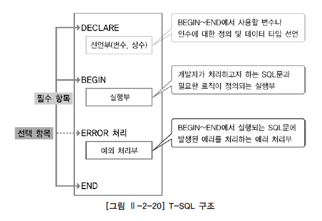
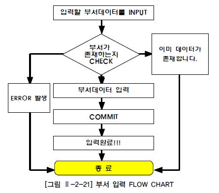
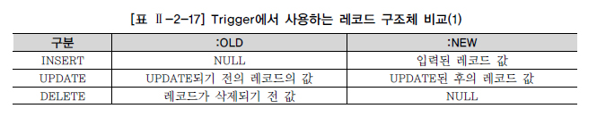
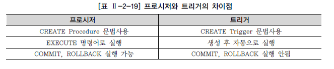

# 절차형 SQL

## 절차형 SQL 개요

* 절차형 SQL을 이용하면 SQL 문의 연속적인 실행이나 조건에 따른 분기처리를 이용하여 특정기능을 수행하는 저장 모듈을 생성할 수 있음

## PL/SQL 개요

### PL/SQL 특징

* Block구조로 되어있음

  * Block 내에는 DML 문장과 QUERY 문장, 절차형 언어(IF, LOOP) 등을 사용 가능

* 절차적 프로그래밍을 가능하게 하는 트랜잭션 언어

* 다양한 저장 모듈 개발

  * 저장 모듈이란, PL/SQL 문장을 데이터베이스 서버에 저장하여 사용자와 Application 사이에서 공유할 수 있도록 만든 일종의 SQL 컴포넌트 프로그램이며, 독립적으로 실행되거나 다른 프로그램으로부터 실행될 수 있는 완전한 실행 프로그램

* 특징

  * PL/SQL은 Block 구조로 되어있어 각 기능별로 모듈화가 가능
  * 변수, 상수 등을 선언하여 SQL 문장 간 값을 교환
  * IF, LOOP 등의 절차형 언어를 사용하여 절차적인 프로그램이 가능하도록 함
  * DBMS 정의 에러나 사용자 정의 에러를 정의하여 사용할 수 있음
  * PL/SQL은 Oracle에 내장되어 있으므로 Oracle과 PL/SQL을 지원하는 어떤 서버로도 프로그램을 옮길 수 있음
  * PL/SQL은 응용 프로그램의 성능을 향상시킴
  * PL/SQL은 여러 SQL 문장을 Block으로 묶고 한 번에 Block 전부를 서버로 보내기 때문에 통신량을 줄일 수 있음

* PL/SQL Architecture

  

### PL/SQL 구조

* Block 구조

  

  * DECLARE : BEGIN ~ END 절에서 사용될 변수와 인수에 대한 정의 및 데이터 타입을 선언하는 선언부

  * BEGIN ~ END : 개발자가 처리하고자 하는 SQL문과 여러 가지 비교문, 제어문을 이용하여 필요한 로직을 처리하는 실행부
  * EXCEPTION : BEGIN ~ END 절에서 실행되는 SQL문이 실행될 때 에러가 발생하면 그 에러를 어떻게 처리할 것인지를 정의하는 예외 처리부

### PL/SQL 기본 문법(Syntax)

* Stored Procedure을 통한 PL/SQL에 대한 기본적인 문법 정리

  ```SQL
  CREATE [OR REPLACE] Procedure [Procedure_name] 
  (argument1 [mode] data_type1, 
   argument2 [mode] date_type2, 
   ... ... )
  IS [AS] ... ... 
  BEGIN ... ... 
  EXCEPTION ... ... 
  END; /
  ```

  * CREATE 명령어로 데이터베이스 내에 프로시저를 생성
    * 생성한 프로시저는 데이터베이스 내에 저장
  * [OR REPLACE] 절은 데이터베이스 내에 같은 이름의 프로시저가 있을 경우, 기존의 프로시저를 무시하고 새로운 내용으로 덮어쓰기 하겠다는 의미
  * Argument는 프로시저가 호출될 때 프로시저 안으로 어떤 값이 들어오거나 혹은 프로시저에서 처리한 결과값을 운영 체제로 리턴시킬 매개 변수를 지정할 때 사용
  * [mode] 부분에 지정할 수 있는 매개변수의 유형은 3가지
    * IN : 운영 체제에서 프로시저로 전달될 변수의 MODE
    * OUT : 프로시저에서 처리된 결과가 운영체제로 전달되는 MODE
    * INOUT : IN과 OUT 두 가지의 기능을 동시에 수행하는 MODE
  * 마지막의 `/` : 데이터베이스에서 프로시저를 컴파일하라는 명령어

* 생성된 프로시저를 삭제하는 명령어

  ```SQL
  DROP Procedure [Procedure_name];
  ```

## T-SQL 개요

### T-SQL 특징

* SQL Server를 제어하기 위한 언어
  * MS사에서 ANSI/ISO 표준의 SQL에 약간의 기능을 더 추가해 보완적으로 만든 것
* 다양한 저장 모듈을 개발
* T-SQL의 프로그래밍 기능
  * 변수 선언 기능 `@@`이라는 전역변수(시스템 함수)와 `@`이라는 지역변수가 있음
  * 지역변수는 사용자가 자신의 연결 시간 동안만 사용하기 위해 만들어지는 변수이며 전역 변수는 이미 SQL 서버에 내장된 값
  * 데이터 유형(Data Type)을 제공
    * int, float, varchar 등의 자료형을 의미
  * 연산자(Operator)
    * 산술 연산자(+, -, *, /)와 비교연산자(=, <, >, <>), 논리연산자(and, or, not) 사용이 가능
  * 흐름 제어 기능
    * IF-ELSE와 WHILE, CASE-THEN 사용이 가능
  * 주석 기능
    * 한줄 주석 : `--`뒤의 내용은 주석
    * 범위 주석 : `/* 내용 */` 형태를 사용하며, 여러 줄도 가능

### T-SQL 구조



* DECLARE : BEGIN ~ END 절에서 사용될 변수와 인수에 대한 정의 및 데이터 타입을 선언하는 선언부
* BEGIN ~ END : 개발자가 처리하고자 하는 SQL문과 여러 가지 비교문, 제어문을 이용하여 필요한 로직을 처리하는 실행부
  * 반드시 사용해야 하는 것은 아니지만 Block 단위로 처리하고자 할 때는 반드시 작성
* ERROR 처리 : BEGIN ~ END 절에서 실행되는 SQL문이 실행될 때 에러가 발생하면 그 에러를 어떻게 처리할 것인지를 정의하는 예외 처리부

### T-SQL 기본 문법(Syntax)

* Stored Procedure을 통해 기본적인 문법 정리

  ```	sql
  CREATE Procedure [schema_name.]Procedure_name 
  @parameter1 data_type1 [mode], 
  @parameter2 date_type2 [mode], 
  ... ... 
  WITH AS ... ... 
  BEGIN ... ... 
  ERROR 처리 ... ... 
  END;
  ```

  * CREATE 명령어로 데이터베이스 내에 프로시저를 생성
    * 생성한 프로시저는 데이터베이스 내에 저장
  * CREATE 구문을 ALTER 구문으로 변경하여 프로시저를 변경
  * @parameter는 프로시저가 호출될 때 프로시저 안으로 어떤 값이 들어오거나 혹은 프로시저에서 처리한 결과 값을 리턴 시킬 매개변수를 지정할 때 사용
  * [mode] 부분에 지정할 수 있는 매개 변수(@parameter)의 유형은 4가지
    * VARYING
      결과 집합이 출력 매개 변수로 사용되도록 지정한 CURSOR 매개변수에만 적용
    * DEFAULT
      지정된 매개변수가 프로시저를 호출할 당시 지정되지 않을 경우 지정된 기본값으로 처리
    * OUT, OUTPUT
      프로시저에서 처리된 결과 값을 EXECUTE 문 호출 시 반환
    * READONLY
      자주 사용되지 않음, 프로시저 본문 내에서 매개 변수를 업데이트하거나 수정할 수 없음을 나타냄
      매개 변수 유형이 사용자 정의 테이블 형식인 경우 READONLY를 지정해야 함
  * WITH 부분에 지정할 수 있는 옵션 3가지
    * RECOMPILE
      데이터베이스 엔진에서 현재 프로시저의 계획을 캐시하지 않고 프로시저가 런타임에 컴파일됨
      데이터베이스 엔진에서 저장 프로시저 안에 있는 개별 쿼리에 대한 계획을 삭제하려 할 때 RECOMPILE 쿼리 힌트를 사용
    * ENCRYPTION
      CREATE PROCEDURE 문의 원본 텍스트가 알아보기 어려운 형식으로 변환
      변조된 출력은 SQL Server의 카탈로그 뷰 어디에서도 직접 표시되지 않음
      원본을 볼 수 있는 방법이 없기 때문에 반드시 원본은 백업을 해두어야 함
    * EXECUTE AS
      해당 저장 프로시저를 실행할 보안 컨텍스트를 지정

*  생성된 프로시저를 삭제하는 명령어

  ```SQL
  DROP Procedure [schema_name.]Procedure_name;
  ```

## Procedure의 생성과 활용

* Flow Chart

  

* 예제

  ```sql
  [Oracle] 
  CREATE OR REPLACE Procedure p_DEPT_insert -------------① 
  	( v_DEPTNO in number, v_dname in varchar2, v_loc in varchar2, v_result out varchar2) 
  IS 
  cnt number := 0; 
  BEGIN 
  	SELECT COUNT(*) INTO CNT -------------② 
  	FROM DEPT 
  	WHERE DEPTNO = v_DEPTNO 
  		AND ROWNUM = 1; 
  	if cnt > 0 then -------------③ 
  		v_result := '이미 등록된 부서번호이다'; 
  	else 
  		INSERT INTO DEPT (DEPTNO, DNAME, LOC) -------------④ 
  		VALUES (v_DEPTNO, v_dname, v_loc); 
  		COMMIT; -------------⑤ 
  		v_result := '입력 완료!!'; 
  	end if; 
  EXCEPTION -------------⑥ 
  	WHEN OTHERS THEN 
  		ROLLBACK;
  		v_result := 'ERROR 발생'; 
  END; 
  /
  
  [SQL Server] 
  CREATE Procedure dbo.p_DEPT_insert -------------① 
  @v_DEPTNO int, 
  @v_dname varchar(30), 
  @v_loc varchar(30), 
  @v_result varchar(100) OUTPUT 
  AS 
  DECLARE @cnt int 
  SET @cnt = 0 
  BEGIN 
  	SELECT @cnt=COUNT(*) -------------② 
  	FROM DEPT 
  	WHERE DEPTNO = @v_DEPTNO 
  	IF @cnt > 0 -------------③ 
  	BEGIN 
  		SET @v_result = '이미 등록된 부서번호이다' 
  		RETURN 
  	END 
  	ELSE 
  	BEGIN 
  		BEGIN TRAN 
  		INSERT INTO DEPT (DEPTNO, DNAME, LOC) -------------④ 
  		VALUES (@v_DEPTNO, @v_dname, @v_loc) 
  		IF @@ERROR<>0 
  		BEGIN 
  			ROLLBACK -------------⑥ 
  			SET @v_result = 'ERROR 발생' 
  			RETURN 
  		END 
  		ELSE 
  		BEGIN 
  			COMMIT -------------⑤ 
  			SET @v_result = '입력 완료!!' 
  			RETURN 
  		END 
  	END 
  END
  ```

  1. DEPT 테이블에 들어갈 칼럼 값(부서코드, 부서명, 위치)을 입력 받음
  2. 입력 받은 부서코드가 존재하는지 확인
  3. 부서코드가 존재하면 '이미 등록된 부서번호입니다.'라는 메시지를 출력 값에 넣음
  4. 부서코드가 존재하지 않으면 입력받은 필드 값으로 새로운 부서 레코드를 입력
  5. 새로운 부서가 정상적으로 입력됐을 경우에는 COMMIT 명령어를 통해 트랜잭션을 종료
  6. 에러가 발생하면 모든 트랜잭션을 취소하고 'ERROR 발생'이라는 메시지를 출력 값에 넣음

* 프로시저를 작성하면서 주의해야 할 몇 가지 문법적 요소

  * PL/SQL 및 T-SQL에서는 다양한 변수가 있음
    * SCALAR 변수는 사용자의 임시 데이터를 하나만 저장할 수 있는 변수이며 거의 모든 형태의 데이터 유형을 지정할 수 있음
  * PL/SQL에서 사용하는 SQL 구문은 대부분 지금까지 살펴본 것과 동일하게 사용할 수 있지만 SELECT 문장은 다름
    * PL/SQL 에서는 결과값이 반드시 있어야 하며 결과 역시 반드시 하나여야 함
    * 하지만 T-SQL에서는 결과값이 없어도 에러가 발생하지 않음
  * T-SQL을 비롯하여 일반적으로 대입 연산자는 `=`을 사용하지만 PL/SQL에서는 `:=`을 사용
  * 에러 처리를 담당하는 EXCEPTION에는 WHEN ~ THEN 절을 사용하여 에러의 종류별로 적절히 처리
    * OTHERS를 이용하여 모든 에러를 처리할 수 있지만 정확하게 에러를 처리하는 것이 좋음

## User Defined Function의 생성과 활용

* Procedure처럼 절차형 SQL을 로직과 함께 데이터베이스 내에 저장해 놓은 명령문의 집합

* Procedure와 다른 점은 RETURN을 사용해서 하나의 값을 반드시 되돌려 줘야 하는 것

  * 특정 작업을 수행하고 반드시 수행 결과 값을 리턴함

* 함수 생성

  ```SQL
  [Oracle]
  CREATE OR REPLACE Function UTIL_ABS 
  (v_input in number) ---------------- ① 
    return NUMBER 
  IS 
    v_return number := 0; ---------------- ② 
  BEGIN 
    if v_input < 0 then ---------------- ③ 
      v_return := v_input * -1; 
    else 
      v_return := v_input; 
    end if; 
    RETURN v_return; ---------------- ④ 
  END; 
  /
  
  [SQL Server]
  CREATE Function dbo.UTIL_ABS 
  (@v_input int) ---------------- ① 
  RETURNS int 
  AS 
  BEGIN 
    DECLARE @v_return int ---------------- ② 
    SET @v_return=0 
    IF @v_input < 0 ---------------- ③ 
      SET @v_return = @v_input * -1 
    ELSE 
      SET @v_return = @v_input 
    RETURN @v_return; ---------------- ④ 
  END
  ```

  1. 숫자 값을 입력 받음 (예제에서는 숫자 값만 입력된다고 가정)
  2. 리턴 값을 받아줄 변수인 v_return을 선언
  3. 입력 값이 음수이면 -1을 곱하여 v_return 변수에 대입
  4. v_return 변수를 리턴

## Trigger의 생성과 활용

* 특정한 테이블에 INSERT, UPDATE, DELETE와 같은 DML 문이 수행되었을 때, 데이터베이스에서 자동으로 동작하도록 작성된 프로그램

  * 사용자가 직접 호출하여 사용하는 것이 아니고 데이터베이스에서 자동적으로 수행하게 함

* 테이블과 뷰, 데이터베이스 작업을 대상으로 정의

  * 전체 트랜잭션 작업에 대해 발생되는 Trigger와 각 행에 대해서 발생되는 Trigger가 있음

* Trigger 작성 예제

  ```SQL
  [Oracle]
  CREATE OR REPLACE Trigger SUMMARY_SALES ---------------- ① 
  	AFTER INSERT 
  	ON ORDER_LIST 
  	FOR EACH ROW 
  DECLARE ---------------- ② 
  	o_date ORDER_LIST.order_date%TYPE;
      o_prod ORDER_LIST.product%TYPE;
  BEGIN 
  	o_date := :NEW.order_date; 
  	o_prod := :NEW.product; 
  	UPDATE SALES_PER_DATE ---------------- ③ 
  		SET qty = qty + :NEW.qty, 
  			amount = amount + :NEW.amount 
  	WHERE sale_date = o_date 
  		AND product = o_prod; 
  	if SQL%NOTFOUND then ---------------- ④ 
  		INSERT INTO SALES_PER_DATE 
  		VALUES(o_date, o_prod, :NEW.qty, :NEW.amount); 
  	end if; 
  END; 
  /
  ```

  1. Trigger를 선언

     * 행 순서대로 Trigger 선언문, 레코드 입력후 Trigger 발생, 테이블에 Trigger 설정, 각 Row마다 Trigger 적용

  2. 값을 저장할 변수 선언, 신규로 입력된 데이터 저장

     * :NEW는 신규로 입력된 레코드의 정보를 가지고 있는 구조체
     * :OLD는 수정, 삭제되기 전의 레코드를 가지고 있는 구조체

     

  3. 먼저 입력된 주문 내역의 주문 일자와 주문 상품을 기준으로 SALES_PER_DATE 테이블에 업데이트

  4. 처리 결과가 SQL%NOTFOUND이면 해당 주문 일자의 주문 상품 실적이 존재하지 않으며, SALES_PER_DATE 테이블에 새로운 집계 데이터 입력

* Trigger는 데이터베이스 보안의 적용, 유효하지 않은 트랜잭션의 예방, 업무 규칙 자동 적용 제공 등에 사용될 수 있음

## 프로시저와 트리거의 차이점

* 프로시저는 BEGIN ~ END 절 내에 COMMIT, ROLLBACK과 같은 트랜잭션 종료 명령어를 사용할 수 있음

* 트리거는 BEGIN ~ END 절 내에 사용할 수 없음

* 차이점

  