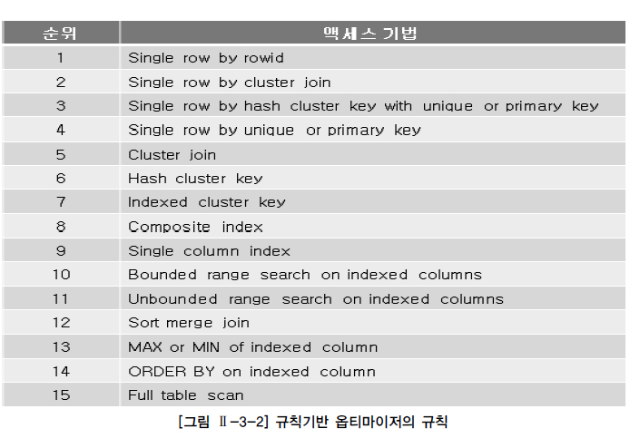
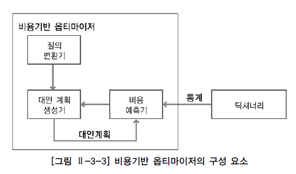
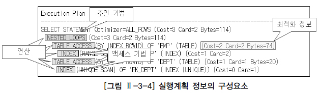
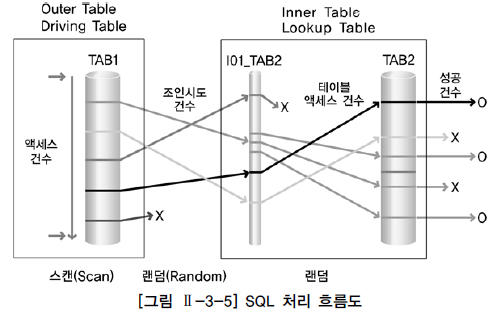

# 옵티마이저와 실행계획

## 옵티마이저

* 사용자가 질의한 SQL 문에 대해 최적의 실행 방법을 결정하는 역할을 결정
  * 이러한 최적의 실행 방법을 실행 계획(Execution Plan)이라고 함
* 관계형 데이터베이스는 옵티마이저가 결정한 실행 방법대로 실행 엔진이 데이터를 처리하여 결과 데이터를 사용자에게 전달할 뿐임
* 실행 방법의 적절성 여부는 질의의 수행 속도에 가장 큰 영향
* 최적의 실행 방법 결정이라는 것은 어떤 방법으로 처리하는 것이 최소 일량으로 동일한 일을 처리할 수 있을지 결정하는 것
  * 옵티마이저는 이러한 결정을 실제 SQL문을 처리해보지 않은 상태에서 결정해야 하는 어려움이 있음
* 구분
  * 규칙기반 옵티마이저 (RBO, Rule Based Optimizer)
    * 신규 기능들에 대해서는 더 이상 지원하지 않음
  * 비용기반 옵티마이저 (CBO, Cost Based Optimizer)
    * 현재 대부분의 관계형 데이터베이스

### 규칙기반 옵티마이저

* 규칙(우선 순위)을 가지고 실행계획을 생성

* 규칙기반 옵티마이저가 실행계획을 생성할 때 참조하는 정보

  * SQL문을 실행하기 위해서 이용 가능한 인덱스 유무

  * (유일, 비유일, 단일, 복합 인덱스)종류, SQL문에서 사용하는 연산자(=, <, <>, LIKE, BETWEEN 등)의 종류
  * SQL문에서 참조하는 객체(힙 테이블, 클러스터 테이블 등)의 종류

* 참조하는 정보에 따라 우선 순위(규칙)가 정해져 있고, 이 우선 순위를 기반으로 실행계획을 생성

* **규칙기반 옵티마이저는 우선 순위가 높은 규칙이 적은 일량으로 해당 작업을 수행하는 방법이라고 판단하는 것**

* 규칙기반 옵티마이저의 15가지 규칙

  * 순위의 숫자가 낮을수록 높은 우선 순위

  

  * 규칙1
    * ROWID를 통해서 테이블에서 하나의 행을 액세스 하는 방식
    * ROWID는 행이 포함된 데이터 파일, 블록 등의 정보를 가지고 있기 때문에 다른 정보를 참조하지 않고도 바로 원하는 행을 액세스 할 수 있음
    * 하나의 행을 액세스하는 가장 빠른 방법
  * 규칙4
    * 유일 인덱스(Unique Index)를 통해서 하나의 행을 액세스 하는 방식
    * 인덱스를 먼저 액세스하고 인덱스에 존재하는 ROWID를 추출하여 테이블의 행을 액세스함
  * 규칙8
    * 복합 인덱스에 동등(`=`) 조건으로 검색하는 경우
    * 인덱스 구성 칼럼의 개수가 더 많고 해당 인덱스의 모든 구성 칼럼에 대해 `=`로 값이 주어질 수록 우선순위가 더 높음
  * 규칙9
    * 단일 칼럼 인덱스에 `=`조건으로 검색하는 경우
  * 규칙10
    * 인덱스가 생성되어 있는 칼럼에 양쪽 범위를 한정하는 형태로 검색하는 방식
    * BETWEEN, LIKE
  * 규칙11
    * 인덱스가 생성되어 있는 칼럼에 한쪽 범위만 한정하는 형태로 검색하는 방식
    * <, <=, >, >=
  * 규칙15
    * 전체 테이블을 액세스하면서 조건절에 주어진 조건을 만족하는 행만을 결과로 추출

* 인덱스를 이용한 액세스 방식이 전체 테이블 액세스 방식보다 우선순위가 높음

  * SQL문에서 이용 가능한 인덱스가 존재한다면 전체 테이블 액세스 방식보다는 항상 인덱스를 사용하는 실행계획을 생성

* 조인 순서를 결정할 때는 조인 칼럼 인덱스의 존재 유무가 중요한 판단의 기준

  * 인덱스가 양쪽 테이블에 모두 존재한다면 규칙에 따라 우선순위가 높은 테이블을 선행 테이블로 선택
  * 한쪽 조인 칼럼에만 인덱스가 존재하는 경우에는 인덱스가 없는 테이블을 선행 테이블로 선택해서 조인 수행
  * 모두 인덱스가 존재하지 않으면 FROM 절의 뒤에 나열된 테이블을 선행 테이블로 선택
  * 조인 테이블의 우선 순위가 동일하다면 FROM 절에 나열된 테이블의 역순으로 선행 테이블을 선택

* 규칙기반 옵티마이저의 조인 기법

  * 양쪽 조인 칼럼에 모두 인덱스가 없는 경우에는 Sort Merge Join을 사용
  * 둘 중 하나라도 조인 칼럼에 인덱스가 존재한다면 일반적으로 NL Join을 사용

* 규칙기반 옵티마이저의 최적화 과정

  ```SQL
  SELECT ENAME 
  FROM EMP 
  WHERE JOB = 'SALESMAN' 
  AND SAL BETWEEN 3000 AND 6000 INDEX 
  --------------------------------- 
  EMP_JOB : JOB 
  EMP_SAL : SAL 
  PK_EMP : EMPNO (UNIQUE)
  ```

  1. 조건절에서 JOB 칼럼의 조건은 `=`이고 SAL 칼럼의 조건은 `BETWEEN`으로 값이 주어졌고 각각의 칼럼에 단일 칼럼 인덱스가 존재
  2. 우선 순위 규칙에 따라 JOB 조건은 규칙 9의 단일 칼럼 인덱스를 만족하고 SAL 조건은 규칙 10의 인덱스 상의 양쪽 한정 검색을 만족
  3. 우선순위가 높은 EMP_JOB 인덱스를 이용해 조건을 만족하는 행에 대해 EMP 테이블을 액세스하는 방식을 선택

  * 규칙기반 옵티마이저가 생성한 실행계획

    ```SQL
    Execution Plan 
    ------------------------------------------------------------ 
    SELECT STATEMENT Optimizer=CHOOSE 
    	TABLE ACCESS (BY INDEX ROWID) OF 'EMP' 
    		INDEX (RANGE SCAN) OF 'EMP_JOB' (NON-UNIQUE)
    ```

### 비용기반 옵티마이저

* SQL문을 처리하는데 필요한 비용이 가장 적은 실행계획을 선택하는 방식

  * 비용이란, SQL문을 처리하기 위해 예상되는 소요시간 또느 자원 사용량을 의미

* 비용을 예측하기 위해 테이블, 인덱스, 칼럼 등의 다양한 객체 통계정보와 시스템 통계정보 등을 이용

  * 통계 정보가 없는 경우 정확한 비용 예측이 불가능해져서 비효율적인 실행계획을 생성할 수 있음
  * 정확한 통계정보를 유지하는 것은 비용기반 최적화에서 중요한 요소

* 구성 요소

  

  * 질의변환기
    * 사용자가 작성한 SQL문을 처리하기에 보다 용이한 형태로 변환하는 모듈
  * 대안 계획 생성기
    * 동일한 결과를 생성하는 다양한 대안 계획을 생성하는 모듈
    * 대안 계획은 연산의 적용 순서 변경, 연산 방법 변경, 조인 순서 변경 등을 통해 생성
    * 대안 계획의 생성이 너무 많아지면 최적화가 오래 걸릴 수 있어서 대안 계획의 수를 제약하는 다양한 방법을 사용
  * 비용 예측기
    * 생성된 대안 계획의 비용을 예측하는 모듈
    * 정확한 비용을 예측하기 위해서 연산의 중간 집합의 크기 및 결과 집합의 크기, 분포도 등의 예측이 정확해야 함
    * 보다 나은 예측을 위해 정확한 통계정보를 필요로 함
    * 보다 나은 예측을 위해 대안 계획을 구성하는 각 연산에 대한 비용 계산식이 정확해야 함

## 실행 계획

* SQL에서 요구한 사항을 처리하기 위한 절차와 방법을 의미

* SQL을 어떤 순서로 어떻게 실행할 지를 결정하는 작업

* 생성된 실행계획을 보는 방법은 데이터베이스 벤더마다 서로 다름

* Oracle의 실행 계획 형태

  

  * 조인 순서
    * 조인 작업을 수행할 때 참조하는 테이블의 순서
  * 조인 기법
    * 두 개의 테이블을 조인할 때 사용할 수 있는 방법
    * NL Join, Hash Join, Sort Merge Join
  * 액세스 기법
    * 하나의 테이블을 액세스할 때 사용할 수 있는 방법
    * 인덱스를 이용하여 테이블을 액세스하는 인덱스 스캔
    * 테이블 전체를 모두 ㅇ릭으면서 조건을 만족하는 행을 찾는 전체 테이블 스캔
  * 최적화 정보
    * 옵티마이저가 실행 계획의 각 단계마다 예상되는 비용 사항을 표시한 것
    * 비용사항이 표시된다는 것은 비용기반 최적화 방식으로 실행계획을 생성했다는 것을 의미
    * Cost는 상대적인 비용 정보
    * Card는 Cardinality의 약자로 주어진 조건을 만족한 결과 집합 혹은 조인 조건을 만족한 결과 집합의 건수를 의미
    * Bytes는 결과 집합이 차지하는 메모리 양을 바이트로 표시한 것
    * 통계 정보를 바탕으로 옵티마이저가 계산한 예상치
  * 연산
    * 여러 가지 조작을 통해서 원하는 결과를 얻어내는 일련의 작업
    * 조인 기법, 액세스 기법, 필터, 정렬, 집계, 뷰 등 다양한 종류가 존재

## SQL 처리 흐름도

* SQL의 내부적인 처리 절차를 시각적으로 표현한 도표

  * 실행 계획을 시각화한 것

* 액세스 처리 흐름도

  

  * 조인순서는 TAB1 -> TAB2
    * TAB1을 Outer Table 또는 Driving Table
    * TAB2를 Inner Table 또는 Lookup Table
  * 액세스 방법
    * TAB1은 테이블 전체스캔
    * TAB2는 I01_TAB2라는 인덱스를 통한 인덱스 스캔
  * 조인 방법
    * NL Join
  * TAB1에 대한 액세스는 스캔 방식
  * 조인시도 및 I01_TAB2 인덱스를 통한 TAB2 액세스는 랜덤방식
  * 건수라고 표시된 곳에 SQL 처리를 위해 작업한 거수 또는 처리 결과 건수 등의 일량을 함께 표시할 수 있음