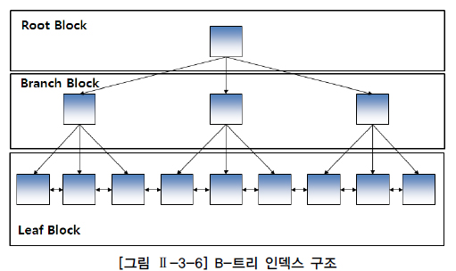

# 인덱스 기본

## 인덱스 특징과 종류

* 인덱스는 원하는 데이터를 쉽게 찾을 수 있도록 돕는 책의 찾아보기와 유사한 개념
* 테이블을 기반으로 선택적으로 생성할 수 있는 구조
* 기본적인 목적은 검색 성능의 최적화
  * INSERT, UPDATE, DELETE 와 같은 DML 작업은 테이블과 인덱스를 함께 변경해야 하기 때문에 오히려 느려질 수 있다는 단점이 존재

### 트리 기반 인덱스

* DBMS에서 가장 일반적인 인덱스는 B-트리 인덱스

  

  * 가장 상위에 있는 블록을 루트 블록
  * 브랜치 블록은 분기를 목적으로 하는 블록
    * 다음 단계의 블록을 가리키는 포인터를 가지고 있음
  * 리프 블록은 트리의 가장 아래 단계에 존재
    * 인덱스를 구성하는 칼럼의 데이터와 해당 데이터를 가지고 있는 행의 위치를 가리키는 레코드 식별자로 구성되어 있음
    * 인덱스 데이터는 인덱스를 구성하는 칼럼의 값으로 정렬
    * 인덱스 데이터의 값이 동일하면 레코드 식별자의 순서로 저장
    * 양방향 링크를 가지고 있음
      * 오름차순, 내림차순 검색을 쉽게 할 수 있음
  * 범위 검색 모두에 적합한 구조

* 인덱스를 생성할 때 동일 칼럼으로 구성된 인덱스를 중복해서 생성할 수 없음

  * 인덱스 구성 칼럼을 동일하지만 칼럼의 순서가 다르면 서로 다른 인덱스로 생성 가능

* 비트맵 인덱스, 리버스 키 인덱스, 함수기반 인덱스 등이 존재

### SQL Server의 클러스터형 인덱스

* 저장 구조에 따라 클러스터형 인덱스와 비클러스터형 인덱스로 나뉨
* 특징
  * 인덱스의 리프 페이지가 곧 데이터 페이지
    * 테이블 탐색에 필요한 레코드 식별자가 리프 페이지에 없음
  * 리프 페이지의 모든 로우(데이터)는 인덱스 키 칼럼 순으로 물리적으로 정렬되어 저장
    * 테이블 로우는 물리적으로 한 가지 순서로만 정렬 가능
    * 클러스터형 인덱스는 테이블당 한 개만 생성할 수 있음

## 전체 테이블 스캔과 인덱스 스캔

### 전체 테이블 스캔

* 테이블에 존재하는 모든 데이터를 읽어 가면서 조건에 맞으면 결과로서 추출하고 조건에 맞지 않으면 버리는 방식으로 검색
* 읽은 블록들은 재사용성이 떨어짐
  * 전체 테이블 스캔 방식으로 읽은 블록들은 메모리에서 곧 제거될 수 있도록 관리
* 옵티마이저가 연산으로 전체 테이블 스캔 방식을 선택하는 이유
  * SQL문에 조건이 존재하지 않는 경우
    * 테이블에 존재하는 모든 데이터가 답이 된다는 것
  * SQL문의 주어진 조건에 사용 가능한 인덱스가 존재하지 않는 경우
    * 데이터를 액세스할 수 있는 방법은 테이블의 모든 데이터를 읽으면서 주어진 조건을 만족하는지 검사하는 방법뿐
    * 주어진 조건에 사용가능한 인덱스는 존재하나 함수를 사용하여 인덱스 칼럼을 변형한 경우에도 인덱스를 사용할 수 없음
  * 옵티마이저의 취사선택
    * 조건을 만족하는 데이터가 많은 경우, 결과를 추출하기 위해 테이블의 대부분의 블록을 액세스해야 한다고 옵티마이저가 판단하면 조건에 사용 가능한 인덱스가 존재해도 전체 테이블 스캔 방식으로 읽을 수 있음
  * 그 밖의 경우
    * 병렬처리 방식으로 처리하는 경우 또는 전체 테이블 스캔 방식의 힌트를 사용한 경우

### 인덱스 스캔

* 인덱스를 구성하는 칼럼의 값을 기반으로 데이터를 추출하는 액세스 기법
* 인덱스에 존재하지 않는 칼럼의 값이 필요한 경우에는 현재 읽은 레코드 식별자를 이용하여 테이블을 액세스
  * SQL문에서 필요로 하는 모든 칼럼이 인덱스 구성 칼럼에 포함된 경우 테이블에 대한 엑세스는 발생하지 않음
* 인덱스는 인덱스 구성 칼럼의 순서로 정렬되어 있음
* 인덱스 스캔
  * 인덱스 유일 스캔
    * 유일 인덱스를 사용하여 단 하나의 데이터를 추출하는 방식
    * 유일 인덱스 구성 칼럼에 대해 모두 `=`로 값이 주어진 경우에만 가능한 인덱스 스캔 방식
  * 인덱스 범위 스캔
    * 인덱스를 이용하여 한 건 이상의 데이터를 추출하는 방식
    * 유일 스캔 방식이 아닌 경우와 비유일 인덱스를 이용하는 모든 액세스 방식은 인덱스 범위 스캔 방식으로 데이터를 액세스
  * 인덱스 역순 범위 스캔
    * 인덱스의 리프 블록의 양방향 링크를 이용하여 내림 차순으로 데이터를 읽는 방식
    * 최대값을 쉽게 찾을 수 있음
  * 인덱스 전체 스캔, 인덱스 고속 전체 스캔, 인덱스 스킵 스캔 등이 존재

### 전체 테이블 스캔과 인덱스 스캔 방식의 비교

* 이용 가능한 때
  * 사용 가능한 적절한 인덱스가 존재할 때만 이용할 수 있는 인덱스 스캔 방식
  * 인덱스의 존재 유무와 상관없이 항상 이용 가능한 전체 테이블 스캔 방식
* I/O 요청
  * 인덱스 스캔은 레코드 식별자를 이용해서 검색하는 데이터의 정확한 위치를 알고 데이터를 읽어서 한번의 I/O요청에 한 블록씩 데이터를 읽음
  * 전체 테이블 스캔은 데이터를 읽을 때 한 번의 I/O요청으로 여러 블록을 한꺼번에 읽음
  * 어차피 테이블의 모든 데이터를 읽을 것이라면 한번 읽기 작업을 할 때 여러 블록을 함께 읽는 것이 효율적
* 대용량 데이터에서
  * 극히 일부의 데이터를 찾을 때
    * 인덱스 스캔 방식은 몇 번의 I/O만으로 원하는 데이터를 쉽게 찾음
    * 전체 테이블 스캔은 모든 데이터를 읽어야 해서 비효율적인 검색을 함
  * 대부분의 데이터를 읽을 거라면
    * 한번에 여러 블록씩 읽는 전체 테이블 스캔 방식이 유리