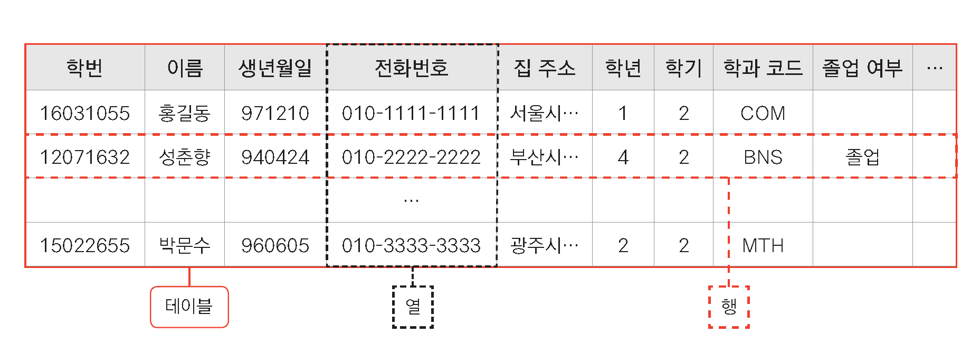
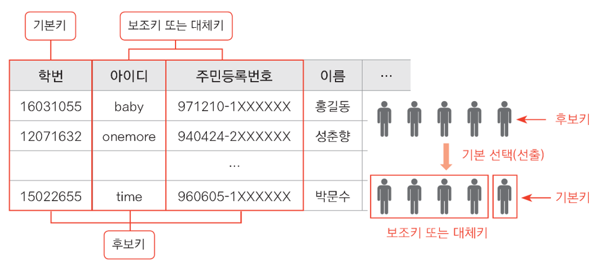
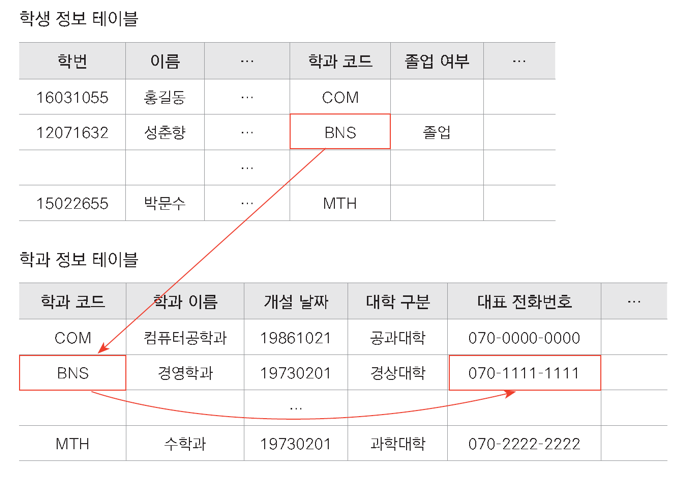
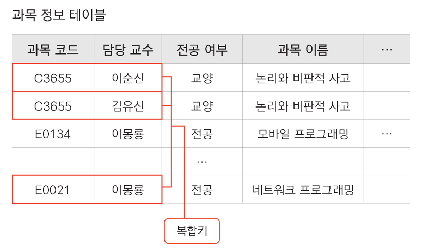

# RDBMS

> Relational Database Management System

## 구성요소

* 테이블(Table)

  

* 특별한 의미를 가진 Column, Key

  * 기본키(PK : Primary Key)

    

    * 다른 `Row`들과 구분되는 중복되지 않는 값을 가진 `Column`

  * 후보키 & 보조키(Alternate Key)

    

  * 외래키(FK : Foreign Key)

    

    * 다른 `Table`을 참조하는 `Key`, 다른 `Table`에서 `PK`역할을 진행하는 `Key`여야 한다.

  * 복합키

    