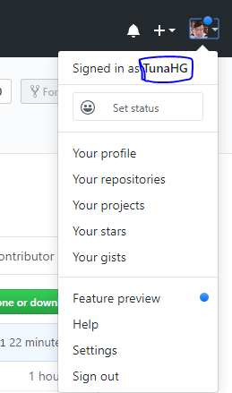

# Git 기초

## 0. 준비 사항

* [Git bash Download](https://gitforwindows.org/)
  * Git을 활용하기 위한 `CLI(Command Line Interface)`를 제공한다.
  * Source Tree, Github Desktop 등을 통해 `GUI`환경에서도 활용 가능하다.

## 1. 로컬 저장소 활용하기

### 1. 저장소 초기화

```bash
$ git init
Initialized empty Git repository in C:/Users/student/Desktop/til/.git/
```

* 저장소(Repository)를 초기화하게 되면, `.git`폴더가 해당 디렉토리에 생성된다.
* bash 창에서는 `(master)`라고 표기된다.
  * 현재 branch가 master라는 것을 의미한다.

### 2. add - Staging Area

> Git으로 관리되는 파일들은 Working Directory(작업 공간), Staging Area, Commit 단계를 거쳐 이력에 저장된다.

```bash
$ git add a.txt   # 파일명
$ git add images/ # 폴더명
$ git add .       # 현재 디렉토리의 모든 파일
```

*  add 전 상태

```bash
$ git status
On branch master

No commits yet

Untracked files:
  (use "git add <file>..." to include in what will be committed)
        Git.md
        image/
        markdown.md

nothing added to commit but untracked files present (use "git add" to track)
```

* add 후 상태

```bash
$ git add .
$ git status
On branch master

No commits yet

Changes to be committed:
  (use "git rm --cached <file>..." to unstage)
        new file:   Git.md
        new file:   "image/\353\213\244\354\232\264\353\241\234\353\223\234.png"
        new file:   markdown.md
```

### 3. Commit

#### 0. Config 설정

> Config를 설정해주지 않고 Commit을 진행하면 에러가 발생한다.

```bash
$ git commit -m "message"
*** Please tell me who you are.

Run

  git config --global user.email "you@example.com"
  git config --global user.name "Your Name"

to set your account's default identity.
Omit --global to set the identity only in this repository.

fatal: unable to auto-detect email address
```

> 저장하는 사람이 누구인지를 알려달라고 한다. 이를 위해 config를 설정해준다.

```bash
$ git config --global user.email {user.email}
$ git config --global user.name {user.name}
```

* `{user.email}`은 Github에 연동한 email을 입력해주면 된다.

* `{user.name}`은 로그인 했을 때의 닉네임을 입력하면 된다.

  * 만약 닉네임이 기억이 나지 않는다면 다음 위치에서 탐색한다.

    

#### 1. Commit 실행

> Commit은 코드의 이력을 남기는 과정이다.

```bash
$ git commit -m "Commit Message"
[master (root-commit) ab29ad3] Markdown and Git tutorial
 3 files changed, 89 insertions(+)
 create mode 100644 Git.md
 create mode 100644 "image/\353\213\244\354\232\264\353\241\234\353\223\234.png"
 create mode 100644 markdown.md
```

* Commit Message는 항상 해당 이력에 대한 정보를 담을 수 있도록 작성하는 것이 좋다.
* 일관적인 Commit Message를 작성하는 습관을 들이자.
* 이력 확인을 위해서는 아래의 명령어를 활용한다

```bash
$ git log
commit ab29ad37b50b3fb814731deb39de258e689c9a08 (HEAD -> master)
Author: TunaHG <asdf0185@naver.com>
Date:   Mon Dec 16 14:24:23 2019 +0900

    Markdown and Git tutorial
```

* `git log --oneline`을 사용하면 commit당 한줄씩 간단하게 표시된다.

**항상 status 명령어를 통해 Git의 상태를 확인하자! Commit 이후에는 log 명령어를 통해 이력들을 확인하자!**

### 2. add + commit 실행

> Add와 Commit을 한번에 사용할 수 있다.

```bash
$ git commit -am "Update File" 
```

* 하지만 새로 생성된 파일에는 사용할 수 없으며 한번이라도 `commit`이력이 있는 파일에 한해서만 사용할 수 있다.

## 2. 원격 저장소 활용하기

> 원격 저장소(Remote Repository)를 제공하는 서비스는 다양하게 존재한다.
>
> github을 기준으로 설명한다.

### 0. 준비하기

* Github에서 저장소(Repository) 생성

### 1. 원격 저장소 설정

```bash
$ git remote add origin {github url}
```

* `{github url}`부분에는 원격 저장소 url을 작성한다.

* 원격 저장소(remote)로 `{github url}`을 `origin`이라는 이름으로 추가(add)하는 명령어 이다.

* 원격 저장소 목록을 보기 위해서는 아래의 명령어를 활용한다.

  ```bash
  $ git remote -v
  origin  https://github.com/TunaHG/TIL.git (fetch)
  origin  https://github.com/TunaHG/TIL.git (push)
  ```

### 2. push

```bash
$ git push origin master
```

* 설정된 원격 저장소(`origin`)으로 push!

폴더의 내용을 수정 및 삭제, 생성 등을 하게 된다면, `add`, `commit` 명령어를 통해서 이력을 저장하고 `push` 명령어를 통해 업로드 한다.

### 3. clone

> 기존 환경과는 다른 환경에서 Github의 내용을 처음 이어하는 경우

```bash
$ git clone {clone url}
```

* `{clone url}`부분은 Repository Site에서 File List 오른쪽 위의 clone or Download을 클릭하여 나온 링크를 의미한다.
* `clone` 이후 `git bash`에서 `cd foldername`을 통해 넘어가서 진행하면 된다. 혹은 켜져있던 `git bash`를 종료하고 `clone`으로 다운받은 폴더에서 다시 `git bash`를 실행시키면 된다.
* 이후 새로운 내용을 추가하고 `add`, `commit`, `push`를 진행하면 업데이트 된다.
* 이 때 주의할 것은 `git init`을 진행한 후 `clone`을 하는 것이 아니다. `clone`에는 `init`의 역할이 포함되어 있다.

### 4. pull

>다른 환경에서 작업한 내용을 기존 환경의 로컬에 Update하는 경우

```bash
$ git pull origin master
```

* 기존에 작업하던 파일에서 `Git Bash Here`을 진행하면 `.git`폴더가 이미 만들어진 상태이므로 `git init`을 진행할 필요 없이 바로 `(master)`가 켜져있으며 `pull`을 바로 진행하면 된다.
* 해당 폴더의 내용을 변경하기 전에 `pull`을 진행하여 항상 원격 저장소와 동기화를 시켜놔야한다.

## 기타

### 1. 참고사항

* `gitignore`를 이용하여 git bash에서 무시하고자 하는 형식을 지정해 줄 수 있다.
* 각 폴더마다 `README.md`파일을 새로만들면 해당 폴더로 진입시 README가 보인다.
* 다른 `Repository`로 이동해 보여주기위해서는 하이퍼링크로 주소를 지정해준다.

### 2. 주의사항

* Github 사이트에서 연결된 원격 저장소(Remote Repository)를 직접 수정하면 git bash에서 `push`명령어를 진행할 때 에러가 발생할 수 있다.
  * 모든 변경사항은 `git bash`에서 진행한다고 생각한다.