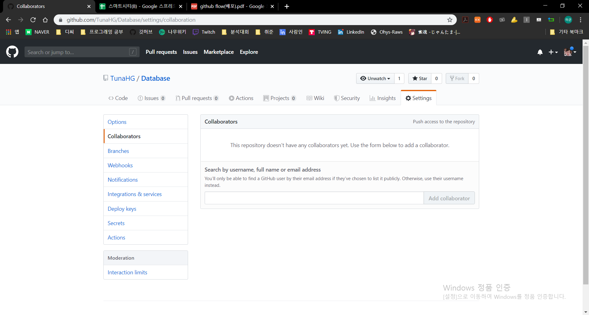

# Github Flow Models

## Shared Repository Model

> 동일한 저장소를 공유하여 활용하는 방식

1. **Invite Collaborator**

   

   * Github의 닉네임이나 이메일주소를 이용하여 초대

   * 초대받은 인원이 이메일을 통해 초대를 수락하거나 초대자가 복사해서 보내준 링크로 접속하여 초대 수락

   * 초대받은 인원이 로컬 저장소에 초대받은 Repository의 `clone`생성

     ```bash
     $ git clone {project repository url}
     ```

2. **Create feature branch**

   * `master branch`는 항상 배포 가능한 상태를 유지하고, 영향이 가지 않도록 독립적인 `branch`에서 작업을 한다.

   * `feature branch`는 이름을 생성할 때, 기능을 명시적으로 나타낸다.

     ```bash
     (master) $ git checkout -b feature/accounts-login
     (feature/accounts-login) $ touch develop-login.txt
     ```

   * `Commit`을 통해 작업의 이력을 남긴다.

     ```bash
     (feature/accounts-login) $ git add develop-login.txt
     (feature/accounts-login) $ git commit -m 'Complete login feature'
     ```

     * `Commit`은 다른 사람들이 내가 한 작업들을 확인할 수 있는 이력이며, 코드의 변화에 맞춰 실시한다.
     * `Commit message`는 매우 중요하며, 일관된 형식으로 해당 이력을 쉽게 파악할 수 있도록 작성한다.
     * `git status`와 `git log`명령어를 반드시 활용하여 상태를 파악한다.

   * 완성된 코드는 원격 저장소에 push한다.

     ```bash
     (feature/accounts-login) $ git push origin feature/accounts-login
     ```

     * `git push`를 하기전에 코드와 `commit`상태를 반드시 확인한다.
       원격 저장소에 공개된 이력은 절대 변경 하여서는 안된다.

3. **Pull Request**

   * Github에서 Pull Request를 클릭한다.
     * `branch`를 확인하고 작업 내용을 작성하여 요청을 보낸다.
   * 작성된 코드를 확인 후 병합
     * `merge`과정에서 충돌이 발생할 경우 해결 후 `merge`를 진행한다.
     * `master branch`로 병합의 경우 코드가 반드시 배포 가능한 상태여야 한다.
   * 다음 작업 준비
     * `merge`된 `branch`는 삭제하고 `master branch`를 업데이트 한다.
     * 1 ~ 3의 과정을 반복한다.

## Fork & Pull Model

> Repository의 Collaborator에 등록되지 않고, Pull request를 통한 협업이 가능, Github기반의 오픈소스 참여 과정에서 쓰이는 방식.

1. **Fork Repository**

   * 원격 저장소를 `Fork`하면 내 저장소로 복제본을 가져온다.

   * 복제본을 내 로컬 저장소에 `git clone`한다.

     ```bash
     $ git clone {project repository url}
     ```

2. **Create feature branch**

   * 작업은 항상 독립적인 `feature branch`에서 한다.

     ```bash
     (master) $ git checkout -b feature/accounts-login
     (feature/accounts-login) $ touch develop-login.txt
     ```

   * `Commit`을 통해 작업의 이력을 남긴다.

     ```bash
     (feature/accounts-login) $ git add develop-login.txt
     (feature/accounts-login) $ git commit -m "Complete login feature"
     ```

   * 완성된 코드는 원격 저장소에 `push`를 한다.

     ```bash
     (feature/accounts-login) $ git push origin feature/accounts-login
     ```

3. **Pull Request**

   * Github에 들어가서 `Pull Request`를 클릭한다
   * `base repository`와 `head repository`를 확인한다.
   * 작성된 코드를 확인 후 `merge`

4. **while True: but, upstream!!**

   * 다음 작업을 준비한다.
   * 기존에는 단순히 새로 반영된 내용을 받아오기 위하여 origin으로부터 `pull`을 받아왔지만, 지금 설정되어 있는 `origin`은 `no-yeah-contributor`의 저장소이다.
   * 따라서 **project 저장소를 새롭게 원격 저장소(upstream)로 등록하고 받아와야 한다.**

   ```bash
   (feature/accounts-login) $ git checkout master
   (master) $ git branch -d feature/accounts-login
   (master) $ git remote -v
   ```

   ```bash
   (master) $ git remote add upstream https://github.com/github-flow-tutorials/fork-pull-model.git
   (master) $ git pull upstream master
   (master) $ git checkout -b feature/new-feature
   (feature/new-feature) $
   ```

   

   