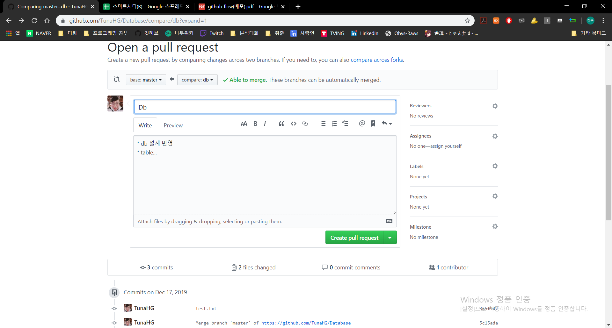

## Pull Request

> Repository의 Owner에게 merge를 허락받기 위해 보내는 과정

1. branch 생성 및 이동

   ```bash
   $ git checkout -b DB
   Switched to a new branch 'db'
   ```

2. 파일 생성 및 commit

   ```bash
   $ touch db.txt
   $ git add .
   $ git commit -m 'Complete DB'
   [db 81a1588] Complete db
    1 file changed, 0 insertions(+), 0 deletions(-)
    create mode 100644 db.txt
   ```

3. pull request

   ```bash
   $ git push origin db
   Enumerating objects: 9, done.
   Counting objects: 100% (9/9), done.
   Delta compression using up to 4 threads
   Compressing objects: 100% (6/6), done.
   Writing objects: 100% (7/7), 756 bytes | 378.00 KiB/s, done.
   Total 7 (delta 2), reused 0 (delta 0)
   remote: Resolving deltas: 100% (2/2), done.
   remote:
   remote: Create a pull request for 'db' on GitHub by visiting:
   remote:      https://github.com/TunaHG/Database/pull/new/db
   remote:
   To https://github.com/TunaHG/Database.git
    * [new branch]      db -> db
   ```

4. Github Site에서 `Pull Request`진행

   

5. Owner가 `merge`진행