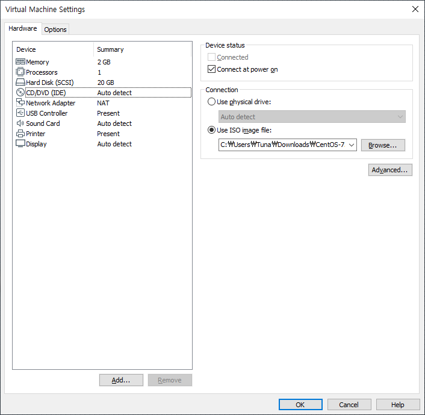
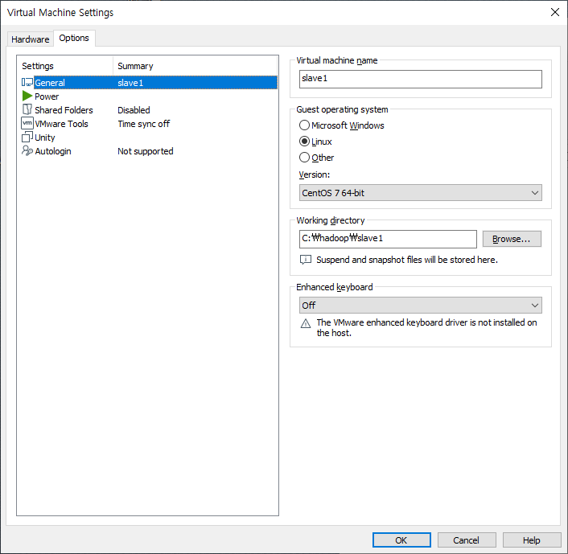
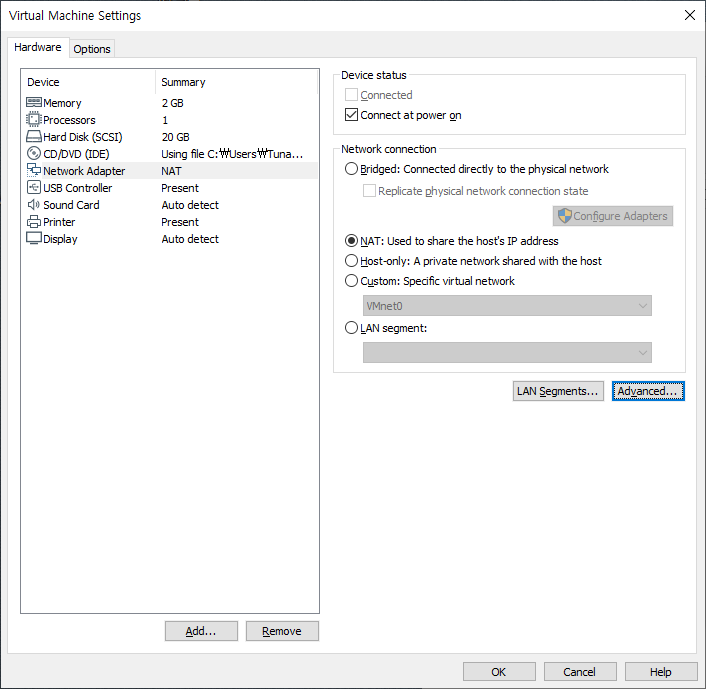
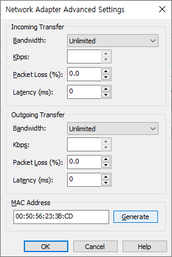
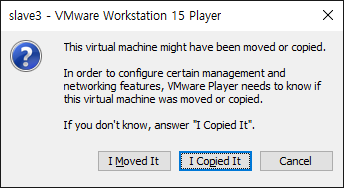
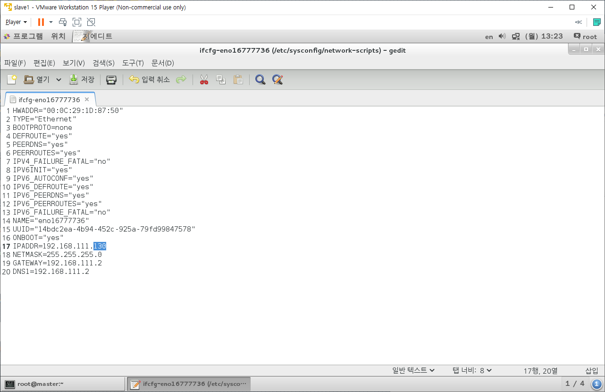
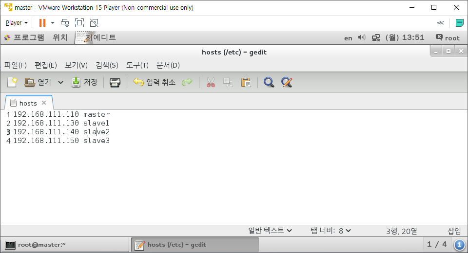

# Hadoop Start

> 빅데이터 저장(분산) 처리 시스템

* 1개 컴퓨터(vm) : Single Node로 운영
* 4개 컴퓨터 : Multi Clustering Node로 운영
  * 하나의 VM을 먼저 만든 후 복사하여 4개의 VM을 생성
  * master : 2GB Memory, 1 Processor, 20GB Disk, NAT Network, Cent OS Iso file

## Concept

* 빅데이터의 3V 속성
  * 규모(Volume) : 데이터를 생성하는 주기가 빠르다. => 데이터의 규모가 커진다.
  * 속도(Velocity) : 저장된 데이터를 처리하는 속도가 빠르다.
  * 다양성(Variety) : SNS등에서 쌓이는 데이터는 각종 형태를 가진다. (텍스트, 이미지 등)
  * 정확성 : 데이터에 부여할 수 있는 신뢰 수준
  * 가치 : 빅데이터를 저장하기 위한 IT 인프라 구조를 구현하는 비용
* HDFS : Hadoop Distributed File System
  * 분산처리시스템
* 설치방식
  * 독립실행모드(Standalone)
    * 기본 실행 모드, 환경설정 파일에 아무런 설정을 하지 않고 실행하면 로컬 장비에서만 실행되기 때문에 로컬모드라고도 한다.
    * 분산환경을 고려한 테스트는 불가능하다.
  * 가상분산모드(Pseudo-Distributed)
    * 하나의 장비에 모든 하둡 환경설정을 하고, 하둡 서비스도 이 장비에서만 제공하는 방식
  * 완전분산모드(Fully Distributed) : 이 모드로 설치한다.
    * 여러 대의 장비에 하둡이 설치된 경우

## VM Setting

* VMWare에서 Home - Create a New Virtual Machine

  * OS를 나중에 설치하는 3번째 라디오박스 체크후 Next
  * Linux, Cent OS 7으로 설정후 Next
  * name은 master, 경로는 `C:\hadoop\master`로 설정
  * 이후 변경없이 Next, Finish

* VMWare에서 master - Edit virtual machine setting

  * Memory 2GB로 변경

  * Processors는 본인 컴퓨터 사양에 맞춰서 올리고싶으면 올려도됨

    * 단, Hadoop을 구동하기 위해 4개의 가상환경을 구축한다는 것을 생각할것.

  * CD/DVD에서 Connection - Use ISO Image file - Browse를 선택하여 Cent OS의 iso파일을 선택

  * Network Adapter가 NAT로 설정되어 있는지 확인

    

* 이후 Cent OS의 설치방식은 Linux를 설치할 때의 방식과 동일하게 설치한다.

  * [Linux_Start](../Linux/Linux_Start.md)를 참고하여 Install과 Setting을 동일하게 진행한다.
    * 사용자 생성은 hadoop/hadoop으로 하나 생성해준다.
      * root계정으로 hadoop을 사용하다가 실수하면 Linux 시스템 자체를 사용할 수 없는 상태가 될 수 있기 때문에 사용자 계정에서 진행한다.
    * Setting의 소프트웨어, yum업데이트 방지, 네트워크설정, SELinux기능 끄기를 전부 진행한다.
      * 네트워크 설정에서 IPADDR은 192.168.111.110으로 설정한다.

* 방화벽

  * 이전 Linux를 배울 때는 원하는 포트번호에 한하여 방화벽을 해제해줬다.

  * 하지만 Hadoop을 공부할 때는 여러개의 포트번호를 사용하기 때문에 방화벽 자체를 해제한다.

  * `systemctl status firewalld`명령어를 사용하여 현재 방화벽 상태를 확인한다.

    ```
    [root@localhost ~]# systemctl status firewalld
    firewalld.service - firewalld - dynamic firewall daemon
       Loaded: loaded (/usr/lib/systemd/system/firewalld.service; enabled)
       Active: active (running) since 월 2020-02-24 09:57:41 KST; 54min ago
     Main PID: 753 (firewalld)
       CGroup: /system.slice/firewalld.service
               └─753 /usr/bin/python -Es /usr/sbin/firewalld --nofork --nopid
    
     2월 24 09:57:41 localhost.localdomain systemd[1]: Started firewalld - dynam...
    Hint: Some lines were ellipsized, use -l to show in full.
    
    ```

    * Active를 살펴보면 active(running)으로 현재 활성화 되어있는 것을 확인할 수 있다.

  * `systemctl stop firewalld`를 사용하여 현재 방화벽을 해제한다.

  * `systemctl disable firewalld`를 사용하여 이후에도 방화벽이 다시 안켜지도록 변경한다.

    * 후에 다시 활성화 시키고 싶다면 `systemctl enable firewalld`명령어를 사용한다.

  * `systemctl restart network`명령어를 사용하여 변경된 Setting을 적용한다.

* JDK를 설치한다.

  * [JDK Install](../Linux/JDK.md)를 참고하여 진행한다.

* Host name을 변경한다.

  * `hostname`명령어를 입력하면 현재 hostname이 나온다.

    ```
    [root@localhost ~]# hostname
    localhost.localdomain
    ```

  * `hostnamectl set-hostname master`로 hostname을 master로 변경한다.

    ```
    [root@localhost ~]# hostnamectl set-hostname master
    [root@localhost ~]# hostname
    master
    ```

### 4개의 VM Setting

* `C:\hadoop`경로로 들어오면 만들었던 master폴더가 존재한다.

  * 해당 폴더를 복사 붙여넣기하여 3개의 폴더를 추가로 생성한다.

  * 각 폴더의 이름을 slave1, 2, 3로 변경한다.

    

* VMWare를 켜서 Home에서 우클릭하여 Open a VM을 클릭

  * 위의 폴더를 찾아서 이동하여 slave1을 열어 master.vmf를 선택후 열기

  * 새롭게 생성된 master에서 Edit Virtual Machine Settings를 선택

  * Options - Working Directory가 slave1인 것을 확인하고 name을 slave1으로 변경

    

  * Hardware - Network Adapter - Advanced를 선택

    

    * 가장 아래의 MAC Address 부분을 Generate버튼을 클릭하여 새로 생성후 해당 값을 복사하여 메모장에 저장

      

* 이후 slave1 가상 컴퓨터를 실행, I Moved It 선택후 OS 부팅

  

* root계정으로 접속 후 `gedit /etc/sysconfig/network-scripts/ifcfg-eno16777736`명령어 실행

  

  * IPADDR의 마지막 부분을 110에서 130으로 수정한다.
  * HWADDR을 위에서 메모장에 복사해둔 slave1의 MAC ADDRESS로 수정한다.

* hostname을 slave1으로 수정

  * `hostnamectl set-hostname slave1`
  * `hostname` 명령어를 사용해보면 현재 hostname을 확인 할 수 있다.
  * 재부팅하면 터미널의 앞부분이 `[root@master ~]`에서 `[root@slave1 ~]`으로 수정된다.

* 변경된 값들을 적용한다.

  * `systemctl restart network`
  * `reboot`

* 과정을 반복하여 slave2, slave3의 가상컴퓨터도 생성한다.

  * 각 IPADDR의 마지막 부분은 140, 150으로 변경한다.

* 가상 컴퓨터에서 hostname들을 변경해준다.

  * master 가상컴퓨터의 터미널에서 `gedit /etc/hosts`명령어를 사용하여 진입한다.

  * 원래 쓰여진 내용을 전부 지우고 새로운 내용을 다음과 같이 입력한다.

    

  * 내용을 전부 입력했다면 다시 터미널로 이동하여 `systemctl restart network`를 입력한다.

  * slave1, 2, 3의 가상컴퓨터에서도 전부 동일하게 진행한다.

  * 제대로 연결됬는지 확인하기 위해서 master에서 `ping 192.168.111.130`명령어를 사용하여 slave1과 연결을 주고받아 본다. slave2, 3와도 진행해본다.

    ```
    [root@master ~]# ping 192.168.111.130
    PING 192.168.111.130 (192.168.111.130) 56(84) bytes of data.
    64 bytes from 192.168.111.130: icmp_seq=1 ttl=64 time=0.614 ms
    64 bytes from 192.168.111.130: icmp_seq=2 ttl=64 time=0.882 ms
    64 bytes from 192.168.111.130: icmp_seq=3 ttl=64 time=0.801 ms
    64 bytes from 192.168.111.130: icmp_seq=4 ttl=64 time=0.874 ms
    64 bytes from 192.168.111.130: icmp_seq=5 ttl=64 time=0.677 ms
    64 bytes from 192.168.111.130: icmp_seq=6 ttl=64 time=0.823 ms
    64 bytes from 192.168.111.130: icmp_seq=7 ttl=64 time=0.471 ms
    64 bytes from 192.168.111.130: icmp_seq=8 ttl=64 time=0.791 ms
    64 bytes from 192.168.111.130: icmp_seq=9 ttl=64 time=0.837 ms
    ```

    * 위와 같이 표시된다면 정상적으로 통신한다는 의미다.

* SSH 연결을 진행해본다.

  * master의 터미널에서 `ssh slave1`명령어를 입력한다.

  * 연결할 것인지 물어보는 yes/no가 나타나는데 yes를 입력한다.

  * slave1의 root계정 비밀번호를 물어본다. password를 입력하여 로그인한다.

  * 로그인되면 좌측의 `[root@master ~]#`가 `[root@slave1 ~]#`으로 변경된다.

    ```
    [root@master ~]# ssh slave1
    The authenticity of host 'slave1 (192.168.111.130)' can't be established.
    ECDSA key fingerprint is ac:4e:61:29:99:80:92:0d:19:6f:97:df:80:62:6f:02.
    Are you sure you want to continue connecting (yes/no)? yes
    Warning: Permanently added 'slave1,192.168.111.130' (ECDSA) to the list of known hosts.
    root@slave1's password: 
    Last login: Mon Feb 24 13:46:05 2020
    [root@slave1 ~]#
    ```

  * `who`명령어를 입력해보면 다음과 같이 나타난다.

    ```
    [root@slave1 ~]# who
    root     :0           2020-02-24 13:46 (:0)
    root     pts/0        2020-02-24 13:48 (:0)
    root     pts/1        2020-02-24 13:57 (master)
    ```

    * (master)로 표시된 master가상컴퓨터를 확인할 수 있다.

  * 확인했으니 slave1에서 로그아웃하여 master로 돌아가본다.

    * `exit`명령어로 진행한다.

      ```
      [root@slave1 ~]# exit
      logout
      Connection to slave1 closed.
      [root@master ~]# 
      ```

  * slave2, 3와도 ssh연결을 실습해본다.

  * master에서만 이동가능한 것이 아닌, slave1에서 slave2로 연결하는 등 서로서로 연결이 가능하다.

* SSH Key를 만들어서 SSH연결시마다 비밀번호를 입력할 수고를 줄여준다.

  * master계정에서 진행한다.

  * `ssh-keygen -t rsa`을 입력한다. 이후 입력하는 칸이 나올때마다 아무것도 입력하지 않고 엔터키만 누른다.

    ```
    [hadoop@master ~]$ ssh-keygen -t rsa
    Generating public/private rsa key pair.
    Enter file in which to save the key (/home/hadoop/.ssh/id_rsa): 
    Created directory '/home/hadoop/.ssh'.
    Enter passphrase (empty for no passphrase): 
    Enter same passphrase again: 
    Your identification has been saved in /home/hadoop/.ssh/id_rsa.
    Your public key has been saved in /home/hadoop/.ssh/id_rsa.pub.
    The key fingerprint is:
    f9:0d:8b:34:df:8e:69:92:d3:a6:05:a4:45:e8:be:b9 hadoop@master
    The key's randomart image is:
    +--[ RSA 2048]----+
    |       ..        |
    |      ..         |
    |     .  o        |
    |      .+ .       |
    |     .. S .      |
    |      .. * =     |
    |       o.o= o    |
    |      o +.++     |
    |      E..*o .    |
    +-----------------+
    ```

    * 아래에 나온 이미지가 내 key가 된다.

  * slave1에게 key를 나눠준다.

    * `ssh-copy-id -i /home/hadoop/.ssh/id_rsa hadoop@slave1`명령어를 사용한다.

      * `/home/hadoop/.ssh/id_rsa`경로는 키가 생성될 때 저장위치가 표시된다.

    * 연결을 물어보는 질문에 yes를 입력하고, 이후에 hadoop@slave1의 비밀번호를 묻는 질문에 hadoop을 입력한다.

      ```
      [hadoop@master ~]$ ssh-copy-id -i /home/hadoop/.ssh/id_rsa hadoop@slave1
      The authenticity of host 'slave1 (192.168.111.130)' can't be established.
      ECDSA key fingerprint is ac:4e:61:29:99:80:92:0d:19:6f:97:df:80:62:6f:02.
      Are you sure you want to continue connecting (yes/no)? yes
      /usr/bin/ssh-copy-id: INFO: attempting to log in with the new key(s), to filter out any that are already installed
      /usr/bin/ssh-copy-id: INFO: 1 key(s) remain to be installed -- if you are prompted now it is to install the new keys
      hadoop@slave1's password: 
      
      Number of key(s) added: 1
      
      Now try logging into the machine, with:   "ssh 'hadoop@slave1'"
      and check to make sure that only the key(s) you wanted were added.
      
      [hadoop@master ~]$
      ```

    * `ssh hadoop@slave1`명령어를 사용하면 연결할 수 있다고 알려준다. 사용해본다.

      ```
      [hadoop@master ~]$ ssh hadoop@slave1
      Last login: Mon Feb 24 14:28:18 2020
      [hadoop@slave1 ~]$ exit
      logout
      Connection to slave1 closed.
      [hadoop@master ~]$
      ```

  * slave2, 3에도 동일한 과정을 진행하여 SSH key를 생성해준다.

## Hadoop

### Download

* [Download Site]에서 hadoop-1.2.1.tar.gz를 다운로드 받는다.
* 다운로드 받은 tar파일을 Linux에서 압축해제한다. (4개의 가상 컴퓨터 모두에서 진행한다.)

### Setting

* `/hadoop-1.2.1/conf`경로에서 masters, slaves파일을 수정한다.

  * masters파일을 열어 localhost를 slave1으로 변경한다.

    * master가 제 역할을 못할 때 어떤 가상컴퓨터가 역할을 수행할지 정한다.
    * 보조네임노드를 실행할 서버를 설정한다.

  * slaves파일을 열어 localhost를 slave1, slave2, slave3로 수정한다.

    ```
    slave1
    slave2
    slave3
    ```

    * 여기서는 데이터노드를 실행할 서버를 설정한다.

* `/hadoop-1.2.1/conf`경로에서 hadoop-env.sh파일을 수정한다.

  * Line 9의 주석처리를 해제하고 JAVA_HOME을 내가 가진 JDK경로로 수정한다.

    ```
    # The java implementation to use.  Required.
    export JAVA_HOME=/usr/local/jdk1.8
    ```

* hadoop에서 생성되는 데이터를 저장할 폴더 하나를 생성한다.

  * `mkdir /home/hadoop/hadoop-data`

* `/hadoop-1.2.1/conf`경로에서 core-site.xml, hdfs-site.xml, mapred-site.xml파일을 수정한다.

  * core-site.xml을 다음과 같이 수정한다.

    ```xml
    <configuration>
    	<property>
           <name>fs.default.name</name>
        	<value>hdfs://master:9000</value>
        </property>
        <property>
           <name>hadoop.tmp.dir</name>
           <value>/home/hadoop/hadoop-data/</value>
        </property>
    </configuration>
    ```

  * hdfs-xite.xml을 다음과 같이 수정한다.

    ```xml
    <configuration>
    	<property>
    		<name>dfs.replication</name>
         	<value>3</value>
    	</property>
    	<property>
    		<name>dfs.http.address</name>
    		<value>master:50070</value>
    	</property>
    	<property>
    		<name>dfs.secondary.http.address</name>
    		<value>slave1:50090</value>
    	</property>
    </configuration>
    ```

  * mapred-site.xml을 다음과 같이 수정한다.

    ```xml
    <configuration>
    	<property>
    		<name>mapred.job.tracker</name>
    		<value>master:9001</value>
    	</property>
    </configuration>
    ```

* 수정한 파일들 중 xml파일 3개와 hadoop-env.sh파일을 slave1, 2, 3 가상컴퓨터로 복사한다.

  * `scp 복사할파일 다른가상컴퓨터계정:붙여넣기할경로`명령어를 사용한다.
    * 복사하는 명령어인 `cp`와 `ssh`가 합쳐진 다른 컴퓨터로 복사할 때 사용하는 `scp`명령어다.
    * `scp hadoop-env.sh hadoop@slave1:/home/hadoop/hadoop-1.2.1/conf`
    * `scp *-site.xml hadoop@slave1:/home/hadoop/hadoop-1.2.1/conf`
  * slave2와 slave3에도 동일하게 진행한다.

* hadoop계정의 profile을 수정한다.

  * `/etc/profile`은 모든 계정에 해당하는 설정이므로 건들지 않는다.

  * `/home/hadoop/.bash_profile`에 다음의 Code를 추가한다.

    ```
    export HADOOP_HOME=/home/hadoop/hadoop-1.2.1
    export HADOOP_HOME_WARN_SUPPRESS="TRUE"
    PATH=$HADOOP_HOME/bin:$PATH
    ```

    * HADOOP_HOME_WARN_SUPPRESS="TRUE"는 `Warning: $HADOOP_HOME is deprecated.`가 보이지 않도록 한다.
      * 이 Warning은 하둡 자체를 실행하는데 필요없는 HADOOP_HOME을 선언하면서 중복된다며 발생하는 에러이다. 하둡을 실행하는데에는 필요없지만 Hive, Pig등을 사용할 때는 Hadoop의 설치경로를 찾아줄 필요가 있으므로 선언해둔 것이다.

  * `source`명령어를 사용하여 변경된 profile파일을 적용한다.

    * `source /home/hadoop/.bash_profile`

  * `echo $PATH`를 입력하여 PATH가 제대로 추가되었는지 확인한다.

## Execute

> 명령어의 순서를 맞춰 실행한다.

* `hadoop namenode -format`

  * 하둡 저장소를 초기화하는 명령어

  ```
  [hadoop@master conf]$ hadoop namenode -format
  20/02/24 15:36:15 INFO namenode.NameNode: STARTUP_MSG: 
  /************************************************************
  STARTUP_MSG: Starting NameNode
  STARTUP_MSG:   host = master/192.168.111.110
  STARTUP_MSG:   args = [-format]
  STARTUP_MSG:   version = 1.2.1
  STARTUP_MSG:   build = https://svn.apache.org/repos/asf/hadoop/common/branches/branch-1.2 -r 1503152; compiled by 'mattf' on Mon Jul 22 15:23:09 PDT 2013
  STARTUP_MSG:   java = 1.8.0_241
  ************************************************************/
  20/02/24 15:36:15 INFO util.GSet: Computing capacity for map BlocksMap
  20/02/24 15:36:15 INFO util.GSet: VM type       = 64-bit
  20/02/24 15:36:15 INFO util.GSet: 2.0% max memory = 1013645312
  20/02/24 15:36:15 INFO util.GSet: capacity      = 2^21 = 2097152 entries
  20/02/24 15:36:15 INFO util.GSet: recommended=2097152, actual=2097152
  20/02/24 15:36:16 INFO namenode.FSNamesystem: fsOwner=hadoop
  20/02/24 15:36:16 INFO namenode.FSNamesystem: supergroup=supergroup
  20/02/24 15:36:16 INFO namenode.FSNamesystem: isPermissionEnabled=true
  20/02/24 15:36:16 INFO namenode.FSNamesystem: dfs.block.invalidate.limit=100
  20/02/24 15:36:16 INFO namenode.FSNamesystem: isAccessTokenEnabled=false accessKeyUpdateInterval=0 min(s), accessTokenLifetime=0 min(s)
  20/02/24 15:36:16 INFO namenode.FSEditLog: dfs.namenode.edits.toleration.length = 0
  20/02/24 15:36:16 INFO namenode.NameNode: Caching file names occuring more than 10 times 
  20/02/24 15:36:16 INFO common.Storage: Image file /home/hadoop/hadoop-data/dfs/name/current/fsimage of size 112 bytes saved in 0 seconds.
  20/02/24 15:36:17 INFO namenode.FSEditLog: closing edit log: position=4, editlog=/home/hadoop/hadoop-data/dfs/name/current/edits
  20/02/24 15:36:17 INFO namenode.FSEditLog: close success: truncate to 4, editlog=/home/hadoop/hadoop-data/dfs/name/current/edits
  20/02/24 15:36:17 INFO common.Storage: Storage directory /home/hadoop/hadoop-data/dfs/name has been successfully formatted.
  20/02/24 15:36:17 INFO namenode.NameNode: SHUTDOWN_MSG: 
  /************************************************************
  SHUTDOWN_MSG: Shutting down NameNode at master/192.168.111.110
  ************************************************************/
  ```

  * 아래에서 4번째줄에 successfully formatted가 나와있다면 성공적으로 진행한 것이다.
    * 아니라면 이전의 과정을 하나하나 다시 살펴보며 오타가 있진 않았는지 살펴본다.

* `start-all.sh`

  * hadoop을 시작하는 명령어다.
  * hadoop 폴더아래의 bin폴더에 존재하는 파일이다. PATH를 설정했으니 그냥 입력한다.

  ```
  [hadoop@master conf]$ start-all.sh
  starting namenode, logging to /home/hadoop/hadoop-1.2.1/libexec/../logs/hadoop-hadoop-namenode-master.out
  slave2: starting datanode, logging to /home/hadoop/hadoop-1.2.1/libexec/../logs/hadoop-hadoop-datanode-slave2.out
  slave1: starting datanode, logging to /home/hadoop/hadoop-1.2.1/libexec/../logs/hadoop-hadoop-datanode-slave1.out
  slave3: starting datanode, logging to /home/hadoop/hadoop-1.2.1/libexec/../logs/hadoop-hadoop-datanode-slave3.out
  slave1: starting secondarynamenode, logging to /home/hadoop/hadoop-1.2.1/libexec/../logs/hadoop-hadoop-secondarynamenode-slave1.out
  starting jobtracker, logging to /home/hadoop/hadoop-1.2.1/libexec/../logs/hadoop-hadoop-jobtracker-master.out
  slave2: starting tasktracker, logging to /home/hadoop/hadoop-1.2.1/libexec/../logs/hadoop-hadoop-tasktracker-slave2.out
  slave3: starting tasktracker, logging to /home/hadoop/hadoop-1.2.1/libexec/../logs/hadoop-hadoop-tasktracker-slave3.out
  slave1: starting tasktracker, logging to /home/hadoop/hadoop-1.2.1/libexec/../logs/hadoop-hadoop-tasktracker-slave1.out
  ```

  * 잘됬는지 안됬는지 확인하기가 힘들다.

* `jps`

  * 잘됬는지 안됬는지 확인해본다.

  ```
  [hadoop@master conf]$ jps
  10038 Jps
  9913 JobTracker
  9739 NameNode
  ```

  * JobTracker와 NameNode가 존재하면 잘 된 상태이다.

  * 이 명령어를 master가 아닌 slave1에서 사용해본다

    ```
    [hadoop@slave1 ~]$ jps
    10277 SecondaryNameNode
    10183 DataNode
    10393 TaskTracker
    10621 Jps
    ```

    * 보조네임노드로 설정해두었기 때문에 SecondaryNameNode가 생성된다.

  * 이 명령어를 slave2, slave3에서 사용해본다.

    ```
    [hadoop@slave2 ~]$ jps
    9543 DataNode
    9672 TaskTracker
    9807 Jps
    ```

    ```
    [hadoop@slave3 ~]$ jps
    9473 DataNode
    9602 TaskTracker
    11033 Jps
    ```

* `stop-all.sh`

  * hadoop을 종료하는 명령어다.

  ```
  [hadoop@master conf]$ stop-all.sh
  stopping jobtracker
  slave1: stopping tasktracker
  slave3: stopping tasktracker
  slave2: stopping tasktracker
  stopping namenode
  slave1: stopping datanode
  slave2: stopping datanode
  slave3: stopping datanode
  slave1: stopping secondarynamenode
  ```

  