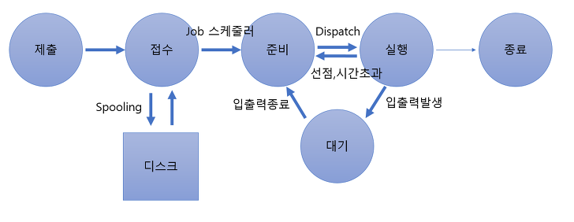

# Process VS Thread

* Process와 Thread의 차이는 무엇인가?
  * Process는 컴퓨터에서 연속적으로 실행되고 있는 컴퓨터 프로그램으로 운영체제로부터 시스템 자원을 할당받는 작업의 단위이다. Thread는 프로세스 내에서 실행되는 여러 흐름의 단위로 프로세스가 할당받은 자원을 이용하는 실행의 단위이다.
  * 프로세스는 실행될 때 운영체제로부터 프로세서, 필요한 주소 공간, 메모리 등 자원을 각각의 독립된 메모리 영역에 할당받습니다. 스레드란 한 프로세스 내에서 동작되는 여러 실행의 흐름으로 프로세스 내에서 Stack을 제외한 메모리 영역을 같은 프로세스 내에 스레드끼리 공유하고 Stack을 따로 할당받아 실행된다.

## Process

> 컴퓨터에서 연속적으로 실행되고 있는 컴퓨터 프로그램

* 종종 스케줄링의 대상이 되는 작업(Task)라는 용어와 거의 같은 의미로 사용한다.
* 여러 개의 프로세서를 사용하는 것을 멀티 프로세싱
* 여러 개의 프로그램을 띄우는 시분할 방식을 멀티 태스킹

### 프로세스 구성

> 프로세스에 대한 정보는 프로세스 제어블록(PCB : Process Control Block) 또는 프로세스 기술자(Process Discriptor)라고 부르는 자료구조에 저장된다.
>
> PCB 자료구조는 다음과 같은 정보를 가지고 있다.

* PID
  * 운영체제가 각 프로세스를 식별하기 위해 부여된 프로세스 식별번호(PID : Process IDentification)
* 프로세스 상태
  * CPU는 프로세스를 빠르게 교체하면서 실행하기 때문에 실행중인 프로세스도 있고 대기 중인 프로세스도 있다. 그런 프로세스의 상태를 저장한다.
* 프로그램 카운터
  * CPU가 다음으로 실행할 명령어를 가리키는 값
  * CPU는 기계어로 한 단위씩 읽어서 처리하는데,
    프로세스를 실행하기 위해 다음으로 실행할 기계어가 저장된 메모리주소를 가리키는 값
* 스케줄링 우선순위
  * 운영체제는 여러 개의 프로세스를 동시에 실행하는 환상을 제공한다.
  * 여러 개의 프로세스가 CPU에서 실행되는 순서를 운영체제가 결정하는 것을 스케줄링이라고 한다.
  * 스케줄링에서 우선순위가 높으면 먼저 실행될 수 있는데 이를 스케줄링 우선순위라고 한다.
* 권한
  * 프로세스가 접근할 수 있는 자원을 결정하는 정보
* 프로세스의 부모와 자식 프로세스
  * 최초로 생성되는 init 프로세스를 제외하고 모든 프로세스는 부모 프로세스를 복제해서 생성되고 이 계층관계는 트리를 형성한다.
  * 각 프로세스는 자식 프로세스와 부모 프로세스에 대한 정보를 가지고 있다.
* 프로세스의 데이터와 명령어가 있는 메모리 위치를 가리키는 포인터
  * 프로세스는 실행중인 프로그램이므로 프로그램에 대한 정보를 가지고 있어야 한다.
  * 프로그램에 대한 정보는 프로세스가 가지는 자신만의 주소 공간에 저장한다.
  * 이 공간에 대한 포인터 값을 가진다.
* 프로세스에 할당된 자원들을 가리키는 포인터
* 실행문맥
  * 프로세스가 실행상태에서 마지막으로 실행한 프로세서의 레지스터 내용을 담고있다.
  * CPU에 실행되는 프로세스는 운영체제에 의해 계속 교체되는데, 교체되었다가 다시 자신의 차례가 되어서 실행될 때 중단된 적 없고 마치 연속적으로 실행된 것처럼 하기 위해 이 레지스터 정보를 가지고 있다.

### 프로세스 상태 전이

> 프로세스가 시스템 내에 존재하는 동안 프로세스의 상태가 변하는 것을 의미

* 프로세스 상태
  * **제출** : 작업을 처리하기 위해 사용자가 작업을 시스템에 제출한 상태
  * **접수 :** 제출된 작업이 스풀 공간인 디스크의 할당 위치에 저장된 상태
  * **준비 :** 프로세스가 프로세서를 할당받기 위해 기다리고 있는 상태
    * 프로세스는 준비상태 큐(스케줄링 큐)에서 실행을 준비하고 있으며 
      접수상태에서 준비 상태로의 전이는 Job 스케줄러에 의해 수행
  * **실행 :** 준비상태 큐에 있는 프로세스가 프로세서를 할당받아 실행되는 상태
    * 프로세스 수행이 완료되기 전에 프로세스에게 주어진 프로세서 할당 시간이 종료 되면 프로세스는 준비상태로 전환
    * 실행중인 프로세스에 입출력 처리가 필요하면 실행중인 프로세스는 대기상태로 전이되며, 실행상태로의 전이는 CPU 스케줄러에 의해 수행
  * **대기 :** 프로세스에 입출력 처리가 필요하면 현재 실행중인 프로세스가 중단되고, 입출력 처리가 완료될떄까지 대기하고 있는상태
  * **종료 :** 프로세스의 실행이 끝나고 프로세스 할당이 해제된 상태
* 프로세스 상태 전이 용어
  * **Dispatch :** 준비 상태에서 대기하고 있는 프로세스 중 하나가 프로세서를 할당받아 실행 상태로 전이되는 과정
  * **Wake Up :** 입 출력 작업이 완료되어 프로세스가 대기 상태에서 준비 상태로 전이되는 과정
  * **Spooling :** 입 출력 장치의 공유 및 상대적으로 느린 입출력 장치의 처리속도를 보완하고 다중 프로그래밍 시스템의 성능을 향상시키기 위해 입 출력할 데이터를 직접 입출력장치에 보내지 않고 나중에 한꺼번에 입출력하기 위해 디스크에 저장하는 과정
  * **교통량 제어기 :** 프로세스의 상태에 대한 조사와 통보 담당

### Program VS Process

* Program
  * 일반적으로 하드디스크 등에 저장되어 있는 실행코드
  * 실행되기를 기다리는 명령어(코드)와 정적인 데이터의 묶음
* Process
  * Program을 구동하여 Program 자체와 Program의 상태가 메모리 상에서 실행되는 작업 단위를 지칭
  * 프로그램의 명령어와 정적 데이터가 메모리에 적재되면 생명이 있는 프로세스가 됨
* 하나의 Program을 여러 번 구동하면 여러 개의 Process가 메모리 상에서 실행된다.
* 즉, 프로세스란 실행 중인 프로그램

## Multi Processing

* 하나의 CPU, 즉 **프로세서는 한순간에 하나의 프로세스만 실행**할 수 있다.

## Thread

## 참고자료

* [프로세스란 무엇인가?](https://coding-factory.tistory.com/307)
* [프로세스가 뭐지?](https://bowbowbow.tistory.com/16)
* [프로세스란?](https://coding-start.tistory.com/198)

