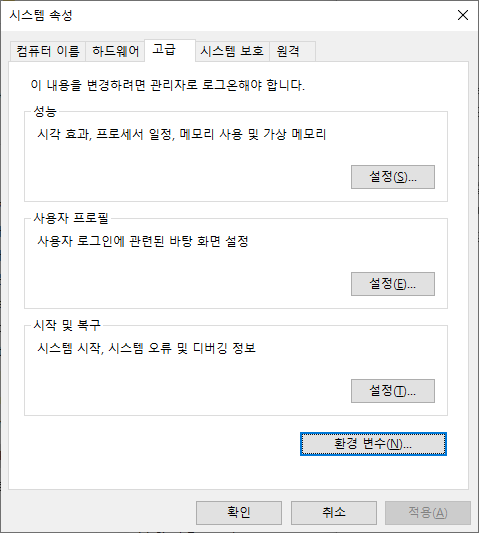

# Java 개발환경 구축

> 19/12/02에 Windows 10에서 사용할 Java와 Eclipse를 설치하는 과정이다.

---

## 1. Java 설치

### 1. Java 설치파일 다운로드

* [Oracle](https://www.oracle.com/kr/index.html)사이트 접속 후 회원가입

  

* [Java Download Site](https://www.oracle.com/technetwork/java/javase/downloads/jdk8-downloads-2133151.html) 접속 후 로그인

  

  * 현재 운영체제가 Windows 64비트이므로 맨 아래 파일을 다운로드받는다.

### 2. Java 다운로드

> Oracle사이트에서 다운로드받은 설치파일을 실행한다.
>
> 별도의 설정변경없이 Next를 눌러 Install을 진행한다.

## 2. Eclipse 설치

### 1. Eclipse 파일 다운로드

* [Eclipse Download Site](https://www.eclipse.org/downloads/) 접속 후 Download Package 클릭

  

* 원하는 버전을 선택하고 Download

  

  * 우측 아래의 `MORE DOWNLOAD` 에서 `2019-03`버전을 다운로드 받는다.
  * `Eclipse IDE for EnterPrise Java Developers`의 Windows 64-bit를 다운로드 받는다.

* 다운로드받은 압축파일을 해제하면 `Eclipse`파일이 존재한다.

## 3. Java 환경변수 설정

> 명령프롬프트 창에서 Java를 실행할 수 있게 해주는 환경변수를 설정한다.

### 1. 시스템 환경 변수 

* 윈도우 검색에서 `환경 변수`를 검색한다.

  * `시스템 환경 변수 편집`을 클릭

* 환경 변수 버튼을 클릭

  

* 시스템 변수의 `새로 만들기` 버튼 클릭

  

* JAVA_HOME 생성

  

  * 변수 이름은`JAVA_HOME`으로 설정, 변수 값은 `Jdk가 설치된 경로`로 설정.

* Path에 `%JAVA_HOME%\bin`경로 추가

  

### 2. 명령프롬프트 창에서 확인

  > 명령프롬프트 창은 Windows 실행창에서 cmd를 입력하면 실행할 수 있다.

* `java` 명령어를 입력했을 때 다음과 같은 결과가 나타나면 성공.

  