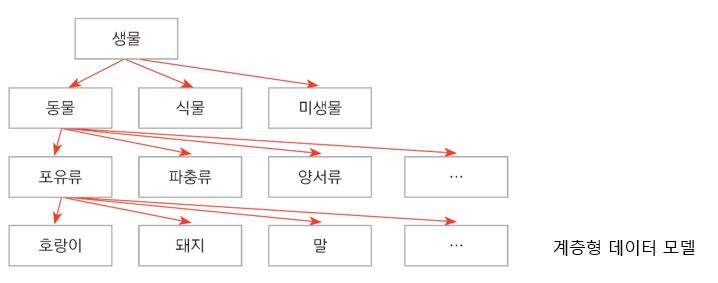
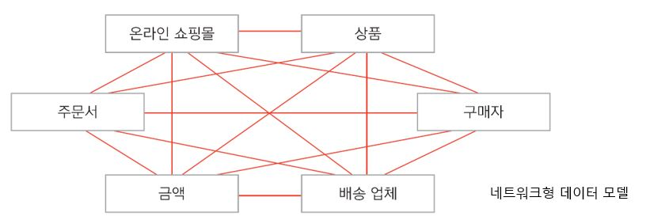
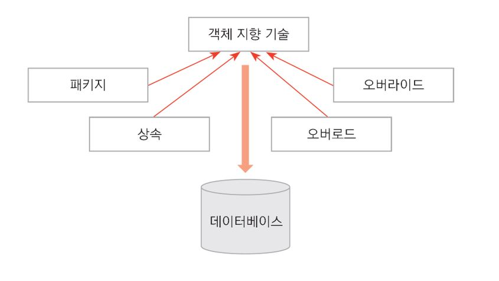
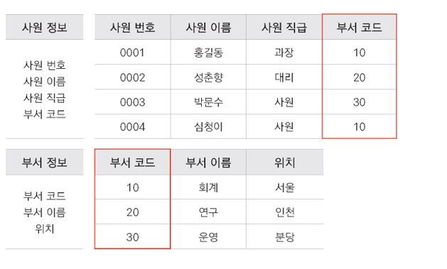

# Database

> 데이터베이스는 구조화된 데이터의 집합이다.

## 특징

* 여러사람과 실시간으로 공유하여 사용이 가능하다.
* 효율적으로 데이터를 관리, 검색할 수 있다.
* 일관성 있는 방법으로 데이터를 관리할 수 있다.
* 데이터의 누락 및 중복을 제거할 수 있다.

## DBMS

> 데이터베이스와 응용프로그램 사이에서 데이터의 접근, 관리 등의 업무를 전담하는 시스템
>
> DataBase Management System.

## 데이터 모델

### 1. 계층형 데이터 모델

### 2. 네트워크형 데이터 모델

### 3. 객체 지향형 데이터 모델

### 4. 관계형 데이터 모델

* [RDBMS(Relational Database Management System)](./RDBMS.md)
* 개체(Entity), 속성(Attribute), 관계(Relationship)으로 이루어져 있음
* Oracle, MS-SQL, MySQL, MariaDB, ...