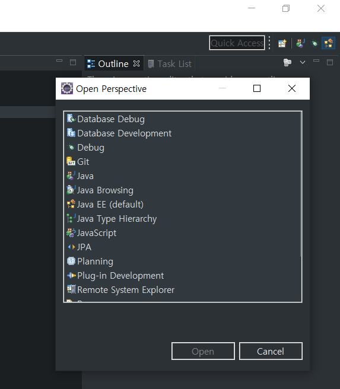

# SQL Execute in Eclipse

> Eclipse에서 SQL code을 실행할 수 있도록 설정한다.

## .Properties 생성

> Database로 사용하는 Project내에 {Name}.properties 파일을 생성한다.

```properties
id=SCOTT
pw=TIGER
driver=
url=
```

* 생성한 `.properties`파일에 위와 같이 입력한다.

## Eclipse에서 Driver생성

* 우선, `C:\oraclexe\app\oracle\product\11.2.0\server\jdbc\lib`경로에 존재하는 `ojdbc6.jar` 파일을 복사하여 `C:\lib`폴더에 붙여넣는다.

* `Eclipse`에서 우측 상단의 `Java EE`를 선택한다.

  

  

* `Java EE`로 변경했다면 창의 아래부분에 `Data Source Explorer`를 선택하고, `Database Connection`를 우클릭하여 `new`를 선택한다.

  

  

* `New`를 선택하면 다음과 같은 창이 뜨는데, `Oracle`을 찾아서 선택하고 이름을 변경한다.

  

  

* `Next`로 넘어가면 다음과 같은 창이 뜨는데, 현재 나는 `Driver`를 설정해둬서 이렇게 뜬다. 초기화면에는 설정된 `Driver`가 없을 것이다. `Driver`를 먼저 생성한다.

  

  * `Drivers`의 파랗게 선택된 부분 오른쪽에 아이콘에 마우스를 올려보면 `New Driver Definition`이라는 아이콘이 보인다. **클릭**

  * `Name/Type`에서 `Oracle Thin Driver`의 `Version 11`을 선택

    

  * `JAR List`부분으로 진입하여 이미 존재하는 `ojdbc14.jar`을 삭제하고 아까 `C:\lib`으로 복사해놨던 `ojdbc6.jar`을 `Add`버튼을 이용하여 추가한다.

    

  * 생성했다면 `OK`눌러서 `Driver`를 생성하면 된다.

  * 현재 나는 `Name`이 중복된 상태라 `OK`가 비활성화 되있지만 처음 `Driver`를 만드는 분들이라면 활성화 되있을 것이다.
    

* `Driver`가 생성되었으니 나머지 설정을 진행한다. 다음 사진과 같이 설정해준다.

  

  * `Service Name`은 `XE`로 설정한다.
  * `Host`는 `127.0.0.1`로 설정한다. 이 때, 127.0.0.1은 루프백을 의미하는 것으로 현재 내 컴퓨터의 IP주소를 의미한다. 나중에 내가 사용하고 싶은 DB가 존재하는 PC의 IP주소를 입력해주면 된다.
  * `User name`은 우리가 접속할 DB 계정인 `SCOTT`을 입력한다.
  * `Password`는 우리가 접속할 `SCOTT`계정의 비밀번호인 `TIGER`를 입력한다.
  * `Save password`를 체크한 후 `Test Connection`을 클릭
  * `Ping Succeeded`가 나타나면 성공한 것이니 `Connection url`을 복사한후 `Finish`

## .properties 수정

* 아까 만들었던 `.properties`파일로 진입하여 복사한 `Connection url`을 `url`부분에 붙여넣는다.

  ```properties
  id=SCOTT
  pw=TIGER
  driver=
  url=jdbc:oracle:thin:@127.0.0.1:1521:XE
  ```

  * 혹시 위에서 `url`을 복사하지 않았다면 `Data Source Explorer`부분에 있는 `{Name}`을 우클릭하고 `properties`에 진입하여 `driver properties`를 들어가면 `url`이 나와있다.

## Eclipse에서 코드 실행

* `SQL file`로 돌아와서 위 쪽에 `Type`을 `Oracle_11`로 선택한후 `Name`, `Database`를 선택한다.
* 오른쪽에 `Connected`가 표시되면 실행하고 싶은 코드를 `Block`잡은 뒤 우클릭하여 `Execute Selected Text`를 클릭하거나 단축키 `Alt + X`를 누르면 코드가 실행되고 결과가 나타난다.