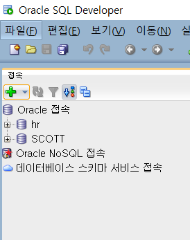
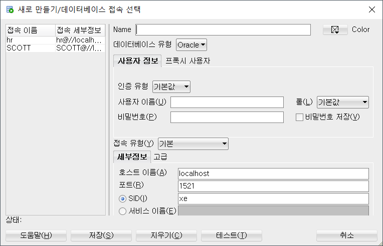
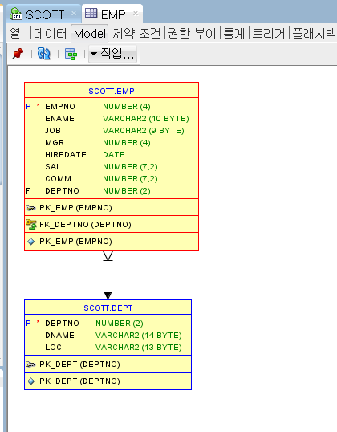

# SQL Developer

> Oracle에서 지원해주는 SQL 개발 Tool

* [SQL Developer Download](https://www.oracle.com/tools/downloads/sqldev-downloads.html) Oracle에서 지원해주는 Tool을 다운로드 받는다.

## Oracle 접속 추가

* SQL Developer가 완전히 켜지면 좌측에 접속 탭에 다음과 같은 `+`표시가 보인다

  

* 다음과 같은 창이 뜨는데, **Name과 사용자 이름, 비밀번호**만 입력해주면 된다.

  

  * 세 가지를 모두 입력했다면 아래에 테스트를 눌러보면 좌측 하단 **상태:**표시에 성공 혹은 실패가 나타난다. 실패가 나타났다면 사용자 이름과 비밀번호를 다시 확인한다.

## Usage

* Oracle 접속을 추가하여 만든 계정에 더블클릭을 진행하면 우측에 쿼리문을 작성할 수 있는 공간이 나타난다. 이 부분에서 쿼리문을 작성하여 실행하면 된다.

* 좌측 계정의 하위로 테이블이 표시된다. 테이블의 하위에 있는 특정 테이블을 더블클릭하여 어떤 테이블인지 확인할 수 있다.

  * Model을 선택하면 간단하게 보여주며 다른 테이블과 어떤관계인지도 한번에 볼 수 있다.

    

* 데이터베이스가, 테이블이 어떤식으로 구성되어 있으며 많은 데이터를 가진 테이블을 살펴볼 때 이용하면 용이하다.
  * 현재 내 노트북에서는 편집기를 구성할 때 자주 잔렉이 걸리며 딜레이가 생기긴 한다.