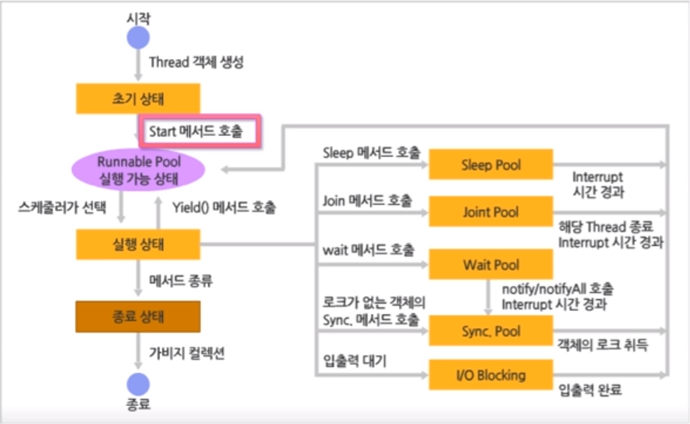

# Multi Thread

> Samsung SW Expert의 동영상강의 
>
> Java Programming 초급(3) 자바 API활용의 5차시 멀티 Thread 프로그래밍

## Multi Thread

### Thread 구성요소

* 가상 CPU
  * 1개의 Thread를 수행시키기 위하여 Java 인터프리터에 의해 내부적으로 처리되는 가상 코드
* 수행 코드
  * Thread가 구현한 기능, Thread 클래스의 run()메소드의 코드를 말함
* 처리 데이터
  * Thread가 처리하는 데이터

### 단일 Thread

> 하나의 Thread를 이용하는 프로그램

* [SingleThreadTest](https://github.com/TunaHG/Eclipse_Workspace/blob/master/Java_Multicampus/src/MultiThread/SingleThreadTest.java)
* Single Thread Program은 프로그램이 종료될 때까지 하나의 Thread만 수행되는 프로그램

### 멀티 Thread

> 여러 개의 Thread를 이용하는 프로그램

* 각각의 Thread가 하나의 독립된 프로그램처럼 일을 수행
* 하나의 프로세스 안에서 동시에 수행되는 구조를 가짐
* 프로세스가 점유한 메모리 공간에서 다른 Thread와 병렬적으로 수행됨
  * 여러 개의 프로세스로 수행되는 것에 비해 시스템 자원을 좀 더 효율적으로 이용할 수 있음

## Multi Thread Programming

### Thread Class

> java.lang.Thread

#### 생성자

* `Thread()`
  * 기본 Thread 객체 생성
* `Thread(String name)`
  * 특정 이름을 가진 Thread를 생성
* `Thread(Runnable r)`
  * Runnable 인터페이스를 구현한 객체를 이용하여 Thread를 생성

#### 메소드

* `static void sleep(long msec) throws InterruptedException`
  * msec에 지정된 millisecond 동안 Thread를 대기함
* `static void sleep(long msec, int nsec) throws InterruptedException`
  * 지정한 millisecond에 지정한 nanosecond를 더한 만큼 Thread를 대기함
* `String getName()`
  * Thread의 이름을 반환함
* `void setName(String s)`
  * Thread의 이름을 s로 설정함
* `void start()`
  * Thread를 시작하게 함
* `final int getPriority()`
  * Thread의 우선순위를 반환함
* `final void setPriority(int p)`
  * Thread의 우선순위를 p로 설정함
* `boolean isAlive()`
  * Thread가 시작되었고 아직 종료하지 않은 경우 true를 리턴함
* `void join() throws InterruptedException`
  * Thread가 끝날때까지 대기함
* `void run()`
  * Thread 기능을 실행함
* `static void yield()`
  * 현재 실행중인 Thread를 잠시 멈추어 다른 Thread가 실행될 여지를 줌

### Thread Class 상속

* [ThreadTest1](https://github.com/TunaHG/Eclipse_Workspace/blob/master/Java_Multicampus/src/MultiThread/ThreadTest1.java)
* Thread 객체
  * start() Method를 호출할 때 동작함
  * Overriding한 run() Method가 실행됨
  * Thread의 실행과 무관하게 main()  Method는 종료됨
    * main() Method는 두 개의 Thread를 기동하는 것으로 역할을 다함
  * 두 Thread 객체가 각각 자신이 수행할 작업들을 독립적으로 수행함

### Runnable Interface 상속

* Thread의 수행 코드인 run() Method를 가지고 있어서 내부적으로는 Thread 객체를 생성해서 수행하도록 되어있음

* Java 언어에서는 다중 상속을 지원하지 않기 때문에 두 개 이상의 Class를 상속받을 수 없음

* [ThreadTest2](https://github.com/TunaHG/Eclipse_Workspace/blob/master/Java_Multicampus/src/MultiThread/ThreadTest2.java)

### Thread의 상태도

* Java Program에서 사용된 Thread 객체는 생성되고 소멸될 때까지 생명 주기를 가지게 되며, Thread는 그 생명 주기에 따라 동작함

  

* 실행 가능 상태
  * Thread가 CPU를 차지하여 언제든지 실행 상태로 갈 수 있는 Thread들을 의미
  * 실행 가능한 Thread들이 모여있는 장소를 Runnable Pool이라고 함
* 실행 상태
  * 실행 가능 상태의 Thread들 중 실행 상태로 들어갈 수 있는 Thread는 1개
  * 나머지 Thread는 Runnable Pool에서 대기해야 함
* 스케줄러
  * 실행 가능 상태의 Thread들 중에서 실행 상태로 들어가는 Thread를 선택하는 Thread
  * JVM 안에서 수행되는 특별한 Thread
  * 실행 상태에 있는 Thread가 CPU를 반납할 경우 여러 상황을 고려하여 다음에 수행될 Thread 후보를 선택

* Thread의 제어 Method

  * 수행 가능 상태(Runnable)

    * 대기 장소에서 JVM의 스케줄러가 Thread를 선택해서 수행 상태로 가기를 기다리는 상태

  * 수행 상태(Running)

  * 수행 불가능한 상태(Not Runnable)

    * 수행 가능한 상태(Runnable)로 가기를 기다리는 상태

  * 수행 불가능한 상태로 이동시키는 Thread Class의 Method

    * `sleep()`

      * 현재 실행 중인 Method를 Sleep Pool로 쫓아냄
      * millis를 인자로 받음
      * 시간이 경과되면 실행 가능한 상태가 되며 Runnable Pool로 들어가게 됨
      * 다른 Thread에게 실행 기회를 **양보**하기 위한 목적으로 쓰임

      ```java
      public void run() {
      		for(int i = 0; i < 10; i++) {
      			System.out.println(i + " " + threadName);
      			try {
      				Thread.sleep((int) (Math.random() * 1000));
      			} catch (InterruptedException e) {
      				
      			}
      		}
      	}
      ```

    * `join()`

      * 다른 Thread와 **협동**작업을 요구할 때 사용할 수 있는 Method(합류하길 기다린다!)
      * sleep()과 같이 miilis를 인자로 줄 수 있음
      * 인자로 받은 miilis가 지날 때까지 Thread가 종료하지 못할 경우 대기 중이던 Thread가 다시 실행 가능 상태로 전환됨
      * 두 개 이상의 Thread가 존재할 때 서로 간의 작업이 시간에 따라 영향을 받거나 선후관계가 존재할 때 유용하게 사용될 수 있음

      ```java
      public void doWork(){
          Thread anotherThread = new Thread();
          anotherThread.start();
          
          try {
              // anotherThread의 수행이 끝날 때까지 기다린다.
              anotherThread.join();
          } catch (Exception e){
              e.printStackTrace();
          }
          // 현재 Thread가 하고자 하는 일을 계속한다.
          // ...
      }
      ```

    * `wait()`, `notify()`, `notifyAll()`

      * Thread가 여러 개 존재하면서, **순차적** 또는 일정 **순서**에 따라 작업하고 싶을 때 사용
      * Thread Class가 아닌 Object Class에 소속되어 있음
      * Synchronized 예약어와 밀접한 관련을 맺고 있음
      * `wait()`는 Thread를 기다리게 만드는 Method
      * `notify()`은 Wait Pool에 들어가 있는 Thread들을 Runnable Pool로 이동시킴
        * 어떤 Thread가 나오는 지는 JVM에 따라 달라지지만 대부분 선입선출형 큐 구조를 따르는 경우가 많음
        * 모든 Thread를 빠져나오도록 만들고 싶다면 `notifyAll()`을 호출함

    * `yield()`

      * 한 Thread가 수행 상태를 너무 오랫동안 점유하지 않고 다른 Thread에게도 기회를 주기 위해서 사용되는 메소드

      ```java
      public void run(){
          for(int i = 0; i < 1000; i++){
              for(int j = 0; j < 2000; j++){
                  System.out.println("연산 결과 : " + i * j);
                  yield();
              }
          }
      }
      ```

      * 이중 for문을 오랫동안 처리한다면 시스템은 이 작업을 수행하느라 다른 작업을 할 수 없음
      * `yield()`를 통해 다른 Thread들도 수행 권한을 얻을 수 있음

    * `run()`

      * `run()` 메소드의 내용을 모두 수행하면 Thread는 자동으로 종료하고 Thread 수행 시 할당되었던 자원은 모두 해제됨
      * `run()` 메소드를 모두 수행하기 전에 Thread를 종료할 수 있음
        * `stop()`
          * 잘못된 동작을 유발할 가능성이 있기 때문에 deprecated 메소드로 분류됨

      ```java
      class MyThread implements Runnable {
          private boolean flag = true;
          
          public void run() {
              while(flag) {
                  try {
                      Thread.sleep(1000);
                  } catch (InterruptedException e) {
                      return;
                  }
                  System.out.println("작업을 처리한다.");
              }
          }
          public void threadStart(){
              Thread myThread = new Thread(this);
              myThread.start();
          }
      }
      ```

  * IO를 수행하고 있는 경우는 이미 수행되고 있는 **객체에 대한 접근이 Blocking** 될 수 있음

* Thread 스케줄링

  * 대기 상태의 Thread는 Thread 스케줄링을 통하여 실행 상태가 됨
  * 스케줄링을 하는 방식
    * **우선순위(Priority)에 따른 방식**과 Round-Robin(Time Slicing)을 적용하는 방식이 있음
    * Java에서 생성된 모든 Thread는 기본적으로 5의 우선순위를 가짐
    * Thread에 할당할 수 있는 우선순위는 1에서 10까지이며 1이 가장 낮은 우선순위를 말함
      * `final static int MIN_PRIORITY` : 가장 작은 우선순위, 1
      * `final static int NORM_PRIORITY` : 중간 값의 우선순위, 5
      * `final static int MAX_PRIORITY` : 가장 큰 우선순위, 10

* [PriorityTest](https://github.com/TunaHG/Eclipse_Workspace/blob/master/Java_Multicampus/src/MultiThread/PriorityTest.java)

### 동기화

> Synchronization

* 우리가 작성하는 응용 프로그램들은 많은 경우에 다수 개의 Thread가 어떤 연관 관계를 가지고 동작

* 병렬적으로 접근하면 출력 결과가 뜻하지 않게 출력될 수 있음

* 순차적으로 자원에 접근

* 임계 영역

  * 하나의 Thread가 수행되고 있는 동안 다른 Thread에 의해 접근되지 못하게 해야 함

  * 파일에 대한 처리를 하는 부분은 한 순간에 하나의 Thread만 사용할 수 있는 영역이 되어야 함

  * Test

    ```java
    class Mailbox {
        private String message;
        // message라는 변수에 저장됨
        public void storeMessage(String message){
            this.message = message;
        }
        // message라는 변수에 저장된 메시지가 추출됨
        public String retrieveMessage(){
            return message;
        }
    }
    ```

    * 두 메소드가 동시에 호출된다면 문제가 발생한다.
    * storeMessage()가 호출되어 메시지가 저장되는 동안 retrieveMessage()가 호출되거나 또는 그 반대 상황이 발생할 수 있다.

* synchronized 예약어를 통해 동기화 처리 가능하며, 두 개 이상의 Thread가 하나의 자원을 공유하면서 작업을 진행할 때 자원을 보호하기 위해 사용함

  * Method 앞에 붙여서 메소드 자체를 동기화함

  * 여러 Thread에 의해 특정 객체의 메소드들이 동시에 호출되는 것에 대해 잠금(Lock)을 설정하는 기능을 가지고 있음

    * 호출된 메소드들 중 하나가 호출되면 그 **객체 정보에 대해 잠금(Lock)을 설정**해서 이 호출이 완료될 때까지 잠금 상태가 유지됨

  * Test

    ```java
    class Mailbox {
        private String message;
        // message라는 변수에 저장됨
        public synchronized void storeMessage(String message){
            this.message = message;
        }
        // message라는 변수에 저장된 메시지가 추출됨
        public synchronized String retrieveMessage(){
            return message;
        }
    }
    ```

    * 동기화된 상태에서 메시지 접근이 가능함
    * MailBox Class는 임계영역으로 설정한 synchronized 메소드가 각 Thread에 의해 번갈아 교대로 호출되어야 함
      * synchronized 메소드 구현만으로는 부족함

* Thread 사이의 통신

  * 두 개 이상의 Thread가 서로 협력하며 공유 자원을 사용하도록 하는 것

  * `wait()`

    * wait()를 만나면 해당 Thread는 Wait Pool로 들어가면 모니터링 락을 반납함
    * 반납된 모니터링 락은 다음 Thread가 가지게됨

  * `notify()`

    * Wait Pool에 들어간 Thread를 Runnable Pool로 이동시킴
    * notify()메소드를 실행한 메소드가 아직 실행상태 이므로 모니터링 락은 해당 Thread가 가지고 있음
    * 해당 메소드가 종료되면 모니터링 락을 반납함
    * 반납된 모니터링 락은 wait()가 호출된 Thread로 들어가게 되며 wait()이후의 코드를 실행함

  * 빠져 나오는 Thread가 무엇인가를 가정하고 코드를 작성하는 것은 매우 위험한 상황을 발생시킬 수 있음

    * 모든 Thread를 Wait Pool에서 꺼내어 놓고 같은 조건에서 다시 시작하도록 작성하는 것이 더욱 안전
    * 모든 Thread를 꺼내는 명령어 `notifyAll()`을 사용
    * 두 개 이상의 Thread일 경우에는 `notifyAll()`을 사용하는 것이 안전

  * [Buffer](https://github.com/TunaHG/Eclipse_Workspace/blob/master/Java_Multicampus/src/MultiThread/Buffer.java), [Producer](https://github.com/TunaHG/Eclipse_Workspace/blob/master/Java_Multicampus/src/MultiThread/Producer.java), [Consumer](https://github.com/TunaHG/Eclipse_Workspace/blob/master/Java_Multicampus/src/MultiThread/Consumer.java), [ProducerConsumerTest](https://github.com/TunaHG/Eclipse_Workspace/blob/master/Java_Multicampus/src/MultiThread/ProducerConsumerTest.java)
