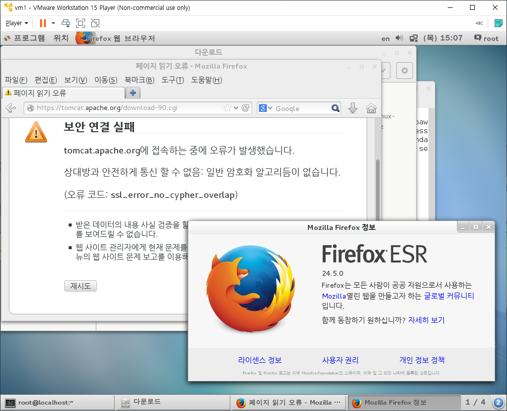
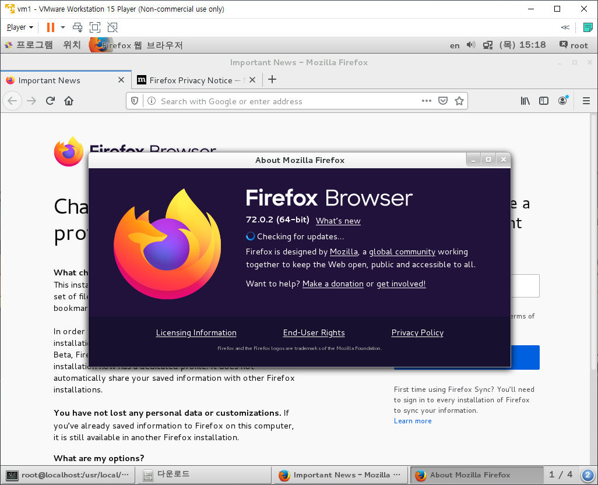
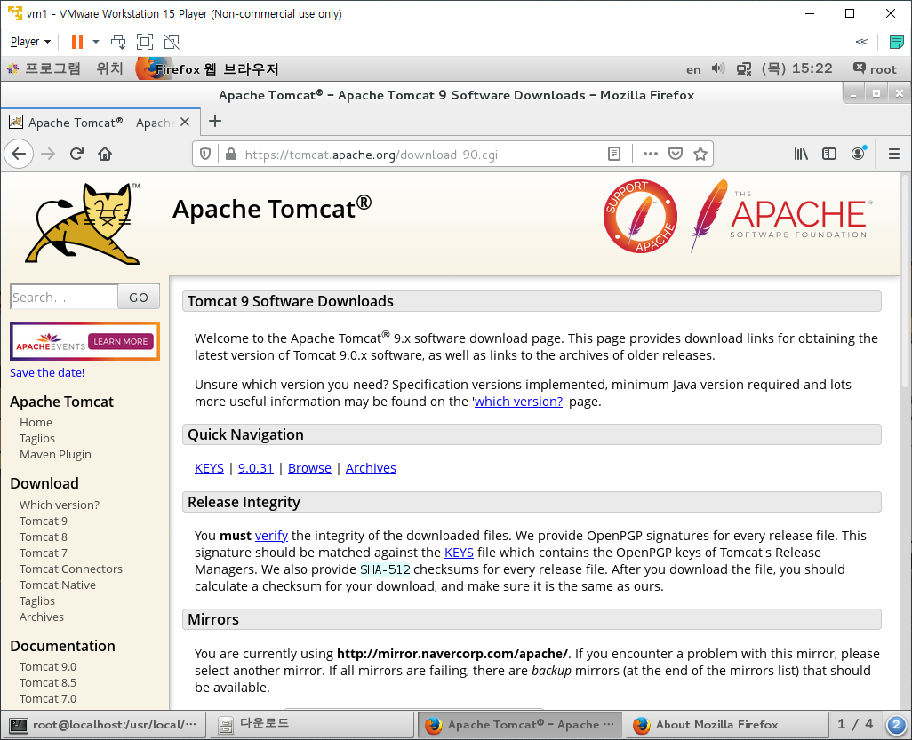
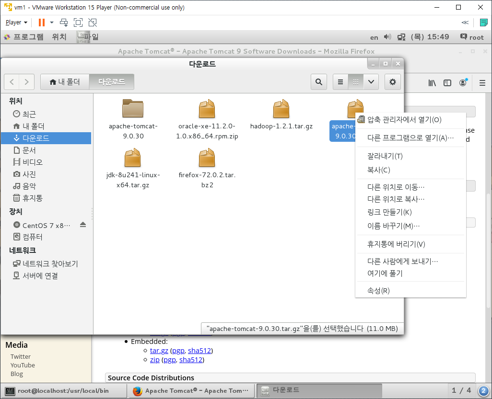

# Apache Tomcat

* [Tomcat Download Site](https://tomcat.apache.org/download-90.cgi)로 진입하면 보안 연결 실패가 나타난다.

  * Firefox의 버전이 낮아서 생긴문제다.

    

  * Firefox의 버전을 먼저 올려준다.

    * [Firefox Download Site](https://www.mozilla.org/ko/firefox/new/)로 진입한 후 [고급설치방법 및 기타 플랫폼] - [Linux 64bit]를 클릭하여 설치파일을 다운로드 받는다.
    * 다운로드 받은 파일이 있는 경로에서 `tar xvf firefox-72.0.2.tar.bz2` 명령어를 입력하여 압축을 해제한다.
    * `/root`경로 밑에 설치하면 root계정만 사용이 가능하다. 그러므로 `/usr`경로로 폴더를 이동한다.
      * 앞으로 프로그램은 `/usr/local`에 설치한다.
      * `mv firefox /usr/local`
    * 사용하기 편하도록 링크를 만들어준다.
      * `ln -s /usr/local/firefox/firefox /usr/local/bin`

  * 터미널에서 `firefox`를 입력하여 웹브라우저를 실행한다.

    * 우측 상단의 작대기 세개 버튼을 클릭하여 메뉴창을 띄운다.

    * [Help] - [About Firefox]를 클릭하여 버전을 확인한다.

      

    * 터미널에서 `firefox -version`을 입력해봐도 버전을 확인할 수 있다.

  * 다시 Tomcat Download Site로 진입해본다.

    

    * 정상진입!

  * Firefox 실행시 Version등으로 인해서 Mozila Crash Report 문제가 발생한다면 다음과 같이 진행한다.
    * `/root/다운로드`에 있는 Firefox 압축파일을 압축해제한다
    * `/root/다운로드/firefox`로 압축이 해제됬는지 확인한다.
    * 터미널에서 `/root/다운로드/firefox/firefox`를 입력하여 실행해본다.

* 진입한 Tomcat Download Site에서 tar.gz파일을 다운로드 받는다.

  * 다운로드 폴더에 존재하는 압축파일을 해제한다.

    

  * 압축해제된 폴더를 이동한다

    * `mv /root/다운로드/tomcat9 /usr/local`

* Tomcat을 실행해본다.

  ` /usr/local/tomcat9/bin/startup.sh`

  * Tomcat started라는 문구가 나타나있다면 실행이 완료된 것이다.
  * Firefox에서 `localhost:8080`을 주소로 진입했을 때 Tomcat 고양이 창이 뜬다면 정상 실행된 것이다.

