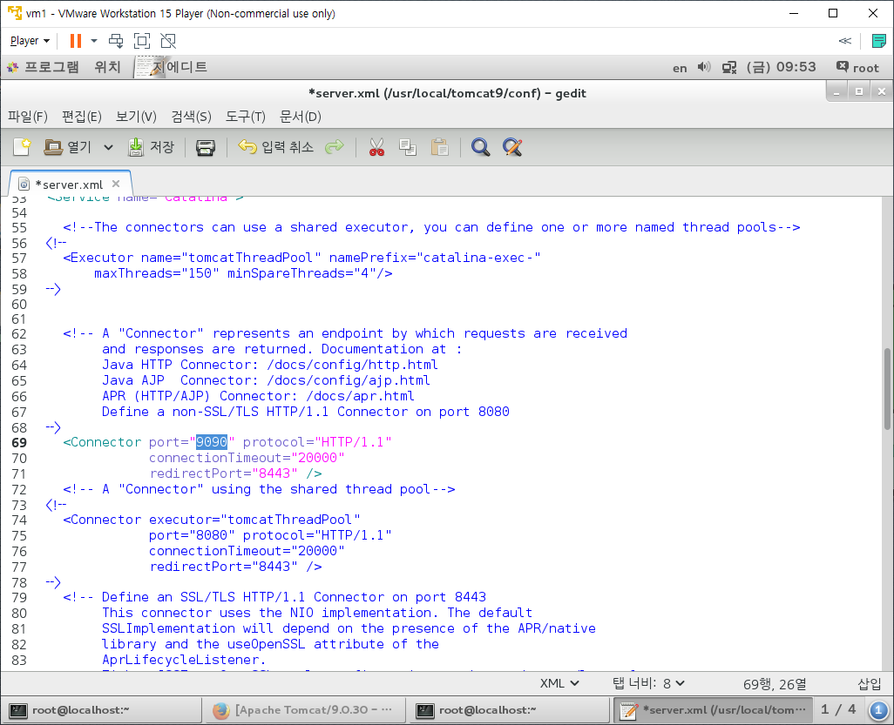
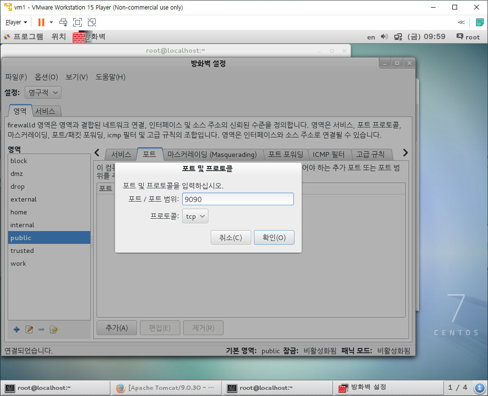
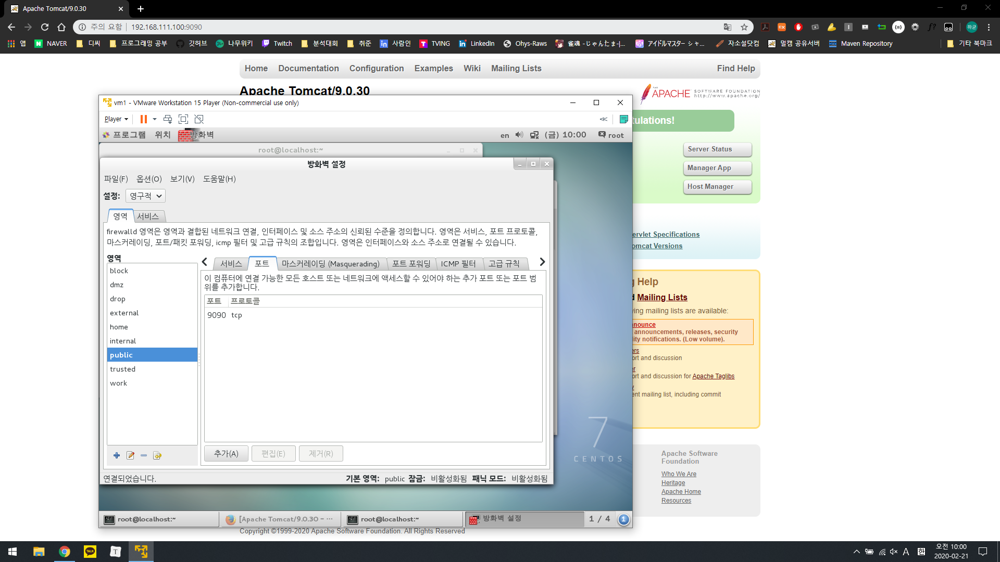
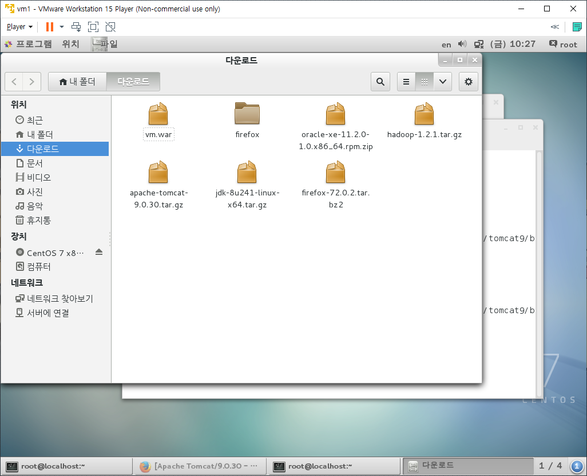
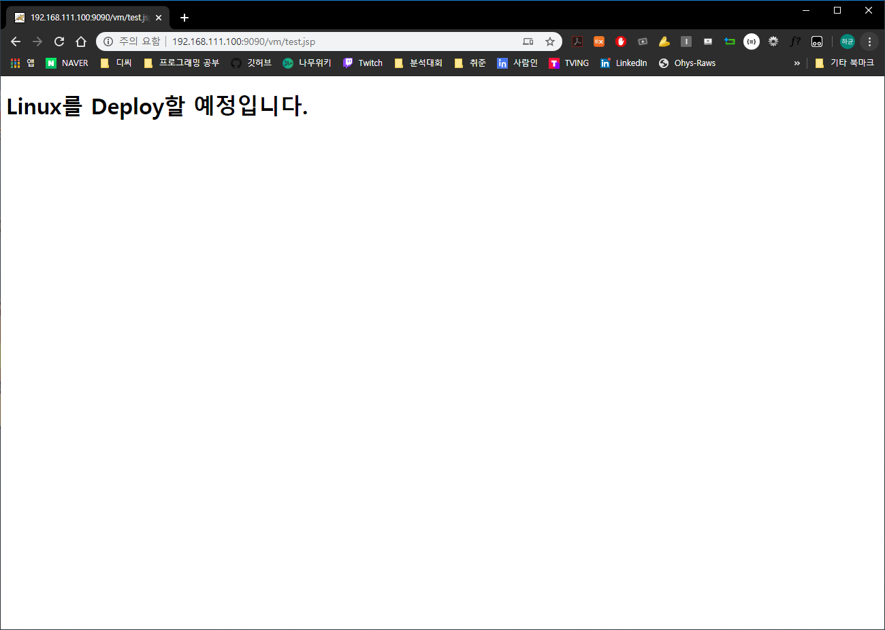
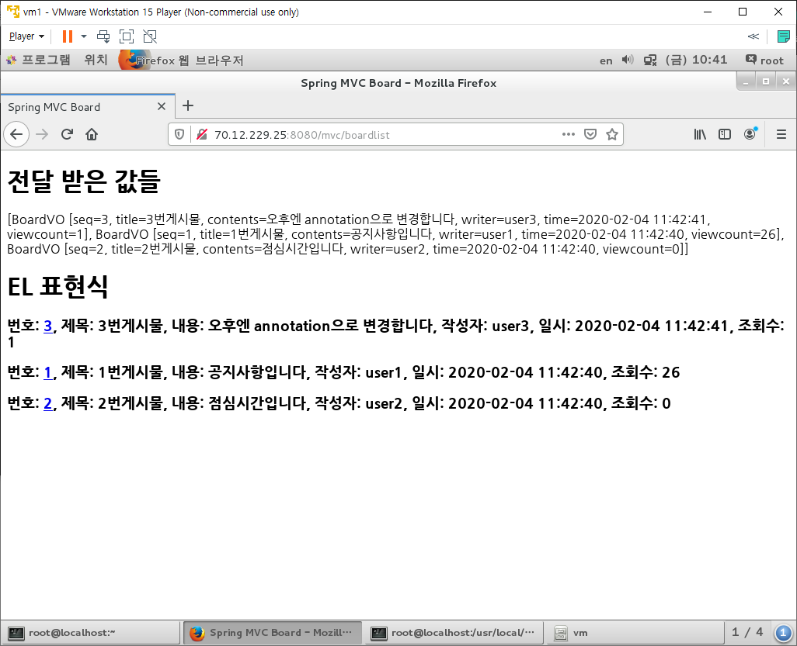

# Apache Tomcat

## Setting

* [Tomcat Download Site](https://tomcat.apache.org/download-90.cgi)로 진입하면 보안 연결 실패가 나타난다.

  * Firefox의 버전이 낮아서 생긴문제다.

    

  * Firefox의 버전을 먼저 올려준다.

    * [Firefox Download Site](https://www.mozilla.org/ko/firefox/new/)로 진입한 후 [고급설치방법 및 기타 플랫폼] - [Linux 64bit]를 클릭하여 설치파일을 다운로드 받는다.
    * 다운로드 받은 파일이 있는 경로에서 `tar xvf firefox-72.0.2.tar.bz2` 명령어를 입력하여 압축을 해제한다.
    * `/root`경로 밑에 설치하면 root계정만 사용이 가능하다. 그러므로 `/usr`경로로 폴더를 이동한다.
      * 앞으로 프로그램은 `/usr/local`에 설치한다.
      * `mv firefox /usr/local`
    * 사용하기 편하도록 링크를 만들어준다.
      * `ln -s /usr/local/firefox/firefox /usr/local/bin`

  * 터미널에서 `firefox`를 입력하여 웹브라우저를 실행한다.

    * 우측 상단의 작대기 세개 버튼을 클릭하여 메뉴창을 띄운다.

    * [Help] - [About Firefox]를 클릭하여 버전을 확인한다.

      

    * 터미널에서 `firefox -version`을 입력해봐도 버전을 확인할 수 있다.

  * 다시 Tomcat Download Site로 진입해본다.

    

    * 정상진입!

  * Firefox 실행시 Version등으로 인해서 Mozila Crash Report 문제가 발생한다면 다음과 같이 진행한다.
    * `/root/다운로드`에 있는 Firefox 압축파일을 압축해제한다
    * `/root/다운로드/firefox`로 압축이 해제됬는지 확인한다.
    * 터미널에서 `/root/다운로드/firefox/firefox`를 입력하여 실행해본다.

* 진입한 Tomcat Download Site에서 tar.gz파일을 다운로드 받는다.

  * 다운로드 폴더에 존재하는 압축파일을 해제한다.

    

  * 압축해제된 폴더를 이동한다

    * `mv /root/다운로드/tomcat9 /usr/local`

* Tomcat을 실행해본다.

  ` /usr/local/tomcat9/bin/startup.sh`

  * Tomcat started라는 문구가 나타나있다면 실행이 완료된 것이다.
  * Firefox에서 `localhost:8080`을 주소로 진입했을 때 Tomcat 고양이 창이 뜬다면 정상 실행된 것이다.

* 정상 실행된 것을 확인했다면 종료해본다.
  * `/usr/local/tomcat9/bin/shutdown.sh`
  * 다시 Firefox에서 `localhost:8080`으로 진입해보면 Tomcat창이 안뜨는 것을 볼 수 있다.

## Deploy

* Linux에서 벗어나서 Window에서 `192.168.111.100:8080`을 이용하여 접속해본다.

  * Host OS에서는 접속이 불가능하다.

    * Host OS에 설치된 Tomcat의 Port번호가 8080으로 중복되는 문제 1
    * Guest OS에서 컴퓨터 방화벽의 문제 2

  * Guest OS인 Linux에서 Tomcat의 Port번호를 변경해준다.

    * `gedit /usr/local/tomcat9/conf/server.xml`로 진입하여 Line 69에서 8080으로 되어있는 Port번호를 9090으로 변경해준다.

      

  * Tomcat을 재시작한다.

    * `/usr/local/tomcat9/bin/shutdown.sh`
    * `/usr/local/tomcat9/bin/start.sh`

  * 9090 Port번호 요청에 대한 컴퓨터 방화벽을 해제해야 한다.

    * `systemctl status firewalld` : `<active>` 상태 확인

    * `firewall-config`로 진입한다. (GUI로 보여주며, CUI는 firewall-cmd로 진입한다)

      

      * 좌측 상단의 설정을 영구적으로 변경한다.
      * public의 포트에 추가를 클릭하여 9090, tcp로 확인을 클릭한다.
      * 이후 옵션 - Firewall 다시 불러오기를 진행한다.
        * `systemctl restart firewalld`의 역할을 대신한다.

  * Host OS인 Window에서 192.168.111.100:9090으로 접속해본다.

    

    * 접속성공!

### Dynamic Web project

* Eclipse에서 vm이라는 프로젝트명으로 Dynamic Web Project를 만든다.

* WebContent 폴더 내에 test.jsp를 만들어 Body태그 내에 확인할 글귀 하나를 추가한다.

* Window와 Linux에서 폴더의 경로와 같은 것들이 다를 수 있다.

  * 이는 Eclipse에서 tomcat9 서버의 구조에 맞춰서 압축할 수 있다.

    * vm프로젝트에서 우클릭하여 Export - WAR File 클릭

    * war파일의 설치경로를 바탕화면으로 지정하고, 아래의 체크박스 전부 체크후 Finish

    * war파일을 Linux내부로 복사 붙여넣기

      

  * tomcat9의 webapps폴더로 war파일을 옮긴다.

    * `mv /root/다운로드/vm.war /usr/local/tomcat9/webapps`
    * Tomcat이 실행되어 있는 상태라면 war파일을 webapps폴더 내에 자동으로 압축을 해제한다.
    * Linux에서는 ContextPath가 폴더 명인 vm이 된다.

  * Host OS인 Windows에서 `http://192.168.111.100:9090/vm/test.jsp`로 진입해서 해당 JSP가 출력되는지 확인한다.

    

* 반대로 Windows에서 Tomcat이 실행중이라면 Linux에서도 접속할 수 있다.

  * Windows cmd창에서 ipconfig로 ip주소를 얻고, ip주소:Tomcat Port번호로 Linux에서 접속하면 된다.

    