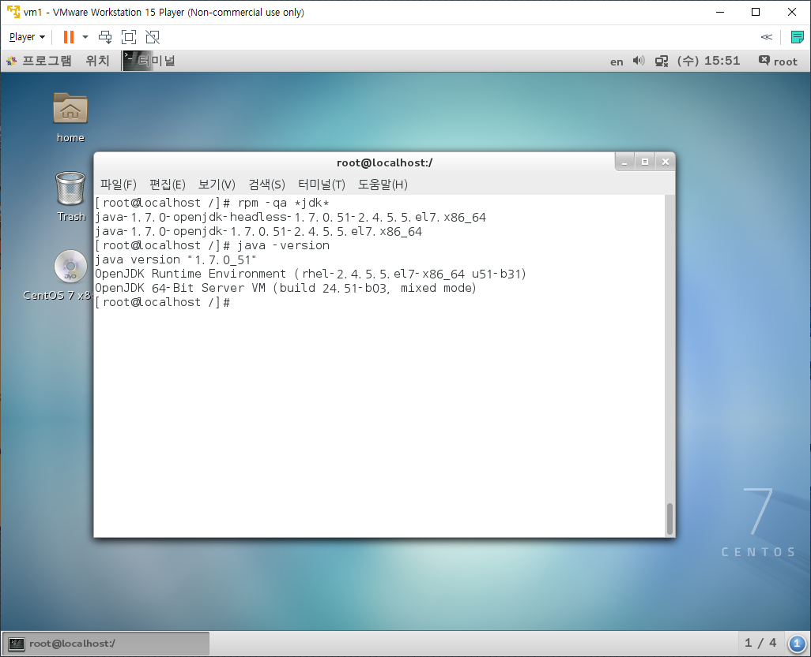

# JDK Linux

> Linux 설치시 openjdk 1.7이 기본으로 설치되어 있다.
>
> 기본으로 설치된 openjdk 1.7을 삭제하고, 새로운 버전을 설치한다.
>
> java.exe, javac.exe 두 파일을 환경변수 PATH에 등록해야한다.

* Hadoop에서 Java가 필요하기 때문에 Hadoop설치 이전에 이 과정을 진행해야 한다.

* 현재 Linux에 설치된 Java를 확인해본다.

  

* 설치된 jdk를 삭제한다.

  * `yum remove java`로 진행한다.

* [JDK Download](https://www.oracle.com/java/technologies/javase/javase-jdk8-downloads.html) 해당 사이트에서 `jdk-8u241-linux-x64.tar.gz`로 이름된 파일을 다운로드 받는다.

  * 해당파일을 윈도우에서 복사하여 VMware에서 붙여넣기를 진행하면된다.
  * 혹시 복사 붙여넣기가 안되면 다음과 같이 진행한다.
    * 실행중인 VMWare를 종료한 후 해당 Linux의 Edit Virtual Machine Setting로 진입한다.
    * Option탭의 Shared Folders에서 Folder Sharing을 Always enabled로 변경한 후 아래의 Add버튼을 클릭한다.
    * Next로 넘어가서 Host Path에 윈도우에서 넘기고자 하는 파일이 있는 폴더를 탐색하여 지정한다.
    * 이후 Read_Only에 추가적으로 체크한 후 종료한 후 Linux를 다시 실행한다.
    * 다시 윈도우에서 복사하여 Linux에 붙여넣기를 진행해본다.

* 다운로드 폴더로 복사한 JDK의 압축을 해제한다.

  * `tar xfvz jdk-8u241-linux-x64.tar.gz`

* 다운로드 폴더에서 `/usr/local`폴더로 JDK폴더를 이동한다.

  * `mv jdk1.8.0_241 /usr/local/jdk1.8`

* 환경변수 PATH를 등록한다.

  * `gedit /etc/profile`로 진입하여 파일의 마지막에 다음의 4문장을 추가한다.

    ```
    export JAVA_HOME=/usr/local/jdk1.8
    export PATH=$PATH:$JAVA_HOME/bin
    export JAVA_OPTS="-Dfile.encoding=UTF-8"
    export CLASSPATH="."
    ```

  * 설정파일을 수정했으면 이를 반영해야 한다.

    `source /etc/profile`

  * 이후 `java -version`을 입력했을 때 java의 버전이 보이면 된다.