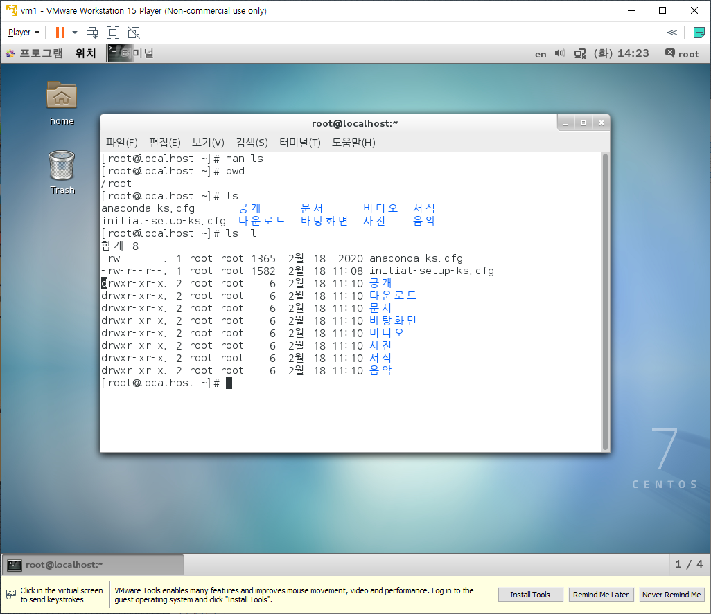
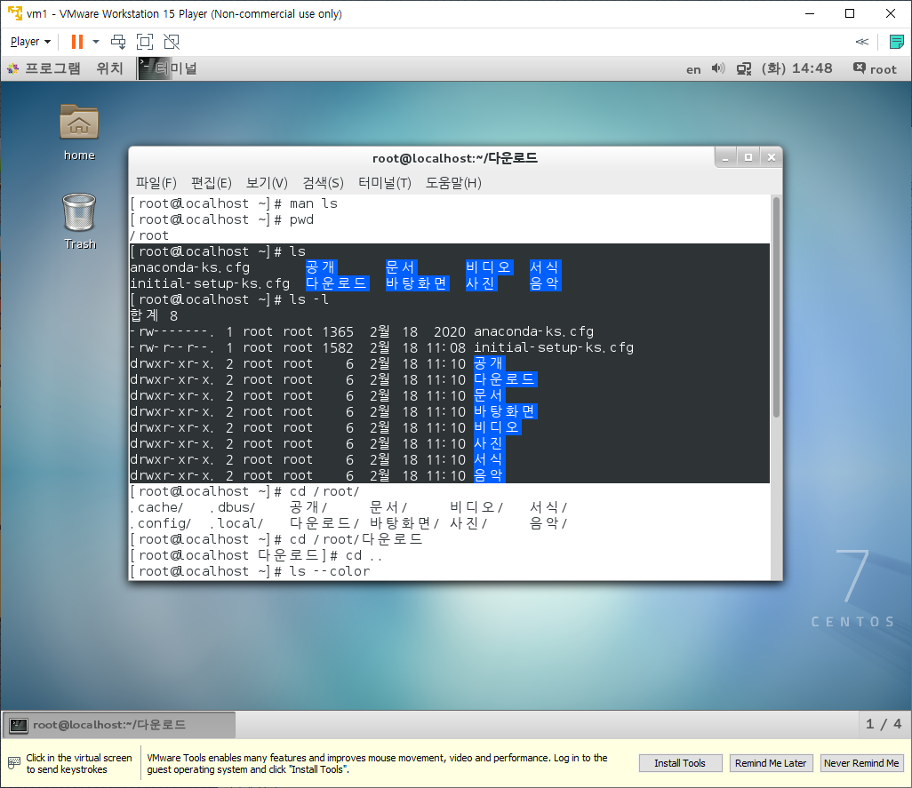
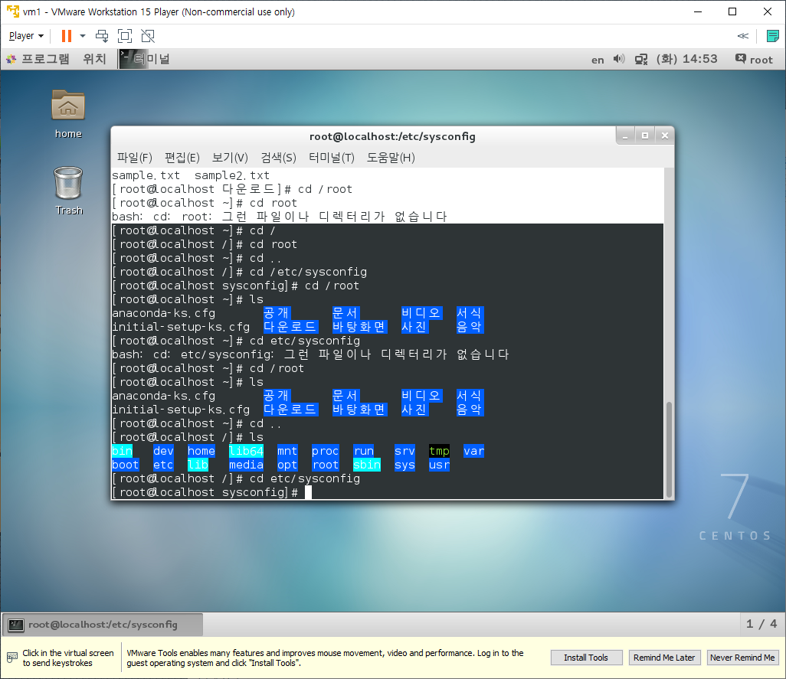
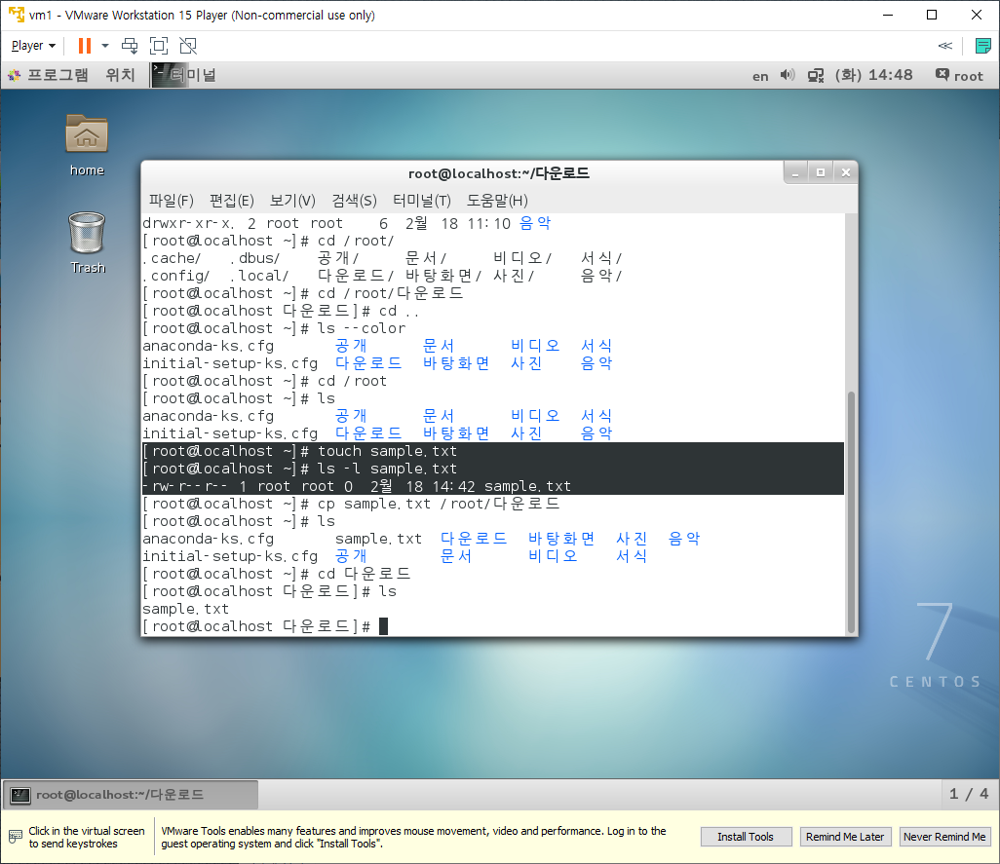
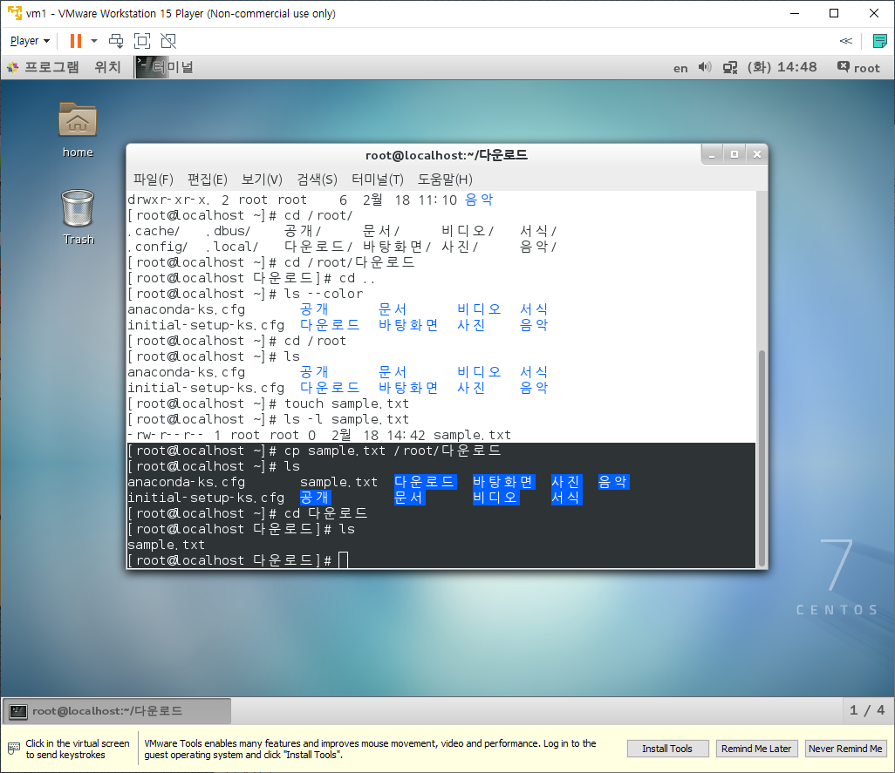
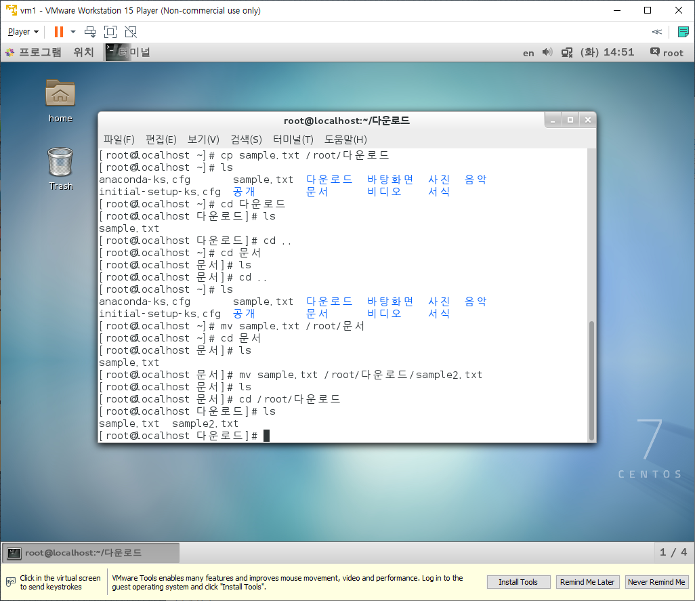

# Linux Command

* 버전 확인
  * `cat /etc/redhat-release`
* Directory
  * `/` : C드라이브 root
  * `/root` : root 계정 관련 저장하는 Directory
  * `/home/user` : 해당 user 계정 관련 저장하는 Directory
  * `/etc/xxxx` : 설정파일 저장하는 Directory
  * `/usr/...` : 모든 계정에서 사용가능한 파일들을 저장하는 Directory

## Power On and Off

### Power Off

> VMWare를 종료하는 것으로 대신하는 경우가 많다.

* `shutdown -P now` : 바로 종료
  * `shutdown -P +10` : 10분후 종료
  * `shutdown -P 22:00` : 오후 10시에 종료
  * `shutdown -c` : 예약된 shutdown 명령을 취소
  * `shutdown -k +15` : 사용자에게 15분 후에 종료된 메시지를 보냄, 실제 종료는 안됨
* `halt -p ` : 시스템 종료
* `init 0` : 시스템 종료
* `poweroff` : 시스템 종료

### Power On(Reboot)

* `shutdown -r now` : 바로 재시작
* `reboot` : 재시작, 가장 많이 사용
* `init 6` : 재시작
  * `init`은 RunLevel이라 하며 0~6까지의 값을 가질 수 있다.
    * 0 : Power Off, 종료 모드
    * 1 : Rescue, 복구 모드
    * 2 : Multi-User, 사용하지 않음
    * 3 : Multi-User, 텍스트 모드의 다중 사용자 모드
    * 4 : Multi-User, 사용하지 않음
    * 5 : Multi-User, 그래픽모드의 다중 사용자모드, 기본 설정
    * 6 : Reboot, 재시작

## 자동완성

* `history` : 사용했던 명령을 전부 본다.
  * `history -c` : 기억된 명령을 모두 삭제한다.
* tab을 사용하여 원하는 폴더나 파일명 등 자동완성을 진행한다.

## Editor

* `ls {filename}` : 파일 정보 확인

  * `ls -l` : 자세한 정보를 출력한다.

  * 가장 앞의 d가 있다면 directory이며 없다면 파일이다.

    

* `cat {filename}` : 파일 내용 출력(입력x)

* `gedit {filename}` : 파일 내용 출력(입력o)

* `vi {filename}` : 파일 내용 출력(입력o), 하지만 사용하기 불편할 수 있음

  * `i` : 입력모드 진입
  * `esc` : 입력모드 탈출
  * `q` : 파일 출력 탈출

## Manual

* `man {command}` : 명령어에 대한 도움말을 출력한다.

## ETC

* 윈도우키 + 스페이스바 : 한영 전환

## Basic Command

* `ls` : 현재 폴더 내의 파일들을 보여주는 명령어

  * `ls -l` : 각 파일의 자세한 정보까지 보여주는 기능

  * `ls -a` : 숨겨진 파일까지 보여주는 기능

  * `ls {directory}` : directory 내부의 파일들을 보여주는 기능

  * `ls --color` : 파일의 속성에 따라 다른색으로 보여주는 기능

    

* `cd {directory}` : Change Directory, 위치를 directory로 이동하는 명령어

  * `{directory}`를 지정할 때, `/`로 시작하면 root directory에서 시작하며 `/`가 없이 시작한다면 현재 위치에서 해당 경로를 탐색하여 이동한다.

    * `/root`가 현재 경로 일 때, `cd /etc/sysconfig`로 하면 해당 위치로 이동한다.
    * `/root`가 현재 경로 일 때, `cd etc/sysconfig`로 하면 에러가 발생한다. root위치에는 etc라는 폴더가 없기 때문이다.

  * `cd ..` : 현재 위치에서 상위 폴더로 이동하는 기능

  * `cd /` : 최상위 경로인 `/`로 이동하는 기능 (directory가 /인 것임)

    

* `pwd` : 현재 directory의 전체 경로를 보여주는 명령어

* `touch` : 크기가 0인 파일을 만드는 명령어 (이미 만들어져 있다면 최종수정시간을 변경한다)

  * `touch sample.txt` : 크기가 0인 sample.txt라는 파일을 만든다.

  * `ls -l`을 사용하여 해당 파일의 크기를 확인한다.

    

* `cp` : 파일이나 directory를 복사하는 명령어 (사용자는 해당 파일의 읽기권한이 필요하다)

  * `cp sample.txt /root/다운로드` : 현재 폴더에 만들어진 sample.txt를 `/root/다운로드`경로에 복사한다

  * 각 경로에서 `ls`를 사용하여 확인해보면 두 경로 모두에서 sample.txt가 확인된다.

    

* `mv` : 파일이나 directory의 이름을 변경하거나 다른 directory로 옮길 때 사용한다.

  * `mv sample.txt /root/문서` : 현재 폴더에 만들어진 sample.txt를 `/root/문서`경로로 이동한다.

  * 각 경로에서 `ls`를 사용하여 확인한다.

  * `mv sample.txt /root/다운로드/sample2.txt` : 현재 폴더에 만들어진 sample.txt를 `/root/다운로드`경로로 이동하는데 파일명을 sample2.txt로 변경하며 이동한다.

    

* `mkdir`

* `rmdir`

* `cat`

* `head`, `tail`