# Linux Concept & Command

## Command

* 버전 확인
  * `cat /etc/redhat-release`
* Directory
  * `/` : C드라이브 root
  * `/root` : root 계정 관련 저장하는 Directory
  * `/home/user` : 해당 user 계정 관련 저장하는 Directory
  * `/etc/xxxx` : 설정파일 저장하는 Directory
  * `/usr/...` : 모든 계정에서 사용가능한 파일들을 저장하는 Directory

#### Power Off

> VMWare를 종료하는 것으로 대신하는 경우가 많다.

* `shutdown -P now` : 바로 종료
  * `shutdown -P +10` : 10분후 종료
  * `shutdown -P 22:00` : 오후 10시에 종료
  * `shutdown -c` : 예약된 shutdown 명령을 취소
  * `shutdown -k +15` : 사용자에게 15분 후에 종료된 메시지를 보냄, 실제 종료는 안됨
* `halt -p ` : 시스템 종료
* `init 0` : 시스템 종료
* `poweroff` : 시스템 종료

#### Power On(Reboot)

* `shutdown -r now` : 바로 재시작
* `reboot` : 재시작, 가장 많이 사용
* `init 6` : 재시작
  * `init`은 RunLevel이라 하며 0~6까지의 값을 가질 수 있다.
    * 0 : Power Off, 종료 모드
    * 1 : Rescue, 복구 모드
    * 2 : Multi-User, 사용하지 않음
    * 3 : Multi-User, 텍스트 모드의 다중 사용자 모드
    * 4 : Multi-User, 사용하지 않음
    * 5 : Multi-User, 그래픽모드의 다중 사용자모드, 기본 설정
    * 6 : Reboot, 재시작

#### 자동완성

* `history` : 사용했던 명령을 전부 본다.
  * `history -c` : 기억된 명령을 모두 삭제한다.
* tab을 사용하여 원하는 폴더나 파일명 등 자동완성을 진행한다.

### Editor

* `ls {filename}` : 파일 정보 확인

  * `ls -l` : 자세한 정보를 출력한다.

  * 가장 앞의 d가 있다면 directory이며 없다면 파일이다.

    

* `cat {filename}` : 파일 내용 출력(입력x)

* `gedit {filename}` : 파일 내용 출력(입력o)

* `vi {filename}` : 파일 내용 출력(입력o), 하지만 사용하기 불편할 수 있음

  * `i` : 입력모드 진입
  * `esc` : 입력모드 탈출
  * `q` : 파일 출력 탈출

#### Manual

* `man {command}` : 명령어에 대한 도움말을 출력한다.

#### ETC

* 윈도우키 + 스페이스바 : 한영 전환

### Basic Command

* `ls` : 현재 폴더 내의 파일들을 보여주는 명령어

  * `ls -l` : 각 파일의 자세한 정보까지 보여주는 기능

  * `ls -a` : 숨겨진 파일까지 보여주는 기능

  * `ls {directory}` : directory 내부의 파일들을 보여주는 기능

  * `ls --color` : 파일의 속성에 따라 다른색으로 보여주는 기능

    

* `cd {directory}` : Change Directory, 위치를 directory로 이동하는 명령어

  * `{directory}`를 지정할 때, `/`로 시작하면 root directory에서 시작하며 `/`가 없이 시작한다면 현재 위치에서 해당 경로를 탐색하여 이동한다.

    * `/root`가 현재 경로 일 때, `cd /etc/sysconfig`로 하면 해당 위치로 이동한다.
    * `/root`가 현재 경로 일 때, `cd etc/sysconfig`로 하면 에러가 발생한다. root위치에는 etc라는 폴더가 없기 때문이다.

  * `cd ..` : 현재 위치에서 상위 폴더로 이동하는 기능

  * `cd /` : 최상위 경로인 `/`로 이동하는 기능 (directory가 /인 것임)

    

* `pwd` : 현재 directory의 전체 경로를 보여주는 명령어

* `touch` : 크기가 0인 파일을 만드는 명령어 (이미 만들어져 있다면 최종수정시간을 변경한다)

  * `touch sample.txt` : 크기가 0인 sample.txt라는 파일을 만든다.

  * `ls -l`을 사용하여 해당 파일의 크기를 확인한다.

    

* `cp` : 파일이나 directory를 복사하는 명령어 (사용자는 해당 파일의 읽기권한이 필요하다)

  * `cp sample.txt /root/다운로드` : 현재 폴더에 만들어진 sample.txt를 `/root/다운로드`경로에 복사한다

  * 각 경로에서 `ls`를 사용하여 확인해보면 두 경로 모두에서 sample.txt가 확인된다.

    

* `mv` : 파일이나 directory의 이름을 변경하거나 다른 directory로 옮길 때 사용한다.

  * `mv sample.txt /root/문서` : 현재 폴더에 만들어진 sample.txt를 `/root/문서`경로로 이동한다.

  * 각 경로에서 `ls`를 사용하여 확인한다.

  * `mv sample.txt /root/다운로드/sample2.txt` : 현재 폴더에 만들어진 sample.txt를 `/root/다운로드`경로로 이동하는데 파일명을 sample2.txt로 변경하며 이동한다.

    

* `rm` : 파일 또는 Directory(하위 directory까지)를 삭제하는 명령어

  * `rm -f` : 확인하지 않고 강제로 삭제하는 기능 (Force의 약자)

    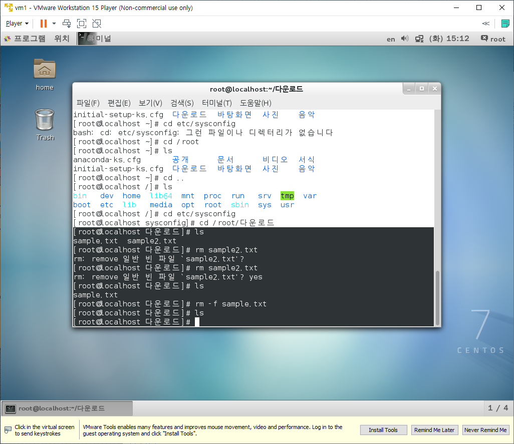

  * `rm -i` : 삭제할지 확인하는 메시지가 나오는 기능

  * `rm -r` : 해당 directory 삭제 (Recursive의 약자)

  * `rm -rf` : r과 f 옵션을 합친 것, directory와 하위 directory까지 전부 강제로 삭제

    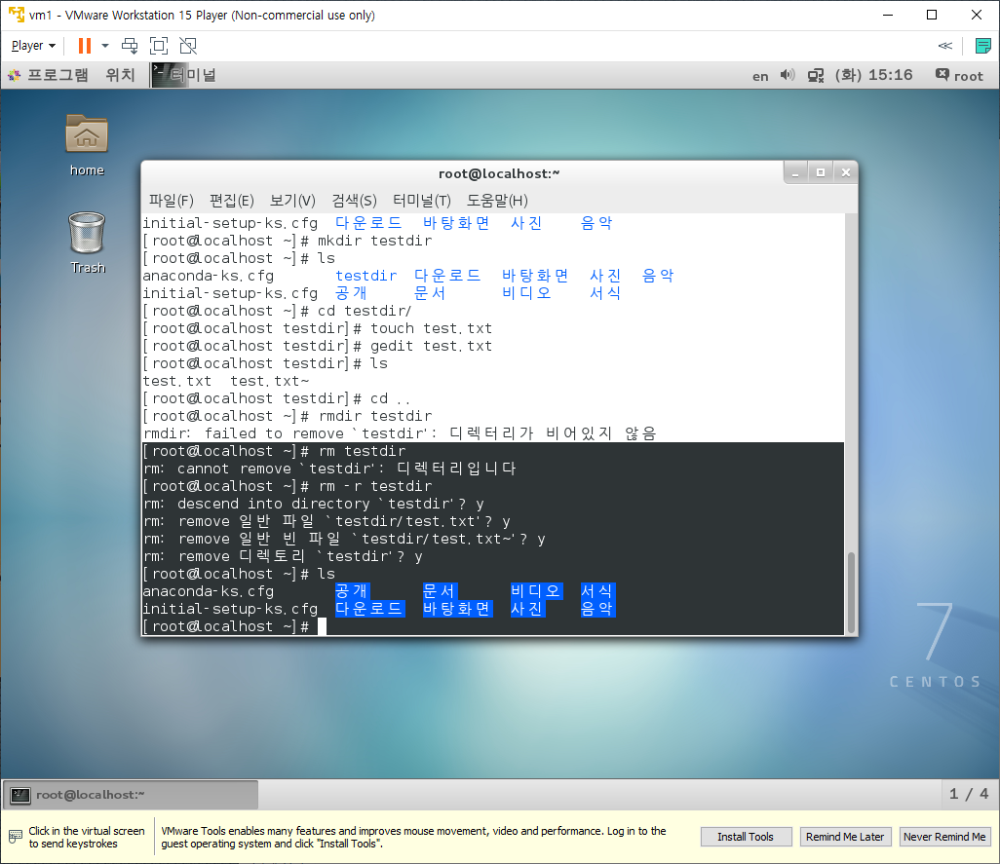

* `rmdir` : Directory를 삭제하는 명령어 (비어있는 Directory만 삭제가능)

  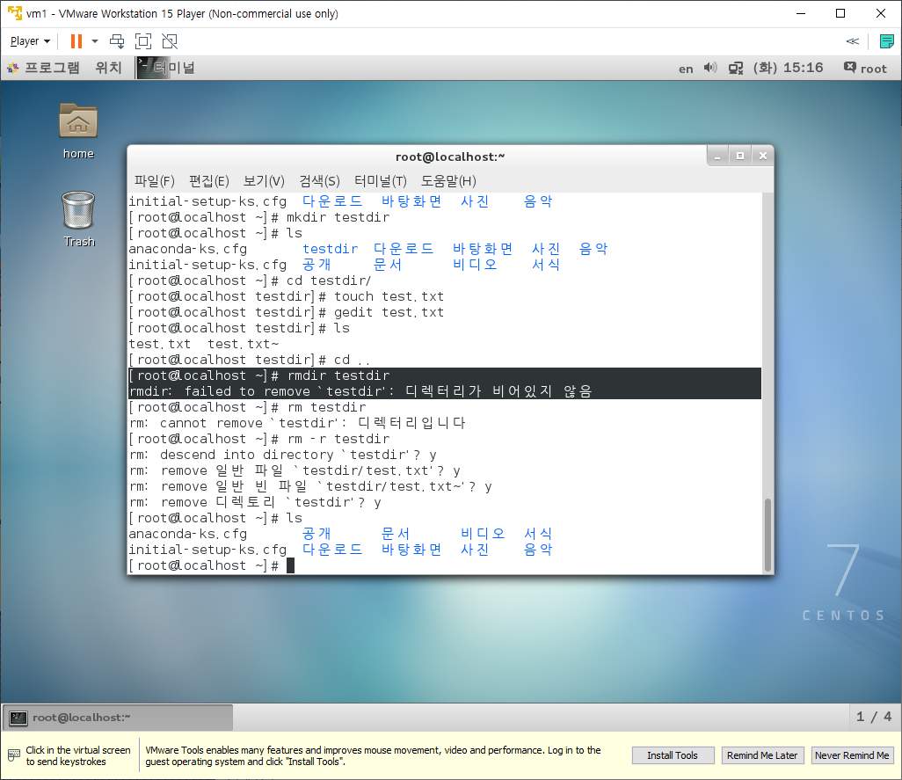

* `mkdir` : Directory를 생성하는 명령어

  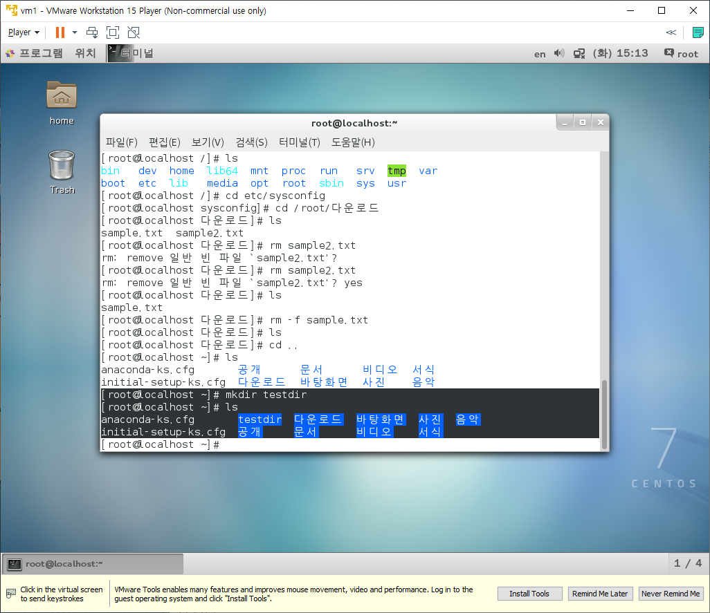

* `cat` : 파일의 내용을 출력하여 보여주는 명령어

  * `cat {filename}`

    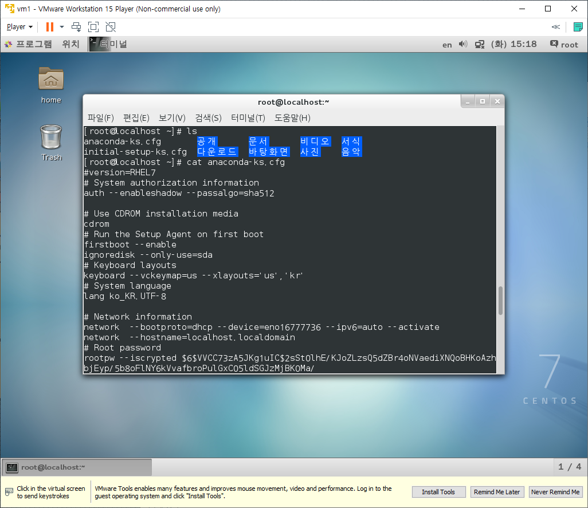

  * `cat file1 file2 > file3` : file1, file2의 내용을 붙여서 출력하고 그 내용을 file3의 기존 내용을 삭제하고 file3에 넣는 기능

    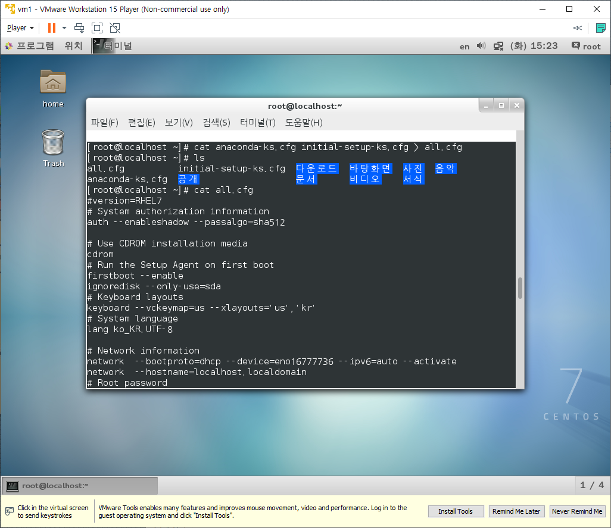

  * `cat file1 file2 >> file3` : > 와 다른점은 기존 내용을 삭제하지 않는다는 점이다.

    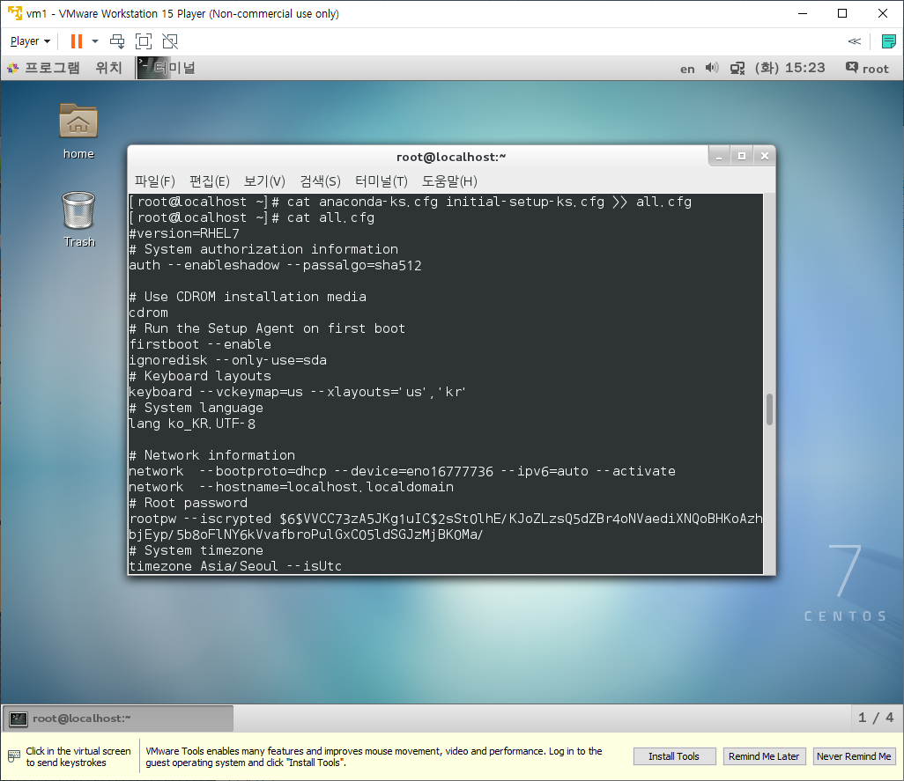

    * 파일이 길어서 한번에 살펴볼 순 없지만 차근차근 스크롤 내리면서 살펴보면 해당 기능을 수행했다는 것을 알 수 있다.

* `head` : 파일의 첫행부터 시작하여 10개 행을 출력하는 명령어

  * `head -3` : 3개 행을 출력하는 기능

    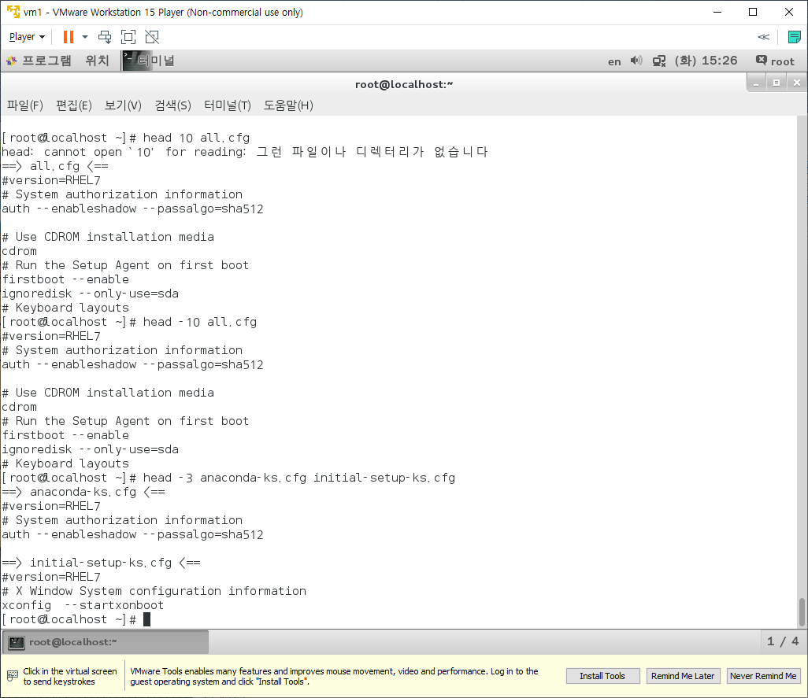

  * `tail -5` : 마지막 5개 행만 출력하는 기능

    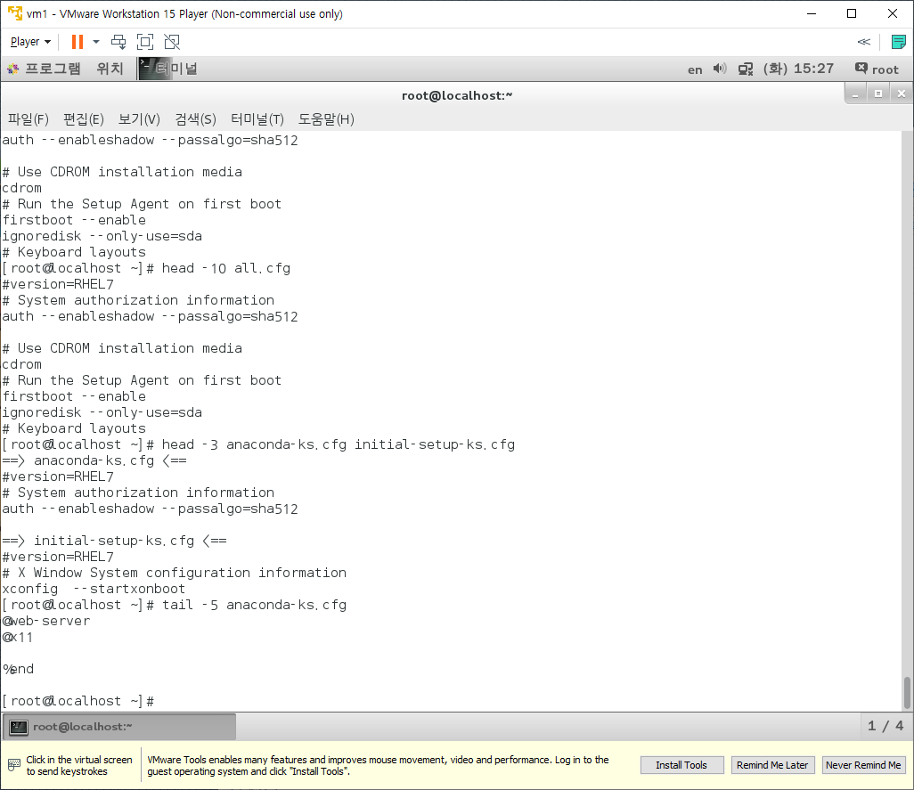

* `more` : 텍스트 형식으로 작성된 파일을 페이지 단위로 화면에 출력하는 명령어

  * `more +100` : 100행부터 출력하는 기능

* `less` : `more`와 비슷하지만 확장된 기능을 가진 명령어
  
* Page Up, Page Down키를 사용할 수 있다.
  
* `file` : 어떤 종류의 파일인지 표시해주는 명령어

* `clear` : 터미널 화면을 깨끗하게 지워주는 명령어
  * history를 지워주는 것이 아니라 보는 부분만 깨끗하게 해준다.
  * 스크롤을 위로 올리면 기록은 그대로 남아있다.
  
* `whoami` : 현재 접속한 계정이 어떤 계정인지 알려주는 명령어

* `su` : 다른 계정으로 접속할 수 있는 명령어

  * `su - centos` : centos계정으로 계정을 변경한다.
  * root계정에서 진입하면 비밀번호를 입력할 필요가없다.

## Concept

### 사용자 관리와 파일 속성

#### 파일관리

* `ls -l`로 나오는 파일 속성에 대해 살펴본다.

  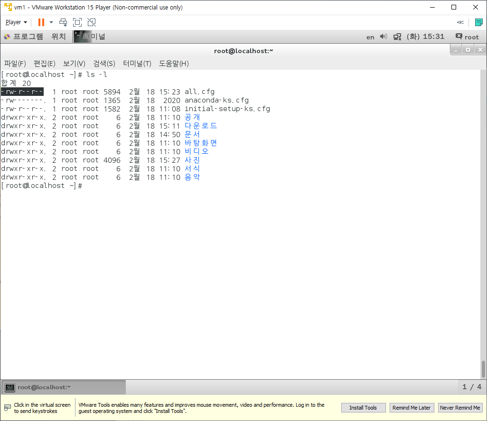

  * **파일유형, 파일 권한, 링크 수, 파일 소유자 이름, 파일 소유 그룹이름, 파일 크기, 변경일자, 이름**으로 구성되어 있다.
  * 맨 앞의 -한칸 파일유형을 의미한다.
    * `-` : 일반적인 파일
    * `d` : directory
    * `b` : 블록 디바이스
    * `c` : 문자 디바이스
    * `l` : 링크
  * 이후는 3칸씩 나누어 파일권한을 의미하며 rwx 혹은 각 위치에 -가 오며 r은 read를 w은 write를 x는 execute를 의미한다.
    * read는 읽기 권한, write는 쓰기 권한, execute는 실행파일 이라는 의미다.
  * 파일권한을 3칸씩 나누었을 때 총 3구역이 나온다
    * 첫번째 구역은 root계정에 대한 권한이다.
    * 두번째 구역은 root계정과 같은 그룹의 사용자에 대한 권한이다.
    * 세번째 구역은 root계정과 다른 그룹의 사용자에 대한 권한이다.
  * 이는 `chmod`명령어를 통해 변경이 가능하다.
    * `chmod 000 all.cfg`과 같이 세 숫자와 대상 디렉토리 혹은 파일을 지정한다.
      * 각 숫자가 위에서 언급한 각 구역에 대한 권한 설정을 의미한다.
      * r은 4, w은 2, x는 1로 구역의 숫자는 각 수를 더한 값으로 설정된다.
  * `chown` 명령어를 통해 파일 소유권을 다른 사용자 계정 또는 그룹으로 변경해줄 수 있다.
    * `chown 새로운사용자이름(.새로운그룹이름) 파일이름`의 형식으로 사용한다.
    * `chgroup 새로운그룹이름 파일이름`을 통해 사용자 그룹만 변경할 수 있다.

##### 링크

* `ln 원본 링크이름`

  * `-s` : 심볼릭 링크

  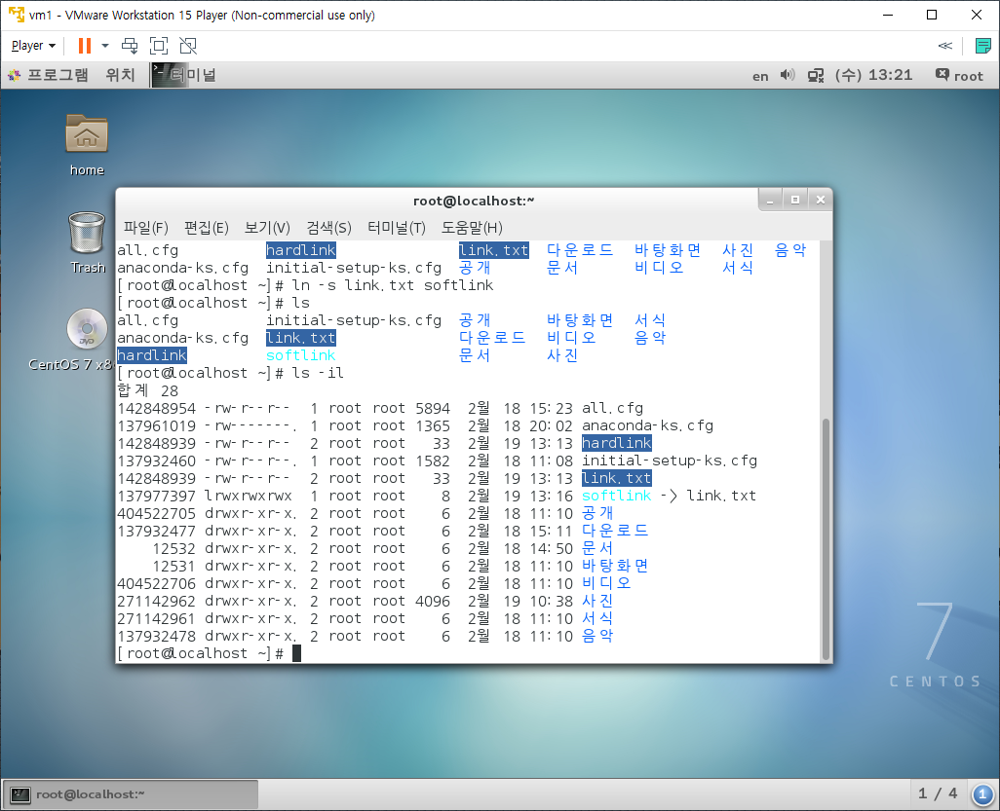

* 하드링크

  > 원본 파일의 사본을 만드는 느낌

  * inode가 원본파일과 동일하다
  * Data블록에 같은 원본파일 데이터를 사용하기 때문에 크기가 동일하다
  * 원본파일을 변경하면 하드링크도 같이 변경한다.
  * 원본파일과 같은 권한을 가진다.
  * 원본파일의 정보가 변경되면 변경된 정보를 가지고 간다.(이름 변경 등)
  * 원본 파일이 삭제되도 하드링크는 남아서 정보를 가지고 있다.

* 심볼릭 링크

  > 원본파일과 연결된 링크를 만드는 느낌

  * inode가 원본파일과 다르다
  * 별도의 원본파일포인터를 가지기 때문에 크기가 다르다.
  * 원본파일을 변경하면 소프트링크도 같이 변경한다.
  * 원본파일과 달리 모든 권한을 가진다.
  * 원본파일의 이름이 변경되면 변경된 정보를 가져가지 못해 이전의 이름을 링크한다.
  * 원본 파일이 삭제되면 링크의 역할을 못한다.

#### 사용자 관리

* `gedit /etc/passwd`에서 나오는 파일에 대해 살펴본다.

  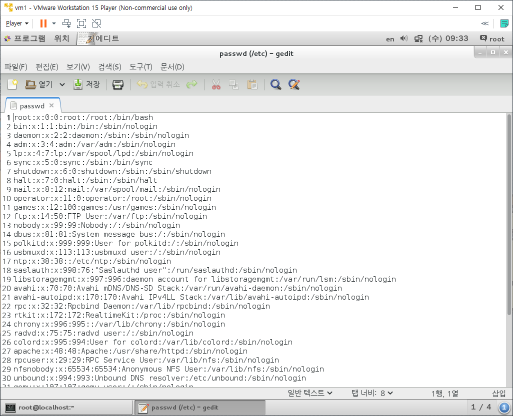

  * 계정에 대해 살펴볼 수 있다.
  * **사용자이름:암호:사용자ID:사용자가 소속된그룹ID:전체이름:홈디렉토리:기본셸**로 구성되어있다.
  * 암호는 `/etc/shadow`파일에 저장되어 있다는 의미로 X로 표시되어 있다.

* `gedit /etc/shadow`를 살펴보면 각 계정의 암호를 알 수 있다.

  * 다만, 설정한 암호를 바로 볼수 있는것이 아니라 암호화 되어있어서 암호가 있다는 것만 알 수 있다.
  * `!`로 되어있는 것은 암호가 없는 계정을 의미한다.

* `gedit /etc/group`은 사용자 계정이 속해있는 사용자 그룹을 살펴볼 수 있다.

  * 사용자 그룹은 보통 사용자 계정을 만들때 계정명과 같은 이름으로 생성된다.
  * 그룹을 변경해서 묶어주면 그룹별로 권한을 한번에 지정할 수 있어 편리하다.
  * **그룹이름:비밀번호:그룹ID:그룹에속한사용자이름**으로 구성되어 있다.

* 사용자 생성과 그룹 변경은 root계정에서만 가능하다.

  * 사용자 생성 : `useradd testuser1`
    * `-u` : userID 지정
    * `-g` : 사용자그룹 지정가능
    * `-d` : home directory 지정가능
    * `-s` : 기본 셸 지정가능
  * 비밀번호 지정 : `passwd testuser1`
  * 사용자 그룹 변경 : `usermod -g root testuser1`
    * 사용자 속성을 변경하는 `usermod`이며 옵션은 `useradd`와 동일하다.
  * 사용자 삭제 : `userdel testuser1`
    * `userdel -r testuser1`을 이용하여 directory도 삭제해줘야한다.
    * 디렉토리가 남아있다면 `useradd`로 같은 계정이 생성되지않는다.
  * 사용자 그룹 삭제 : `groupdel testuser1`

* `yum -y install system-config-users`

  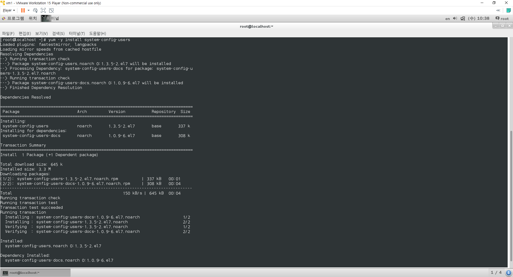

  * 위에서 설치한 `system-config-users`는 사용자 관리를 편하게 해주는 패키지이다.
  * `yum`은 이후에 배울 패키지를 쉽게 다운로드 받을 수 있는 명령어다.
  * `-y` 옵션은 y/n을 선택하는 경우 y를 입력해서 무조건 설치하겠다는 뜻이다.

#### 파일 설치

##### RPM

* `*.rpm` 파일에 대해 설치/삭제/설치정보확인을 진행한다.
* `rpm -Uvh *.rpm`
  * `U` : 신규 / 업그레이드
  * `v` : 설치 과정 출력
  * `h` : ???
* `rpm -e *` : 패키지 삭제
* `rpm -qa *jdk*` : 설치된 프로그램 조회
* `rpm -qip *.rpm` : 미설치 프로그램 정보 조회(패키지 이름, 버전, url 다운로드..)

* 파일 위치 찾기
  * `which` : 환경 변수에 등록된 경로 상의 파일명
  * `whereis` : 실행파일, 소스, man 페이지 파일까지 검색한다.
  * `find` : 어떤 파일이라도 전부 탐색, 파일의 이름이나 권한으로 탐색할 수 있다.
    * `-name`
    * `-user` : 소유자
    * `-newer` : 전/후
    * `-perm` : 허가권
    * `-size` : 크기
    * `-print` : 기본값
    * `-exec` : 외부명령 실행
  * `locate` : 파일목록 DB에서 검색해서 빠르지만 `updatedb`명령어를 실행해야 사용할 수 있다.

##### YUM

* `yum install 패키지파일명`
* /etc/yum.repos.d/CentOS-Base.repo에 기록된 URL을 이용하여 다운로드 받는다
* `yum clean all` : yum 저장소 초기화
* `yum remove` : 패키지 제거

#### 파일 압축과 묶기

##### 파일 압축

> 파일 1개만 압축

* `*.gz`
  * `gzip` 명령어를 사용하여 압축하거나 풀어준다.
* `*.bz2`
  * `bzip2` 명령어를 사용하여 압축하거나 풀어준다.

##### 파일 묶기

* `tar`
  * 확장명 tar로 묶음파일을 만들거나 묶음을 푼다.
  * 동작
    * `c` : 새로운 묶음을 만든다.
    * `x` : 묶인 파일을 푼다.
    * `t` : 묶음을 풀기 전에 묶인 경로를 보여준다.
    * `C` : 묶음을 풀 때 지정된 디렉토리에 압축을 푼다.
  * 옵션
    * `f` : 필수, 묶음파일 이름 지정, 생략하면 테이프로 보내진다.
    * `v` : visual의 의미로 파일이 묶이거나 풀리는 과정을 보여준다.
    * `J` : tar + xz, tar로 묶고 xz압축을 진행한다.
    * `z` : tar + gzip
    * `j` : tar + bzip2

### 시스템 설정

* `systemctl list-unit-files`
* `systemctl list-unit-files | grep firewall`
  * `grep 문자열 파일` : 파일 내에 문자열이 존재하는지 찾는 명령어(파일이 아닌 ls처럼 파일이름들로도 가능하다)
  * `명령1 | 명령2` : 명령1의 결과물을 가지고 명령2를 수행

#### 날짜 설정

* `system-config-date`로 진입할 수 있다.
  * 이는 `yum -y install system-config-boot`로 설치해야 한다.
* 이를 사용하지 않고 Linux 우측 상단의 날짜표시를 눌러서 설정할 수 있다.
* `date`를 터미널에 입력하여 설정할 수 있다.
  * 아무 값도 추가하지 않으면 현재 날짜를 출력한다.
  * `date 011503002020` : 2020년 1월 15일 03시 00분으로 날짜를 조정한다.

#### 네트워크 설정

* `nmtui`를 통해 진입할 수 있다.

##### 네트워크 통신

> a(프로토콜) - b(프로토콜)
>
> web : http 프로토콜(고급수준)
>
> TCP/IP(저급수준) - IP중심으로 네트워크 연결

* http 프로토콜
  * Windows / Linux 이미 설치되어 있음
* Telnet
  * 원격으로 다른 컴퓨터에 접속할 수 있는 프로토콜
* SSH
  * Telnet보다 보안이 강화된 프로토콜
  * Hadoop에 대해 공부할 때 더 알아볼 예정
* `ping`
  * ping을 보내서 돌아오면 해당 IP와 정상적으로 통신이 된다는 의미로 사용하는 명령어
* `nslookup`
  * 접속하는 경로상에 모든 네트워크 주소를 보여주는 명령어
  * DNS(Domain Name Server)로 사용 가능함.

##### 명령어

* `ifconfig` : 네트워크 종류, IP등의 정보를 확인할 수 있는 명령어
* `nmtui` : GUI형태의 네트워크 설정 제공해주는 명령어
* `ifup/ifdown` : 해당 네트워크를 가동하거나 정지하는 명령어
* `systemctel start/stop/restart/status network` : 네트워크 설정을 변경한 후 시스템에 적용시키는 명령

##### 설정파일

* `/etc/sysconfig/network-scripts/ifcfg-enoxxxx`
  * 네트워크, 맥어드레스, IP, Gateway, DNS 저장 파일
* `/etc/resolv.conf`
  * DNS만 존재
  * DNS를 수정하거나 추가할 때 사용
* `/etc/hostname`
  * 도메인 수정

#### 방화벽 설정

* `firewall-config` 명령어를 통해 진입한다.
  * 외부에 서비스하려고 포트를 열어 줄 때 사용한다.

### CRON & AT

#### CRON

> 주기적으로 특정 작업을 자동 수행

* `gedit /etc/crontab`
  * **분 시 일 월 요일 사용자 실행명령**으로 구성되어있다.
    * ex) `00 05 1 * * root cp -r /home /backup`
      매월 1일 (요일 상관x) 새벽 5시 00분에 root권한으로 /home 디렉토리를 통째로 /backup디렉토리에 복사한다.

#### AT

> 특정 작업을 1회만 자동 수행

* `at now + 2minutes`
  * `at>`로 변경되며 이제 2분후 실행할 명령어를 입력하면 된다.
  * `at> tar cfJv /backup/at.tar.xz /home`를 입력한다.
  * `at>`에서 벗어나고싶다면 Ctrl + D를 눌러 벗어나면된다.