# Linux

## Setting

### Install CentOS

* [Download Site](http://archive.kernel.org/centos-vault/7.0.1406/isos/x86_64/)에 접속하여 CentOS-7.0-1406-x86_64-DVD.iso를 다운로드 받는다.

* VMware에서 vm1 - Edit Virtual Machine Settings를 선택한다.

  * CD/DVD로 이동하여 iso파일을 선택하고 다운로드받은 iso파일을 지정해준다.

    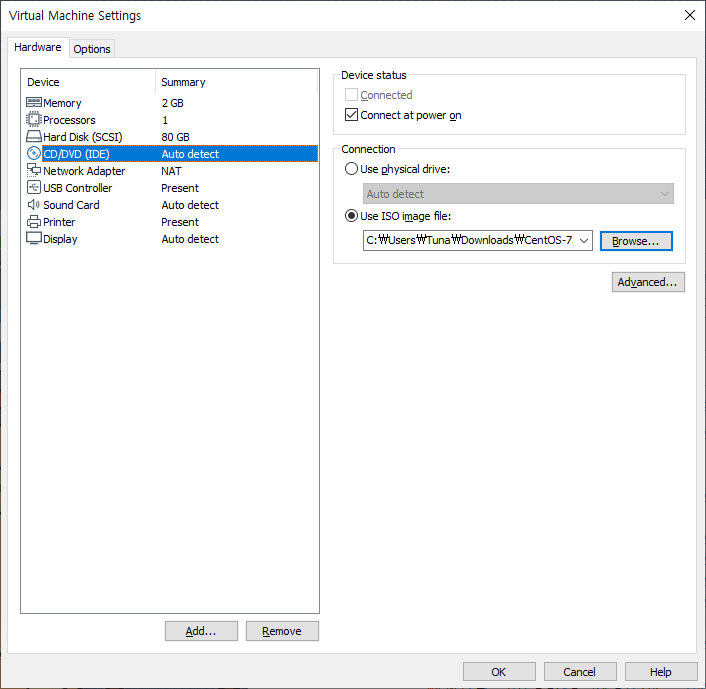

* 이제 vm1을 실행시킨다.

  * 화살표를 이용하여 Install CentOS를 선택한 후 Enter

  * 지역 설정을 한국으로 변경한 후 계속 진행

  * 키보드를 선택한 후 나오는 창에서 좌측 하단 +버튼 클릭후 영어(미국)을 추가하여 한국어보다 위로 이동

    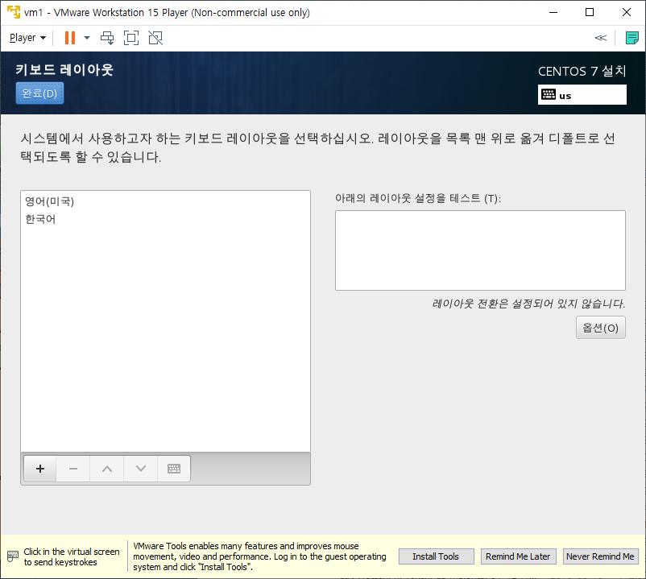

  * 소프트웨어 선택으로 진입한 후 개발 및 창조를 위한 워크스테이션 선택 후 완료

    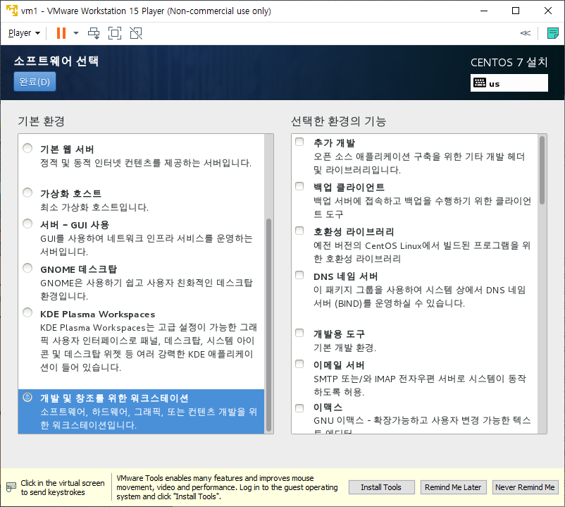

  * 네트워크 및 호스트 이름으로 진입하여 이더넷 우측상단에 끔을 클릭하여 켬으로 변경

    * 192.168.111.xxx로 ip주소가 표시되는 것을 확인

  * 설치대상으로 진입하여 로컬표준디스크에 81.92GB로 되어있는 디스크를 두번 클릭, 아래의 파티션 설정 부분에서 파티션을 설정합니다로 체크 변경

    * 81.92GB는 VMWare세팅에서 80기가로 설정했기 때문이다.

    * 이후 완료를 누르면 나오는 창에서 LVM으로 나와있는 지점에 클릭하여 표준파티션으로 변경

    * 아래의 +버튼을 누르면 나오는 마운트지점 추가에서 마운트지점을 swap으로 변경, 원하는 용량을 2g로 하여 하나 추가

    * 아래의 +버튼을 한번 더 클릭하여 마운트지점을 /로, 원하는용량은 입력하지 않고 추가

    * 다음과 같이 표시되어야 함

      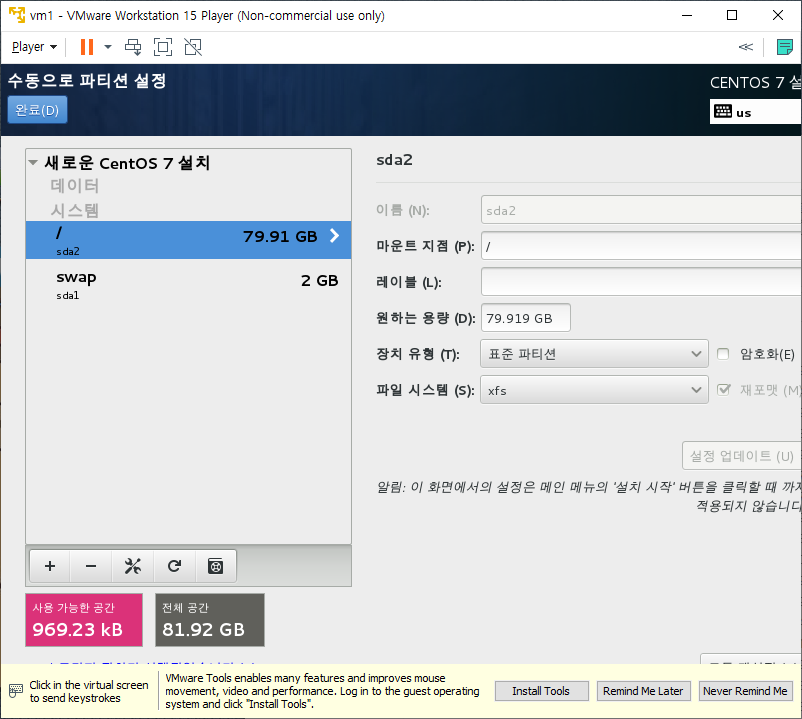

  * 설치시작!

  * Root암호는 간단한 테스트용이니 잊어버리지 않기위해 password로 설정

  * 사용자를 생성한다

    * 성명, 사용자이름, 암호 전부 centos로 입력한다.
    * 만약 암호를 설정하는 부분에서 사용자생성이 비활성화 되어있다면 재부팅 이후에 사용자를 생성하는 버튼이 다시 나오게 된다.
  
  * 설정완료를 누르면 이후 운영체제를 선택하는 부분이 나오는데 놔두면 넘어간다. 혹은 그대로 엔터를 클릭한다.
  
  * 라이센스 동의를 클릭하여 동의한다.
  
  * kdump에 관련된 부분이 나오는데 체크를 해제한 후 앞으로를 클릭한다.
  
    * 재부팅한다는 메시지가 나오면 예를 눌러 재부팅을 진행한다.
  
  * 이후 부팅되면 사용자 계정이 나오는데, 이 때 목록에 없습니다를 클릭한다.
  
    * 사용자 이름을 root, 암호를 password를 입력하여 진입한다.
  
  * 이후에 나오는 설정에서는 바꿀 부분이 거의없다. 다음을 누르며 진행하고, 입력기를 선택하는 부분에서 한국어를 선택한 후 계속해서 다음을 클릭하면 된다.
  
  * 설치가 완료됬다.
  
    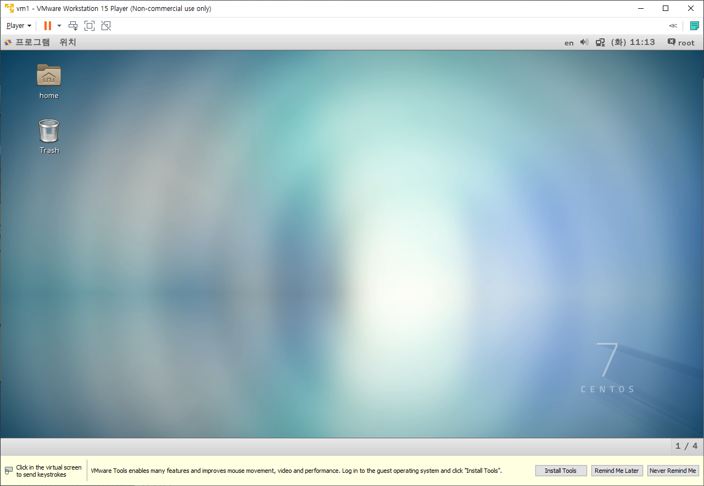
  
    * 우측 상단에 root로 로그인되어 있는것을 확인할 수 있다.
    * 해당 부분을 클릭하면 로그아웃, 컴퓨터 종료등을 진행할 수 있다.
  
* OS Setting을 진행한다.

  * 우측상단 root를 클릭하여 알림을 끈다.

  * root를 클릭했을 때 나오는 설정을 진입하여 하드웨어 - 디스플레이로 진입한다.

    * 해상도를 1024 * 768로 변경한 후 적용한다.

  * 설정에서 하드웨어 - 전원으로 진입한다.

    * 절전을 안함으로 변경한다.
    * 아무 행동도 없을 때 OS가 절전모드로 진입하는 것을 방지한다.

  * 프로그램 - 시스템 도구 - 소프트웨어로 진입한다.

    * 그래도 계속을 선택하여 소프트웨어로 진입하고 상단바에서 소프트웨어를 클릭하여 최신 패키지만과 전용 패키지만을 끈다.

      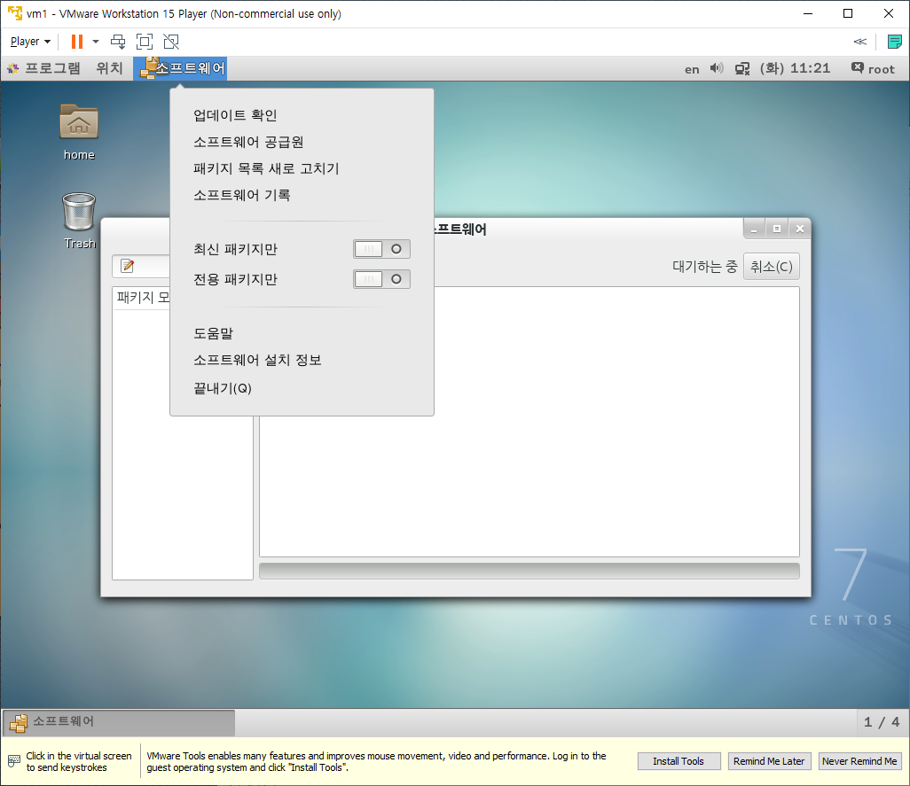

    * 소프트웨어 공급원으로 진입하여 자동업데이트를 하지않기로 변경한다.

      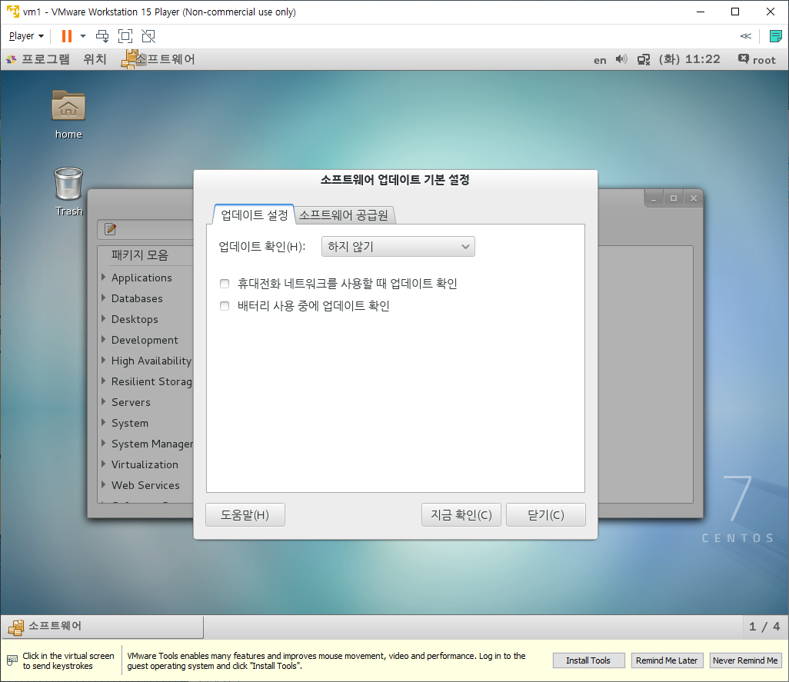

  * 프로그램 - 즐겨찾기 - 터미널로 진입한다.

    * root계정임을 확인하여야 한다. `#`표시가 나와있다면 root계정이며 `$`표시가 나와있으면 root가 아닌 다른계정임을 알 수 있다.

      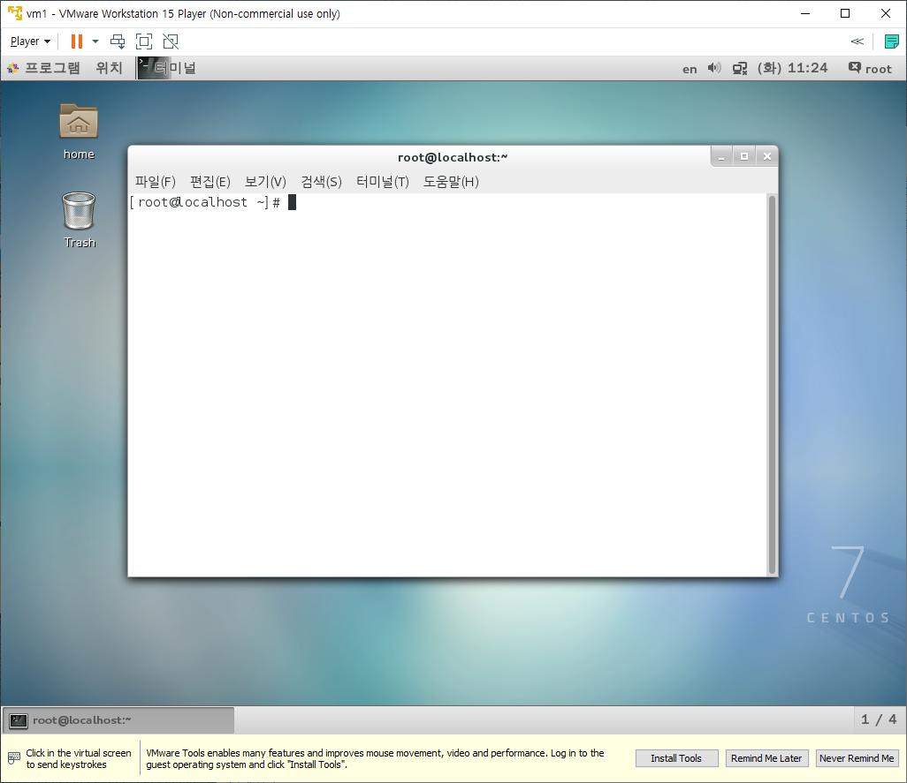

* YUM 명령을 사용할 때 업데이트된 소프트웨어가 설치되지않고 CentOS 7의 출시시점의 소프트웨어가 설치되도록 한다. 터미널을 오픈한 상태로 진행한다.

  * `cd /etc/yum.repos.d` : cd는 change directory로 해당 폴더로 경로를 이동하는 명령어다.

  * `ls` : ls는 현재 폴더 내의 어떤 파일들이 있는지 보여주는 명령어다.

  * `gedit Centos-Base.repo`

    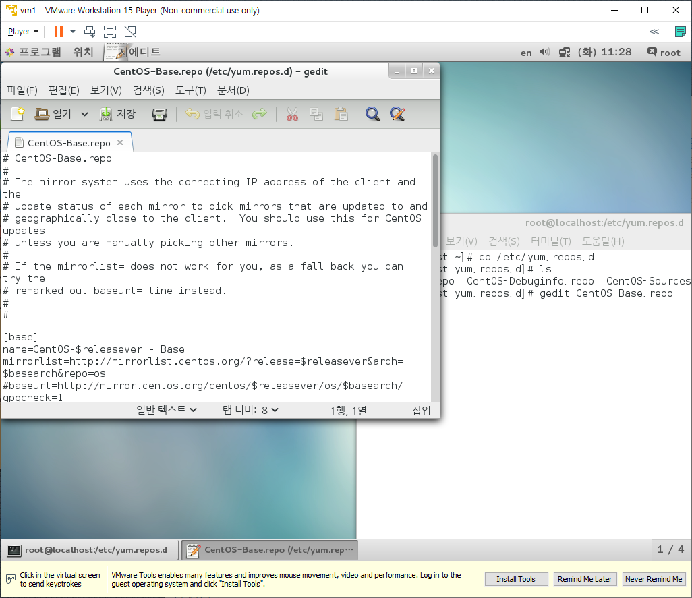

  * 위의 gedit창에서 [updates]를 찾아서 전부 주석처리한 후 창을 닫는다.

    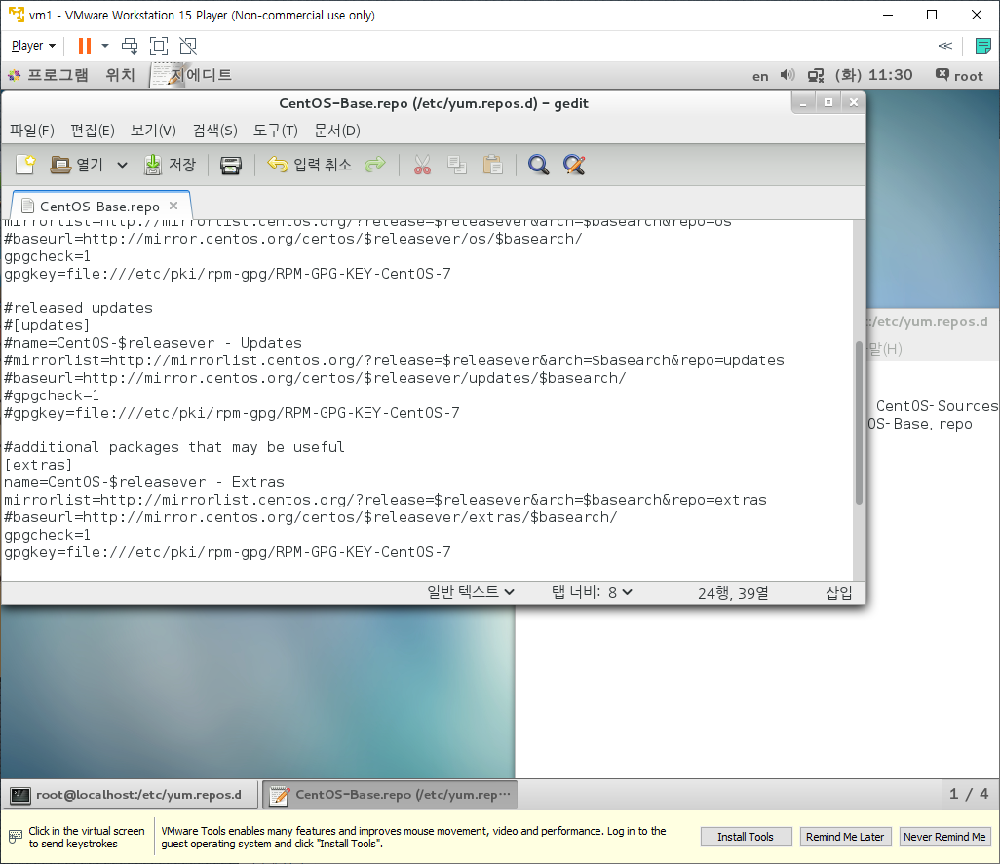

    * gedit창을 닫지않으면 터미널을 사용할 수 없다.

  * 위/아래 화살표를 사용하면 이전에 사용한 명령어를 불러올 수 있다. (DOS키라고 부른다.)

  * `gedit Centos-Sources.repo`로 진입하여 [updates-source]부분을 전부 주석처리한다.
  
  * 이후 다음의 명령어를 순서대로 입력한다.
    * `su -` : root계정으로 진입하는 명령어, 비밀번호를 물어보면 password를 입력한다.
    * `cd /etc/yum.repos.d` : 해당 폴더로 이동하는 명령어
    * `mv CentOS-Base.repo CentOS-Base.repo.bak` : 기존 Base.repo파일을 백업하는 명령어
    * `wget http://download.hanbit.co.kr/centos/7/CentOS-Base.repo` : 새 Base.repo를 다운로드 하는 명령어
    * `chmod 644 * ` : 권한을 변경하는 명령어, 다음에 자세히 배운다.
    * `rm -f *.repo~` : 조건에 맞는 파일을 삭제하는 명령어, 필요없는 파일을 삭제한다.
    * `ls` : 현재 폴더 내의 파일들을 보여주는 명령어, 5개 파일이 보이면 된다.
    * `yum clean all` : 저장소를 초기화하는 명령어
      * `yum clean all`에서 Existing lock ~~과 같은 Error가 발생하며 진행이 안된다면 다음 웹사이트를 참고하여 문제를 해결한다.
      * [Existing lock Error Solve](https://dang-dang12.tistory.com/22)
  
* ifconfig에서 나오는 ip주소를 살펴본다.

  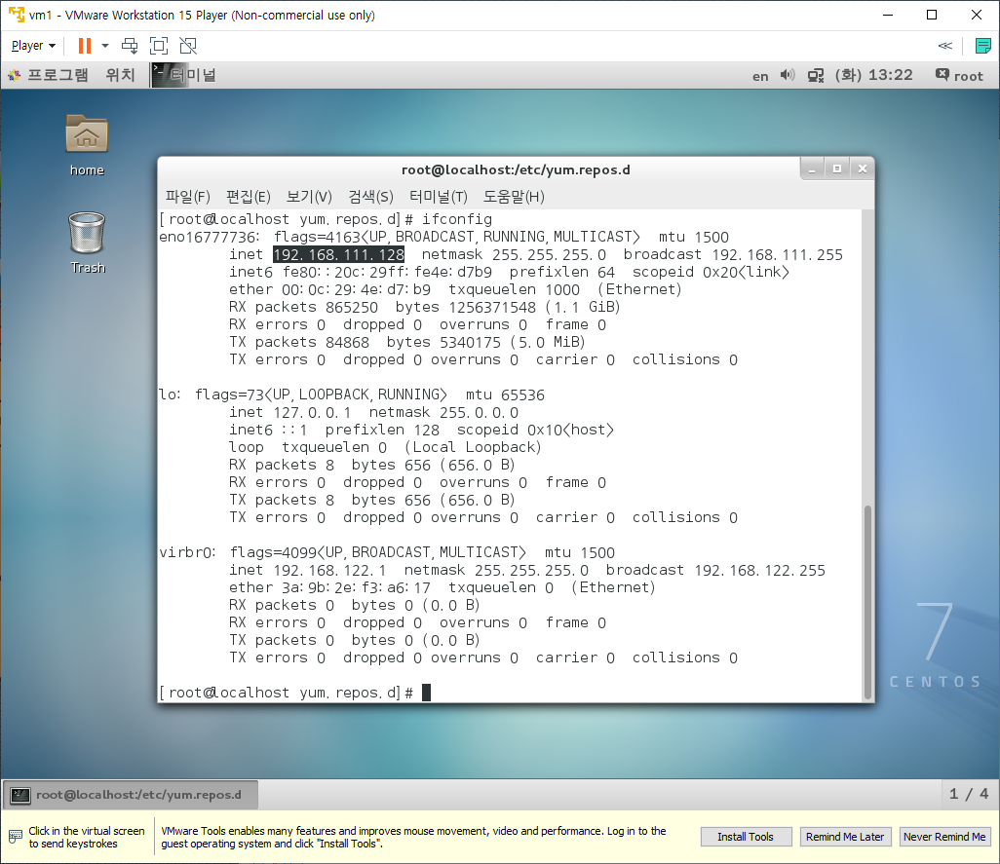

  * 해당 ip주소는 가상 컴퓨터를 껐다킬때마다 맨뒤의 128의 값이 변경된다.

  * 이를 고정시키기 위해서 다음과 같은 방법을 사용한다.

    * `cd /etc/sysconfig/network-scripts`

      * sysconfig와 같은 경우 sysco까지만 작성하고 Tab을 누르면 자동완성된다.
      * `pwd`를 입력하면 현재 디렉토리 경로를 보여준다.

    * `gedit ifcfg-eno16777736`

      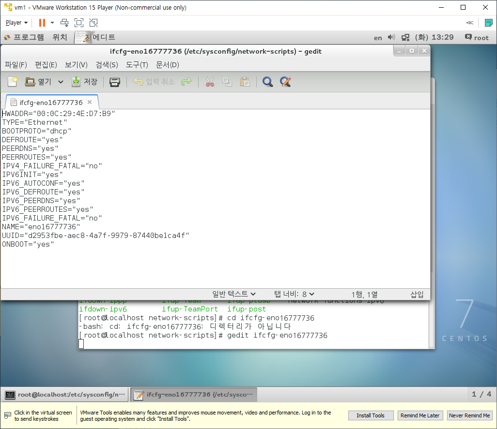

      * `BOOTPROTO`의 값을 `dhcp`에서 `none`으로 변경한다.
      * 다음의 4줄을 추가한다.
        * `IPADDR=192.168.111.100
          NETMASK=255.255.255.0
          GATEWAY=192.168.111.2
          DNS1=192.168.111.2`

    * `systemctl restart network` : 네트워크 재시작

    * 이후 `ifconfig`를 다시 입력해보면 ip주소가 변경된 것을 확인할 수 있다.

* 보안에 관련된 SELinux 기능을 끈다.

  * SELinux설정 파일을 편집한다.

    `gedit /etc/sysconfig/selinux`

  * SELINUX를 disabled로 변경한다.

    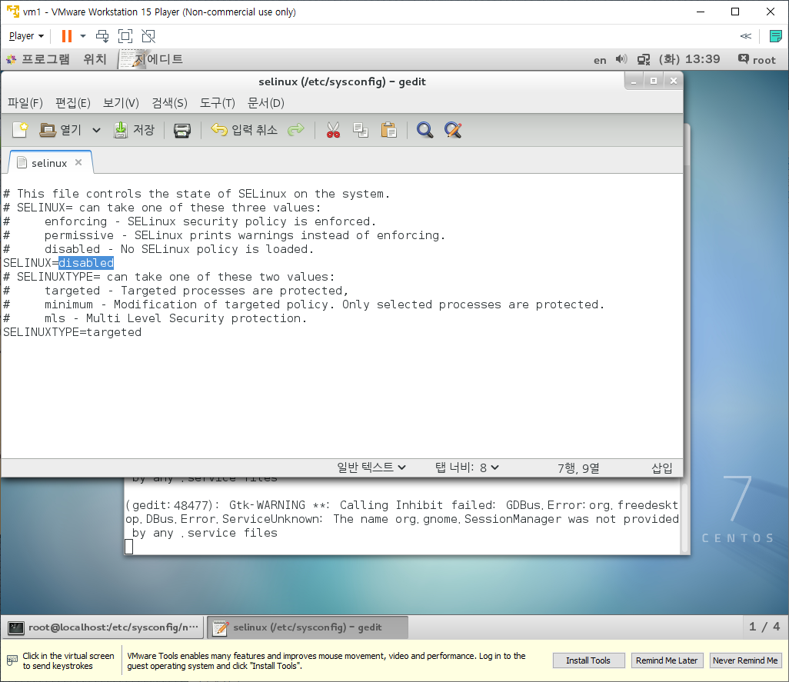