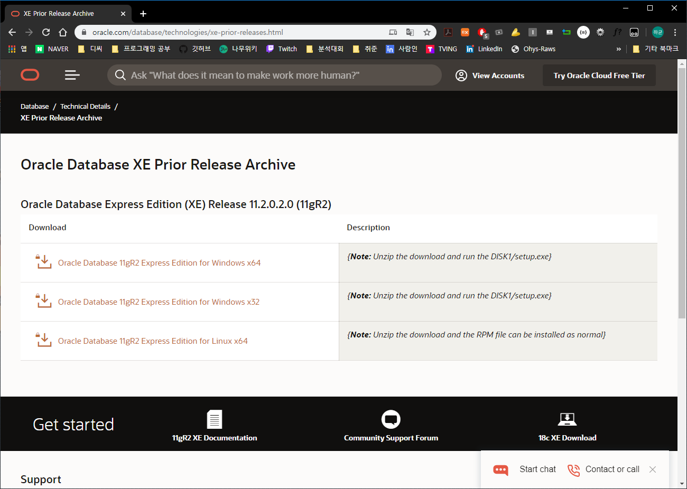
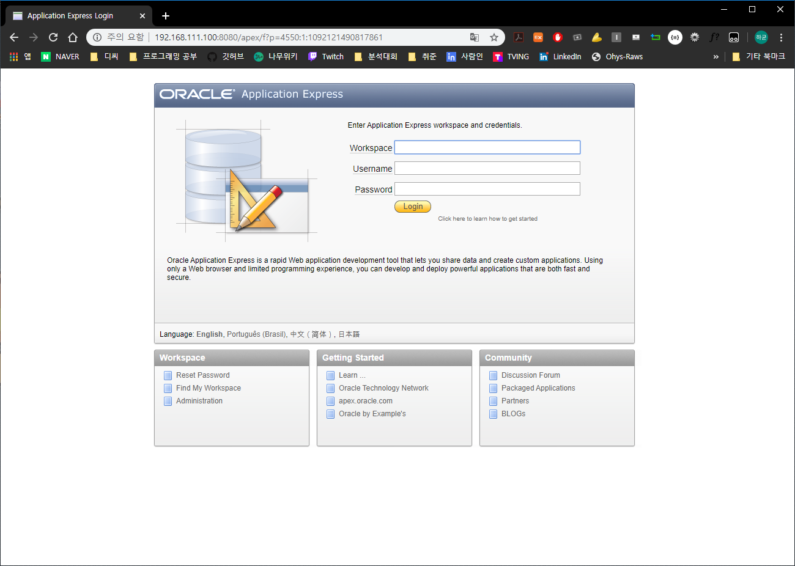
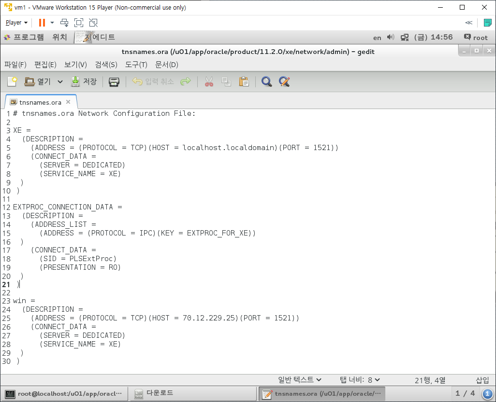

# Oracle Database

## Download

* [Download Site](https://www.oracle.com/database/technologies/xe-prior-releases.html)에서 Linux x64용을 다운로드받는다.

  

* 다운로드 받은 파일을 Linux 다운로드 폴더에 넣는다.
  * 다운로드 받은 파일을 압축 해제한다.
    * `.zip`파일이므로 `unzip` 명령어를 사용하여 압축을 해제한다.
    * `unzip oracle-xe-11.2.0-1.0.x86_64.rpm.zip`
  * Disk1이라는 폴더가 생성되었다면 정상적으로 압축이 해제된 것이다.

* Disk1폴더 내에 `.rpm`파일이 생성되어 있다.

  * `rpm -qip oracle-xe-11.2.0-1.0.x86_64.rpm`

    ```
    [root@localhost Disk1]# rpm -qip oracle-xe-11.2.0-1.0.x86_64.rpm 
    Name        : oracle-xe
    Version     : 11.2.0
    Release     : 1.0
    Architecture: x86_64
    Install Date: (not installed)
    Group       : Applications/OracleXE
    Size        : 591492962
    License     : Oracle Corporation
    Signature   : (none)
    Source RPM  : oracle-xe-11.2.0-1.0.src.rpm
    Build Date  : 
    Build Host  : dadvfg0711.us.oracle.com
    Relocations : (not relocatable)
    Packager    : Oracle <www.oracle.com>
    URL         : http://www.oracle.com
    Summary     : Oracle Database 11g Release 2 Express Edition
    Description :
    Oracle Database 11g Release 2 Express Edition
    ```

    * rpm의 정보를 확인해본 것이다.

    * 설치가 안되어있고 설치가 가능하다.

* 설치는 `rpm`이 아닌 `yum`을 활용하여 설치한다.

  * Linux Setting을 진행할 때 2GB로 설정한 임시메모리 구역 Swap이 2GB로는 부족하여 잠시 늘려주는 작업을 진행한다.

    * `free -m` 명령어를 사용하여 현재 차지하고 있는 공간을 확인한다.

      ```
      [root@localhost Disk1]# free -m
                   total       used       free     shared    buffers     cached
      Mem:          1987       1911         76          9          0        930
      -/+ buffers/cache:        981       1006
      Swap:         1999          0       1999
      ```

    * `swapon -s` 명령어를 사용하여 가상 메모리의 용량을 확인한다.

      ```
      [root@localhost Disk1]# swapon -s
      Filename				Type		Size	Used	Priority
      /dev/sda1               partition	2047996	808 	-1
      ```

    * 다음 네가지 명령어를 사용하여 4GB 상당의 가상메모리 공간을 확보한다.

      ```
      [root@localhost Disk1]# dd if=/dev/zero of=/swapfile bs=1024 count=4194304
      4194304+0 records in
      4194304+0 records out
      4294967296 bytes (4.3 GB) copied, 29.7357 s, 144 MB/s
      
      [root@localhost Disk1]# mkswap /swapfile
      Setting up swapspace version 1, size = 4194300 KiB
      no label, UUID=b6c54fab-a614-49ad-8653-dcd67513a4ce
      
      [root@localhost Disk1]# swapon /swapfile
      swapon: /swapfile: insecure permissions 0644, 0600 suggested.
      
      [root@localhost Disk1]# swapon -s
      Filename				Type		Size	Used	Priority
      /dev/sda1               partition	2047996	109304	-1
      /swapfile               file		4194300	0		-2
      ```

      * `dd`는 가상메모리용 파일을 생성하는 작업이다.
        * `if`는 input file로 지정한 파일을 입력대상으로 하며 `of`는 output file로 결과로 생성될 파일을 지정한다. `bs`는 한번에 읽을 바이트 수인데, 1024(1KB)로 지정했다. `count`는 반복할 횟수인데 4GB를 지정하기 위해 4096 * 1024인 4194304로 설정했다.
      * `mkswap`은 파일을 가상 메모리로 포맷하는 명령어다
      * `swapon  /swapfile`은 가상메모리를 활성화 시키는 명령어다.

  * 가상 메모리도 늘렸으니 `yum`을 활용하여 설치한다.

    * `yum -y localinstall oracle-xe-11.2.0-1.0.x86_64.rpm`
    * 가상메모리를 늘리지 않았다면 중간에 에러가 발생하여 설치가 안된다.

  * `rpm -qa`를 사용하여 설치가 되었는지 확인한다.

    ```
    [root@localhost Disk1]# rpm -qa | grep oracle
    oracle-xe-11.2.0-1.0.x86_64
    ```

    * 정상적으로 설치되어있다.

## Setting

* 설치가 완료되었으니 환경설정을 진행한다.

  * `service oracle-xe configure` 명령어로 시작한다.

    * 시스템 암호를 제외하고는 y가 기본설정이기에 엔터만 입력하면 y로 설정된다.

  * 웹서버 port번호를 8080으로 할지를 물어본다.

    ```
    [root@localhost Disk1]# service oracle-xe configure
    
    Oracle Database 11g Express Edition Configuration
    -------------------------------------------------
    This will configure on-boot properties of Oracle Database 11g Express 
    Edition.  The following questions will determine whether the database should 
    be starting upon system boot, the ports it will use, and the passwords that 
    will be used for database accounts.  Press <Enter> to accept the defaults. 
    Ctrl-C will abort.
    
    Specify the HTTP port that will be used for Oracle Application Express [8080]:
    ```

  * oracle DB에 대한 port번호를 1521로 할지 물어본다.

    ```
    Specify a port that will be used for the database listener [1521]:
    ```

  * 시스템 암호를 정하고 확인한다.

    ```
    Specify a password to be used for database accounts.  Note that the same
    password will be used for SYS and SYSTEM.  Oracle recommends the use of 
    different passwords for each database account.  This can be done after 
    initial configuration:
    Confirm the password:
    ```

    * 암호가 보이지 않아도 입력된 것이다.

  * Linux가 시작될 때 Oracle DB를 시작할지 물어본다.

    ```
    Do you want Oracle Database 11g Express Edition to be started on boot (y/n) [y]:
    ```

* 환경설정을 진행했으니 서비스를 시작해본다.

  ```
  [root@localhost Disk1]# /etc/init.d/oracle-xe start
  Starting oracle-xe (via systemctl):                        [  OK  ]
  ```

  * `start/stop/status` 옵션을 통하여 시작하거나 종료하고 상태를 확인할 수 있다.

* 오라클 환경을 설정해주는 스크립트를 실행한다.

  ```
  [root@localhost xe]# . /u01/app/oracle/product/11.2.0/xe/bin/oracle_env.sh
  ```

  * 에러만 발생하지 않는다면 정상적으로 작동한 것이다.
  * 가장 앞에 `. `이 있다.

* `gedit /etc/bashrc`로 진입한다.

  * 맨 마지막 줄에 다음의 코드를 추가한다.

    `. /u01/app/oracle/product/11.2.0/xe/bin/oracle_env.sh`

  * 이는 위에서 실행한 환경을 설정해주는 스크립트를 Linux를 재부팅한 후에도 적용되도록 해준다.

* 방화벽을 해제한다.

  * `firewall-config`로 진입한다.

  * 좌측 상단의 설정을 런타임에서 영구적으로 변경한다.

  * public으로 선택된 영역은 그대로 두고 우측의 포트로 진입하여 추가를 클릭한다.

  * tcp로 설정된 것은 그대로 두고 1521과 8080 각각 추가한다.

  * 옵션 - firewalld 다시 불러오기를 클릭한다.

  * Host OS인 Windows에서 크롬창 Url에 `192.168.111.100:8080/apex`를 입력한다.

    

    * 다음의 창이 뜨면 성공적으로 해제되었다.

* Linux에서 Windows의 Oracle DB로 접속해본다.

  * `gedit /u01/app/oracle/product/11.2.0/xe/network/admin`

    

    * win으로 시작되는 Line 23 ~ 30을 추가한다.
    * 이 때 win부분이 이름이 되므로 이것을 변경한 것이다.
    * 또한 HOST부분을 Host OS인 Windows의 IP주소로 변경한다.
      * 여기서 실습했을 때, 192.168.111.1로 다들 변경했다. (이더넷 VMnet8의 IP주소)
      * 노트북으로 진행했을 땐 위의 IP주소로하면 Error가 발생했고, 노트북 자체의 무선 LAN 어댑터 IP주소로 진행하니 정상적으로 연결되었다.

  * 이후 Oracle-xe를 껐다가 다시 켜야한다.

    * `/etc/init.d/oracle-xe stop`
    * `/etc/init.d/oracle-xe start`

  * sqlplus로 OracleDB로 진입한다.

    * 첫 진입시 user-name과 password는 system계정이나 hr계정으로 진입한다.

    * 이후 conn을 활용하여 scott/TIGER계정으로 진입하는데, 뒤에 @win을 붙여준다

      `conn scott/TIGER@win`