# Virtual Machine

* virtual box
* vmware

> 실제 컴퓨터의 OS인 WIndows를 Host OS라 부르며, 가상 컴퓨터의 OS인 Linux를 Guest OS라 부른다.

## Setting

* [VMWare Site]에서 다운로드 - 무료제품 다운로드에서 WorkStation Player를 선택한 후 Windows버전을 다운로드받는다.

  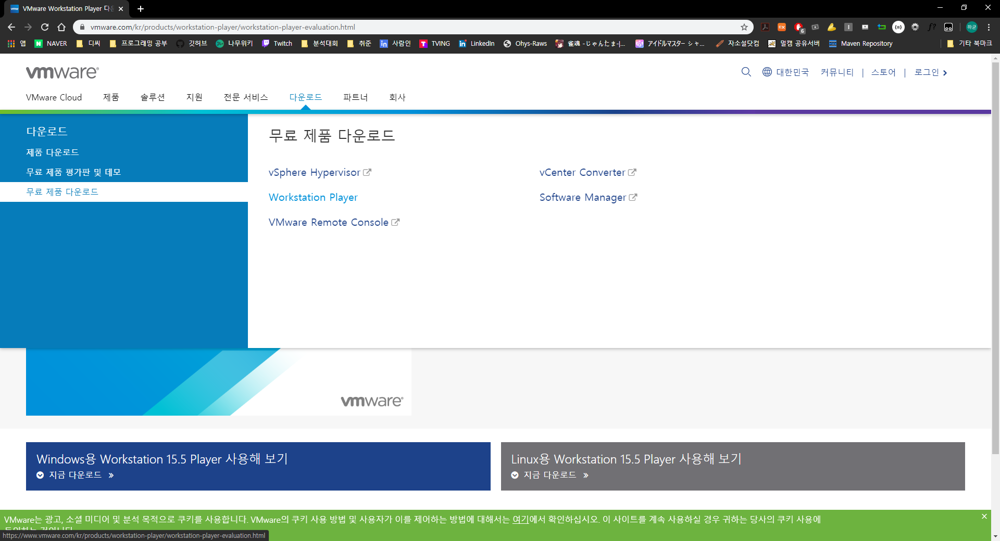

* 다운로드 받은 설치파일을 다운로드 받는다.

  * 중간에 경로를 설정해줄 때만 C드라이브의 VMware폴더로 변경해준다.
  * 나머지는 변경하지않고 Next를 누른후 다운로드 받는다.

* C드라이브에 hadoop폴더를 생성한다

* VMware Player를 실행한 후 Home에서 Create a New Virtual Machine을 선택한다.

  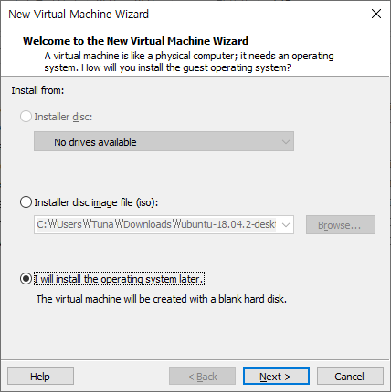

  * 맨 아래를 선택후 Next

* Linux를 설치할 것이며 CentOS를 설치할 것이므로 다음과 같이 선택한다.

  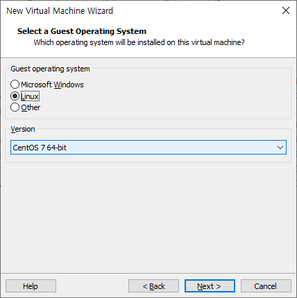

* 이름과 경로를 다음과 같이 변경한다.

  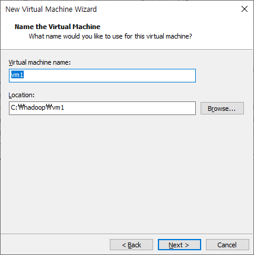

* 이후 디스크 사이즈가 20기가로 설정되어있는데 변경없이 Next

  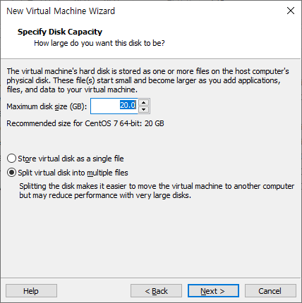

* 설정을 확인하고 끝낸다

  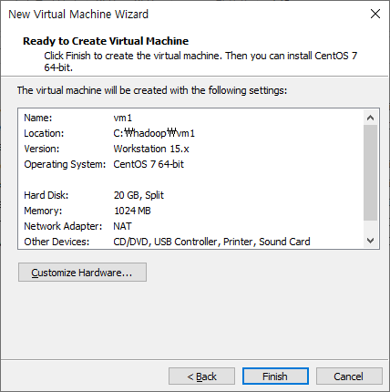

* Home아래에 표시된 vm1에서 우클릭하여 Setting으로 진입한다.

  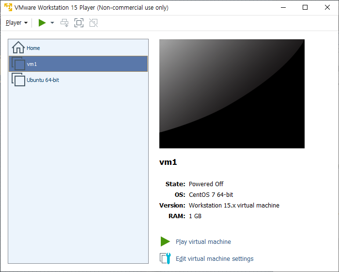

  * Ubuntu는 내가 이전에 사용했던 Linux이므로 무시한다.

* Setting으로 진입했을 때 나오는 메모리 크기에서 1기가는 너무 적으므로 2기가로 올려준다.

  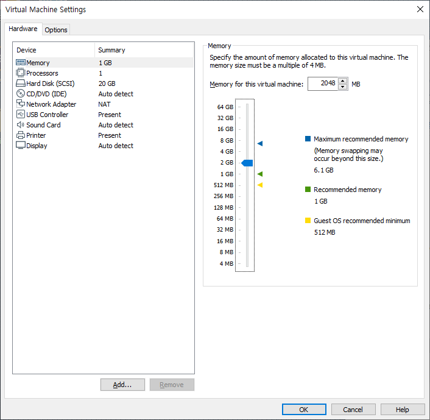

* Hard Disk는 SCSI의 20기가로 설정 되어있다. 이를 삭제후 80기가 하드디스크로 다시만들어 본다.

  * Hard Disk를 선택한 후 아래의 Remove를 선택하여 제거

  * Add를 누른 후 Hard Disk를 새로 추가한다.

  * Hard Disk의 Type을 선택해준다.

    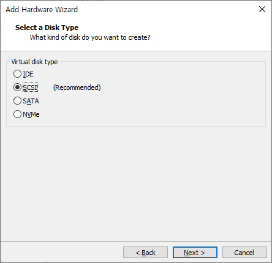

    * 서버로 사용할 것이라면 SCSI가 추천된다.

  * 변경 없이 Next를 한번 누른후 Disk의 크기를 정해주는 칸이 나오면 80기가로 변경한다.

  * 이후 변경없이 Next를 누르며 Hard Disk를 새로 생성한다.

  * Disk까지 변경했으면 OK를 눌러 Setting에서 벗어난다.

* 이제 VM1에서 Play를 누르면 운영체제가 없다는 표시와 함께 실행이 안된다.

* 이제 운영체제를 설치하기 위해 Power를 꺼본다.

  * 좌측 상단에 Player - Power로 진입하거나 일시정지 표시의 옆 버튼을 누르면 Power표시가 나온다.
  * Vmware자체의 창에서 우측 상단 X표시를 눌러도 Power Off가 보인다.
    * 이 때 같이 보이는 Suspend는 현재 작업중인 내용을 유지한 상태로 종료하는 것이다. 다음에 다시 Power를 킬시 그대로 표시된다.
  * 마우스가 사라졌거나 움직이지 않는다면 Ctrl + Alt를 눌러본다.
    * Host OS와 Guest OS 둘 중 어디에서 마우스가 사용될 것인지를 변경하는 단축키이다.
  
* Windows의 명령프롬프트(cmd)창에서 ipconfig로 vmnet8에 대한 ip를 확인해본다.

  * 이는 Windows와 가상환경간의 통신에 사용되는 ip이다.

  * 192.168.111.xxx와 같이 설정하며 이는 같은 네트워크 통신그룹이라고 명시한다.

  * 이와 같이 설정하기 위해 vmnetcfg.exe파일을 다운로드 받아서 vmware폴더에 넣고 실행한다.

    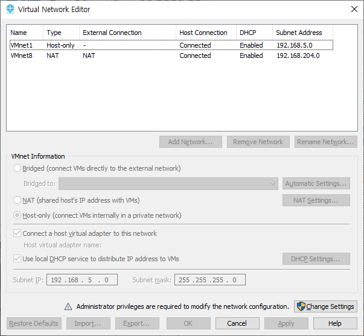

  * VMnet1은 건드리지 않으며, VMnet8에 대한 내용을 수정하고자 하나, 회색으로 표시되며 변경이 안된다. 우측 하단에 Change Setting을 클릭하여 다시 실행하면 수정이 가능하다.

  * 수정이 가능하면 VMnet8을 선택후 좌측 하단의 Subnet IP를 192.168.111.0으로 수정한다.

    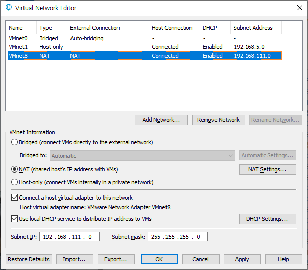

  * OK를 눌러 수정을 완료한 후 명령프롬프트창에서 ipconfig를 다시 실행시켜 보면 VMnet8의 ip가 변경된 것을 확인할 수 있다.