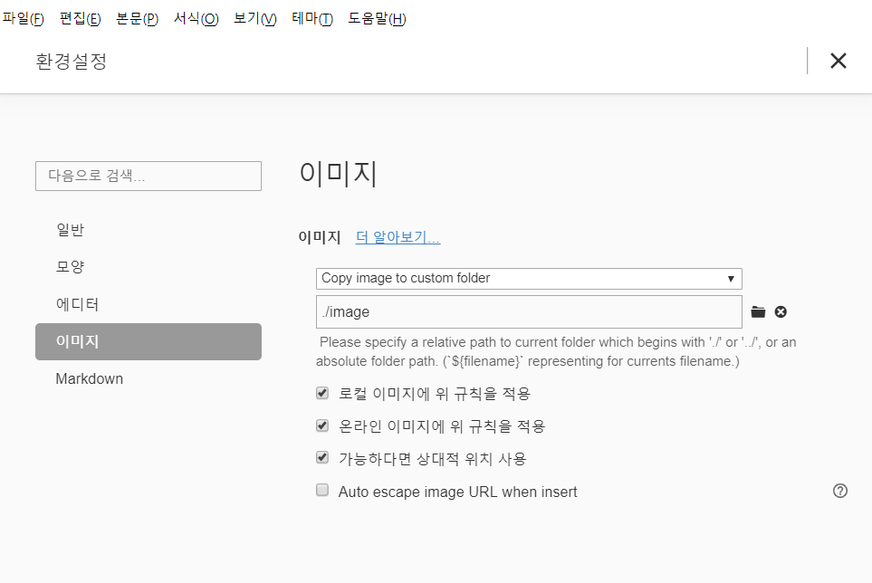

# 마크다운(markdown) 기초

## 제목(Heading)

제목은 `#`을 통해 표현한다

`#`의 갯수로 제목의 레벨을 표현 가능하며, 1 ~ 6까지 사용할 수 있다.

### H3

#### H4

##### H5

###### H6

## 목록

* 순서가 없는 목록은

* `*` 을 통해 표현합니다.

  * Tab을 통해 목록의 레벨을 조정할 수 있습니다.
  * 엔터

  엔터

* 엔터로 여기까지

1. 순서가 있는 목록
2. 순서가 있는 목록은 `1.`
   1. Tab을 통해 목록의 레벨을 조정할 수 있습니다.

## 링크

[구글신](https://google.com)

[마크다운 활용법](https://guides.github.com/features/mastering-markdown/)

## 코드 블록

```java
// 자바 주석
int number = 3;
System.out.println("안녕");
```

```python
# 파이썬 주석
// 이건 파이썬 주석 아님.
print("Hi")
def foo():
    return "hi"
```

## 이미지


Drag&Drop으로 넣으면 바로 경로설정이 뜸

이미지 환경설정 다음과 같이 진행할 것.

주의사항 : til폴더를 만들어 저장해둔 상태여야 함.




| 순번 | 이름   | 나이 |
| ---- | ------ | ---- |
| 1    | 최시영 | 10   |
| 2    | 김현호 | 3    |
| 3    | 심재영 | 반장 |

## 기타

> 인용문은 `>`기호를 통해 작성합니다.

수직선은 `---`을 이용하여 사용할 수 있습니다.

---

*이탤릭체 기울임체*는 `*italic*`과 같이 사용할 수 있습니다.

**볼드체 굵게**는 `**bold**`와 같이 사용할 수 있습니다.

~~취소선~~은 `~~cancel~~`과 같이 사용할 수 있습니다.

