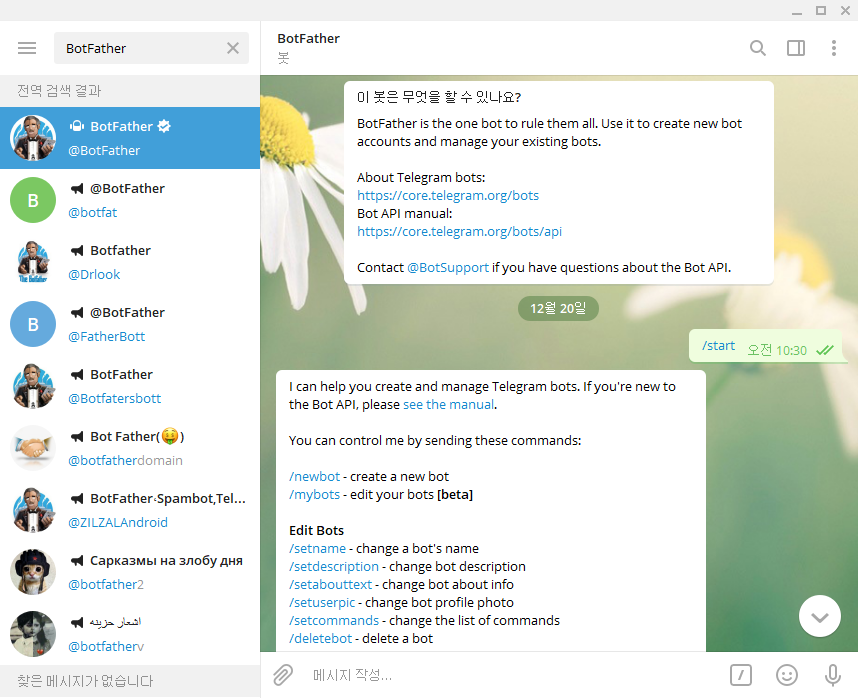
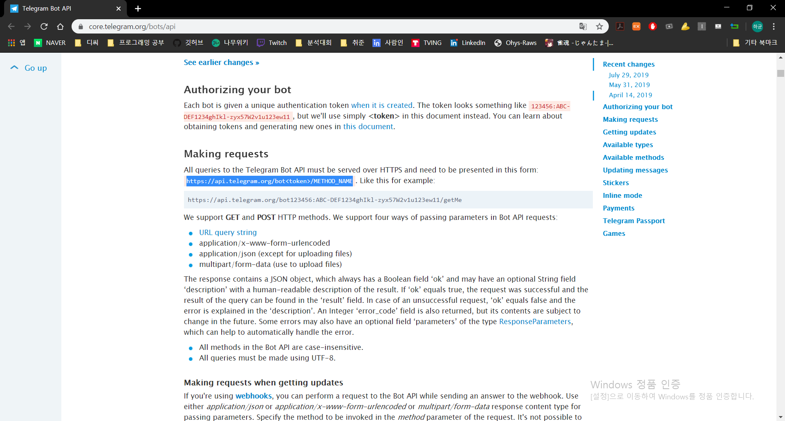
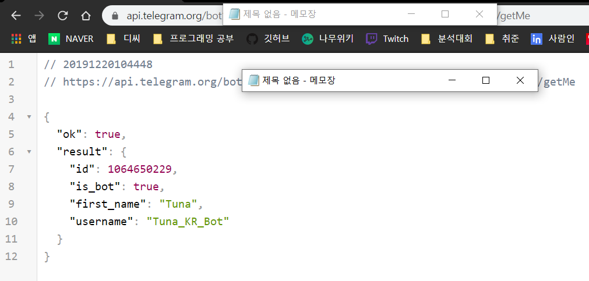
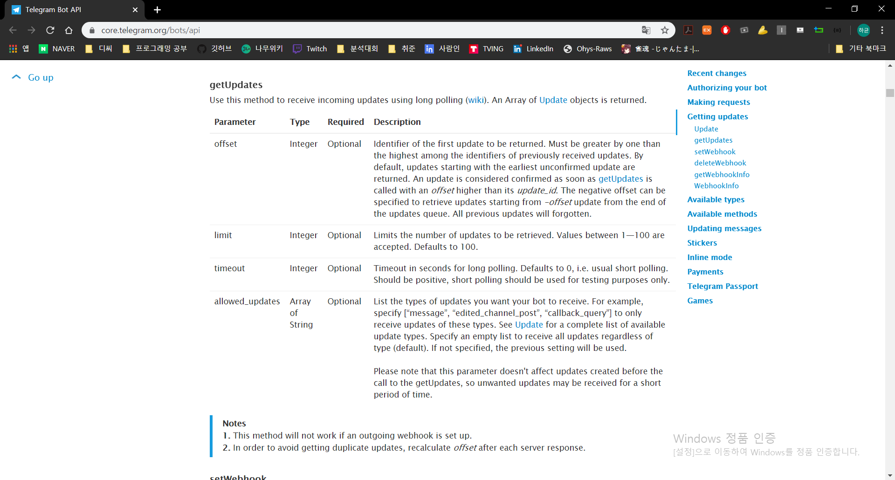
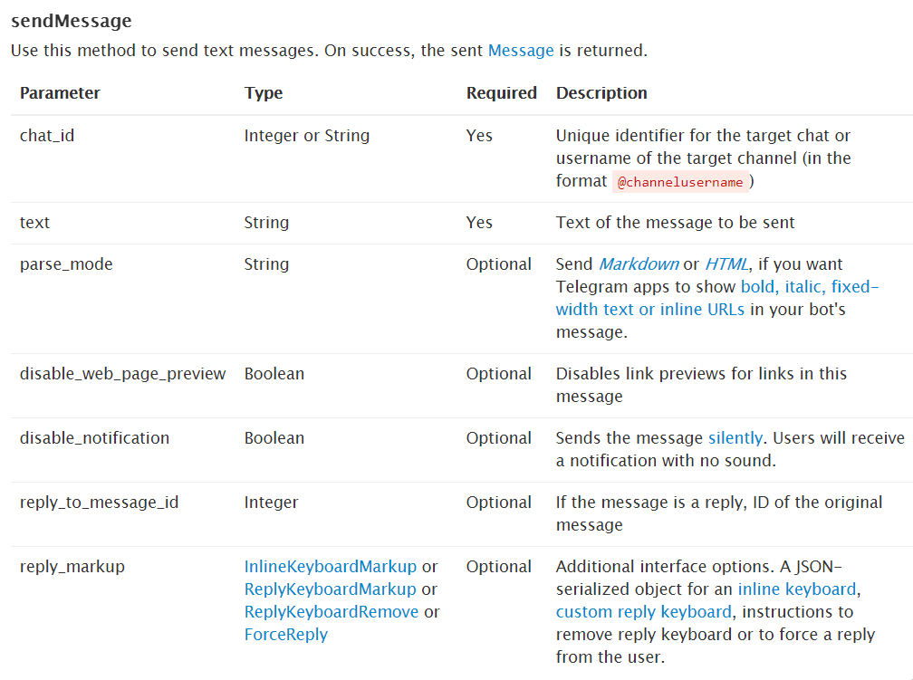
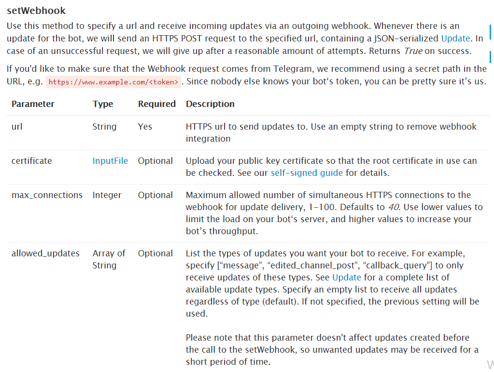

# Telegram Chatbot

## 1. Telegram 가상환경 구축

* `python` 가상환경 구축

  ```bash
  $ python -m venv telegram-venv
  ```

* 가상환경 동작

  ```bash
  $ source telegram-venv/Scripts/activate
  (telegram-venv)
  Tuna@DESKTOP-E7HFSJP MINGW64 /c/TIL/Python (master)
  $ pip list
  Package    Version
  ---------- -------
  pip        19.0.3
  setuptools 40.8.0
  You are using pip version 19.0.3, however version 19.3.1 is available.
  You should consider upgrading via the 'python -m pip install --upgrade pip' command.
  ```

  * `(telegram-venv)`와 같이 나타나며 가상환경이 동작한다.
  * `pip list`를 사용해보면 이전에 설치했던 `pip`들이 없다. 이로써 가상환경이 구축되었다는 것을 확인할 수 있다.

* 설치된 `pip`들의 이름과 버전 가져오기

  ```bash
  $ pip freeze
  ```

  * 결과를 `Copy`하여 `requirements.txt`에 붙여넣기한다.

  * `requirements.txt`파일을 직접 만들지 않고 바로 넣어줄 수 있다.
  
    ```bash
  $ pip freeze > requirements.txt
    ```

* `requirements.txt`에 있는 `pip`들 한번에 설치하기
  
  ```bash
  $ pip install -r requirements.txt
  ```
  
* `Flask`, `requests` 설치하기

  ```bash
  $ pip install Flask
  $ pip install requests
  ```

## 2. Telegram Chatbot

### 1. Telegram

1. Telegram 설치

   [Telegram Site](https://desktop.telegram.org/)에서 Desktop용 Telegram을 설치할 수 있다.
   [Telegram Web](https://web.telegram.org)에서 설치하지 않고 이용할 수 있다.

2. BotFather 검색

   

3. `/newbot`생성 후 API 메모장에 저장

   

   * 다음과 같이 API를 제공해준다. 이는 개인적인 API이므로 공유하지말고 메모장에 저장해서 보관한다

4. `newbot`생성 시 주어지는 API아래에 경로를 들어가서 사용법에 대해 알아본다.

   

5. 범위로 지정된 부분을 복사하여 도메인으로 입력한다.

   * 이 때, `<token>`에 해당하는 부분에 내가 가진 API를 입력한다.
   * 뒤의 `METHOD_NAME`을 `getMe`로 변경한다.

   

   * 위와 같은 사이트가 나타난다.

6. `Bot`을 활성화시킨다.

   * `search`에서 만든 `Bot`의 이름을 입력하여 검색한다.

   

7. `getUpdates`를 살펴본다.

   

   * 이제 아까 사용했던 `url`에서 맨 마지막 `getMe`를 입력했던 `METHOD_NAME`부분에 `getUpdates`를 입력해주면 된다.

   ```json
   {
     "ok": true,
     "result": [
       {
         "update_id": 595769885,
         "message": {
           "message_id": 1,
           "from": {
             "id": 1062122131,
             "is_bot": false,
             "first_name": "Hagyun",
             "last_name": "Kim"
           },
           "chat": {
             "id": 1062122131,
             "first_name": "Hagyun",
             "last_name": "Kim",
             "type": "private"
           },
           "date": 1576807427,
           "text": "/start",
           "entities": [
             {
               "offset": 0,
               "length": 6,
               "type": "bot_command"
             }
           ]
         }
       }
     ]
   }
   ```

   * 만약 `Bot`을 활성화시키는 6번과정을 진행하지 않았다면 `result`부분이 공백으로 보인다.
   * `chat_id`를 사용할 예정이니 `"result"`의 `"message"`의 `"chat"`에 있는 `"id"`를 메모장에 저장해둔다.

8. `sendMessage` 메소드를 알아본다

   

   * 마찬가지로 `METHOD_NAME`부분에 `sendMessage`를 입력하여 `METHOD`를 사용할 수 있다.
   * 이 때, `chat_id`와 `text`가 필요한데, 이는 `url`뒤에 `?`를 입력한 후 그 뒤에 인자를 추가할 수 있다. (각 인자 사이는 `&`로 구분한다.)


### 2. .env file

1. `.env file` 생성

2. `token`과 `chat_id`를 선언한다.

   ```
   TELEGRAM_TUNA_KR_BOT_TOKEN='TOKEN API'
   
   TELEGRAM_MY_CHAT_ID='1062122131'
   ```

### 3. App.py

1. `Flask` 생성

   ```python
   from flask import Flask
   
   app = Flask(__name__)
   
   # root
   @app.route('/')
   def hello():
       return "Hello!"
   
   # debug mode
   if __name__ == "__main__":
       app.run(debug=True)
   ```

2. `write.html `생성

   ```html
   <!DOCTYPE html>
   <html lang="en">
   <head>
       <meta charset="UTF-8">
       <meta name="viewport" content="width=device-width, initial-scale=1.0">
       <meta http-equiv="X-UA-Compatible" content="ie=edge">
       <title>Document</title>
   </head>
   <body>
       <form action="/send" method="GET">
           <input type="text" name="message">
           <input type="submit">
       </form>
   </body>
   </html>
   ```

3. `decouple` 패키지 `install`

   * `env`파일에 선언한 `token`과 `chat_id`를 가져오기 위하여 `decouple` 패키지 `install`

   ```bash
   $ pip install python-decouple
   ```

4. `app.py` 코드추가

   ```python
   from flask import Flask, render_template, request
   from decouple import config
   import requests
   
   token = config('TELEGRAM_TUNA_KR_BOT_TOKEN')
   chat_id = config('TELEGRAM_MY_CHAT_ID')
   
   app_url = f"https://api.telegram.org/bot{token}"
   ```

   * `decouple`패키지에 있는 `config`를 가져와서 이를 이용하여 `env`파일에 있는 변수를 가져온다.

   ```python
   @app.route('/write')
   def write():
       # HTML file
       return render_template("write.html")
   
   @app.route('/send')
   def send():
       message = request.args.get("message")
       message_url = app_url + f"/sendMessage?chat_id={chat_id}&text={message}"
       # message 받아서 telegram 메시지 보내는 요청
       requests.get(message_url)
       return "Complete send message"
   ```

5. `app.py`실행 후 나오는 `Flask url`에서 뒤에 `/write`를 붙여서 `input`에 작성하면 Telegram에 메시지를 전송한다.

### 4. Webhook

> Telegram에 들어온 데이터를 Flask에 전송하는 역할

1. ngrok

   > 회원가입하지 않고 다운로드받으면 8시간의 시간제한이 존재하며, 회원가입하면 켜놓은 동안에는 시간제한이 존재하지않으나 껏다키면 url이 변경된다.

   * [ngrok Download](https://ngrok.com/download)
   * `ngrok.exe` 파일 위치이동 `(C:/Users/Tuna)`
   * `cmd`창에서 `ngrok http 5000`입력
   * `Ctrl + C`를 누르거나 `cmd`창을 종료하면 `ngrok`이 종료되기 때문에 계속 켜놓아야 한다.

2. Webhook

   

   * `url`이 필수로 필요하다. 여기에 `ngrok`에서 얻은 `Forwarding url`을 복사하여 넣으면 된다. 
   * 이후 `/{token}`을 추가로 `url`에 추가해준다.
     * `{token}`을 추가해주는 이유는 다른사람들의 원하지 않는 접근을 방지하기 위해서 중복되지않고 어려운 `url`을 만들어주기 위함이다.
   * `last url` = `https://api.telegram.org/bot{token}/setWebHook?url={Forwarding url}/{token}`

3. `app.py `추가

   ```python
   # Webhook
   @app.route(f"/{token}", methods=['POST'])
   def telegram():
       print(request.get_json())
       # return body, status_code
       return '', 200
   ```

   * 이후 Telegram에 메시지를 보내면 해당 요청의 `HTML`태그가 출력된다.
   * `request.get_json()`으로 받는 요청의 `id` 혹은 `text`를 이용하여 여러 작업을 할 수 있다.

* [Codes](./app.py)

## 3. Python anywhere

1. [Python anywhere](https://www.pythonanywhere.com/)가입 후 이메일 인증
2. 우상단의 Files에 `my_site`의 `flask_app.py`파일에 `app.py`의 내용을 덮어쓰기
   * `my_site`폴더 내에 `.env`파일도 새로 생성해줘야 한다.
3. `deleteWebHook`
   * 현재 진행중인 WebHook을 삭제해준다.
4. `setWebHook?url={python anywhere url}/{token}`
   * Python Anywhere에서 받은 `Hosting`을 이용하여 새로운 WebHook을 세팅한다.

* 강의중 현재 3.8버전에서 실행이 안되서 3.7로 진행했다.
  * 하지만 난 Python버전이 3.7이라 3.7로 진행했다.