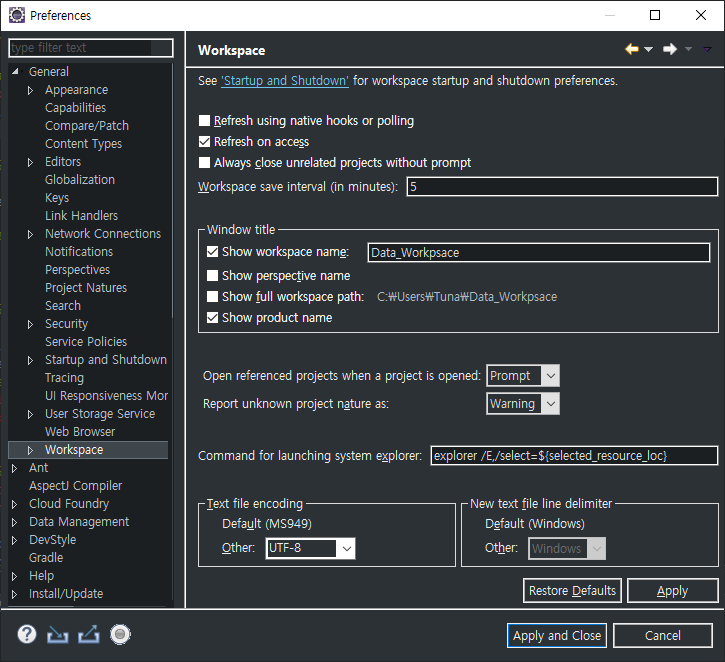
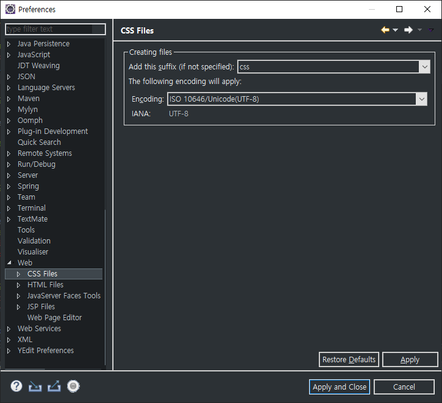
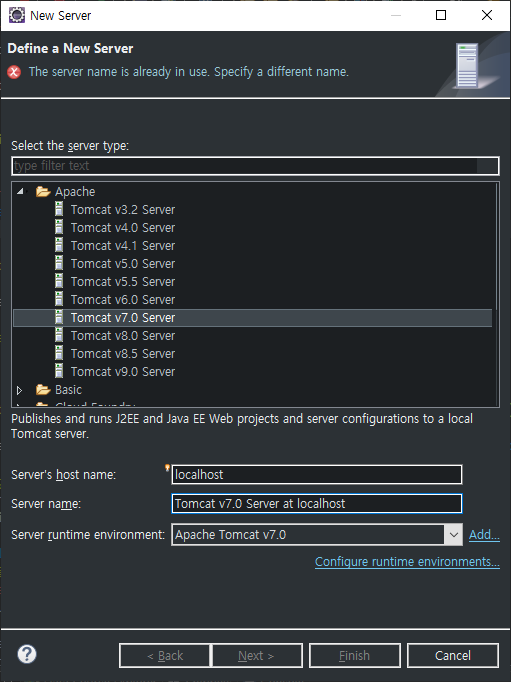
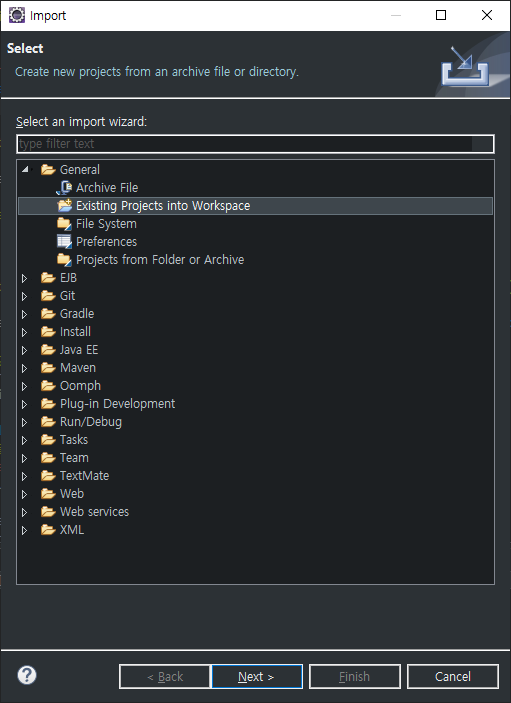
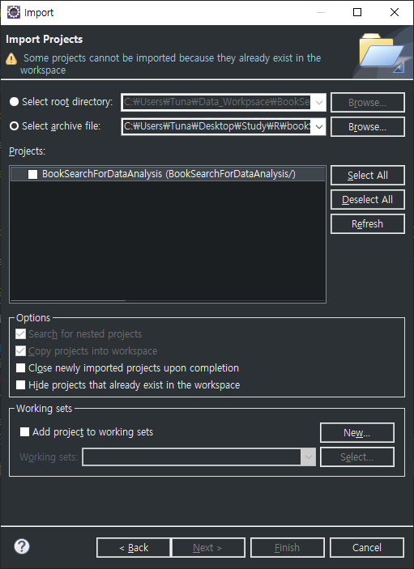
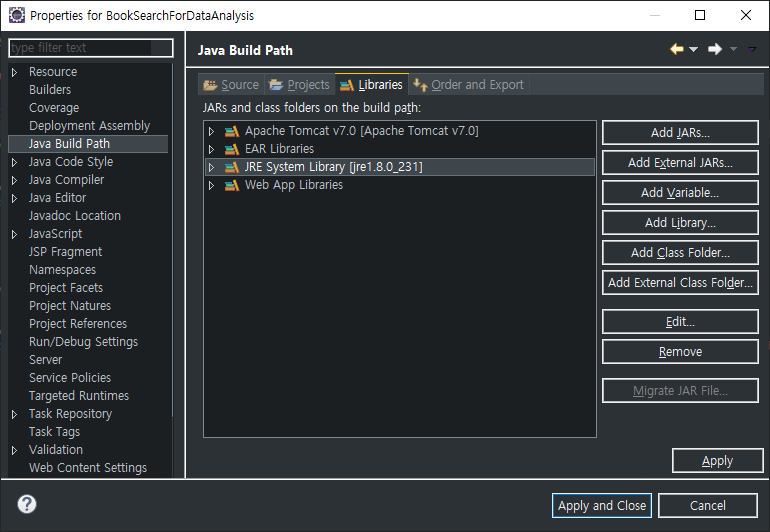
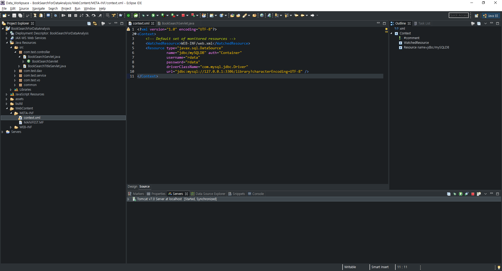
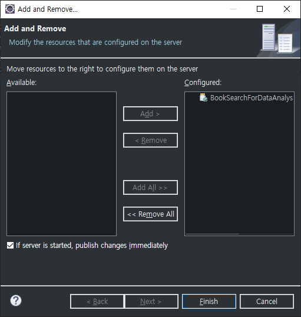
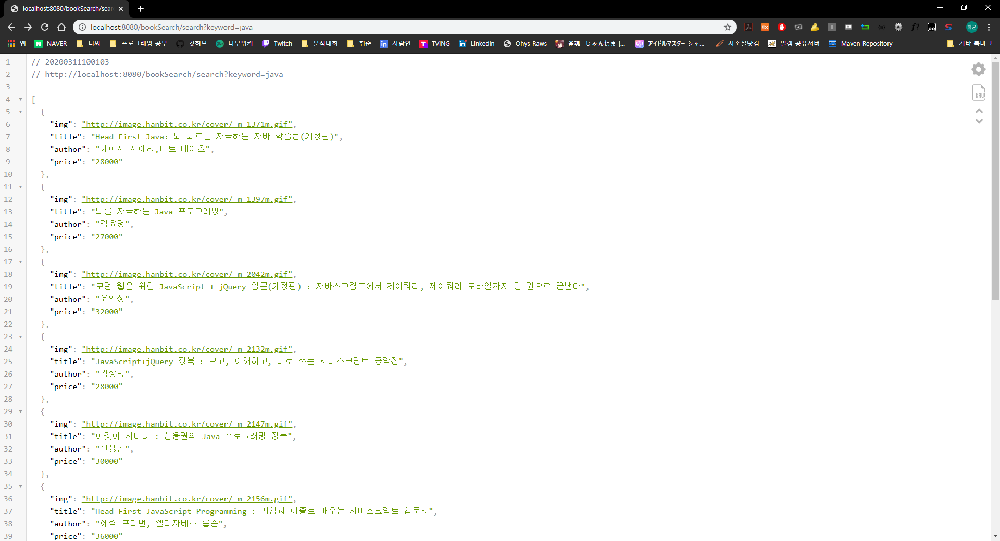

# MySQL

* MySQL 서버 실행

  ```
  C:\Users\Tuna>cd C:\mysql\bin
  
  C:\mysql\bin>mysqld
  2020-03-11 09:35:57 0 [Warning] TIMESTAMP with implicit DEFAULT value is deprecated. Please use --explicit_defaults_for_timestamp server option (see documentation for more details).
  2020-03-11 09:35:57 0 [Note] --secure-file-priv is set to NULL. Operations related to importing and exporting data are disabled
  2020-03-11 09:35:57 0 [Note] mysqld (mysqld 5.6.47) starting as process 16636 ...
  ```

* 서버를 실행한 이후 다른 Command창을 실행하여 MySQL 진입

  ```
  C:\mysql\bin>mysql -u root
  Welcome to the MySQL monitor.  Commands end with ; or \g.
  Your MySQL connection id is 1
  Server version: 5.6.47 MySQL Community Server (GPL)
  
  Copyright (c) 2000, 2020, Oracle and/or its affiliates. All rights reserved.
  
  Oracle is a registered trademark of Oracle Corporation and/or its
  affiliates. Other names may be trademarks of their respective
  owners.
  
  Type 'help;' or '\h' for help. Type '\c' to clear the current input statement.
  ```

* rdata 계정 생성

  ```
  mysql> create user rdata@localhost identified by 'rdata';
  Query OK, 0 rows affected (0.00 sec)
  ```

* localhost 추가

  ```
  mysql> create user rdata@localhost identified by 'rdata';
  Query OK, 0 rows affected (0.00 sec)
  ```

* DB 생성

  ```
  mysql> create database library;
  Query OK, 1 row affected (0.01 sec)
  ```

* DB 권한 설정(rdata, rdata@localhost 계정 둘다 설정)

  ```
  mysql> grant all privileges on library.* to rdata;
  Query OK, 0 rows affected (0.01 sec)
  
  mysql> grant all privileges on library.* to rdata@localhost;
  Query OK, 0 rows affected (0.00 sec)
  
  mysql> flush privileges;
  Query OK, 0 rows affected (0.00 sec)
  ```

* 복사 파일 설정하기

  ```
  C:\Users\Tuna>cd C:\mysql\bin
  
  C:\mysql\bin>mysql -u rdata -p library < _BookTableDump.sql
  Enter password: *****
  ```

  * rdata계정의 비밀번호를 입력한다.
  * _BookTableDump.sql파일을 미리 해당 bin경로로 복사해놔야한다.

* MySQL 종료

  ```
  C:\mysql\bin>mysqladmin -u root shutdown
  ```

  * mysqld를 입력했던 Command창을 확인해보면 MySQL서버가 종료되었다.

## Eclipse

* Preference - General - Workspace에서 가장 아래부분 Encoding을 UTF-8로 변경

  

* Preference - Web - CSS, HTML, JSP에서 Encoding을 UTF-8로 변경

  

* Apache Tomcat 7 Server 연동

  

* Project부분에서 우클릭하여 Import - Import - General - Existing Project into Workspace선택

  

  * Select Archieve File을 체크하여 zip파일을 찾아서 지정

    

* 생성된 Project에 우클릭하여 Properties로 진입

  * Java Build Path - Library로 진입하면 JRE가 (unbound) 되어있는 것을 확인

  * JRE에 더블클릭을 한 후 Workspace Default JRE를 선택하거나 설치된 JRE를 탐색하여 지정

    

* WebContent - META-INF - context.xml로 진입

  * username과 password를 위에서 지정한 rdata로 변경

    

* Server에 우클릭하여 Add and Remove로 진입

  * 해당 Project를 Add

    

* Project - Properties - Web Project Settings의 Context Path를 사용해 호출한다.

  * http://localhost:8080/bookSearch/search?keyword=java

  * bookSearch뒤의 search는 Controller의 servlet에서 지정한 페이지이다.

  * ?뒤의 값은 search페이지에 주는 keyword값이다.

  * Command창에서 mysqld로 MySQL을 실행하고, Apache Tomcat 7 서버를 실행한 뒤 해당 URL로 진입하면 된다.

    