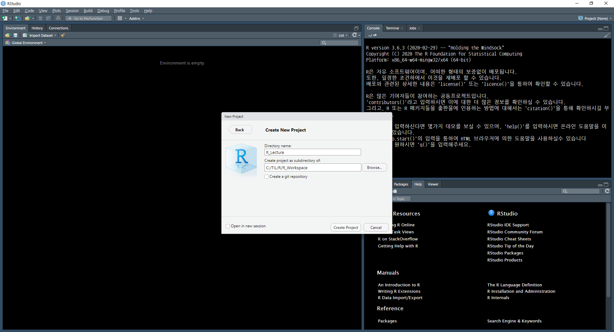

# R Start

> R 이란, 통계계산을 위해서 만들어진 프로그래밍 언어이면서 소프트웨어
>
> AT&T의 BELL연구소에서 만들어진 S라는 언어에서 발전됨
>
> 1993년 로스이하카, 로버트 젠틀맨에 의해서 개발되었고 현재는 R 코어팀에 의해서 유지보수 개발 중

### R로 할 수 있는 기능

* 통계분석
  * 기초 통계
  * 가설 검정
* 머신러닝
* 텍스트 마이닝

### R 이외에도 데이터 분석이 가능한 Tool

* SAS, SPSS
  * 유료로 이용가능, 통계전문
* Excel
  * 기본적인 통계기능을 포함하고 있다.

### R의 특징

* 무료로 사용가능
  * 유료 Tool에 버금가는 기능을 가지고 있다.
* 코드 베이스(재연성)

### Python VS R

* R은 순수한 데이터분석에 사용된다. 데이터를 분석하여 결과를 브리핑할 때.
* Python은 분석된 데이터를 Python과 연결된 Web등의 시스템에 연관시키기 좋다.

## R Download

* [Download Site](https://cran.r-project.org/)로 진입한다.
  * Download R for Windows로 진입한 후 base를 클릭한다.
  * [Download R 3.6.3 for Windows](https://cran.r-project.org/bin/windows/base/R-3.6.3-win.exe)을 클릭한다.
  * 해당 파일을 실행하면 된다.
* 만약 이전에 R을 설치해본 경험이 있다면 Update를 진행하면 된다.
  * 위의 방법처럼 진행하는 것과 크게 다르지 않다.
  * R GUI에서 installr패키지를 install한 후 `installr::updateR()`을 진행하면된다.
  * 이 방법을 사용하면 이전에 사용하던 Rprofile이나 package들을 그대로 가져오는 과정을 진행할 수 있다.

## RStudio Download

> R을 편하게 사용할 수 있는 IDE인 RStudio를 다운로드 받아야 한다.

* [Download Site](https://rstudio.com/products/rstudio/)에서 RStudio Desktop에 대한 Download를 클릭하고 무료버전을 다운로드 받는다.
* 다운로드 받은 EXE파일을 실행해서 다른 변경없이 설치하면된다.

## Start

### Create New Project

* File - New Project - New Directory - New Project로 진입하여 새로운 프로젝트를 생성한다.

  * 프로젝트 이름은 간단하게 R_Lecture로 지정했으며, 프로젝트의 경로는 내가 공부하고 있는 폴더인 TIL의 R폴더 내부에 R_Workspace폴더를 생성하여 지정하였다.

    

### Setting

* Tools - Global Option로 진입하여 환경설정을 진행한다.

  * Tools의 Project Option은 각 프로젝트 마다 설정을 다르게 할 때 사용한다.

* Global Option - Code - Editing에서 Soft-wrap R source File을 체크한다.

  * 이는 R Script에서 화면을 넘어가는 R Code를 줄바꿈을 진행한 것처럼 보여줘서 보기 편하게 해준다.

    

* Tools - Global Option - Code - Saving에서 가장 아래 Default text encoding을 UTF-8로 변경한다.

  