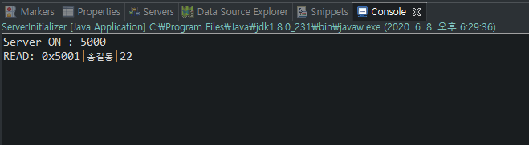
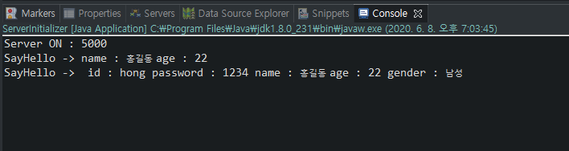

# Dispatcher

> 2020/06/08 손영수멘토님 SW 설계 패턴 특강 Part 2 (18~20)

## 기본적인 서버 작성

> 네트워크 수업 복습

* Server Class

  ```java
  import java.io.BufferedReader;
  import java.io.IOException;
  import java.io.InputStreamReader;
  import java.net.ServerSocket;
  import java.net.Socket;
  
  public class ServerInitializer {
  
  	public static void main(String[] args) {
  		int port = 5000;
  		System.out.println("Server ON : " + port);
  		
  		try {
  			ServerSocket serverSocket = new ServerSocket(port);
  			Socket connection;
  			
  			while(true) {
  				connection = serverSocket.accept();
  				InputStreamReader inputStreamReader = new InputStreamReader(connection.getInputStream());
  				BufferedReader bufferedReader = new BufferedReader(inputStreamReader);
  				String line = bufferedReader.readLine();
  				
  				System.out.println("READ: " + line);
  			}
  		} catch (IOException e) {
  			e.printStackTrace();
  		}
  	}
  
  }
  
  ```

  * Stream
    * REST API와 달리 네트워크 부하가 한번씩 치고 올라가지 않으며, 꾸준한 부하가 걸림
    * 데이터를 한번에 전송하는 것이 아니라 조금씩 계속 보냄

* TestClient Class

  ```java
  import java.io.IOException;
  import java.io.OutputStream;
  import java.net.Socket;
  import java.net.UnknownHostException;
  
  public class TestClient {
  
  	public static void main(String[] args) {
  		System.out.println("Client ON");
  		
  		try {
  			String message;
  			
  			Socket socket = new Socket("127.0.0.1", 5000);
  			OutputStream out = socket.getOutputStream();
  			message = "0x5001|홍길동|22";
  			out.write(message.getBytes());
  			socket.close();
  			
  		} catch (UnknownHostException e) {
  			e.printStackTrace();
  		} catch (IOException e) {
  			e.printStackTrace();
  		}
  	}
  
  }
  
  ```

* Server Class를 Run하고, TestClient Class를 Run하면 다음과 같은 결과가 나옴

  

  * 홍길동이라는 한글이 표시되지 않고 깨져서 나온다면 인코딩문제
    * 해당 Project의 Properties로 이동하여 인코딩을 UTF-8로 변경

* Client에서 전송한 message는 Protocol

  * `0x5001`은 헤더로 어떤방법으로 데이터를 파싱할지 표시함
  * `홍길동`과 `22`는 `|`파이프로 구분되는 데이터 (이름과 나이를 구분하여 데이터 전송)

## 간단한 Dispatcher 작성

* Dispatcher를 사용함으로써 헤더마다 다르게 처리하도록 만들 수 있음

* Server를 살펴보면

  * 서버를 설정하고, 연결을 받고, 데이터를 읽고, 읽은 데이터를 처리하는 부분으로 나뉘어져 있음
  * 연결을 받는 부분(커넥션을 연결하는 부분)을 Dispatcher
  * 읽은 데이터를 처리하는 부분을 Protocol

* Dispatcher Class 생성

  ```java
  import java.io.IOException;
  import java.io.InputStream;
  import java.net.ServerSocket;
  import java.net.Socket;
  
  public class Dispatcher {
  	private final int HEADER_SIZE = 6;
      
  	public void dispatch(ServerSocket serverSocket) {
  		try {
  			Socket socket = serverSocket.accept();
  		} catch (IOException e) {
  			e.printStackTrace();
  		}
  	}
  }
  
  ```

  * 받은 데이터를 헤더에 따라 분배해주는 demultiplex Method를 생성

    ```java
    public void demultiplex(Socket socket) {
    		InputStream inputStream;
    		try {
    			inputStream = socket.getInputStream();
    			
    			byte[] buffer = new byte[HEADER_SIZE];
    			inputStream.read(buffer);
    			String header = new String(buffer);
    			
    			switch(header) {
    			case "0x5001":
    				break;
    			case "0x6001":
    				break;
    			}
    		} catch (IOException e) {
    			e.printStackTrace();
    		}
    	}
    ```

    * HEADER_SIZE만큼만 값을 받아와서 읽고 헤더에 따른 실행을 `switch-case`문을 사용하여 분기

* 각 헤더에 따른 데이터 처리 Class 생성

  * StreamSayHelloProtocol Class 생성

    ```java
    import java.io.IOException;
    import java.io.InputStream;
    import java.util.StringTokenizer;
    
    public class StreamSayHelloProtocol {
    	
    	private static final int DATA_SIZE = 512;
    	private static final int TOKEN_NUM = 2;
    	
    	public void handleEvent(InputStream inputStream) {
    		try {
    			byte[] buffer = new byte[DATA_SIZE];
    			inputStream.read(buffer);
    			String data = new String(buffer);
    			
    			String[] params = new String[TOKEN_NUM];
    			StringTokenizer token = new StringTokenizer(data, "|");
    			
    			int i = 0;
    			while(token.hasMoreTokens()) {
    				params[i] = token.nextToken();
    				++i;
    			}
    			
    			sayHello(params);
    		} catch (IOException e) {
    			e.printStackTrace();
    		}
    	}
    	
    	private void sayHello(String[] params) {
    		System.out.println("SayHello -> name : " + params[0] + " age : " + params[1]);
    	}
    }
    
    ```

    * DATA_SIZE는 InputStream으로 받는 DATA의 크기를 512로 한정한다는 의미
    * TOKEN_NUM은 `|`파이프를 통하여 분할되는 TOKEN의 수가 2개라는 의미
    * 해당 Class에서는 입력받은 2개의 데이터를 출력해주는 처리를 진행

  * StreamUpdateProfileProtocol Class 생성

    ```java
    import java.io.IOException;
    import java.io.InputStream;
    import java.util.StringTokenizer;
    
    public class StreamUpdateProfileProtocol {
    	
    	private static final int DATA_SIZE = 1024;
    	private static final int TOKEN_NUM = 5;
    	
    	public void handleEvent(InputStream inputStream) {
    		try {
    			byte[] buffer = new byte[DATA_SIZE];
    			inputStream.read(buffer);
    			String data = new String(buffer);
    			
    			String[] params = new String[TOKEN_NUM];
    			StringTokenizer token = new StringTokenizer(data, "|");
    			
    			int i = 0;
    			while(token.hasMoreTokens()) {
    				params[i] = token.nextToken();
    				++i;
    			}
    			
    			updateProfile(params);
    		} catch (IOException e) {
    			e.printStackTrace();
    		}
    	}
    	
    	private void updateProfile(String[] params) {
    		System.out.println("UpdateProfile ->" +
    				" id : " + params[0] +
    				" password : " + params[1] + 
    				" name : " + params[2] + 
    				" age : " + params[3] +
    				" gender : " + params[4]);
    	}
    }
    
    ```

    * DATA_SIZE와 TOKEN_NUM는 위와 동일한 의미이나 숫자를 변경
    * 역시 동일하게 입력받은 5개의 데이터를 출력해주는 처리를 진행

* Dispatcher Class로 돌아와서 분기에 따른 Class의 Method 호출

  ```java
  switch(header) {
  case "0x5001":
  	StreamSayHelloProtocol sayHelloProtocol = new StreamSayHelloProtocol();
  	sayHelloProtocol.handleEvent(inputStream);
  	break;
  case "0x6001":
  	StreamUpdateProfileProtocol updateProfileProtocol = new StreamUpdateProfileProtocol();
  	updateProfileProtocol.handleEvent(inputStream);
  	break;
  }
  ```

  * `switch-case`문을 위와 같이 변경

* 처음 네트워크 기본 복습에서 진행했던 Server Class를 변경

  ```java
  import java.io.IOException;
  import java.net.ServerSocket;
  
  public class ServerInitializer {
  
  	public static void main(String[] args) {
  		int port = 5000;
  		System.out.println("Server ON : " + port);
  		
  		try {
  			ServerSocket serverSocket = new ServerSocket(port);
  			Dispatcher dispatcher = new Dispatcher();
  			
  			while(true) {
  				dispatcher.dispatch(serverSocket);
  			}
  		} catch (IOException e) {
  			e.printStackTrace();
  		}
  	}
  
  }
  
  ```

  * Dispatcher에게 ServerSocket을 전달하도록 수정

* TestClient에 `0x6001`헤더에 대한 테스트 연결 정보를 작성

  ```java
  Socket socket2 = new Socket("127.0.0.1", 5000);
  OutputStream out2 = socket2.getOutputStream();
  message = "0x6001|hong|1234|홍길동|22|남성";
  out2.write(message.getBytes());
  socket2.close();
  ```

  * 기존에 작성된 `0x5001`헤더에 대한 테스트케이스 아래에 작성

* Server Class를 Run 후, TestClient Class를 Run하면 다음과 같은 결과가 출력

  

* 이후에 새로운 Protocol을 계속해서 추가할 수 있음

  * 하지만 Design Pattern을 활용해서 개선할 수 있음
  * 이를 개선하는 것이 **Reactor Pattern**
    * Handle Map, Event Handler 등등
    * Protocol 추가에 유연한 디스패처(Reactor) Pattern은?
  * [다음 내용 Reactor](Reactor)