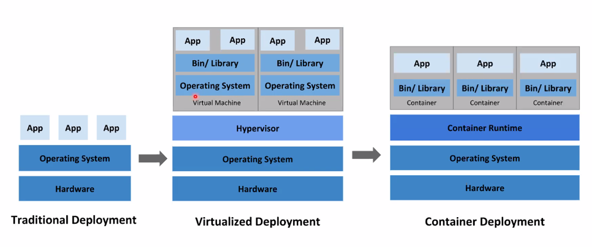

# Docker

* 시대별 배포 유형

  

  * 운영체제를 신경쓰지 않고 App만을 구동하고 싶어서 불필요한 부분을 걷어내기 시작함

## Container

* 장점
  * 기민한 애플리케이션 생성과 배포
  * 지속적인 개발, 통합 및 배포
  * 개발과 운영의 관심사 분리
  * 개발, 테스팅 및 운영 환경에 걸친 일관성
  * 클라우드 및 OS배포판 간 이식성
  * 애플리케이션 중심 관리
  * ...

## Docker

* Local에 설치되어 있지 않은 기능을 Container를 가져와서 사용할 수 있음
* 컨테이너 기반의 오픈소스 가상화 플랫폼
* Container를 하기 위한 기능은 이미 Linux Kernel(v2.6부터)에 탑재 되어 있음
* Namespace
  * 나만의 공간
  * Hostname, Network Routing 등
* Cgroup
  * Control Group
  * 자원을 격리하거나 제한
    * 하나의 App이 100%의 CPU를 사용하면 다른 App들은 CPU를 사용할 수 없음
    * 그러므로 하나의 App이 최대한 사용할 수 있는 CPU를 제한하는 기능
    * 메모리와 같은 자원도 마찬가지
* Image
  * 
  * 아무것도 없는데, 나만의 이미지를 만들 수 없음
    * 근본이 되는 이미지가 존재해야 함
  * 최초의 이미지인 BaseImage는 Docker에서 만들어서 제공 (읽기 전용)

## Training

* Linux에서 진행

* Docker 설치

  ```shell
  # 공식 Linux 배포판 Repository
  sudo apt install docker.io # (구버전)
  sudo apt install docker-ce
  
  # Docker 개발사가 지원하는 Linux 배포판 Repository
  sudo apt add-repository docekr.com URL...
  # GPG 키 추가
  sudo apt update
  sudo apt install docker-ce
  
  # 손 쉬운 설치 스크립트
  # R-pi, Linux 등 OS 알아서 체크, 탐지하여 두번째 방법 실행
  
  curl -fsSL https://get.docker.com/ | sudo sh
  ```

* 설치 확인

  ```shell
  docker --version
  ```

  * Docker의 Version이 출력되면 제대로 설치가 된 것

* Hello World 확인

  ```shell
  docker run hello-world
  ```

  * Error가 발생하며 실행이 안된다.

  ```shell
  sudo docker run hello-world
  ```

  * 뭔가 출력이 되지만, 이는 좋은 방법이 아님
  * 매번 sudo를 쳐서 관리자 권한으로 실행해야 되기 때문

  ```shell
  sudo usermod -aG docker $USER
  ```

  * Docker를 사용할 수 있도록 권한을 추가하는 명령어
  * 이를 친 다음 Linux를 재부팅하면 `docker run hello-world`가 정상적으로 실행됨
    * `id`명령어를 입력하면 999(docker)로 Docker의 권한이 추가되었다는 것을 확인

  ```shell
  docker run docker/whalesay cowsay Hello-World!
  ```

  * 고래가 표시되며 입력한 `Hello-World!`가 출력됨

* Container 확인

  ```shell
  docker ps -a
  ```

  * 만들어져 있는 Container를 확인

  ```shell
  docker rm {CONTAINER_ID or NAMES}
  ```

  * 만들어져 있는 Container를 삭제
  * CONTAINER_ID와 NAMES는 1:1매칭되는 항목
  * CONTAINER_ID의 앞의 일부분을 입력해도 가능
    * 5fa, 7d2와 같은 형식
  * 띄어쓰기를 활용하여 여러 개를 한번에 삭제 가능

  ```shell
  docker container ls -a
  ```

  * 사용한 적이 있는 Container들을 표시
  * *ps와 conatiner ls의 차이?*

* Images

  ```shell
  docker images
  ```

  * 가지고 있는 Image들이 표시

  ```shell
  docker pull ubuntu
  ```

  * ubuntu Image를 가져옴, `docker images`를 진행하면 ubuntu가 추가된 것을 확인할 수 있음
  * 아무것도 입력하지 않으면 default값인 `latest`로 가져옴

  ```shell
  docker pull ubuntu:16.04
  ```

  * ubuntu의 16.04 Version을 가져옴
  * Image가 저장되는 위치는 /var/lib/docker에 저장되어 있음
    * 확인하고 싶다면 `sudo ls -al /var/lib/docker`
    * 해당 폴더의 용량을 확인하고 싶다면 `sudo du -hs /var/lib/docker`

* Ubuntu Bash

  ```shell
  docker run -it ubuntu:16.04 bash
  ```

  * ubuntu v16.04의 CLI창으로 진입

  ```shell
  cat /etc/*-release
  ```

  * 현재 CLI가 ubuntu라는 것을 확인할 수 있음

  ```shell
  exit
  ```

  * 현재 CLI창을 종료하고 초기 Linux로 돌아갈 수 있음

  ```shell
  docker attach {CONTAINER_ID}
  ```

  * Image를 통합

  ```shell
  docker run -it --rm ubuntu:16.04 bash
  ```

  * 종료시 Container를 삭제하도록 설정하고 생성