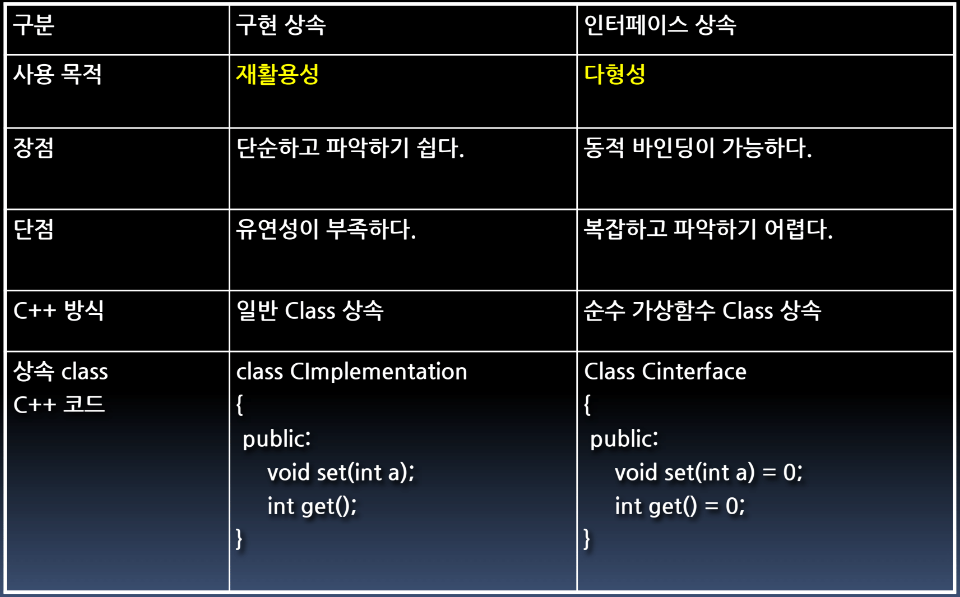
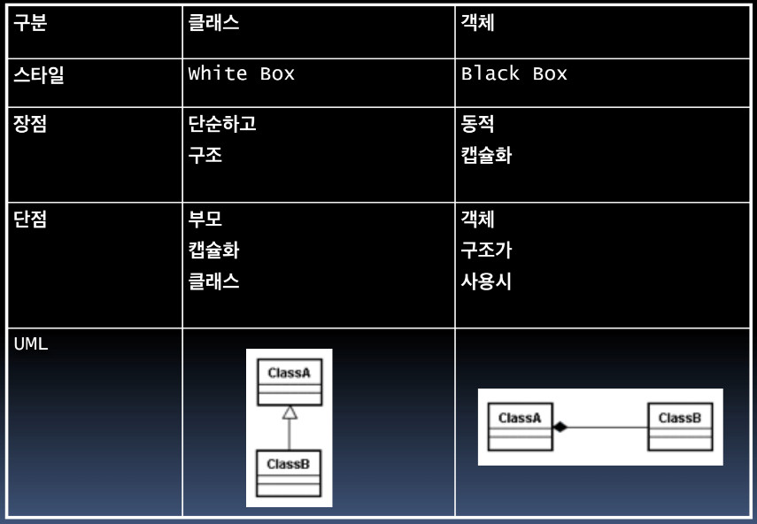

# SW Design Pattern

> 2020/05/25 손영수멘토님 소프트웨어 설계패턴 특강 Part 1 (15 ~ 19)

* hillside.net/plop/2020 => 패턴학회
  * 손영수 멘토님이 이사로 참여중
* Part 2부터는 Dispatcher에 대한 실습이 진행됨
  * Network의 Reactor/Proactor에 대한 개념이해가 진행됨

## Pattern

### Definition

> Pattern is Father

* 이미 해결한 문제와 유사한 문제들은 유사한 방법(패턴)으로 해결 할 수 있다.
  * 내가 궁금한 문제는 누가 이미 풀어봤음
* 좋은 설계라는 건 경험으로 인한 시행착오가 있을 수록 좋아진다.
  * 소마같은 경우에서는 경험이 없으므로 좋게 설계하기 힘들다

### Necessity

* 동기/비동기, Blocking/Non-Blocking, Reactor/Proactor
  * 각 기능에 대한 이해가 필요
* CPU와 메모리의 자원 관리
  * 동일한 서비스더라도 적은 Core를 사용하면 소모비용이 감소되므로 회사에 이득이 됨
* 이와같이 어려운 내용들에 대해서 선배들의 이용 경험을 조언받는 것이 **패턴**

### Significance

* 문제 해결을 위한 선각자들의 노하우
* **추상화된 커뮤니케이션 수단**
* 구현, 설계 나아가 생각과 이해의 틀

### People

* Ralph Johnson
  * GoF 디자인 패턴 만듬
  * Framework 만듬
* Martin Fowler
  * Ralph Johnson의 제자
  * Refactoring
* Eric Gamma
  * Eclipse 만든 사람
  * Visual Studio 총괄
* James 고슬링?
  * Java언어 만듬
* Joshua Block?
  * Java Framework 만듬
* Kent Beck
  * TDD (Test Driven Design) 만듬
* Robert C. Martins
  * Uncle Bob
  * Solid Principle 설계

## Gang of Four

> 대부분의 개발자들이 알고 있는 Pattern
>
> Ralph Johnson, Eric Gamma 외 2명이 만든 디자인 패턴

* 패턴을 소프트웨어적으로 설명하고 분류하면서 구조를 설명
  * 패턴 23개 추출
  * 디자인 패턴을 기반으로 한 객체지향적인 전략과 접근법을 주장
* 부정적 인식
  * 구닥다리
  * 딱딱하다
  * 난해하다
* 이해하기 힘듬, 여러 패턴을 연결하는 접착제 역할로 활용
  * Micro Pattern이라고 부름
  * GoF패턴을 아무리 이해해도 패턴을 만들기 어려움, 이런게 있구나 하고 이해만 하면됨

### Principle

* Program to an *interface*, not an *implementation*

  * 구현이 아닌 인터페이스에 따라 프로그래밍 하라

  * 상속방식의 구분이 필요

    

  * Strategy Pattern

    * 인터페이스 지향적으로 구성되어 있고 교체가 가능하다.
    * 이름에 집착하지말 것, 상황에 따라서 용어가 정해짐

  * 장점

    * 다형성, 대체가능성 확보
    * 결합도와 종속성 감소
    * 변화에 대한 **유연성** 확보

  * 원리

    * 인스턴스 이용방식에 대한 이슈
    * 변수를 구체적 클래스의 인스턴스로 선언하지 말자
    * 대신 구체적 클래스의 인터페이스를 통해 인스턴스 변수를 선언하라

* Favor object composition over class inheritance

  * 클래스 상속보다는 객체 합성(조합?)을 더 선호하라

  * 조합이란 한 Class에서 다른 Class의 객체를 사용하는 느낌

    * 단, 사용하는 다른 Class가 Interface의 다형성을 활용

      ```java
      iSort = new <iSort>
      ```

      `<iSort>`부분이 이제 XML에서 Bubble, Quick과 같은 형태로 생성

  * 객체 조합 방식에 대한 구분이 필요

    

  * 장점

    * 복잡도 감소, 객체간 종속성 사라짐
    * 캡슐화 유지, 대체 가능성 확보, 재사용성 확보
    * 변화에 대한 유연성 확보

  * 원리

    * 객체간 조합방식에 대한 이슈
    * 객체간의 조합 시에 클래스 상속보다는 합성을 선호
    * 완벽한 재사용성을 위해서는 상속과 객체합성이 모두 이용되어야 한다.

### Kinds

* Strategy
  * 상황에 따라 A아니면 B 전략으로 진행한다.
* Template Method
  * Interface지향적인 패턴을 무너뜨리고, 상속 Class를 이용
  * 부모에서 자식을 호출하는 패턴
    * 어떠한 Class가 오더라도 추상클래스만 정의하면 공통 Class는 Client가 Control할 수 없다.
    * 일종의 Capsulization
  * 대부분의 Framework는 이렇게 구성되어 있음
  * Control Flow를 개발자가 Control하는지 Framework가 Control하는지
* Component Configurator
  * GoF패턴은 아님
  * 설정파일 정보가 바뀌면 소프트웨어의 코드 수정없이 속성이 변경
    * 설정파일 정보를 활용하여 유연성 확보
  * Web서버 대부분 구조
  * Reflection
    * 인터페이스는 동일
    * 각 기능을 dll, 인터페이스로 구조 형성
* Observer Pattern
  * 통보 받는 역할 
  * Starcraft로 오해가 있음 => Pattern명 변경 (**Pub / Sub** => Publisher, Subscriber)
    * 정보를 관심있는 인원에게 공개하고, 관심있으면 수락해서 들어라
  * Publisher가 있고 각 Sub에게 Notification
  * Database복제에 가장 많이쓰임
    * Master - Slave 구조
    * 현업에선 Write만 진행하는 Server(Master)와 그에 연결된 Slave를 생성, 각 Slave에서 Read만 진행
    * Slave의 개수에 따라 부하의 기준 %가 달라짐
      * 2개의 Slave가 100%라면 하나의 Slave가 망가졌을 때 나머지 Slave가 200%가 되므로
      * 망가졌을 때 나머지 Slave가 100%를 넘지 않도록 기준 %를 개발자가 조정
      * 이런 역할은 DB가 자동적으로 진행하지 않고 개발자가 짜야함
      * Master가 망가지면, Slave중 가장 최근에 Update된 Slave를 Master로
  * Event Channel
    * 각각에 Filter를 추가 (Sub 본인에게 맞는 정보인지 Filtering)
    * 많은 Traffic이 오더라도 필요한 정보만 가질 수 있게 해줌

## Other Patterns

* 각 패턴은 하나만 사용되는 것이 아니라 여러 개의 패턴이 뭉쳐서 움직인다.

  * 각 패턴의 연관관계를 알아야 한다.
  * 그러므로 패턴을 공부할땐 하나의 패턴만 공부하는게 아니라 연관된 패턴들을 공부한다

* 조직을 변화시키는 패턴

  * 팀을 이루어 설계 대련을 수행하는 패턴
  * 효율적인 회의를 이끄는 패턴 등등

* 패턴은 전문가의 생각일 뿐 만병통치약이 아님

* 패턴의 장점

  * 유연성
  * 확장성
  * 고객의 새로운 요구사항, 변화를 쉽게 흡수하여 적용할 수 있게 해주는 것

* 패턴도 팀 내 의사소통의 수단이 되기 위해선, 팀원들의 이해가 필요

* 패턴의 남용

  * 리소스 제약이 심한 시스템에 유연성 추가하기

    * 리소스 제약에 따라서 패턴을 포기해야 할 수 있다.

    * Pipe & Filter
    * Component Configurator

* 왠만한 패턴은 전부 구글링으로 나온다.

  * 하지만 어떤 패턴을 적용해야 하는지 생각하기 어렵다.

* 현실에는 유연성에만 초점을 맞추어 SoC(Seperation of Concern)할 수 없다.

  * 예산이 필요하기 때문

* 패턴의 구성요소

  * Name / Aliases
  * Context
  * Forces
  * Problem
  * Solution
  * Consequences
  * Known Use
  * Related Pattern
  * 확장 구성요소 : Resulting Context, Side Effect
  * **참고된 블로그 확인**

* 결과보다 어떤 상황에서 이 패턴을 적용하는 지 아는 것이 중요

  * Context, Problem을 중요하게 봐야한다.
    * Context는 패턴과 패턴을 연결하는 데에 기여한다.

* 패턴 적용시, 발생하는 단점과 Side Effect를 주의 깊게 살펴보기

* **초보를 위한 패턴 빌드오더 PPT 참고하여 책 읽어보기**

  * 이런 책들 소마에서 책 구매 지원해줄텐데, 지원받아서 연수센터에서 읽어보기
  * Posa(Pattern oriented software architecture)
    * 1 아키텍쳐 패턴
    * 2 분산 객체를 위한 패턴
    * 3 자원 관리를 위한 패턴

* WAS - DB / POSA2에 해당하는 패턴 중 1

  * Client가 Url 전달, WAS가 DB에 전달
  * Connect을 WAS가 올때마다 생성하면 너무 많이 생성되기 때문에 Connect Pool을 미리 생성해둠
    * 미리 생성했기 때문에 빠르게 줄 수 있음
    * 너무 많이 생성해두면 메모리를 점유하고 있기 때문에 자원이 부족해 질 수 있음
  * 보스 Thread가 시간이 오래되면 맛이가는 현상이 발생
    * 보스 Thread가 Connection Pool에서 한명씩 보내는 방식이였음
    * 그래서 해당 방식을 사용하지 않고 리더 Thread가 요청을 처리하고 다음 주자를 불러오는 방식
      * 처리한 리더 Thread는 요청을 처리하고 사라짐

* Java의 Garbage Collector / POSA3에 해당하는 패턴 중 1

  * Heap 메모리 영역에 생성되는 new를 사용종료 후 gc가 자동으로 삭제함 (C의 Delete역할을 대신 진행)
  * 일반적인 Java의 GC는 General GC
    * 체인으로 형성된 메모리를 GC가 전부 탐색하며 삭제
    * 객체 생성속도가 GC의 삭제속도보다 빠르다면 OOM(Out Of Memory)가 발생
    * 주기적으로 메모리가 사용중인지 체크, 사용중이지 않으면 삭제 사용중이면 다음세대로 넘김
      * 다음세대로 넘기면 체크 주기를 10초에서 30초로 늘리는 작업
  * Eclipse의 Plugin으로 MAT가 존재 (GC관리?)
  * Android에서는 4.0이전까지 Stop the World해서 GC가 완료되기 전까지 진행이 멈췄었음
  * 이처럼 GC의 동작방식은 여러개가 있음
    * 객체생성에도 weak reference를 사용하면 체인 전부를 탐색하지 않고 중간에 끊어버림
    * Phantom Reference, GC의 Queue를 변경할 수 있음
  * **잘 알고 사용해야 한다.**

* 소프트웨어는 항상 죽을수 있다고 생각해야함

  * 죽으면 빨리 복구해야함 => 이런 기법들에 대해 나와있는 Fault Toleant Software(결함 허용 시스템)

  * Fault(결함) > Error(오류) > Failure(장애)

    * 결함을 개발자가 만들어 오류가 발생하고 오류가 많이 발생하면 시스템이 정상적으로 작동하지 않는 장애가 발생

  * 가용성(Availability)

    * 시스템이 기능 수행할 수 있는 기간이 전체 가동 기간의 몇 퍼센트인지 나타냄
    * 4ESS 스위치는 40년간 고장시간은 2시간만 허용한다 (가용할 수 없는 시간이 연간 3분이어야 한다)

  * AWS보다 Azure, Asrock?과 같은 클라우드를 사용하는 것을 추천

    * AWS는 사용할때 연간 20시간?정도는 동작을 안해도 괜찮다는 것을 인정하고 사용하는 것
    * AWS의 서버로 사용한 아이템을 아마존이 가져다 사용해도 법적 문제가 안됨

    * 구글 클라우드가 IOPS에 이점, 14만원투자하면 우리클라우드 전용SSD를 배정해줌

## SW Maestro 조언

* 주영민 멘토님 (기획)
  * 실제 사업제안서가 통과되도록 만드는, 실제 매출을 책임지는 기획에 도움을 많이 주실 수 있음
* 기획
  * 어떠한 Target User에게 어떠한 Value를 제공하고 수익원이 뭔지가 명확하게 정해져 있어야함
  * Domain지식이 필요함
  * 기술보다 기획이 평가점수는 낮지만, 훨씬 중요함
    * 기술이 아무리 좋아도 아무도 안쓸 서비스를 제작하면 점수는 낮게 받음
  * 괜찮은 아이템을 먼저 찾아내고, 기술로 차별화를 시도
    * 기술을 먼저 이용하면 다 티가 나서 감점
    * General한 솔루션보다는 특정 주제에 대해 깊이있는 솔루션을 만드는게 현실적
  * PPT나 서비스의 디자인 같은 경우 지원해주는 금액으로 해결가능
  * 서버는 AWS를 사고 할당해주는 중간 업체를 이용
* 중간/최종 평가
  * 동일한 심사위원이 들어올수도, 들어오지 않을수도 있음
  * 서술식으로 작성하지말고 간단하게 한눈에 보이도록 작성
    * 외부심사위원들이 자세히 읽기 힘듬
  * 한 팀당 30분정도 진행되며 15~20분 발표 남은시간 질의응답
  * 매출에 관심이 많은 분들이 와서 사업성, 수익을 유의깊게 볼것임
    * 우리가 진행하는 프로젝트에 대한 준비가 철저해야함, 조사 필수
* 50팀중 절반은 망가짐
  * 기획 아이템을 선정하다가 의견 충돌로 망가지는 경우
  * 참여도가 높지 않은 팀원이 생기는 경우
* 멘토링
  * 한달에 멘토당 한번씩은 멘토링을 진행해야함, 한달에 최소 멘토링 4~5번 이상 진행
  * **멘토님 요청시, 얼마나 우리팀에 대해 신경써줄 수 있는지를 확인해야함**
  * 기획 1 + 기술 1 + 서브 2~3 정도로 멘토님들을 요청드리면 됨
  * 멘토님들간의 상충되는 의견에 결정을 내리고 조율해야하는 것은 멘티들
* 분야별 추천 멘토님
  * AI : 오우택 멘토님, 강진범 멘토님, 신승은 멘토님
  * Open Stack : 김동현 멘토님(멘티들 갈갈) => 인증은 모르겠지만 실력은 확실히 성장할 것임
* 멘토님의 팀 선정 기준
  * 얼마나 많은 시간을 투자할 수 있는가?
* 손영수멘토님
  * 멘티들 본인 회사로 취업시켜주는 경우가 있음
  * 아니면 알선시켜주는 경우도 있음
* 40, 50대에서는 재취업이 힘듬
* 어느 분야로 진입할건지
  * FBI
  * 금융권 > 공공분야 > 제조분야 > Retail, 통신사 > 나머지
  * 의료분야는 해당 분야의 전문가만 라벨링이 가능해서 진입하기 힘듬