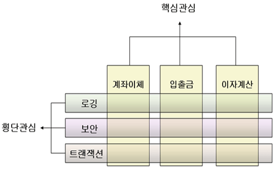

# AOP

> AOP : Aspect Oriented Programming
>
> 관점 지향 프로그래밍, 어떤 로직을 기준으로 핵심적인 관점과 부가적인 관점으로 나누어서 보고 그 관점을 기준으로 각각 모듈화하는 것
>
> 우리가 그동안 사용한 Java는 OOP(Object Oriented Programming, 객체 지향 프로그래밍)이다.

## Feature

* 여러 Java Framework의 기능들 중 Spring에만 있는 특징
* 서로 다른 Class들에서 공통적으로 들어가는 Code가 존재할 때, 별도의 Class로 분리하여 공통 Code를 작성한 후 다른 Class에 붙이거나 떼면서 작업하여 결합도를 낮추는 것.



* 횡단관심이 공통된 Code가 작성된 Class이다.
* 구현이 필요한 코드 - **핵심관심코드** (= 종단관심코드)
* 공통된 Code가 작성될 반복구현사항들 - **공통관심코드** (= 횡단관심코드)

### Proxy Pattern

> 23가지 자바 개발 디자인 패턴 중 AOP와 비슷한 패턴

* ProxyInter라는 Interface를 상속받는 A, B, C중 A와 C는 변경되더라도 B는 변경되지 않는다.
  * 이 때의 B Class의 역할은 공통 실행 내용 객체 (= 공통관심코드)
  * A, C Class는 구현하는 서로 다른 Class (= 핵심관심코드)
  
* B의 Action을 실행하면 공통부분을 실행하고 p의 Action을 실행하면 공통부분이 없다.

* **Codes**

  [Interface Code](https://github.com/TunaHG/Eclipse_Workspace/blob/master/Spring/src/main/java/proxypattern/ProxyInter.java), [A Code](https://github.com/TunaHG/Eclipse_Workspace/blob/master/Spring/src/main/java/proxypattern/A.java), [B Code](https://github.com/TunaHG/Eclipse_Workspace/blob/master/Spring/src/main/java/proxypattern/B.java), [C Code](https://github.com/TunaHG/Eclipse_Workspace/blob/master/Spring/src/main/java/proxypattern/C.java), [Main Code](https://github.com/TunaHG/Eclipse_Workspace/blob/master/Spring/src/main/java/proxypattern/ProxyMain.java)

  * A와 C Class가 핵심관심코드이며 B Class가 공통관심코드이다.

## Weaving

> 종단관심코드와 횡단관심코드를 Spring으로 연결하는 과정이 Weaving

### Weaver Library Download

* `pom.xml`의 `<dependency>`를 추가함으로써 Eclipse에서 자동으로 설치하도록 만들 수 있다.
  * 이 때, `<dependency>`내부에 들어갈 Content를 알아야 하는데, [Mvn Repository](https://mvnrepository.com)에서 가져올 수 있다.
  * **aspectjweaver**로 검색한 후 사용자가 많은 첫 번째로 들어가서 역시나 사용자가 많은 1.9.2버전을 선택
  * 중간쯤의 Maven탭을 살펴보면 `<dependency>` 코드가 나와있으므로 복사한다.
  * `pom.xml`에서 `<dependencies>` 내부에 해당 코드를 붙여넣기한다.
  * 저장하면 Eclipse에서 Library를 자동으로 설치한다. 이후에 **Maven Dependency**에서 확인할 수 있다.

### PointCut

* xml 설정 파일에서 아래의 **Namespaces** 탭을 눌러서 **AOP**를 체크해준 후 진행한다.

* xml 설정파일의 `<beans>`내부에 다음 코드를 추가한다.

  ```xml
  <bean id="common" class="aop1.Common"/>
  <aop:config>
  	<aop:pointcut expression="execution (public * aop1.*.*(..))" id="pc"/>
  	<aop:aspect	id="aspect1" ref="common">
  		<aop:before method="a" pointcut-ref="pc"/>
  	</aop:aspect>
  </aop:config>
  ```
  * `expression="execution (public * aop1.*.*(..))"`
    * execution 형식 : `{Modifier} {returntype} {package}.{class}.{method}({parameter})`
    * 주어진 형식에 맞는 메소드를 선택한다.
    * `*` : 모든
    * `..` : 모든 매개변수
    * `package`와 `class` 사이의 `..` : 하위 패키지 포함
    * `return type`에 `java.lang`패키지가 아닌 다른 패키지에서 사용하는 타입같은 경우는 패키지를 명시
    * `Modifier`에 모든 `Modifier`를 적용하려면 `*`를 입력하는 것이 아닌 아예 입력하지 않는다.
    * `expression`에는 `execution`이 아닌 `bean()` 혹은 `within()` 등이 올 수 있다.
      * `bean()`은 bean의 id를 활용하여 선택한다.
        * ex : `bean("common")` (Coomon Class 내부의 모든 Method)
      * `within()`은 특정 메소드가 아닌 특정 클래스나 인터페이스 내에 존재하는 모든 메소드를 선택
        * ex : `within("aop1.Common")` (Common Class 내부의 모든 Method)
  * `aop:before`
    * `pointcut-ref`로 지정된 메소드 **이전**에 `method`로 지정된 메소드를 실행한다.
  * `aop:after`
    * `pointcut-ref`로 지정된 메소드 **이후**에 `method`로 지정된 메소드를 실행한다.
    * `after-returning` : `return`값을 필요로 할때 사용
    * `after-throwing` : 중간에 예외가 발생할 때 처리하기 위해 사용
  * `aop:around`
    * `pointcut-ref`로 지정된 메소드 **이전과 이후**에 `method`로 지정된 메소드를 실행한다.
    * 메소드에서 `ProceedingJoinPoint` 객체를 매개변수로 받아서 `proceed()` 메소드를 사용하면 `pointcut-ref`로 지정된 메소드를 실행 시킨 이후에 `method`로 지정된 메소드의 나머지 부분을 실행한다.
    * `ProceedingJoinPoint` 객체에는 여러 유용한 메소드가 존재한다.
      * `proceed()` : 메소드를 실행한다.
      * `getTarget()` : 실행되는 메소드의 클래스를 알 수 있다.
      * `getArgs()` : 객체의 Argument를 반환한다.
      * `toLongString()` : `expression`이 어떤 것으로 동작하였는지 확인할 수 있다.
  
* **Codes**

  [Member Code](https://github.com/TunaHG/Eclipse_Workspace/blob/master/Spring/src/main/java/aop1/Member.java), [Board Code](https://github.com/TunaHG/Eclipse_Workspace/blob/master/Spring/src/main/java/aop1/Board.java), [Common Code](https://github.com/TunaHG/Eclipse_Workspace/blob/master/Spring/src/main/java/aop1/Common.java), [Main Code](https://github.com/TunaHG/Eclipse_Workspace/blob/master/Spring/src/main/java/aop1/AopMain.java), [XML File](https://github.com/TunaHG/Eclipse_Workspace/blob/master/Spring/src/main/java/aop1/aop.xml)

  * Member와 Board Class는 핵심관심코드이며 Common Class는 공통관심코드이다.

### Annotation

> Annotation을 적용하여 xml 설정파일의 Line을 줄여본다.

* xml 설정파일에서 **Namespaces** 탭으로 진입하여 **context, aop**를 체크한 후 진행한다.

* 이후 xml 설정파일의 `<beans>`내부에 다음과 같은 코드를 작성한다.

  ```xml
  <context:component-scan base-package="{package directory}"/>
  <aop:aspectj-autoproxy/>
  ```

  * `<context:component-scan>`은 `@Autowired`, `@Repository`, `@Component`, `@Service` 등의 Annotation을 탐색하는 태그
  * `<aop:aspectj-autoproxy>`는 `@Aspect`, `@Pointcut`, `@Before`, `@After`, `@Around` 등의 **Annotation**을 탐색하는 태그
  * 이외의 `<bean>`과 `<aop:config>`는 각 Class의 **Annotation**으로 대체되니 삭제한다.

* 객체로 생성할 각 Class 선언부 위에 `@Component`를 선언한다.

* 공통관심코드가 포함된 Class 선언부 위에는 `@Component`뿐만 아니라 `@Aspect`도 선언한다.

  * 해당 Class에 다음과 같은 **구현부가 빈 메소드**를 선언한다.

    ```java
    public void pc() { }
    ```

    * 해당 메소드 위에 `@Pointcut`을 선언한다. 이 메소드는 `@Pointcut`의 대상이 되는 메소드다.
    * `@Pointcut`의 Argument로 Weaving에서 `<aop:pointcut expression="">`에 진행한 값을 넣는다. `execution ()`와 같은 것을 넣으면 된다.

* 공통관심코드 메소드 위에 어디서 실행할 것인지에 따라 `@Before`, `@After`, `@Around`를 메소드 위에 선언한다.

  * 각 **Annotation**에 Argument로 `@Pointcut`의 대상이 되는 메소드의 이름을 선언한다. (여기서는 `pc()`)

* **Codes**

  [Member Code](https://github.com/TunaHG/Eclipse_Workspace/blob/master/Spring/src/main/java/annotation/aop1/Member.java), [Board Code](https://github.com/TunaHG/Eclipse_Workspace/blob/master/Spring/src/main/java/annotation/aop1/Board.java), [Common Code](https://github.com/TunaHG/Eclipse_Workspace/blob/master/Spring/src/main/java/annotation/aop1/Common.java), [Main Code](https://github.com/TunaHG/Eclipse_Workspace/blob/master/Spring/src/main/java/annotation/aop1/AopMain.java), [XML File](https://github.com/TunaHG/Eclipse_Workspace/blob/master/Spring/src/main/java/annotation/aop1/aop.xml)

  * Member와 Board Class는 핵심관심코드이며 Common Class는 공통관심코드이다.